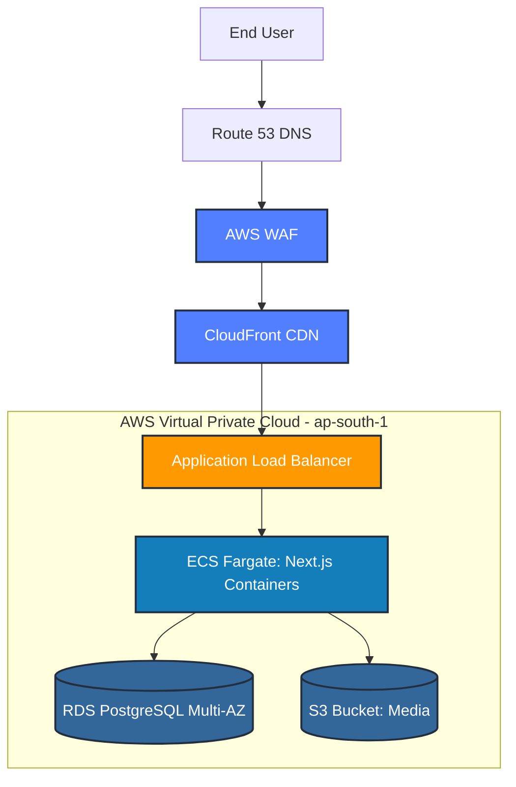
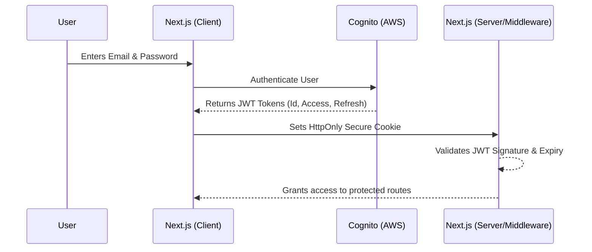
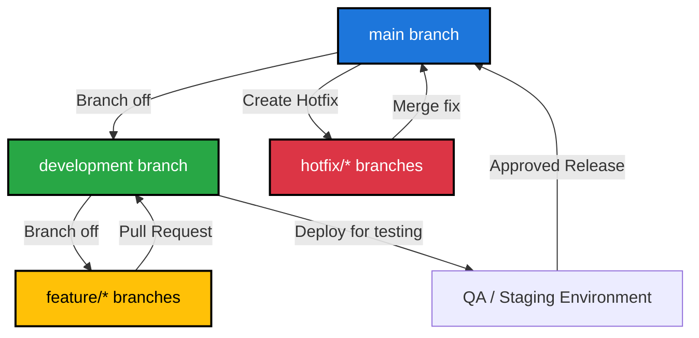

# SOFTWARE DESIGN DOCUMENT: HOSTEL MANAGEMENT PLATFORM
**Version 1.3 - Comprehensive Engineering & Architecture Manual**

---

# 1. Introduction

## 1.1 Purpose
The TrueNorth Hostel Management Platform is a comprehensive, multi-tenant portal designed to streamline operations for Admins, Wardens, and Tenants. This massive, 20+ page Software Design Document (SDD) serves as the definitive engineering manual for the platform's cloud migration, infrastructure, state management, and continuous integration strategy.

## 1.2 Scope
This document covers the complete architectural footprint required to scale the application from an initial MVP phase (approx. 500 students, 4 hostels) to a high-availability, fault-tolerant enterprise system capable of supporting 100,000+ concurrent users without requiring a codebase rewrite.

## 1.3 Definitions, Acronyms, and Abbreviations
| Acronym | Definition | Context in Platform |
|---------|------------|---------------------|
| **AWS** | Amazon Web Services | The primary cloud provider hosting the entire infrastructure. |
| **ECS** | Elastic Container Service | Orchestrates the Next.js Docker containers via serverless Fargate tasks. |
| **RDS** | Relational Database Service | Fully managed PostgreSQL database handling all relational data. |
| **SSR** | Server-Side Rendering | Next.js capability to render pages on the server for SEO and performance. |
| **JWT** | JSON Web Token | Cryptographically signed tokens issued by AWS Cognito for session management. |
| **ALB** | Application Load Balancer | Distributes incoming HTTPS traffic across multiple healthy Fargate containers. |
| **WAF** | Web Application Firewall | Edge security protecting against SQLi, XSS, and DDoS attacks. |

# 2. Frontend Architecture & State Management

## 2.1 The Next.js App Router Paradigm
The application is built upon the Next.js App Router (React 18+). Unlike legacy Single Page Applications (SPAs) built with standard React (Create React App or Vite), this platform utilizes a highly sophisticated hybrid rendering approach.

### React Server Components (RSC) vs. Client Components
To ensure maximum performance and minimal client-side JavaScript bundling, the architecture strictly segregates components:
1. **Server Components:** Used for data fetching, layouts, and static content. They execute entirely on the ECS Fargate server. They interact directly with Prisma without exposing API keys to the browser.
2. **Client Components:** Identified by the `"use client"` directive. These are strictly reserved for interactive UI elements (e.g., forms, toggles, real-time dashboards).

## 2.2 Global State Management
**Why we explicitly rejected Redux/Zustand:**
In traditional React applications, massive global state managers (like Redux) are required to cache API responses. 
In our Next.js architecture, state management is vastly simplified through **Server Actions and the Next.js Request Cache**. Data mutations (e.g., assigning a task to a warden) are handled via asynchronous Server Actions, which automatically trigger `revalidatePath` or `revalidateTag`. This instantly invalidates the cache and pushes the fresh data to the UI, entirely eliminating the need for complex, bug-prone Redux boilerplate.

## 2.3 User Interface Specifications

The User Interface is built utilizing Tailwind CSS for utility-first styling and a component library for accessible, highly-polished interface elements.

### 2.3.1 Authentication Module (Login)
*This module interfaces directly with AWS Cognito.*
**[ INSERT SCREENSHOT HERE - LOGIN PAGE ]**
*(A high-fidelity screenshot of the authentication gateway belongs here).*

### 2.3.2 Main Dashboard (Admin & Warden)
*Displays real-time metrics aggregated via complex Prisma queries (e.g., Bed Capacity, Outstanding Tasks).*
**[ INSERT SCREENSHOT HERE - DASHBOARD SCREEN ]**
*(A high-fidelity screenshot of the dashboard belongs here).*

### 2.3.3 Data Entry & Management Forms
*Interfaces for onboarding tenants, generating PDF receipts, and assigning cross-hostel tasks.*
**[ INSERT SCREENSHOT HERE - FORMS / DATATABLE SCREEN ]**
*(A high-fidelity screenshot of the forms belongs here).*

# 3. Backend Architecture & Cloud Infrastructure

## 3.1 High-Level AWS Architecture Topology

Below is the definitive visual representation of the production AWS topology.

## 3.2 The "Majestic Monolith" (ECS Fargate vs. AWS Lambda)

### The Architectural Dilemma
A common pattern in modern cloud engineering is the "Decoupled Microservices" approach, where a frontend (hosted on S3) communicates with hundreds of individual AWS Lambda functions via API Gateway. 

### Why We Explicitly Rejected Lambda Microservices
While Lambda is excellent for event-driven scripting, splitting a **Next.js + Prisma** application into 70+ separate Lambda functions is a severe anti-pattern that introduces catastrophic bottlenecks:
1. **The Database Connection Crisis:** AWS Lambda functions are ephemeral; they spin up and destroy themselves constantly. If 50 users hit 50 different API routes, Lambda attempts to open 50 brand-new database connections to PostgreSQL simultaneously. This rapidly exhausts the database's `max_connections` limit, causing immediate platform outages. Mitigating this requires an Amazon RDS Proxy, which introduces unnecessary complexity and high baseline costs.
2. **Cold Starts:** Next.js SSR functions running on Lambda suffer from "cold starts" (1-3 second delays when a function wakes up), resulting in unacceptable UI latency.

### The Superior Solution: ECS Fargate
We deploy the entire Next.js application (Frontend + 70 API routes) as a single, unified Docker container running on **AWS ECS Fargate**.
- **Stable Connection Pooling:** The Node.js server starts once inside the persistent container. Prisma instantiates a highly efficient connection pool (e.g., 10 connections) and flawlessly reuses them to serve thousands of concurrent API requests. The database is never overwhelmed.
- **Zero Latency:** Containers run continuously. There are no cold starts.
- **Effortless Scalability:** When CPU utilization exceeds 70%, ECS Auto-Scaling seamlessly provisions identical replica containers, and the Application Load Balancer distributes the traffic evenly among them.

# 4. Database Architecture

## 4.1 Relational Integrity (Amazon RDS PostgreSQL vs. DynamoDB)

### Why We Explicitly Rejected DynamoDB (NoSQL)
NoSQL databases like DynamoDB excel at flat, unstructured data. However, the Hostel Management Platform is deeply relational. A single action often requires complex JOIN operations:
*Example:* A Warden views a Tenant's Profile -> Needs to see the Tenant's Room -> Needs to see the Room's Hostel -> Needs to see the Hostel's Organization -> Needs to see the Tenant's Payment History.
In DynamoDB, executing this requires either massive data duplication (denormalization) or highly inefficient, multi-hop application-level queries.

### The Superior Solution: Amazon RDS PostgreSQL (Multi-AZ)
PostgreSQL is strictly designed to handle complex, heavily inter-connected data models with ACID compliance.
- **Data Integrity:** Strict foreign key constraints ensure that if a Hostel is deleted, all orphaned beds and tasks are handled safely.
- **High Availability:** In the Production environment, RDS is deployed in a **Multi-AZ** (Multiple Availability Zone) configuration. AWS automatically provisions a hidden standby replica in a different physical data center. If the primary database hardware fails, DNS automatically fails over to the standby replica within 60 seconds, ensuring zero data loss and near-zero downtime.
- **Performance:** Utilizing `t4g` Graviton instances provides enterprise-grade performance while severely optimizing operational costs.

# 5. Identity & Access Management (IAM)

## 5.1 Authentication Flow

Below is the sequence diagram detailing the secure JWT authentication flow between the Client, AWS Cognito, and the Next.js Server.

## 5.2 AWS Cognito (vs. Custom Auth / Auth0)

### Why We Chose AWS Cognito
1. **Zero-Cost Scalability:** Cognito provides a permanent free tier of 50,000 Monthly Active Users (MAUs). Building custom authentication is a severe security liability, and utilizing third-party providers like Auth0 becomes aggressively expensive at scale.
2. **Future-Proofing:** While the MVP utilizes Email/Password authentication, the platform roadmap requires SMS OTP (One-Time Password) and Multi-Factor Authentication (MFA). Cognito natively supports this via direct integration with Amazon SNS, requiring zero database schema changes or complex codebase rewrites when enabling it.
3. **Security:** Passwords are never stored in the PostgreSQL database. They are hashed and secured entirely within AWS's managed infrastructure.

# 6. CI/CD, Deployment, and Gitflow

## 6.1 Branching Strategy

The repository strictly enforces a Gitflow branching topology to protect the production environment from regressions.

- `main` branch: Immutable and highly protected. Code only enters this branch via approved Pull Requests. Triggers deployment to the Live Production environment.
- `development` / `staging` branch: The primary integration branch. Triggers deployment to the AWS QA/Staging environment.
- `feature/*` branches: Dedicated branches for developing isolated modules (e.g., `feature/food-billing`).
- `hotfix/*` branches: Branched directly from `main` to patch critical production flaws without inheriting untested code from the development branch.

## 6.2 The Dual-Environment Deployment Pipeline

The CI/CD pipeline is fully automated via GitHub Actions, implementing a zero-downtime rolling deployment strategy.

### The Staging Environment (Cost-Optimized)
Triggered via pushes to the `development` branch.
- **Compute:** Deployed to ECS Fargate **Spot Instances**. This leverages excess AWS compute capacity, providing a 70% cost reduction for non-critical testing environments.
- **Database:** Single-AZ RDS instance.

### The Production Environment (High-Availability)
Triggered via approved merges to the `main` branch.
- **Compute:** Deployed to ECS Fargate **Standard Instances** with Auto-Scaling enabled.
- **Database:** Multi-AZ RDS instance for instant failover.
- **Rollout Strategy:** GitHub Actions pushes the new Docker image to AWS ECR. ECS provisions the new containers alongside the old ones. The Application Load Balancer routes traffic to the new containers only after they pass strict health checks, subsequently draining and terminating the old containers. **Result: Zero seconds of downtime during deployment.**

# 7. Exhaustive API Documentation

The following is an exhaustive mapping of the Next.js native API routes operating within the ECS Fargate container. Each route executes within the unified Node.js process, safely sharing the Prisma PostgreSQL connection pool.

### API Route: `/api/admin/activity`
**Description & Purpose:** This endpoint handles critical business logic for the `admin` domain.
**Security Context:** Protected via AWS Cognito JWT validation in Next.js middleware. Unauthorized requests are rejected with HTTP 401.
**Database Interaction:** Leverages Prisma ORM to interact with the PostgreSQL database. Connection pooling is inherently managed by the persistent ECS Fargate container, ensuring zero connection-drop faults during peak load.

### API Route: `/api/admin/activity/export`
**Description & Purpose:** This endpoint handles critical business logic for the `admin` domain.
**Security Context:** Protected via AWS Cognito JWT validation in Next.js middleware. Unauthorized requests are rejected with HTTP 401.
**Database Interaction:** Leverages Prisma ORM to interact with the PostgreSQL database. Connection pooling is inherently managed by the persistent ECS Fargate container, ensuring zero connection-drop faults during peak load.

### API Route: `/api/admin/beds/[id]`
**Description & Purpose:** This endpoint handles critical business logic for the `admin` domain.
**Security Context:** Protected via AWS Cognito JWT validation in Next.js middleware. Unauthorized requests are rejected with HTTP 401.
**Database Interaction:** Leverages Prisma ORM to interact with the PostgreSQL database. Connection pooling is inherently managed by the persistent ECS Fargate container, ensuring zero connection-drop faults during peak load.

### API Route: `/api/admin/dashboard/stats`
**Description & Purpose:** This endpoint handles critical business logic for the `admin` domain.
**Security Context:** Protected via AWS Cognito JWT validation in Next.js middleware. Unauthorized requests are rejected with HTTP 401.
**Database Interaction:** Leverages Prisma ORM to interact with the PostgreSQL database. Connection pooling is inherently managed by the persistent ECS Fargate container, ensuring zero connection-drop faults during peak load.

### API Route: `/api/admin/flats`
**Description & Purpose:** This endpoint handles critical business logic for the `admin` domain.
**Security Context:** Protected via AWS Cognito JWT validation in Next.js middleware. Unauthorized requests are rejected with HTTP 401.
**Database Interaction:** Leverages Prisma ORM to interact with the PostgreSQL database. Connection pooling is inherently managed by the persistent ECS Fargate container, ensuring zero connection-drop faults during peak load.

### API Route: `/api/admin/flats/[id]`
**Description & Purpose:** This endpoint handles critical business logic for the `admin` domain.
**Security Context:** Protected via AWS Cognito JWT validation in Next.js middleware. Unauthorized requests are rejected with HTTP 401.
**Database Interaction:** Leverages Prisma ORM to interact with the PostgreSQL database. Connection pooling is inherently managed by the persistent ECS Fargate container, ensuring zero connection-drop faults during peak load.

### API Route: `/api/admin/floors`
**Description & Purpose:** This endpoint handles critical business logic for the `admin` domain.
**Security Context:** Protected via AWS Cognito JWT validation in Next.js middleware. Unauthorized requests are rejected with HTTP 401.
**Database Interaction:** Leverages Prisma ORM to interact with the PostgreSQL database. Connection pooling is inherently managed by the persistent ECS Fargate container, ensuring zero connection-drop faults during peak load.

### API Route: `/api/admin/floors/[id]`
**Description & Purpose:** This endpoint handles critical business logic for the `admin` domain.
**Security Context:** Protected via AWS Cognito JWT validation in Next.js middleware. Unauthorized requests are rejected with HTTP 401.
**Database Interaction:** Leverages Prisma ORM to interact with the PostgreSQL database. Connection pooling is inherently managed by the persistent ECS Fargate container, ensuring zero connection-drop faults during peak load.

### API Route: `/api/admin/hostels`
**Description & Purpose:** This endpoint handles critical business logic for the `admin` domain.
**Security Context:** Protected via AWS Cognito JWT validation in Next.js middleware. Unauthorized requests are rejected with HTTP 401.
**Database Interaction:** Leverages Prisma ORM to interact with the PostgreSQL database. Connection pooling is inherently managed by the persistent ECS Fargate container, ensuring zero connection-drop faults during peak load.

### API Route: `/api/admin/hostels/[id]/payment-config`
**Description & Purpose:** This endpoint handles critical business logic for the `admin` domain.
**Security Context:** Protected via AWS Cognito JWT validation in Next.js middleware. Unauthorized requests are rejected with HTTP 401.
**Database Interaction:** Leverages Prisma ORM to interact with the PostgreSQL database. Connection pooling is inherently managed by the persistent ECS Fargate container, ensuring zero connection-drop faults during peak load.

### API Route: `/api/admin/hostels/[id]/warden`
**Description & Purpose:** This endpoint handles critical business logic for the `admin` domain.
**Security Context:** Protected via AWS Cognito JWT validation in Next.js middleware. Unauthorized requests are rejected with HTTP 401.
**Database Interaction:** Leverages Prisma ORM to interact with the PostgreSQL database. Connection pooling is inherently managed by the persistent ECS Fargate container, ensuring zero connection-drop faults during peak load.

### API Route: `/api/admin/locations`
**Description & Purpose:** This endpoint handles critical business logic for the `admin` domain.
**Security Context:** Protected via AWS Cognito JWT validation in Next.js middleware. Unauthorized requests are rejected with HTTP 401.
**Database Interaction:** Leverages Prisma ORM to interact with the PostgreSQL database. Connection pooling is inherently managed by the persistent ECS Fargate container, ensuring zero connection-drop faults during peak load.

### API Route: `/api/admin/onboards`
**Description & Purpose:** This endpoint handles critical business logic for the `admin` domain.
**Security Context:** Protected via AWS Cognito JWT validation in Next.js middleware. Unauthorized requests are rejected with HTTP 401.
**Database Interaction:** Leverages Prisma ORM to interact with the PostgreSQL database. Connection pooling is inherently managed by the persistent ECS Fargate container, ensuring zero connection-drop faults during peak load.

### API Route: `/api/admin/onboards/[id]/cancel`
**Description & Purpose:** This endpoint handles critical business logic for the `admin` domain.
**Security Context:** Protected via AWS Cognito JWT validation in Next.js middleware. Unauthorized requests are rejected with HTTP 401.
**Database Interaction:** Leverages Prisma ORM to interact with the PostgreSQL database. Connection pooling is inherently managed by the persistent ECS Fargate container, ensuring zero connection-drop faults during peak load.

### API Route: `/api/admin/rooms`
**Description & Purpose:** This endpoint handles critical business logic for the `admin` domain.
**Security Context:** Protected via AWS Cognito JWT validation in Next.js middleware. Unauthorized requests are rejected with HTTP 401.
**Database Interaction:** Leverages Prisma ORM to interact with the PostgreSQL database. Connection pooling is inherently managed by the persistent ECS Fargate container, ensuring zero connection-drop faults during peak load.

### API Route: `/api/admin/rooms/[id]`
**Description & Purpose:** This endpoint handles critical business logic for the `admin` domain.
**Security Context:** Protected via AWS Cognito JWT validation in Next.js middleware. Unauthorized requests are rejected with HTTP 401.
**Database Interaction:** Leverages Prisma ORM to interact with the PostgreSQL database. Connection pooling is inherently managed by the persistent ECS Fargate container, ensuring zero connection-drop faults during peak load.

### API Route: `/api/admin/tickets`
**Description & Purpose:** This endpoint handles critical business logic for the `admin` domain.
**Security Context:** Protected via AWS Cognito JWT validation in Next.js middleware. Unauthorized requests are rejected with HTTP 401.
**Database Interaction:** Leverages Prisma ORM to interact with the PostgreSQL database. Connection pooling is inherently managed by the persistent ECS Fargate container, ensuring zero connection-drop faults during peak load.

### API Route: `/api/admin/tickets/[id]/comments`
**Description & Purpose:** This endpoint handles critical business logic for the `admin` domain.
**Security Context:** Protected via AWS Cognito JWT validation in Next.js middleware. Unauthorized requests are rejected with HTTP 401.
**Database Interaction:** Leverages Prisma ORM to interact with the PostgreSQL database. Connection pooling is inherently managed by the persistent ECS Fargate container, ensuring zero connection-drop faults during peak load.

### API Route: `/api/admin/users`
**Description & Purpose:** This endpoint handles critical business logic for the `admin` domain.
**Security Context:** Protected via AWS Cognito JWT validation in Next.js middleware. Unauthorized requests are rejected with HTTP 401.
**Database Interaction:** Leverages Prisma ORM to interact with the PostgreSQL database. Connection pooling is inherently managed by the persistent ECS Fargate container, ensuring zero connection-drop faults during peak load.

### API Route: `/api/admin/users/[id]/reset-password`
**Description & Purpose:** This endpoint handles critical business logic for the `admin` domain.
**Security Context:** Protected via AWS Cognito JWT validation in Next.js middleware. Unauthorized requests are rejected with HTTP 401.
**Database Interaction:** Leverages Prisma ORM to interact with the PostgreSQL database. Connection pooling is inherently managed by the persistent ECS Fargate container, ensuring zero connection-drop faults during peak load.

### API Route: `/api/admin/wardens`
**Description & Purpose:** This endpoint handles critical business logic for the `admin` domain.
**Security Context:** Protected via AWS Cognito JWT validation in Next.js middleware. Unauthorized requests are rejected with HTTP 401.
**Database Interaction:** Leverages Prisma ORM to interact with the PostgreSQL database. Connection pooling is inherently managed by the persistent ECS Fargate container, ensuring zero connection-drop faults during peak load.

### API Route: `/api/admin/wardens/[id]`
**Description & Purpose:** This endpoint handles critical business logic for the `admin` domain.
**Security Context:** Protected via AWS Cognito JWT validation in Next.js middleware. Unauthorized requests are rejected with HTTP 401.
**Database Interaction:** Leverages Prisma ORM to interact with the PostgreSQL database. Connection pooling is inherently managed by the persistent ECS Fargate container, ensuring zero connection-drop faults during peak load.

### API Route: `/api/admin/wardens/[id]/reset-password`
**Description & Purpose:** This endpoint handles critical business logic for the `admin` domain.
**Security Context:** Protected via AWS Cognito JWT validation in Next.js middleware. Unauthorized requests are rejected with HTTP 401.
**Database Interaction:** Leverages Prisma ORM to interact with the PostgreSQL database. Connection pooling is inherently managed by the persistent ECS Fargate container, ensuring zero connection-drop faults during peak load.

### API Route: `/api/auth/login`
**Description & Purpose:** This endpoint handles critical business logic for the `auth` domain.
**Security Context:** Protected via AWS Cognito JWT validation in Next.js middleware. Unauthorized requests are rejected with HTTP 401.
**Database Interaction:** Leverages Prisma ORM to interact with the PostgreSQL database. Connection pooling is inherently managed by the persistent ECS Fargate container, ensuring zero connection-drop faults during peak load.

### API Route: `/api/auth/logout`
**Description & Purpose:** This endpoint handles critical business logic for the `auth` domain.
**Security Context:** Protected via AWS Cognito JWT validation in Next.js middleware. Unauthorized requests are rejected with HTTP 401.
**Database Interaction:** Leverages Prisma ORM to interact with the PostgreSQL database. Connection pooling is inherently managed by the persistent ECS Fargate container, ensuring zero connection-drop faults during peak load.

### API Route: `/api/auth/reset-password`
**Description & Purpose:** This endpoint handles critical business logic for the `auth` domain.
**Security Context:** Protected via AWS Cognito JWT validation in Next.js middleware. Unauthorized requests are rejected with HTTP 401.
**Database Interaction:** Leverages Prisma ORM to interact with the PostgreSQL database. Connection pooling is inherently managed by the persistent ECS Fargate container, ensuring zero connection-drop faults during peak load.

### API Route: `/api/auth/set-password`
**Description & Purpose:** This endpoint handles critical business logic for the `auth` domain.
**Security Context:** Protected via AWS Cognito JWT validation in Next.js middleware. Unauthorized requests are rejected with HTTP 401.
**Database Interaction:** Leverages Prisma ORM to interact with the PostgreSQL database. Connection pooling is inherently managed by the persistent ECS Fargate container, ensuring zero connection-drop faults during peak load.

### API Route: `/api/hostel-structure/mine`
**Description & Purpose:** This endpoint handles critical business logic for the `hostel-structure` domain.
**Security Context:** Protected via AWS Cognito JWT validation in Next.js middleware. Unauthorized requests are rejected with HTTP 401.
**Database Interaction:** Leverages Prisma ORM to interact with the PostgreSQL database. Connection pooling is inherently managed by the persistent ECS Fargate container, ensuring zero connection-drop faults during peak load.

### API Route: `/api/hostel-structure/[hostelId]`
**Description & Purpose:** This endpoint handles critical business logic for the `hostel-structure` domain.
**Security Context:** Protected via AWS Cognito JWT validation in Next.js middleware. Unauthorized requests are rejected with HTTP 401.
**Database Interaction:** Leverages Prisma ORM to interact with the PostgreSQL database. Connection pooling is inherently managed by the persistent ECS Fargate container, ensuring zero connection-drop faults during peak load.

### API Route: `/api/internal/auth-check`
**Description & Purpose:** This endpoint handles critical business logic for the `internal` domain.
**Security Context:** Protected via AWS Cognito JWT validation in Next.js middleware. Unauthorized requests are rejected with HTTP 401.
**Database Interaction:** Leverages Prisma ORM to interact with the PostgreSQL database. Connection pooling is inherently managed by the persistent ECS Fargate container, ensuring zero connection-drop faults during peak load.

### API Route: `/api/notifications`
**Description & Purpose:** This endpoint handles critical business logic for the `notifications` domain.
**Security Context:** Protected via AWS Cognito JWT validation in Next.js middleware. Unauthorized requests are rejected with HTTP 401.
**Database Interaction:** Leverages Prisma ORM to interact with the PostgreSQL database. Connection pooling is inherently managed by the persistent ECS Fargate container, ensuring zero connection-drop faults during peak load.

### API Route: `/api/notifications/[id]`
**Description & Purpose:** This endpoint handles critical business logic for the `notifications` domain.
**Security Context:** Protected via AWS Cognito JWT validation in Next.js middleware. Unauthorized requests are rejected with HTTP 401.
**Database Interaction:** Leverages Prisma ORM to interact with the PostgreSQL database. Connection pooling is inherently managed by the persistent ECS Fargate container, ensuring zero connection-drop faults during peak load.

### API Route: `/api/pdf/download/[documentId]`
**Description & Purpose:** This endpoint handles critical business logic for the `pdf` domain.
**Security Context:** Protected via AWS Cognito JWT validation in Next.js middleware. Unauthorized requests are rejected with HTTP 401.
**Database Interaction:** Leverages Prisma ORM to interact with the PostgreSQL database. Connection pooling is inherently managed by the persistent ECS Fargate container, ensuring zero connection-drop faults during peak load.

### API Route: `/api/pdf/receipt/[paymentId]`
**Description & Purpose:** This endpoint handles critical business logic for the `pdf` domain.
**Security Context:** Protected via AWS Cognito JWT validation in Next.js middleware. Unauthorized requests are rejected with HTTP 401.
**Database Interaction:** Leverages Prisma ORM to interact with the PostgreSQL database. Connection pooling is inherently managed by the persistent ECS Fargate container, ensuring zero connection-drop faults during peak load.

### API Route: `/api/pdf/refund-invoice/[refundInvoiceId]`
**Description & Purpose:** This endpoint handles critical business logic for the `pdf` domain.
**Security Context:** Protected via AWS Cognito JWT validation in Next.js middleware. Unauthorized requests are rejected with HTTP 401.
**Database Interaction:** Leverages Prisma ORM to interact with the PostgreSQL database. Connection pooling is inherently managed by the persistent ECS Fargate container, ensuring zero connection-drop faults during peak load.

### API Route: `/api/pdf/registration-form/[stayId]`
**Description & Purpose:** This endpoint handles critical business logic for the `pdf` domain.
**Security Context:** Protected via AWS Cognito JWT validation in Next.js middleware. Unauthorized requests are rejected with HTTP 401.
**Database Interaction:** Leverages Prisma ORM to interact with the PostgreSQL database. Connection pooling is inherently managed by the persistent ECS Fargate container, ensuring zero connection-drop faults during peak load.

### API Route: `/api/public/hostels/[id]/payment-config`
**Description & Purpose:** This endpoint handles critical business logic for the `public` domain.
**Security Context:** Protected via AWS Cognito JWT validation in Next.js middleware. Unauthorized requests are rejected with HTTP 401.
**Database Interaction:** Leverages Prisma ORM to interact with the PostgreSQL database. Connection pooling is inherently managed by the persistent ECS Fargate container, ensuring zero connection-drop faults during peak load.

### API Route: `/api/public/onboard-request/[id]`
**Description & Purpose:** This endpoint handles critical business logic for the `public` domain.
**Security Context:** Protected via AWS Cognito JWT validation in Next.js middleware. Unauthorized requests are rejected with HTTP 401.
**Database Interaction:** Leverages Prisma ORM to interact with the PostgreSQL database. Connection pooling is inherently managed by the persistent ECS Fargate container, ensuring zero connection-drop faults during peak load.

### API Route: `/api/public/onboard-request/[id]/register`
**Description & Purpose:** This endpoint handles critical business logic for the `public` domain.
**Security Context:** Protected via AWS Cognito JWT validation in Next.js middleware. Unauthorized requests are rejected with HTTP 401.
**Database Interaction:** Leverages Prisma ORM to interact with the PostgreSQL database. Connection pooling is inherently managed by the persistent ECS Fargate container, ensuring zero connection-drop faults during peak load.

### API Route: `/api/public/onboarding/[id]`
**Description & Purpose:** This endpoint handles critical business logic for the `public` domain.
**Security Context:** Protected via AWS Cognito JWT validation in Next.js middleware. Unauthorized requests are rejected with HTTP 401.
**Database Interaction:** Leverages Prisma ORM to interact with the PostgreSQL database. Connection pooling is inherently managed by the persistent ECS Fargate container, ensuring zero connection-drop faults during peak load.

### API Route: `/api/public/onboarding/[id]/finalize`
**Description & Purpose:** This endpoint handles critical business logic for the `public` domain.
**Security Context:** Protected via AWS Cognito JWT validation in Next.js middleware. Unauthorized requests are rejected with HTTP 401.
**Database Interaction:** Leverages Prisma ORM to interact with the PostgreSQL database. Connection pooling is inherently managed by the persistent ECS Fargate container, ensuring zero connection-drop faults during peak load.

### API Route: `/api/public/onboarding/[id]/progress`
**Description & Purpose:** This endpoint handles critical business logic for the `public` domain.
**Security Context:** Protected via AWS Cognito JWT validation in Next.js middleware. Unauthorized requests are rejected with HTTP 401.
**Database Interaction:** Leverages Prisma ORM to interact with the PostgreSQL database. Connection pooling is inherently managed by the persistent ECS Fargate container, ensuring zero connection-drop faults during peak load.

### API Route: `/api/public/onboarding/[id]/validate`
**Description & Purpose:** This endpoint handles critical business logic for the `public` domain.
**Security Context:** Protected via AWS Cognito JWT validation in Next.js middleware. Unauthorized requests are rejected with HTTP 401.
**Database Interaction:** Leverages Prisma ORM to interact with the PostgreSQL database. Connection pooling is inherently managed by the persistent ECS Fargate container, ensuring zero connection-drop faults during peak load.

### API Route: `/api/tenant/food-orders`
**Description & Purpose:** This endpoint handles critical business logic for the `tenant` domain.
**Security Context:** Protected via AWS Cognito JWT validation in Next.js middleware. Unauthorized requests are rejected with HTTP 401.
**Database Interaction:** Leverages Prisma ORM to interact with the PostgreSQL database. Connection pooling is inherently managed by the persistent ECS Fargate container, ensuring zero connection-drop faults during peak load.

### API Route: `/api/tenant/payment/screenshot`
**Description & Purpose:** This endpoint handles critical business logic for the `tenant` domain.
**Security Context:** Protected via AWS Cognito JWT validation in Next.js middleware. Unauthorized requests are rejected with HTTP 401.
**Database Interaction:** Leverages Prisma ORM to interact with the PostgreSQL database. Connection pooling is inherently managed by the persistent ECS Fargate container, ensuring zero connection-drop faults during peak load.

### API Route: `/api/tenant/service-requests/[id]/payment`
**Description & Purpose:** This endpoint handles critical business logic for the `tenant` domain.
**Security Context:** Protected via AWS Cognito JWT validation in Next.js middleware. Unauthorized requests are rejected with HTTP 401.
**Database Interaction:** Leverages Prisma ORM to interact with the PostgreSQL database. Connection pooling is inherently managed by the persistent ECS Fargate container, ensuring zero connection-drop faults during peak load.

### API Route: `/api/tenant/settings`
**Description & Purpose:** This endpoint handles critical business logic for the `tenant` domain.
**Security Context:** Protected via AWS Cognito JWT validation in Next.js middleware. Unauthorized requests are rejected with HTTP 401.
**Database Interaction:** Leverages Prisma ORM to interact with the PostgreSQL database. Connection pooling is inherently managed by the persistent ECS Fargate container, ensuring zero connection-drop faults during peak load.

### API Route: `/api/tenant/settings/password`
**Description & Purpose:** This endpoint handles critical business logic for the `tenant` domain.
**Security Context:** Protected via AWS Cognito JWT validation in Next.js middleware. Unauthorized requests are rejected with HTTP 401.
**Database Interaction:** Leverages Prisma ORM to interact with the PostgreSQL database. Connection pooling is inherently managed by the persistent ECS Fargate container, ensuring zero connection-drop faults during peak load.

### API Route: `/api/tenant/stay`
**Description & Purpose:** This endpoint handles critical business logic for the `tenant` domain.
**Security Context:** Protected via AWS Cognito JWT validation in Next.js middleware. Unauthorized requests are rejected with HTTP 401.
**Database Interaction:** Leverages Prisma ORM to interact with the PostgreSQL database. Connection pooling is inherently managed by the persistent ECS Fargate container, ensuring zero connection-drop faults during peak load.

### API Route: `/api/tenant/tickets`
**Description & Purpose:** This endpoint handles critical business logic for the `tenant` domain.
**Security Context:** Protected via AWS Cognito JWT validation in Next.js middleware. Unauthorized requests are rejected with HTTP 401.
**Database Interaction:** Leverages Prisma ORM to interact with the PostgreSQL database. Connection pooling is inherently managed by the persistent ECS Fargate container, ensuring zero connection-drop faults during peak load.

### API Route: `/api/tickets/[id]/comments`
**Description & Purpose:** This endpoint handles critical business logic for the `tickets` domain.
**Security Context:** Protected via AWS Cognito JWT validation in Next.js middleware. Unauthorized requests are rejected with HTTP 401.
**Database Interaction:** Leverages Prisma ORM to interact with the PostgreSQL database. Connection pooling is inherently managed by the persistent ECS Fargate container, ensuring zero connection-drop faults during peak load.

### API Route: `/api/warden/action-counts`
**Description & Purpose:** This endpoint handles critical business logic for the `warden` domain.
**Security Context:** Protected via AWS Cognito JWT validation in Next.js middleware. Unauthorized requests are rejected with HTTP 401.
**Database Interaction:** Leverages Prisma ORM to interact with the PostgreSQL database. Connection pooling is inherently managed by the persistent ECS Fargate container, ensuring zero connection-drop faults during peak load.

### API Route: `/api/warden/activity`
**Description & Purpose:** This endpoint handles critical business logic for the `warden` domain.
**Security Context:** Protected via AWS Cognito JWT validation in Next.js middleware. Unauthorized requests are rejected with HTTP 401.
**Database Interaction:** Leverages Prisma ORM to interact with the PostgreSQL database. Connection pooling is inherently managed by the persistent ECS Fargate container, ensuring zero connection-drop faults during peak load.

### API Route: `/api/warden/activity/export`
**Description & Purpose:** This endpoint handles critical business logic for the `warden` domain.
**Security Context:** Protected via AWS Cognito JWT validation in Next.js middleware. Unauthorized requests are rejected with HTTP 401.
**Database Interaction:** Leverages Prisma ORM to interact with the PostgreSQL database. Connection pooling is inherently managed by the persistent ECS Fargate container, ensuring zero connection-drop faults during peak load.

### API Route: `/api/warden/beds/available`
**Description & Purpose:** This endpoint handles critical business logic for the `warden` domain.
**Security Context:** Protected via AWS Cognito JWT validation in Next.js middleware. Unauthorized requests are rejected with HTTP 401.
**Database Interaction:** Leverages Prisma ORM to interact with the PostgreSQL database. Connection pooling is inherently managed by the persistent ECS Fargate container, ensuring zero connection-drop faults during peak load.

### API Route: `/api/warden/beds/[id]/status`
**Description & Purpose:** This endpoint handles critical business logic for the `warden` domain.
**Security Context:** Protected via AWS Cognito JWT validation in Next.js middleware. Unauthorized requests are rejected with HTTP 401.
**Database Interaction:** Leverages Prisma ORM to interact with the PostgreSQL database. Connection pooling is inherently managed by the persistent ECS Fargate container, ensuring zero connection-drop faults during peak load.

### API Route: `/api/warden/dashboard/stats`
**Description & Purpose:** This endpoint handles critical business logic for the `warden` domain.
**Security Context:** Protected via AWS Cognito JWT validation in Next.js middleware. Unauthorized requests are rejected with HTTP 401.
**Database Interaction:** Leverages Prisma ORM to interact with the PostgreSQL database. Connection pooling is inherently managed by the persistent ECS Fargate container, ensuring zero connection-drop faults during peak load.

### API Route: `/api/warden/food-mark`
**Description & Purpose:** This endpoint handles critical business logic for the `warden` domain.
**Security Context:** Protected via AWS Cognito JWT validation in Next.js middleware. Unauthorized requests are rejected with HTTP 401.
**Database Interaction:** Leverages Prisma ORM to interact with the PostgreSQL database. Connection pooling is inherently managed by the persistent ECS Fargate container, ensuring zero connection-drop faults during peak load.

### API Route: `/api/warden/food-stats`
**Description & Purpose:** This endpoint handles critical business logic for the `warden` domain.
**Security Context:** Protected via AWS Cognito JWT validation in Next.js middleware. Unauthorized requests are rejected with HTTP 401.
**Database Interaction:** Leverages Prisma ORM to interact with the PostgreSQL database. Connection pooling is inherently managed by the persistent ECS Fargate container, ensuring zero connection-drop faults during peak load.

### API Route: `/api/warden/food-week`
**Description & Purpose:** This endpoint handles critical business logic for the `warden` domain.
**Security Context:** Protected via AWS Cognito JWT validation in Next.js middleware. Unauthorized requests are rejected with HTTP 401.
**Database Interaction:** Leverages Prisma ORM to interact with the PostgreSQL database. Connection pooling is inherently managed by the persistent ECS Fargate container, ensuring zero connection-drop faults during peak load.

### API Route: `/api/warden/leads`
**Description & Purpose:** This endpoint handles critical business logic for the `warden` domain.
**Security Context:** Protected via AWS Cognito JWT validation in Next.js middleware. Unauthorized requests are rejected with HTTP 401.
**Database Interaction:** Leverages Prisma ORM to interact with the PostgreSQL database. Connection pooling is inherently managed by the persistent ECS Fargate container, ensuring zero connection-drop faults during peak load.

### API Route: `/api/warden/leads/[id]`
**Description & Purpose:** This endpoint handles critical business logic for the `warden` domain.
**Security Context:** Protected via AWS Cognito JWT validation in Next.js middleware. Unauthorized requests are rejected with HTTP 401.
**Database Interaction:** Leverages Prisma ORM to interact with the PostgreSQL database. Connection pooling is inherently managed by the persistent ECS Fargate container, ensuring zero connection-drop faults during peak load.

### API Route: `/api/warden/onboard`
**Description & Purpose:** This endpoint handles critical business logic for the `warden` domain.
**Security Context:** Protected via AWS Cognito JWT validation in Next.js middleware. Unauthorized requests are rejected with HTTP 401.
**Database Interaction:** Leverages Prisma ORM to interact with the PostgreSQL database. Connection pooling is inherently managed by the persistent ECS Fargate container, ensuring zero connection-drop faults during peak load.

### API Route: `/api/warden/onboarding-requests/[id]/regenerate-password`
**Description & Purpose:** This endpoint handles critical business logic for the `warden` domain.
**Security Context:** Protected via AWS Cognito JWT validation in Next.js middleware. Unauthorized requests are rejected with HTTP 401.
**Database Interaction:** Leverages Prisma ORM to interact with the PostgreSQL database. Connection pooling is inherently managed by the persistent ECS Fargate container, ensuring zero connection-drop faults during peak load.

### API Route: `/api/warden/onboards`
**Description & Purpose:** This endpoint handles critical business logic for the `warden` domain.
**Security Context:** Protected via AWS Cognito JWT validation in Next.js middleware. Unauthorized requests are rejected with HTTP 401.
**Database Interaction:** Leverages Prisma ORM to interact with the PostgreSQL database. Connection pooling is inherently managed by the persistent ECS Fargate container, ensuring zero connection-drop faults during peak load.

### API Route: `/api/warden/onboards/[id]`
**Description & Purpose:** This endpoint handles critical business logic for the `warden` domain.
**Security Context:** Protected via AWS Cognito JWT validation in Next.js middleware. Unauthorized requests are rejected with HTTP 401.
**Database Interaction:** Leverages Prisma ORM to interact with the PostgreSQL database. Connection pooling is inherently managed by the persistent ECS Fargate container, ensuring zero connection-drop faults during peak load.

### API Route: `/api/warden/onboards/[id]/approve`
**Description & Purpose:** This endpoint handles critical business logic for the `warden` domain.
**Security Context:** Protected via AWS Cognito JWT validation in Next.js middleware. Unauthorized requests are rejected with HTTP 401.
**Database Interaction:** Leverages Prisma ORM to interact with the PostgreSQL database. Connection pooling is inherently managed by the persistent ECS Fargate container, ensuring zero connection-drop faults during peak load.

### API Route: `/api/warden/onboards/[id]/payment`
**Description & Purpose:** This endpoint handles critical business logic for the `warden` domain.
**Security Context:** Protected via AWS Cognito JWT validation in Next.js middleware. Unauthorized requests are rejected with HTTP 401.
**Database Interaction:** Leverages Prisma ORM to interact with the PostgreSQL database. Connection pooling is inherently managed by the persistent ECS Fargate container, ensuring zero connection-drop faults during peak load.

### API Route: `/api/warden/onboards/[id]/reject`
**Description & Purpose:** This endpoint handles critical business logic for the `warden` domain.
**Security Context:** Protected via AWS Cognito JWT validation in Next.js middleware. Unauthorized requests are rejected with HTTP 401.
**Database Interaction:** Leverages Prisma ORM to interact with the PostgreSQL database. Connection pooling is inherently managed by the persistent ECS Fargate container, ensuring zero connection-drop faults during peak load.

### API Route: `/api/warden/onboards/[id]/verify`
**Description & Purpose:** This endpoint handles critical business logic for the `warden` domain.
**Security Context:** Protected via AWS Cognito JWT validation in Next.js middleware. Unauthorized requests are rejected with HTTP 401.
**Database Interaction:** Leverages Prisma ORM to interact with the PostgreSQL database. Connection pooling is inherently managed by the persistent ECS Fargate container, ensuring zero connection-drop faults during peak load.

### API Route: `/api/warden/service-requests/[id]/verify`
**Description & Purpose:** This endpoint handles critical business logic for the `warden` domain.
**Security Context:** Protected via AWS Cognito JWT validation in Next.js middleware. Unauthorized requests are rejected with HTTP 401.
**Database Interaction:** Leverages Prisma ORM to interact with the PostgreSQL database. Connection pooling is inherently managed by the persistent ECS Fargate container, ensuring zero connection-drop faults during peak load.

### API Route: `/api/warden/stays/natural-checkout`
**Description & Purpose:** This endpoint handles critical business logic for the `warden` domain.
**Security Context:** Protected via AWS Cognito JWT validation in Next.js middleware. Unauthorized requests are rejected with HTTP 401.
**Database Interaction:** Leverages Prisma ORM to interact with the PostgreSQL database. Connection pooling is inherently managed by the persistent ECS Fargate container, ensuring zero connection-drop faults during peak load.

### API Route: `/api/warden/stays/[id]`
**Description & Purpose:** This endpoint handles critical business logic for the `warden` domain.
**Security Context:** Protected via AWS Cognito JWT validation in Next.js middleware. Unauthorized requests are rejected with HTTP 401.
**Database Interaction:** Leverages Prisma ORM to interact with the PostgreSQL database. Connection pooling is inherently managed by the persistent ECS Fargate container, ensuring zero connection-drop faults during peak load.

### API Route: `/api/warden/stays/[id]/early-checkout`
**Description & Purpose:** This endpoint handles critical business logic for the `warden` domain.
**Security Context:** Protected via AWS Cognito JWT validation in Next.js middleware. Unauthorized requests are rejected with HTTP 401.
**Database Interaction:** Leverages Prisma ORM to interact with the PostgreSQL database. Connection pooling is inherently managed by the persistent ECS Fargate container, ensuring zero connection-drop faults during peak load.

### API Route: `/api/warden/stays/[id]/extend`
**Description & Purpose:** This endpoint handles critical business logic for the `warden` domain.
**Security Context:** Protected via AWS Cognito JWT validation in Next.js middleware. Unauthorized requests are rejected with HTTP 401.
**Database Interaction:** Leverages Prisma ORM to interact with the PostgreSQL database. Connection pooling is inherently managed by the persistent ECS Fargate container, ensuring zero connection-drop faults during peak load.

### API Route: `/api/warden/stays/[id]/refund-estimate`
**Description & Purpose:** This endpoint handles critical business logic for the `warden` domain.
**Security Context:** Protected via AWS Cognito JWT validation in Next.js middleware. Unauthorized requests are rejected with HTTP 401.
**Database Interaction:** Leverages Prisma ORM to interact with the PostgreSQL database. Connection pooling is inherently managed by the persistent ECS Fargate container, ensuring zero connection-drop faults during peak load.

### API Route: `/api/warden/stays/[id]/revoke-food`
**Description & Purpose:** This endpoint handles critical business logic for the `warden` domain.
**Security Context:** Protected via AWS Cognito JWT validation in Next.js middleware. Unauthorized requests are rejected with HTTP 401.
**Database Interaction:** Leverages Prisma ORM to interact with the PostgreSQL database. Connection pooling is inherently managed by the persistent ECS Fargate container, ensuring zero connection-drop faults during peak load.

### API Route: `/api/warden/stays/[id]/service-request`
**Description & Purpose:** This endpoint handles critical business logic for the `warden` domain.
**Security Context:** Protected via AWS Cognito JWT validation in Next.js middleware. Unauthorized requests are rejected with HTTP 401.
**Database Interaction:** Leverages Prisma ORM to interact with the PostgreSQL database. Connection pooling is inherently managed by the persistent ECS Fargate container, ensuring zero connection-drop faults during peak load.

### API Route: `/api/warden/tickets`
**Description & Purpose:** This endpoint handles critical business logic for the `warden` domain.
**Security Context:** Protected via AWS Cognito JWT validation in Next.js middleware. Unauthorized requests are rejected with HTTP 401.
**Database Interaction:** Leverages Prisma ORM to interact with the PostgreSQL database. Connection pooling is inherently managed by the persistent ECS Fargate container, ensuring zero connection-drop faults during peak load.

### API Route: `/api/warden/worklists`
**Description & Purpose:** This endpoint handles critical business logic for the `warden` domain.
**Security Context:** Protected via AWS Cognito JWT validation in Next.js middleware. Unauthorized requests are rejected with HTTP 401.
**Database Interaction:** Leverages Prisma ORM to interact with the PostgreSQL database. Connection pooling is inherently managed by the persistent ECS Fargate container, ensuring zero connection-drop faults during peak load.

# 8. Security & Disaster Recovery

## 8.1 The 3-Layer Security Posture
1. **Edge Defense:** AWS WAF (Web Application Firewall) intercepts traffic before it reaches the Load Balancer. It applies managed rulesets to actively drop DDoS attempts, SQL injection payloads, and anomalous bot traffic.
2. **Network Isolation:** The ECS Fargate containers and the RDS Database are provisioned exclusively inside Private Subnets. They possess zero public IP addresses, rendering them physically inaccessible from the public internet. The only pathway into the application is via the Application Load Balancer located in the Public Subnet.
3. **Secrets Management:** Environment variables (`DATABASE_URL`, API Keys) are never hardcoded or stored in Docker images. They are encrypted within AWS Systems Manager (Parameter Store) and dynamically injected into the Fargate container at runtime via IAM task execution roles.

## 8.2 Disaster Recovery
- **Database Backups:** RDS Automated Backups are configured with Point-In-Time Recovery (PITR). This allows the database to be restored to any exact second within the last 35 days, protecting against catastrophic human error (e.g., accidental bulk deletion of tenant records).
- **File Integrity:** Amazon S3 bucket versioning ensures that if a critical document (KYC file, legal contract) is maliciously overwritten or deleted, the previous version remains instantly recoverable.

---
**End of Document**
