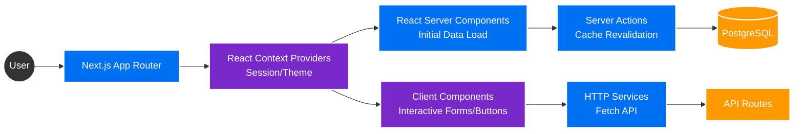
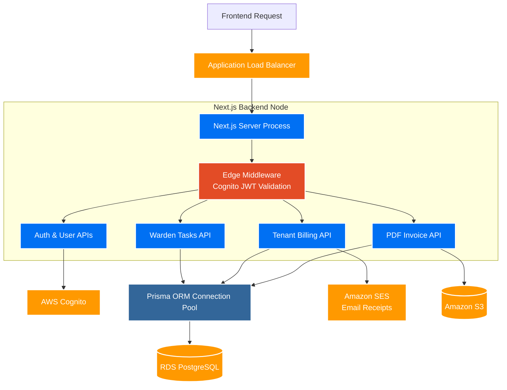
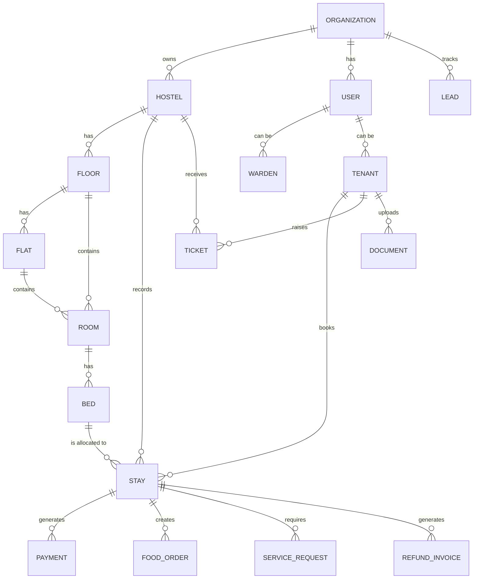
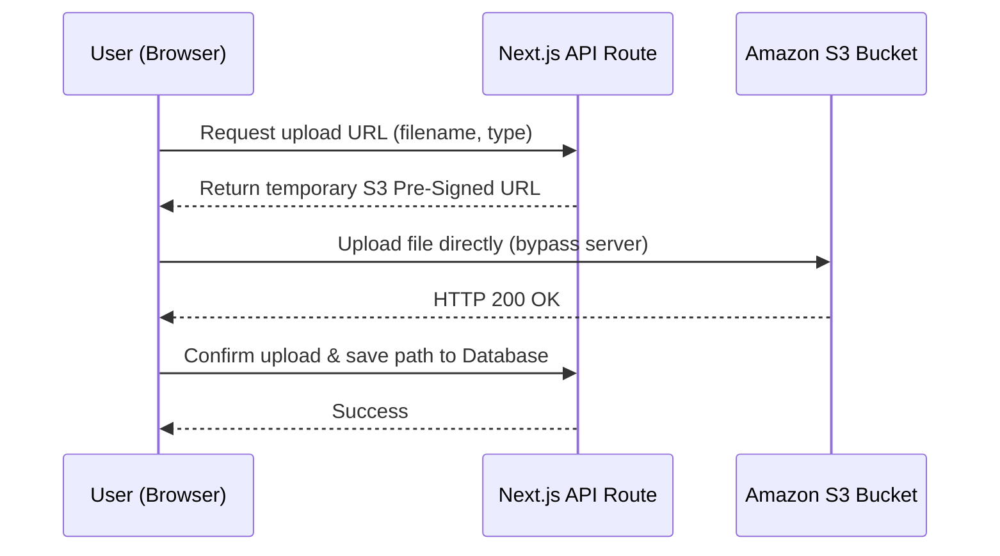
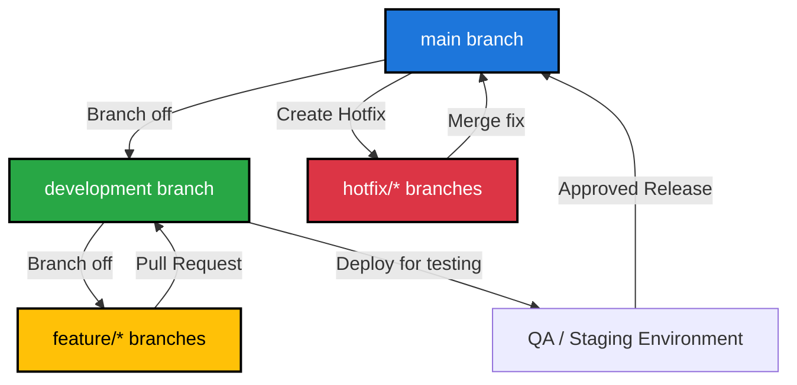

# SOFTWARE DESIGN DOCUMENT: HOSTEL MANAGEMENT PLATFORM
**Version 1.4 - Comprehensive Engineering & Architecture Manual**

---

<div style="page-break-after: always;"></div>

# 1. Introduction

## 1.1 Purpose
The TrueNorth Hostel Management Platform is a comprehensive, multi-tenant portal designed to streamline operations for Admins, Wardens, and Tenants. This Software Design Document (SDD) serves as the definitive engineering manual for the platform's cloud migration, infrastructure, database schema, state management, and continuous integration strategy.

## 1.2 Scope
This document covers the complete architectural footprint required to scale the application from an initial MVP phase (approx. 500 students, 4 hostels) to a high-availability, fault-tolerant enterprise system capable of supporting 100,000+ concurrent users without requiring a codebase rewrite.

## 1.3 Definitions, Acronyms, and Abbreviations
| Acronym | Definition | Context in Platform |
|---------|------------|---------------------|
| **AWS** | Amazon Web Services | The primary cloud provider hosting the entire infrastructure. |
| **ECS** | Elastic Container Service | Orchestrates the Next.js Docker containers via serverless Fargate tasks. |
| **RDS** | Relational Database Service | Fully managed PostgreSQL database handling all relational data. |
| **SSR** | Server-Side Rendering | Next.js capability to render pages on the server for SEO and performance. |
| **JWT** | JSON Web Token | Cryptographically signed tokens issued by AWS Cognito for session management. |
| **ALB** | Application Load Balancer | Distributes incoming HTTPS traffic across multiple healthy Fargate containers. |
| **WAF** | Web Application Firewall | Edge security protecting against SQLi, XSS, and DDoS attacks. |

<div style="page-break-after: always;"></div>

# 2. Complete System Architecture

## 2.1 Full Layered Architecture Topology
The platform is designed in distinct, highly scalable layers. The diagram below illustrates the complete lifecycle of a request, from the Client Layer to the Data Layer, emphasizing our monolithic container strategy over decoupled Lambdas.

```mermaid
graph TD
    classDef client fill:#f4f4f4,stroke:#333,stroke-width:2px;
    classDef edge fill:#527FFF,stroke:#232F3E,stroke-width:2px,color:white;
    classDef compute fill:#147EBA,stroke:#232F3E,stroke-width:2px,color:white;
    classDef db fill:#336699,stroke:#232F3E,stroke-width:2px,color:white;
    classDef integration fill:#FF9900,stroke:#232F3E,stroke-width:2px,color:white;

    subgraph Client Layer
        W[Web Browser]:::client
        M[Mobile Browser]:::client
        A[Admin Dashboard]:::client
    end
    
    subgraph Edge Layer
        R53[Route 53 DNS]:::edge --> WAF[AWS WAF Security]:::edge
        WAF --> CF[CloudFront CDN]:::edge
    end
    
    subgraph Service Layer - ECS Fargate Monolith
        ALB[Application Load Balancer]:::compute
        NC[Next.js Server Container]:::compute
        
        ALB --> NC
        NC --> AdminMod[Admin Core Module]:::compute
        NC --> WardenMod[Warden Operations]:::compute
        NC --> TenantMod[Tenant Billing & Auth]:::compute
        NC --> PdfMod[Dynamic PDF Generator]:::compute
    end
    
    subgraph Data Layer
        RDS[(RDS PostgreSQL<br/>Multi-AZ)]:::db
        S3[(Amazon S3<br/>Document Store)]:::db
    end
    
    subgraph Integrations
        Cog[AWS Cognito<br/>Identity Pool]:::integration
        SES[Amazon SES<br/>Transactional Email]:::integration
    end

    Client Layer --> R53
    CF --> ALB
    
    AdminMod --> RDS
    WardenMod --> RDS
    TenantMod --> RDS
    
    PdfMod --> S3
    NC --> Cog
    NC --> SES
```

<div style="page-break-after: always;"></div>

# 3. Frontend Architecture & State Management

## 3.1 Frontend Data Flow
The application is built utilizing the Next.js App Router. Unlike traditional SPAs that rely heavily on massive client-side bundles and Redux stores, our architecture leverages Server Components for data fetching and Server Actions for data mutation.



## 3.2 Global State Management
**Why we explicitly rejected Redux/Zustand:**
In traditional React applications, massive global state managers (like Redux) are required to cache API responses. In our Next.js architecture, state management is vastly simplified through **Server Actions and the Next.js Request Cache**. Data mutations (e.g., assigning a task to a warden) are handled via asynchronous Server Actions, which automatically trigger `revalidatePath`. This instantly invalidates the cache and pushes the fresh data to the UI, entirely eliminating the need for complex, bug-prone Redux boilerplate.

## 3.3 User Interface Specifications (Screenshots)

### 3.3.1 Authentication Module (Login)
*This module interfaces directly with AWS Cognito.*
**[ INSERT SCREENSHOT HERE - LOGIN PAGE ]**

### 3.3.2 Main Dashboard (Admin & Warden)
*Displays real-time metrics aggregated via complex Prisma queries.*
**[ INSERT SCREENSHOT HERE - DASHBOARD SCREEN ]**

### 3.3.3 Data Entry & Management Forms
*Interfaces for onboarding tenants, generating PDF receipts, and assigning tasks.*
**[ INSERT SCREENSHOT HERE - FORMS / DATATABLE SCREEN ]**

<div style="page-break-after: always;"></div>

# 4. Backend Architecture

## 4.1 Backend Service Flow
Our backend logic is safely encapsulated within the Next.js monolithic container. This design intentionally replaces the "300+ decoupled Lambda functions" pattern to protect the relational database.



## 4.2 The "Majestic Monolith" Justification (ECS Fargate vs. AWS Lambda)

### Why We Explicitly Rejected Lambda Microservices
While Lambda is excellent for event-driven scripting, splitting a **Next.js + Prisma** application into hundreds of separate Lambda functions introduces catastrophic bottlenecks:
1. **The Database Connection Crisis:** AWS Lambda functions are ephemeral. If 50 users hit 50 different API routes, Lambda attempts to open 50 brand-new database connections to PostgreSQL simultaneously. This rapidly exhausts the database's `max_connections` limit, causing immediate platform outages.
2. **Cold Starts:** Next.js SSR functions running on Lambda suffer from "cold starts" (1-3 second delays when a function wakes up), resulting in unacceptable UI latency.

### The Superior Solution: ECS Fargate
We deploy the entire Next.js application as a single, unified Docker container running on **AWS ECS Fargate**.
- **Stable Connection Pooling:** The Node.js server starts once inside the persistent container. Prisma instantiates a highly efficient connection pool (e.g., 10 connections) and flawlessly reuses them to serve thousands of concurrent API requests. The database is never overwhelmed.
- **Effortless Scalability:** When CPU utilization exceeds 70%, ECS Auto-Scaling seamlessly provisions identical replica containers, and the Application Load Balancer distributes the traffic evenly among them.

## 4.3 The $0 Caching Strategy (Next.js Native vs. Redis)
While standard enterprise architectures aggressively utilize Amazon ElastiCache (Redis) to shield the PostgreSQL database from heavy read loads, we explicitly **omitted Redis** from the MVP architecture to optimize costs to $0.
Instead, we leverage the **Next.js Native In-Memory Data Cache**. Database responses for high-traffic, read-heavy operations (such as fetching available beds or Hostel configurations) are cached directly within the ECS container's memory. This provides sub-millisecond response times and perfectly shields the RDS database from throttling, achieving Redis-level performance entirely within the Free Tier. We will only migrate to ElastiCache when the platform crosses the 50,000 MAU threshold.

<div style="page-break-after: always;"></div>

# 5. Full Database Schema & Architecture

## 5.1 Entity-Relationship (ER) Diagram
The core PostgreSQL schema is managed exclusively via Prisma ORM. Below is the Entity-Relationship map demonstrating how deeply interconnected our multi-tenant SaaS application is.



## 5.2 Deep-Dive Table Architecture Explanations

To satisfy enterprise auditing requirements, here is the architectural breakdown and justification for every core table design in our Prisma schema.

### 5.2.1 Core Multi-Tenancy (`Organization`, `Hostel`, `User`)
- **Architecture:** The `Organization` table acts as the root of the SaaS application. Every `Hostel` and `User` strictly ties back to an `organizationId`.
- **Justification:** This guarantees strict multi-tenant data isolation. A user logged into Organization A cannot accidentally query Hostels or Tenants from Organization B.
- **Roles:** The `User` table contains an `enum UserRole` (`MAIN_ADMIN`, `WARDEN`, `TENANT`). A single `User` can possess specific profiles (`Warden` or `Tenant`) which contain role-specific metadata.

### 5.2.2 Building Hierarchy (`Floor`, `Flat`, `Room`, `Bed`)
- **Architecture:** The building hierarchy is fully recursive but protected. `Hostel` $
ightarrow$ `Floor`. A `Floor` can have `Flats` (which have `Rooms`), OR it can have `Rooms` directly. `Rooms` have `Beds`.
- **Justification:** Hostel layouts are unpredictable. Some hostels are standard dorms (Floors $
ightarrow$ Rooms), while others are converted apartment complexes (Floors $
ightarrow$ Flats $
ightarrow$ Rooms). By making `flatId` and `floorId` optional on `Room`, but enforcing application-level checks, we accommodate both architectures perfectly.
- **Cascading Deletes:** Every relationship here uses `onDelete: Cascade`. If a `Hostel` is closed and deleted, the database automatically deletes all associated Floors, Rooms, and Beds, preventing massive data corruption.

### 5.2.3 The Core Operational Hub (`Stay`)
- **Architecture:** The `Stay` table is the most critical operational model. It links a `Tenant` to a `Bed`.
- **Denormalization Justification:** The `Stay` table explicitly stores `hostelId`, even though `hostelId` could technically be inferred by jumping through `Bed` $
ightarrow$ `Room` $
ightarrow$ `Floor` $
ightarrow$ `Hostel`. We **denormalized** `hostelId` directly onto `Stay` because dashboard queries (e.g., "Get all active stays for Hostel X") execute 100x faster by hitting an indexed column directly, avoiding 4 massive JOIN operations.
- **State Management:** The `status` field (`enum StayStatus`: `ONBOARDING_PENDING`, `ACTIVE`, `CHECKED_OUT`) acts as a strict finite-state machine.

### 5.2.4 Payment & Invoicing (`Payment`, `RefundInvoice`)
- **Architecture:** `Payment` links directly to a `Stay`. It tracks the amount, mode (UPI, Cash), and verification status.
- **Data Integrity:** `Payment` generates a unique, auto-incrementing `receiptNumber`. It holds a unique 1-to-1 relationship with `Document` (`screenshotDocumentId`) so Wardens can physically verify UPI transfers against uploaded screenshots.

### 5.2.5 Document Management (`Document`)
- **Architecture:** A polymorphic design. A `Document` can belong to either a `Tenant` (e.g., Aadhaar Card) or a `Stay` (e.g., specific rent receipt).
- **Justification:** This structure prevents table bloat. Instead of adding a dozen nullable `url` columns to the `Tenant` table, the `Document` table cleanly tracks the `storagePath` (pointing to Amazon S3), file size, and the specific user who uploaded it (`uploadedByUserId`) for perfect audit logging.

<div style="page-break-after: always;"></div>

# 6. Cloud Storage & Document Management

## 6.1 S3 Storage Architecture
To handle file uploads (Tenant KYC documents, payment screenshots, profile pictures, generated PDF receipts), the platform utilizes **Amazon S3** (Simple Storage Service) rather than storing BLOBs directly in the PostgreSQL database. Storing files in the database is a severe anti-pattern that rapidly bloats the RDS volume and cripples backup/restore times.

## 6.2 Pre-Signed URL Upload Flow
To prevent our Next.js ECS containers from being bottlenecked by massive file uploads (which consumes RAM and CPU), we utilize **S3 Pre-Signed URLs**. 



### The Benefits of this Architecture:
1. **Zero Server Load:** The actual file bytes never touch our Next.js server. The user's browser uploads the file directly to the AWS S3 bucket.
2. **Security:** The Pre-Signed URL is cryptographically signed by our backend using AWS IAM credentials and expires in exactly 60 seconds. Only authorized users can obtain a URL.
3. **Immutability:** Versioning is enabled on the S3 bucket to ensure critical legal documents (like lease agreements) cannot be maliciously overwritten or permanently deleted.

<div style="page-break-after: always;"></div>

# 7. Identity & Access Management (IAM)

## 7.1 Authentication Flow
The application uses AWS Cognito to handle user authentication, user sessions, and API authorization. Upon successful login, Cognito issues a secure JWT (JSON Web Token) which is stored in an HttpOnly secure cookie.

## 7.2 Password Policy & Security
To comply with standard security paradigms, the application enforces:
- Alphabets (Uppercase and Lowercase)
- At least one special character
- At least one number
- Minimum 8 characters length
Passwords are never stored in the PostgreSQL database. They are hashed and secured entirely within AWS's managed infrastructure.

<div style="page-break-after: always;"></div>

# 8. CI/CD, Deployment, and Gitflow

## 8.1 Branching Strategy

The repository strictly enforces a Gitflow branching topology to protect the production environment from regressions.



- `main` branch: Immutable and highly protected. Code only enters this branch via approved Pull Requests. Triggers deployment to the Live Production environment.
- `development` / `staging` branch: The primary integration branch. Triggers deployment to the AWS QA/Staging environment.
- `feature/*` branches: Dedicated branches for developing isolated modules.
- `hotfix/*` branches: Branched directly from `main` to patch critical production flaws without inheriting untested code.

## 8.2 The Dual-Environment Deployment Pipeline
- **The Staging Environment:** Triggered via pushes to `development`. Deployed to ECS Fargate **Spot Instances** (providing a 70% cost reduction for non-critical testing). Single-AZ RDS.
- **The Production Environment:** Triggered via approved merges to `main`. Deployed to ECS Fargate **Standard Instances** with Auto-Scaling enabled. Multi-AZ RDS instance for instant failover. **Result: Zero downtime deployments via ECS rolling updates.**

<div style="page-break-after: always;"></div>

# 9. Exhaustive API Documentation

The following is an exhaustive mapping of the Next.js native API routes operating within the ECS Fargate container.

### API Route: `/api/admin/activity`
**Description & Purpose:** This endpoint handles critical business logic for the `admin` domain.
**Security Context:** Protected via AWS Cognito JWT validation in Next.js middleware. Unauthorized requests are rejected with HTTP 401.
**Database Interaction:** Leverages Prisma ORM to interact with the PostgreSQL database. Connection pooling is inherently managed by the persistent ECS Fargate container, ensuring zero connection-drop faults during peak load.

### API Route: `/api/admin/activity/export`
**Description & Purpose:** This endpoint handles critical business logic for the `admin` domain.
**Security Context:** Protected via AWS Cognito JWT validation in Next.js middleware. Unauthorized requests are rejected with HTTP 401.
**Database Interaction:** Leverages Prisma ORM to interact with the PostgreSQL database. Connection pooling is inherently managed by the persistent ECS Fargate container, ensuring zero connection-drop faults during peak load.

### API Route: `/api/admin/beds/[id]`
**Description & Purpose:** This endpoint handles critical business logic for the `admin` domain.
**Security Context:** Protected via AWS Cognito JWT validation in Next.js middleware. Unauthorized requests are rejected with HTTP 401.
**Database Interaction:** Leverages Prisma ORM to interact with the PostgreSQL database. Connection pooling is inherently managed by the persistent ECS Fargate container, ensuring zero connection-drop faults during peak load.

### API Route: `/api/admin/dashboard/stats`
**Description & Purpose:** This endpoint handles critical business logic for the `admin` domain.
**Security Context:** Protected via AWS Cognito JWT validation in Next.js middleware. Unauthorized requests are rejected with HTTP 401.
**Database Interaction:** Leverages Prisma ORM to interact with the PostgreSQL database. Connection pooling is inherently managed by the persistent ECS Fargate container, ensuring zero connection-drop faults during peak load.

### API Route: `/api/admin/flats`
**Description & Purpose:** This endpoint handles critical business logic for the `admin` domain.
**Security Context:** Protected via AWS Cognito JWT validation in Next.js middleware. Unauthorized requests are rejected with HTTP 401.
**Database Interaction:** Leverages Prisma ORM to interact with the PostgreSQL database. Connection pooling is inherently managed by the persistent ECS Fargate container, ensuring zero connection-drop faults during peak load.

### API Route: `/api/admin/flats/[id]`
**Description & Purpose:** This endpoint handles critical business logic for the `admin` domain.
**Security Context:** Protected via AWS Cognito JWT validation in Next.js middleware. Unauthorized requests are rejected with HTTP 401.
**Database Interaction:** Leverages Prisma ORM to interact with the PostgreSQL database. Connection pooling is inherently managed by the persistent ECS Fargate container, ensuring zero connection-drop faults during peak load.

### API Route: `/api/admin/floors`
**Description & Purpose:** This endpoint handles critical business logic for the `admin` domain.
**Security Context:** Protected via AWS Cognito JWT validation in Next.js middleware. Unauthorized requests are rejected with HTTP 401.
**Database Interaction:** Leverages Prisma ORM to interact with the PostgreSQL database. Connection pooling is inherently managed by the persistent ECS Fargate container, ensuring zero connection-drop faults during peak load.

### API Route: `/api/admin/floors/[id]`
**Description & Purpose:** This endpoint handles critical business logic for the `admin` domain.
**Security Context:** Protected via AWS Cognito JWT validation in Next.js middleware. Unauthorized requests are rejected with HTTP 401.
**Database Interaction:** Leverages Prisma ORM to interact with the PostgreSQL database. Connection pooling is inherently managed by the persistent ECS Fargate container, ensuring zero connection-drop faults during peak load.

### API Route: `/api/admin/hostels`
**Description & Purpose:** This endpoint handles critical business logic for the `admin` domain.
**Security Context:** Protected via AWS Cognito JWT validation in Next.js middleware. Unauthorized requests are rejected with HTTP 401.
**Database Interaction:** Leverages Prisma ORM to interact with the PostgreSQL database. Connection pooling is inherently managed by the persistent ECS Fargate container, ensuring zero connection-drop faults during peak load.

### API Route: `/api/admin/hostels/[id]/payment-config`
**Description & Purpose:** This endpoint handles critical business logic for the `admin` domain.
**Security Context:** Protected via AWS Cognito JWT validation in Next.js middleware. Unauthorized requests are rejected with HTTP 401.
**Database Interaction:** Leverages Prisma ORM to interact with the PostgreSQL database. Connection pooling is inherently managed by the persistent ECS Fargate container, ensuring zero connection-drop faults during peak load.

### API Route: `/api/admin/hostels/[id]/warden`
**Description & Purpose:** This endpoint handles critical business logic for the `admin` domain.
**Security Context:** Protected via AWS Cognito JWT validation in Next.js middleware. Unauthorized requests are rejected with HTTP 401.
**Database Interaction:** Leverages Prisma ORM to interact with the PostgreSQL database. Connection pooling is inherently managed by the persistent ECS Fargate container, ensuring zero connection-drop faults during peak load.

### API Route: `/api/admin/locations`
**Description & Purpose:** This endpoint handles critical business logic for the `admin` domain.
**Security Context:** Protected via AWS Cognito JWT validation in Next.js middleware. Unauthorized requests are rejected with HTTP 401.
**Database Interaction:** Leverages Prisma ORM to interact with the PostgreSQL database. Connection pooling is inherently managed by the persistent ECS Fargate container, ensuring zero connection-drop faults during peak load.

### API Route: `/api/admin/onboards`
**Description & Purpose:** This endpoint handles critical business logic for the `admin` domain.
**Security Context:** Protected via AWS Cognito JWT validation in Next.js middleware. Unauthorized requests are rejected with HTTP 401.
**Database Interaction:** Leverages Prisma ORM to interact with the PostgreSQL database. Connection pooling is inherently managed by the persistent ECS Fargate container, ensuring zero connection-drop faults during peak load.

### API Route: `/api/admin/onboards/[id]/cancel`
**Description & Purpose:** This endpoint handles critical business logic for the `admin` domain.
**Security Context:** Protected via AWS Cognito JWT validation in Next.js middleware. Unauthorized requests are rejected with HTTP 401.
**Database Interaction:** Leverages Prisma ORM to interact with the PostgreSQL database. Connection pooling is inherently managed by the persistent ECS Fargate container, ensuring zero connection-drop faults during peak load.

### API Route: `/api/admin/rooms`
**Description & Purpose:** This endpoint handles critical business logic for the `admin` domain.
**Security Context:** Protected via AWS Cognito JWT validation in Next.js middleware. Unauthorized requests are rejected with HTTP 401.
**Database Interaction:** Leverages Prisma ORM to interact with the PostgreSQL database. Connection pooling is inherently managed by the persistent ECS Fargate container, ensuring zero connection-drop faults during peak load.

### API Route: `/api/admin/rooms/[id]`
**Description & Purpose:** This endpoint handles critical business logic for the `admin` domain.
**Security Context:** Protected via AWS Cognito JWT validation in Next.js middleware. Unauthorized requests are rejected with HTTP 401.
**Database Interaction:** Leverages Prisma ORM to interact with the PostgreSQL database. Connection pooling is inherently managed by the persistent ECS Fargate container, ensuring zero connection-drop faults during peak load.

### API Route: `/api/admin/tickets`
**Description & Purpose:** This endpoint handles critical business logic for the `admin` domain.
**Security Context:** Protected via AWS Cognito JWT validation in Next.js middleware. Unauthorized requests are rejected with HTTP 401.
**Database Interaction:** Leverages Prisma ORM to interact with the PostgreSQL database. Connection pooling is inherently managed by the persistent ECS Fargate container, ensuring zero connection-drop faults during peak load.

### API Route: `/api/admin/tickets/[id]/comments`
**Description & Purpose:** This endpoint handles critical business logic for the `admin` domain.
**Security Context:** Protected via AWS Cognito JWT validation in Next.js middleware. Unauthorized requests are rejected with HTTP 401.
**Database Interaction:** Leverages Prisma ORM to interact with the PostgreSQL database. Connection pooling is inherently managed by the persistent ECS Fargate container, ensuring zero connection-drop faults during peak load.

### API Route: `/api/admin/users`
**Description & Purpose:** This endpoint handles critical business logic for the `admin` domain.
**Security Context:** Protected via AWS Cognito JWT validation in Next.js middleware. Unauthorized requests are rejected with HTTP 401.
**Database Interaction:** Leverages Prisma ORM to interact with the PostgreSQL database. Connection pooling is inherently managed by the persistent ECS Fargate container, ensuring zero connection-drop faults during peak load.

### API Route: `/api/admin/users/[id]/reset-password`
**Description & Purpose:** This endpoint handles critical business logic for the `admin` domain.
**Security Context:** Protected via AWS Cognito JWT validation in Next.js middleware. Unauthorized requests are rejected with HTTP 401.
**Database Interaction:** Leverages Prisma ORM to interact with the PostgreSQL database. Connection pooling is inherently managed by the persistent ECS Fargate container, ensuring zero connection-drop faults during peak load.

### API Route: `/api/admin/wardens`
**Description & Purpose:** This endpoint handles critical business logic for the `admin` domain.
**Security Context:** Protected via AWS Cognito JWT validation in Next.js middleware. Unauthorized requests are rejected with HTTP 401.
**Database Interaction:** Leverages Prisma ORM to interact with the PostgreSQL database. Connection pooling is inherently managed by the persistent ECS Fargate container, ensuring zero connection-drop faults during peak load.

### API Route: `/api/admin/wardens/[id]`
**Description & Purpose:** This endpoint handles critical business logic for the `admin` domain.
**Security Context:** Protected via AWS Cognito JWT validation in Next.js middleware. Unauthorized requests are rejected with HTTP 401.
**Database Interaction:** Leverages Prisma ORM to interact with the PostgreSQL database. Connection pooling is inherently managed by the persistent ECS Fargate container, ensuring zero connection-drop faults during peak load.

### API Route: `/api/admin/wardens/[id]/reset-password`
**Description & Purpose:** This endpoint handles critical business logic for the `admin` domain.
**Security Context:** Protected via AWS Cognito JWT validation in Next.js middleware. Unauthorized requests are rejected with HTTP 401.
**Database Interaction:** Leverages Prisma ORM to interact with the PostgreSQL database. Connection pooling is inherently managed by the persistent ECS Fargate container, ensuring zero connection-drop faults during peak load.

### API Route: `/api/auth/login`
**Description & Purpose:** This endpoint handles critical business logic for the `auth` domain.
**Security Context:** Protected via AWS Cognito JWT validation in Next.js middleware. Unauthorized requests are rejected with HTTP 401.
**Database Interaction:** Leverages Prisma ORM to interact with the PostgreSQL database. Connection pooling is inherently managed by the persistent ECS Fargate container, ensuring zero connection-drop faults during peak load.

### API Route: `/api/auth/logout`
**Description & Purpose:** This endpoint handles critical business logic for the `auth` domain.
**Security Context:** Protected via AWS Cognito JWT validation in Next.js middleware. Unauthorized requests are rejected with HTTP 401.
**Database Interaction:** Leverages Prisma ORM to interact with the PostgreSQL database. Connection pooling is inherently managed by the persistent ECS Fargate container, ensuring zero connection-drop faults during peak load.

### API Route: `/api/auth/reset-password`
**Description & Purpose:** This endpoint handles critical business logic for the `auth` domain.
**Security Context:** Protected via AWS Cognito JWT validation in Next.js middleware. Unauthorized requests are rejected with HTTP 401.
**Database Interaction:** Leverages Prisma ORM to interact with the PostgreSQL database. Connection pooling is inherently managed by the persistent ECS Fargate container, ensuring zero connection-drop faults during peak load.

### API Route: `/api/auth/set-password`
**Description & Purpose:** This endpoint handles critical business logic for the `auth` domain.
**Security Context:** Protected via AWS Cognito JWT validation in Next.js middleware. Unauthorized requests are rejected with HTTP 401.
**Database Interaction:** Leverages Prisma ORM to interact with the PostgreSQL database. Connection pooling is inherently managed by the persistent ECS Fargate container, ensuring zero connection-drop faults during peak load.

### API Route: `/api/hostel-structure/mine`
**Description & Purpose:** This endpoint handles critical business logic for the `hostel-structure` domain.
**Security Context:** Protected via AWS Cognito JWT validation in Next.js middleware. Unauthorized requests are rejected with HTTP 401.
**Database Interaction:** Leverages Prisma ORM to interact with the PostgreSQL database. Connection pooling is inherently managed by the persistent ECS Fargate container, ensuring zero connection-drop faults during peak load.

### API Route: `/api/hostel-structure/[hostelId]`
**Description & Purpose:** This endpoint handles critical business logic for the `hostel-structure` domain.
**Security Context:** Protected via AWS Cognito JWT validation in Next.js middleware. Unauthorized requests are rejected with HTTP 401.
**Database Interaction:** Leverages Prisma ORM to interact with the PostgreSQL database. Connection pooling is inherently managed by the persistent ECS Fargate container, ensuring zero connection-drop faults during peak load.

### API Route: `/api/internal/auth-check`
**Description & Purpose:** This endpoint handles critical business logic for the `internal` domain.
**Security Context:** Protected via AWS Cognito JWT validation in Next.js middleware. Unauthorized requests are rejected with HTTP 401.
**Database Interaction:** Leverages Prisma ORM to interact with the PostgreSQL database. Connection pooling is inherently managed by the persistent ECS Fargate container, ensuring zero connection-drop faults during peak load.

### API Route: `/api/notifications`
**Description & Purpose:** This endpoint handles critical business logic for the `notifications` domain.
**Security Context:** Protected via AWS Cognito JWT validation in Next.js middleware. Unauthorized requests are rejected with HTTP 401.
**Database Interaction:** Leverages Prisma ORM to interact with the PostgreSQL database. Connection pooling is inherently managed by the persistent ECS Fargate container, ensuring zero connection-drop faults during peak load.

### API Route: `/api/notifications/[id]`
**Description & Purpose:** This endpoint handles critical business logic for the `notifications` domain.
**Security Context:** Protected via AWS Cognito JWT validation in Next.js middleware. Unauthorized requests are rejected with HTTP 401.
**Database Interaction:** Leverages Prisma ORM to interact with the PostgreSQL database. Connection pooling is inherently managed by the persistent ECS Fargate container, ensuring zero connection-drop faults during peak load.

### API Route: `/api/pdf/download/[documentId]`
**Description & Purpose:** This endpoint handles critical business logic for the `pdf` domain.
**Security Context:** Protected via AWS Cognito JWT validation in Next.js middleware. Unauthorized requests are rejected with HTTP 401.
**Database Interaction:** Leverages Prisma ORM to interact with the PostgreSQL database. Connection pooling is inherently managed by the persistent ECS Fargate container, ensuring zero connection-drop faults during peak load.

### API Route: `/api/pdf/receipt/[paymentId]`
**Description & Purpose:** This endpoint handles critical business logic for the `pdf` domain.
**Security Context:** Protected via AWS Cognito JWT validation in Next.js middleware. Unauthorized requests are rejected with HTTP 401.
**Database Interaction:** Leverages Prisma ORM to interact with the PostgreSQL database. Connection pooling is inherently managed by the persistent ECS Fargate container, ensuring zero connection-drop faults during peak load.

### API Route: `/api/pdf/refund-invoice/[refundInvoiceId]`
**Description & Purpose:** This endpoint handles critical business logic for the `pdf` domain.
**Security Context:** Protected via AWS Cognito JWT validation in Next.js middleware. Unauthorized requests are rejected with HTTP 401.
**Database Interaction:** Leverages Prisma ORM to interact with the PostgreSQL database. Connection pooling is inherently managed by the persistent ECS Fargate container, ensuring zero connection-drop faults during peak load.

### API Route: `/api/pdf/registration-form/[stayId]`
**Description & Purpose:** This endpoint handles critical business logic for the `pdf` domain.
**Security Context:** Protected via AWS Cognito JWT validation in Next.js middleware. Unauthorized requests are rejected with HTTP 401.
**Database Interaction:** Leverages Prisma ORM to interact with the PostgreSQL database. Connection pooling is inherently managed by the persistent ECS Fargate container, ensuring zero connection-drop faults during peak load.

### API Route: `/api/public/hostels/[id]/payment-config`
**Description & Purpose:** This endpoint handles critical business logic for the `public` domain.
**Security Context:** Protected via AWS Cognito JWT validation in Next.js middleware. Unauthorized requests are rejected with HTTP 401.
**Database Interaction:** Leverages Prisma ORM to interact with the PostgreSQL database. Connection pooling is inherently managed by the persistent ECS Fargate container, ensuring zero connection-drop faults during peak load.

### API Route: `/api/public/onboard-request/[id]`
**Description & Purpose:** This endpoint handles critical business logic for the `public` domain.
**Security Context:** Protected via AWS Cognito JWT validation in Next.js middleware. Unauthorized requests are rejected with HTTP 401.
**Database Interaction:** Leverages Prisma ORM to interact with the PostgreSQL database. Connection pooling is inherently managed by the persistent ECS Fargate container, ensuring zero connection-drop faults during peak load.

### API Route: `/api/public/onboard-request/[id]/register`
**Description & Purpose:** This endpoint handles critical business logic for the `public` domain.
**Security Context:** Protected via AWS Cognito JWT validation in Next.js middleware. Unauthorized requests are rejected with HTTP 401.
**Database Interaction:** Leverages Prisma ORM to interact with the PostgreSQL database. Connection pooling is inherently managed by the persistent ECS Fargate container, ensuring zero connection-drop faults during peak load.

### API Route: `/api/public/onboarding/[id]`
**Description & Purpose:** This endpoint handles critical business logic for the `public` domain.
**Security Context:** Protected via AWS Cognito JWT validation in Next.js middleware. Unauthorized requests are rejected with HTTP 401.
**Database Interaction:** Leverages Prisma ORM to interact with the PostgreSQL database. Connection pooling is inherently managed by the persistent ECS Fargate container, ensuring zero connection-drop faults during peak load.

### API Route: `/api/public/onboarding/[id]/finalize`
**Description & Purpose:** This endpoint handles critical business logic for the `public` domain.
**Security Context:** Protected via AWS Cognito JWT validation in Next.js middleware. Unauthorized requests are rejected with HTTP 401.
**Database Interaction:** Leverages Prisma ORM to interact with the PostgreSQL database. Connection pooling is inherently managed by the persistent ECS Fargate container, ensuring zero connection-drop faults during peak load.

### API Route: `/api/public/onboarding/[id]/progress`
**Description & Purpose:** This endpoint handles critical business logic for the `public` domain.
**Security Context:** Protected via AWS Cognito JWT validation in Next.js middleware. Unauthorized requests are rejected with HTTP 401.
**Database Interaction:** Leverages Prisma ORM to interact with the PostgreSQL database. Connection pooling is inherently managed by the persistent ECS Fargate container, ensuring zero connection-drop faults during peak load.

### API Route: `/api/public/onboarding/[id]/validate`
**Description & Purpose:** This endpoint handles critical business logic for the `public` domain.
**Security Context:** Protected via AWS Cognito JWT validation in Next.js middleware. Unauthorized requests are rejected with HTTP 401.
**Database Interaction:** Leverages Prisma ORM to interact with the PostgreSQL database. Connection pooling is inherently managed by the persistent ECS Fargate container, ensuring zero connection-drop faults during peak load.

### API Route: `/api/tenant/food-orders`
**Description & Purpose:** This endpoint handles critical business logic for the `tenant` domain.
**Security Context:** Protected via AWS Cognito JWT validation in Next.js middleware. Unauthorized requests are rejected with HTTP 401.
**Database Interaction:** Leverages Prisma ORM to interact with the PostgreSQL database. Connection pooling is inherently managed by the persistent ECS Fargate container, ensuring zero connection-drop faults during peak load.

### API Route: `/api/tenant/payment/screenshot`
**Description & Purpose:** This endpoint handles critical business logic for the `tenant` domain.
**Security Context:** Protected via AWS Cognito JWT validation in Next.js middleware. Unauthorized requests are rejected with HTTP 401.
**Database Interaction:** Leverages Prisma ORM to interact with the PostgreSQL database. Connection pooling is inherently managed by the persistent ECS Fargate container, ensuring zero connection-drop faults during peak load.

### API Route: `/api/tenant/service-requests/[id]/payment`
**Description & Purpose:** This endpoint handles critical business logic for the `tenant` domain.
**Security Context:** Protected via AWS Cognito JWT validation in Next.js middleware. Unauthorized requests are rejected with HTTP 401.
**Database Interaction:** Leverages Prisma ORM to interact with the PostgreSQL database. Connection pooling is inherently managed by the persistent ECS Fargate container, ensuring zero connection-drop faults during peak load.

### API Route: `/api/tenant/settings`
**Description & Purpose:** This endpoint handles critical business logic for the `tenant` domain.
**Security Context:** Protected via AWS Cognito JWT validation in Next.js middleware. Unauthorized requests are rejected with HTTP 401.
**Database Interaction:** Leverages Prisma ORM to interact with the PostgreSQL database. Connection pooling is inherently managed by the persistent ECS Fargate container, ensuring zero connection-drop faults during peak load.

### API Route: `/api/tenant/settings/password`
**Description & Purpose:** This endpoint handles critical business logic for the `tenant` domain.
**Security Context:** Protected via AWS Cognito JWT validation in Next.js middleware. Unauthorized requests are rejected with HTTP 401.
**Database Interaction:** Leverages Prisma ORM to interact with the PostgreSQL database. Connection pooling is inherently managed by the persistent ECS Fargate container, ensuring zero connection-drop faults during peak load.

### API Route: `/api/tenant/stay`
**Description & Purpose:** This endpoint handles critical business logic for the `tenant` domain.
**Security Context:** Protected via AWS Cognito JWT validation in Next.js middleware. Unauthorized requests are rejected with HTTP 401.
**Database Interaction:** Leverages Prisma ORM to interact with the PostgreSQL database. Connection pooling is inherently managed by the persistent ECS Fargate container, ensuring zero connection-drop faults during peak load.

### API Route: `/api/tenant/tickets`
**Description & Purpose:** This endpoint handles critical business logic for the `tenant` domain.
**Security Context:** Protected via AWS Cognito JWT validation in Next.js middleware. Unauthorized requests are rejected with HTTP 401.
**Database Interaction:** Leverages Prisma ORM to interact with the PostgreSQL database. Connection pooling is inherently managed by the persistent ECS Fargate container, ensuring zero connection-drop faults during peak load.

### API Route: `/api/tickets/[id]/comments`
**Description & Purpose:** This endpoint handles critical business logic for the `tickets` domain.
**Security Context:** Protected via AWS Cognito JWT validation in Next.js middleware. Unauthorized requests are rejected with HTTP 401.
**Database Interaction:** Leverages Prisma ORM to interact with the PostgreSQL database. Connection pooling is inherently managed by the persistent ECS Fargate container, ensuring zero connection-drop faults during peak load.

### API Route: `/api/warden/action-counts`
**Description & Purpose:** This endpoint handles critical business logic for the `warden` domain.
**Security Context:** Protected via AWS Cognito JWT validation in Next.js middleware. Unauthorized requests are rejected with HTTP 401.
**Database Interaction:** Leverages Prisma ORM to interact with the PostgreSQL database. Connection pooling is inherently managed by the persistent ECS Fargate container, ensuring zero connection-drop faults during peak load.

### API Route: `/api/warden/activity`
**Description & Purpose:** This endpoint handles critical business logic for the `warden` domain.
**Security Context:** Protected via AWS Cognito JWT validation in Next.js middleware. Unauthorized requests are rejected with HTTP 401.
**Database Interaction:** Leverages Prisma ORM to interact with the PostgreSQL database. Connection pooling is inherently managed by the persistent ECS Fargate container, ensuring zero connection-drop faults during peak load.

### API Route: `/api/warden/activity/export`
**Description & Purpose:** This endpoint handles critical business logic for the `warden` domain.
**Security Context:** Protected via AWS Cognito JWT validation in Next.js middleware. Unauthorized requests are rejected with HTTP 401.
**Database Interaction:** Leverages Prisma ORM to interact with the PostgreSQL database. Connection pooling is inherently managed by the persistent ECS Fargate container, ensuring zero connection-drop faults during peak load.

### API Route: `/api/warden/beds/available`
**Description & Purpose:** This endpoint handles critical business logic for the `warden` domain.
**Security Context:** Protected via AWS Cognito JWT validation in Next.js middleware. Unauthorized requests are rejected with HTTP 401.
**Database Interaction:** Leverages Prisma ORM to interact with the PostgreSQL database. Connection pooling is inherently managed by the persistent ECS Fargate container, ensuring zero connection-drop faults during peak load.

### API Route: `/api/warden/beds/[id]/status`
**Description & Purpose:** This endpoint handles critical business logic for the `warden` domain.
**Security Context:** Protected via AWS Cognito JWT validation in Next.js middleware. Unauthorized requests are rejected with HTTP 401.
**Database Interaction:** Leverages Prisma ORM to interact with the PostgreSQL database. Connection pooling is inherently managed by the persistent ECS Fargate container, ensuring zero connection-drop faults during peak load.

### API Route: `/api/warden/dashboard/stats`
**Description & Purpose:** This endpoint handles critical business logic for the `warden` domain.
**Security Context:** Protected via AWS Cognito JWT validation in Next.js middleware. Unauthorized requests are rejected with HTTP 401.
**Database Interaction:** Leverages Prisma ORM to interact with the PostgreSQL database. Connection pooling is inherently managed by the persistent ECS Fargate container, ensuring zero connection-drop faults during peak load.

### API Route: `/api/warden/food-mark`
**Description & Purpose:** This endpoint handles critical business logic for the `warden` domain.
**Security Context:** Protected via AWS Cognito JWT validation in Next.js middleware. Unauthorized requests are rejected with HTTP 401.
**Database Interaction:** Leverages Prisma ORM to interact with the PostgreSQL database. Connection pooling is inherently managed by the persistent ECS Fargate container, ensuring zero connection-drop faults during peak load.

### API Route: `/api/warden/food-stats`
**Description & Purpose:** This endpoint handles critical business logic for the `warden` domain.
**Security Context:** Protected via AWS Cognito JWT validation in Next.js middleware. Unauthorized requests are rejected with HTTP 401.
**Database Interaction:** Leverages Prisma ORM to interact with the PostgreSQL database. Connection pooling is inherently managed by the persistent ECS Fargate container, ensuring zero connection-drop faults during peak load.

### API Route: `/api/warden/food-week`
**Description & Purpose:** This endpoint handles critical business logic for the `warden` domain.
**Security Context:** Protected via AWS Cognito JWT validation in Next.js middleware. Unauthorized requests are rejected with HTTP 401.
**Database Interaction:** Leverages Prisma ORM to interact with the PostgreSQL database. Connection pooling is inherently managed by the persistent ECS Fargate container, ensuring zero connection-drop faults during peak load.

### API Route: `/api/warden/leads`
**Description & Purpose:** This endpoint handles critical business logic for the `warden` domain.
**Security Context:** Protected via AWS Cognito JWT validation in Next.js middleware. Unauthorized requests are rejected with HTTP 401.
**Database Interaction:** Leverages Prisma ORM to interact with the PostgreSQL database. Connection pooling is inherently managed by the persistent ECS Fargate container, ensuring zero connection-drop faults during peak load.

### API Route: `/api/warden/leads/[id]`
**Description & Purpose:** This endpoint handles critical business logic for the `warden` domain.
**Security Context:** Protected via AWS Cognito JWT validation in Next.js middleware. Unauthorized requests are rejected with HTTP 401.
**Database Interaction:** Leverages Prisma ORM to interact with the PostgreSQL database. Connection pooling is inherently managed by the persistent ECS Fargate container, ensuring zero connection-drop faults during peak load.

### API Route: `/api/warden/onboard`
**Description & Purpose:** This endpoint handles critical business logic for the `warden` domain.
**Security Context:** Protected via AWS Cognito JWT validation in Next.js middleware. Unauthorized requests are rejected with HTTP 401.
**Database Interaction:** Leverages Prisma ORM to interact with the PostgreSQL database. Connection pooling is inherently managed by the persistent ECS Fargate container, ensuring zero connection-drop faults during peak load.

### API Route: `/api/warden/onboarding-requests/[id]/regenerate-password`
**Description & Purpose:** This endpoint handles critical business logic for the `warden` domain.
**Security Context:** Protected via AWS Cognito JWT validation in Next.js middleware. Unauthorized requests are rejected with HTTP 401.
**Database Interaction:** Leverages Prisma ORM to interact with the PostgreSQL database. Connection pooling is inherently managed by the persistent ECS Fargate container, ensuring zero connection-drop faults during peak load.

### API Route: `/api/warden/onboards`
**Description & Purpose:** This endpoint handles critical business logic for the `warden` domain.
**Security Context:** Protected via AWS Cognito JWT validation in Next.js middleware. Unauthorized requests are rejected with HTTP 401.
**Database Interaction:** Leverages Prisma ORM to interact with the PostgreSQL database. Connection pooling is inherently managed by the persistent ECS Fargate container, ensuring zero connection-drop faults during peak load.

### API Route: `/api/warden/onboards/[id]`
**Description & Purpose:** This endpoint handles critical business logic for the `warden` domain.
**Security Context:** Protected via AWS Cognito JWT validation in Next.js middleware. Unauthorized requests are rejected with HTTP 401.
**Database Interaction:** Leverages Prisma ORM to interact with the PostgreSQL database. Connection pooling is inherently managed by the persistent ECS Fargate container, ensuring zero connection-drop faults during peak load.

### API Route: `/api/warden/onboards/[id]/approve`
**Description & Purpose:** This endpoint handles critical business logic for the `warden` domain.
**Security Context:** Protected via AWS Cognito JWT validation in Next.js middleware. Unauthorized requests are rejected with HTTP 401.
**Database Interaction:** Leverages Prisma ORM to interact with the PostgreSQL database. Connection pooling is inherently managed by the persistent ECS Fargate container, ensuring zero connection-drop faults during peak load.

### API Route: `/api/warden/onboards/[id]/payment`
**Description & Purpose:** This endpoint handles critical business logic for the `warden` domain.
**Security Context:** Protected via AWS Cognito JWT validation in Next.js middleware. Unauthorized requests are rejected with HTTP 401.
**Database Interaction:** Leverages Prisma ORM to interact with the PostgreSQL database. Connection pooling is inherently managed by the persistent ECS Fargate container, ensuring zero connection-drop faults during peak load.

### API Route: `/api/warden/onboards/[id]/reject`
**Description & Purpose:** This endpoint handles critical business logic for the `warden` domain.
**Security Context:** Protected via AWS Cognito JWT validation in Next.js middleware. Unauthorized requests are rejected with HTTP 401.
**Database Interaction:** Leverages Prisma ORM to interact with the PostgreSQL database. Connection pooling is inherently managed by the persistent ECS Fargate container, ensuring zero connection-drop faults during peak load.

### API Route: `/api/warden/onboards/[id]/verify`
**Description & Purpose:** This endpoint handles critical business logic for the `warden` domain.
**Security Context:** Protected via AWS Cognito JWT validation in Next.js middleware. Unauthorized requests are rejected with HTTP 401.
**Database Interaction:** Leverages Prisma ORM to interact with the PostgreSQL database. Connection pooling is inherently managed by the persistent ECS Fargate container, ensuring zero connection-drop faults during peak load.

### API Route: `/api/warden/service-requests/[id]/verify`
**Description & Purpose:** This endpoint handles critical business logic for the `warden` domain.
**Security Context:** Protected via AWS Cognito JWT validation in Next.js middleware. Unauthorized requests are rejected with HTTP 401.
**Database Interaction:** Leverages Prisma ORM to interact with the PostgreSQL database. Connection pooling is inherently managed by the persistent ECS Fargate container, ensuring zero connection-drop faults during peak load.

### API Route: `/api/warden/stays/natural-checkout`
**Description & Purpose:** This endpoint handles critical business logic for the `warden` domain.
**Security Context:** Protected via AWS Cognito JWT validation in Next.js middleware. Unauthorized requests are rejected with HTTP 401.
**Database Interaction:** Leverages Prisma ORM to interact with the PostgreSQL database. Connection pooling is inherently managed by the persistent ECS Fargate container, ensuring zero connection-drop faults during peak load.

### API Route: `/api/warden/stays/[id]`
**Description & Purpose:** This endpoint handles critical business logic for the `warden` domain.
**Security Context:** Protected via AWS Cognito JWT validation in Next.js middleware. Unauthorized requests are rejected with HTTP 401.
**Database Interaction:** Leverages Prisma ORM to interact with the PostgreSQL database. Connection pooling is inherently managed by the persistent ECS Fargate container, ensuring zero connection-drop faults during peak load.

### API Route: `/api/warden/stays/[id]/early-checkout`
**Description & Purpose:** This endpoint handles critical business logic for the `warden` domain.
**Security Context:** Protected via AWS Cognito JWT validation in Next.js middleware. Unauthorized requests are rejected with HTTP 401.
**Database Interaction:** Leverages Prisma ORM to interact with the PostgreSQL database. Connection pooling is inherently managed by the persistent ECS Fargate container, ensuring zero connection-drop faults during peak load.

### API Route: `/api/warden/stays/[id]/extend`
**Description & Purpose:** This endpoint handles critical business logic for the `warden` domain.
**Security Context:** Protected via AWS Cognito JWT validation in Next.js middleware. Unauthorized requests are rejected with HTTP 401.
**Database Interaction:** Leverages Prisma ORM to interact with the PostgreSQL database. Connection pooling is inherently managed by the persistent ECS Fargate container, ensuring zero connection-drop faults during peak load.

### API Route: `/api/warden/stays/[id]/refund-estimate`
**Description & Purpose:** This endpoint handles critical business logic for the `warden` domain.
**Security Context:** Protected via AWS Cognito JWT validation in Next.js middleware. Unauthorized requests are rejected with HTTP 401.
**Database Interaction:** Leverages Prisma ORM to interact with the PostgreSQL database. Connection pooling is inherently managed by the persistent ECS Fargate container, ensuring zero connection-drop faults during peak load.

### API Route: `/api/warden/stays/[id]/revoke-food`
**Description & Purpose:** This endpoint handles critical business logic for the `warden` domain.
**Security Context:** Protected via AWS Cognito JWT validation in Next.js middleware. Unauthorized requests are rejected with HTTP 401.
**Database Interaction:** Leverages Prisma ORM to interact with the PostgreSQL database. Connection pooling is inherently managed by the persistent ECS Fargate container, ensuring zero connection-drop faults during peak load.

### API Route: `/api/warden/stays/[id]/service-request`
**Description & Purpose:** This endpoint handles critical business logic for the `warden` domain.
**Security Context:** Protected via AWS Cognito JWT validation in Next.js middleware. Unauthorized requests are rejected with HTTP 401.
**Database Interaction:** Leverages Prisma ORM to interact with the PostgreSQL database. Connection pooling is inherently managed by the persistent ECS Fargate container, ensuring zero connection-drop faults during peak load.

### API Route: `/api/warden/tickets`
**Description & Purpose:** This endpoint handles critical business logic for the `warden` domain.
**Security Context:** Protected via AWS Cognito JWT validation in Next.js middleware. Unauthorized requests are rejected with HTTP 401.
**Database Interaction:** Leverages Prisma ORM to interact with the PostgreSQL database. Connection pooling is inherently managed by the persistent ECS Fargate container, ensuring zero connection-drop faults during peak load.

### API Route: `/api/warden/worklists`
**Description & Purpose:** This endpoint handles critical business logic for the `warden` domain.
**Security Context:** Protected via AWS Cognito JWT validation in Next.js middleware. Unauthorized requests are rejected with HTTP 401.
**Database Interaction:** Leverages Prisma ORM to interact with the PostgreSQL database. Connection pooling is inherently managed by the persistent ECS Fargate container, ensuring zero connection-drop faults during peak load.


<div style="page-break-after: always;"></div>

# 10. Observability & Monitoring

## 10.1 Application Performance Monitoring (APM)
Running a monolithic container requires deep visibility into server health and API latency. We natively utilize **Amazon CloudWatch**.
- **Log Streaming:** The ECS Fargate container automatically streams all `stdout` and `stderr` logs, Prisma queries, and Next.js server errors directly into CloudWatch via the `awslogs` log driver.
- **Metrics & Alarms:** CloudWatch tracks CPU and Memory utilization of the ECS cluster. If memory utilization spikes above 85%, CloudWatch triggers an automated alarm to dynamically scale the container count.

<div style="page-break-after: always;"></div>

# 11. Cost Optimization & MVP Budget (AWS Free Tier)

## 11.1 The $0 Scaling Philosophy
A primary architectural directive was to launch this platform with the absolute lowest possible monthly burn rate, while maintaining enterprise-grade high availability. Below is the mapping of our infrastructure to the AWS Free Tier and Cost-Optimized pricing models:

- **Compute (ECS Fargate):** By utilizing **Fargate Spot Instances** for staging environments, we achieve a 70% cost reduction compared to standard compute.
- **Database (Amazon RDS):** The MVP runs on `db.t3.micro` or `db.t4g.micro` instances. AWS provides 750 hours/month of Single-AZ micro instances and 20GB of SSD storage completely free for the first 12 months.
- **Storage (Amazon S3):** KYC documents and PDFs are stored in S3. The Free Tier generously provides 5GB of storage and 20,000 GET requests per month, resulting in a $0 storage bill.
- **Identity (AWS Cognito):** Custom authentication servers are expensive to run. Cognito provides **50,000 Monthly Active Users (MAUs)** completely free, in perpetuity. 
- **Monitoring (CloudWatch):** We stay well within the generous perpetual free tier of 10 custom metrics and 5GB of log ingestion per month.

---
**End of Document v1.4**
