# SOFTWARE DESIGN DOCUMENT
## Hostel Management Platform
**Version 1.5 — Comprehensive Engineering, Infrastructure & Architecture Manual**

---

| Field | Detail |
|---|---|
| **Document Version** | v1.5 |
| **Prepared By** | Lead Cloud Architect |
| **Date** | July 13, 2026 |
| **Classification** | Internal — CTO Review |
| **Status** | Final Draft |

<div style="page-break-after: always;"></div>

# Table of Contents

1. Introduction
2. Complete System Architecture
3. Dual-Environment Strategy (Staging & Production)
4. Network Architecture & VPC Security
5. Frontend Architecture & State Management
6. Backend Architecture
7. Full Database Schema & Architecture
8. Cloud Storage & Document Management
9. Identity, Access Management & Secrets
10. CI/CD Pipeline & Deployment
11. Observability & Monitoring
12. Disaster Recovery & Backup
13. Cost Optimization & MVP Budget
14. Exhaustive API Documentation

<div style="page-break-after: always;"></div>

# 1. Introduction

## 1.1 Purpose
The TrueNorth Hostel Management Platform is a comprehensive, multi-tenant SaaS portal designed to streamline daily operations for Admins, Wardens, and Tenants across multiple hostel properties. This Software Design Document (SDD) serves as the definitive engineering reference for the platform's complete cloud infrastructure, database schema, deployment strategy, and security posture.

## 1.2 Scope
This document covers the complete architectural footprint for two distinct deployment phases:
- **Phase 1 (MVP):** Single EC2 t3.micro instance on AWS Free Tier, serving up to 2,000 registered users across 4 hostels at ₹0/month.
- **Phase 2 (Scale):** Migration to ECS Fargate with Auto-Scaling, Multi-AZ RDS, and full high availability for 100,000+ concurrent users.

## 1.3 Definitions & Acronyms

| Acronym | Definition | Context |
|---|---|---|
| **AWS** | Amazon Web Services | Primary cloud provider |
| **EC2** | Elastic Compute Cloud | Virtual server hosting the Docker container |
| **ECS** | Elastic Container Service | Managed container orchestration (Phase 2) |
| **RDS** | Relational Database Service | Managed PostgreSQL database |
| **ECR** | Elastic Container Registry | Docker image registry on AWS |
| **S3** | Simple Storage Service | Object storage for documents and PDFs |
| **ACM** | AWS Certificate Manager | Free SSL/TLS certificate provisioning |
| **WAF** | Web Application Firewall | Edge protection against attacks |
| **SSM** | Systems Manager Parameter Store | Secure environment variable storage |
| **JWT** | JSON Web Token | Auth token issued by Cognito |
| **ALB** | Application Load Balancer | Traffic distributor (Phase 2 only) |
| **VPC** | Virtual Private Cloud | Isolated network on AWS |
| **PITR** | Point-In-Time Recovery | RDS backup restore capability |
| **MAU** | Monthly Active Users | Cognito billing unit |

<div style="page-break-after: always;"></div>

# 2. Complete System Architecture

## 2.1 Phased Architecture Overview

The platform is designed with a deliberate two-phase architecture — starting lean on the AWS Free Tier and scaling to enterprise-grade infrastructure as the business grows.

### Phase 1 — MVP Architecture (Current)

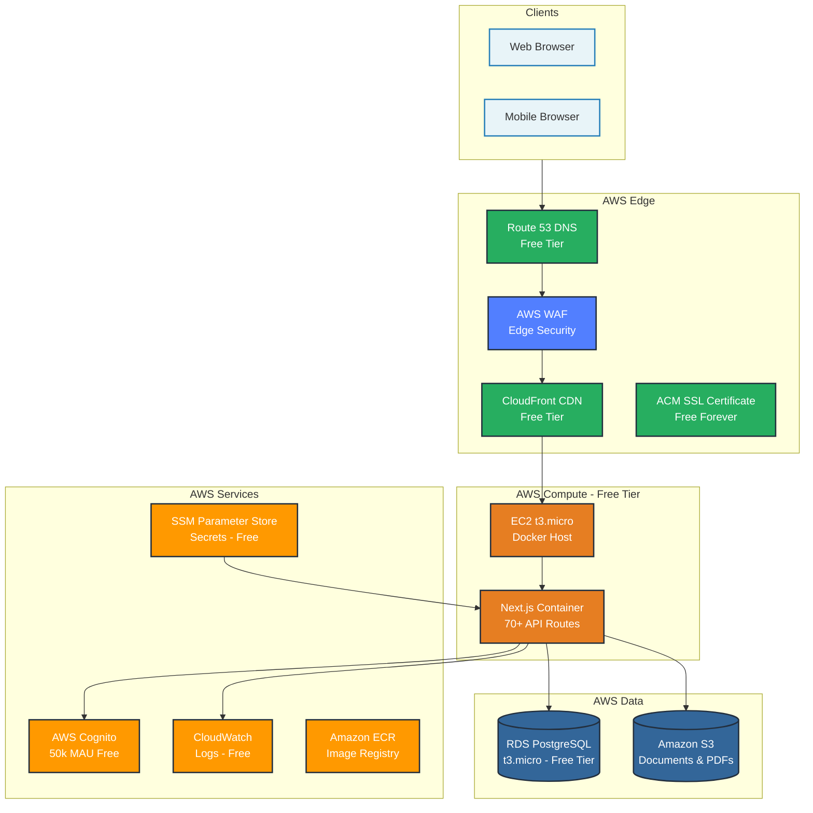

### Phase 2 — Scale Architecture (Future)

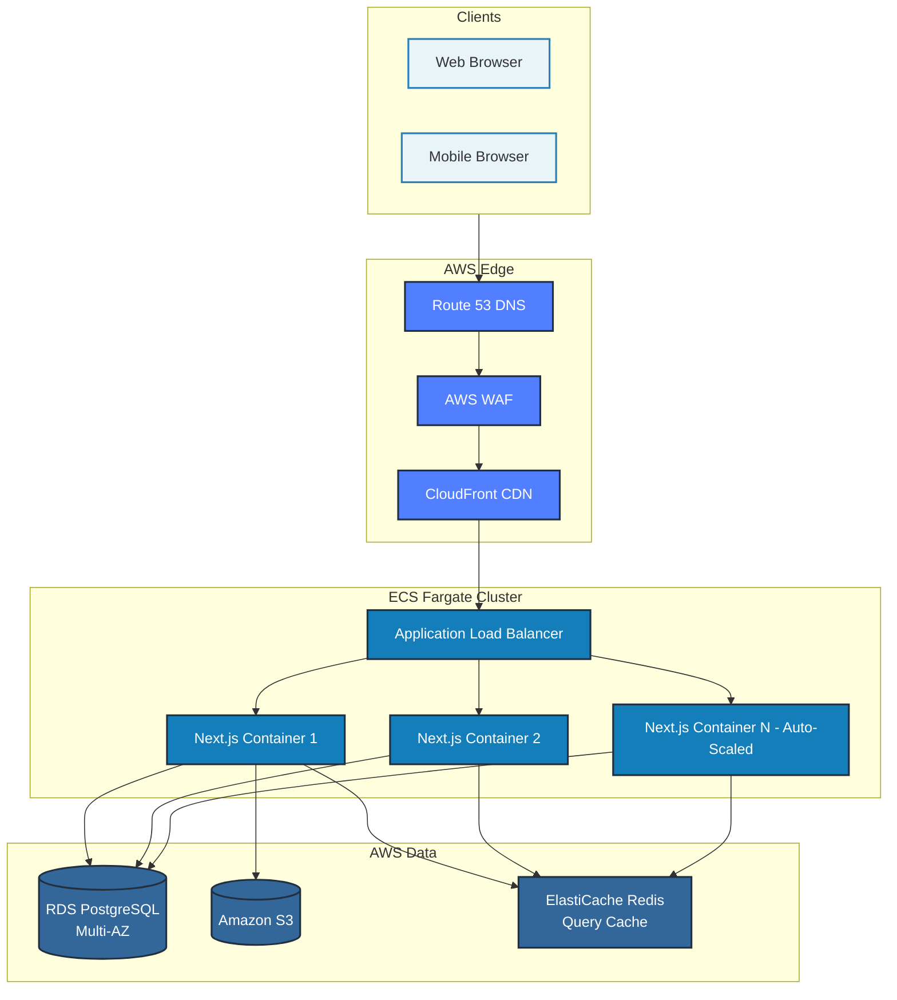

<div style="page-break-after: always;"></div>

# 3. Dual-Environment Strategy

## 3.1 Environment Overview
The platform strictly maintains two completely isolated environments to protect real tenant data from development errors.

| Component | Staging Environment | Production Environment |
|---|---|---|
| **Purpose** | Feature testing & co-founder review | Live system with real tenants |
| **Server** | EC2 t3.micro (off when not in use) | EC2 t3.micro (always on) |
| **Database** | `hostel_staging` on shared RDS | `hostel_prod` on shared RDS |
| **RDS Instance** | Shared single RDS instance | Same shared RDS instance |
| **S3 Bucket** | `hostel-staging-documents` | `hostel-prod-documents` |
| **Cognito Pool** | Separate pool (test users only) | Separate pool (real users) |
| **Domain** | `staging.yourdomain.com` | `app.yourdomain.com` |
| **SSL** | ACM certificate (free) | ACM certificate (free) |
| **Deploys from** | `development` branch | `main` branch (PR only) |
| **EC2 Runtime** | ~20 hrs/month (on-demand) | 720 hrs/month (24/7) |
| **Monthly Cost** | ₹0 | ₹0 (free tier) |

## 3.2 One Shared RDS — Two Isolated Databases

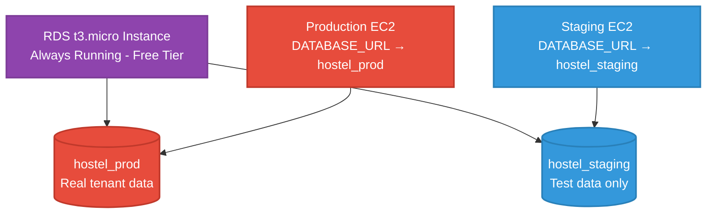

**Critical Isolation Rule:** The `DATABASE_URL` environment variable in each environment points to a completely different database. It is physically impossible for a staging deployment to read or write to production data.

## 3.3 Developer Workflow

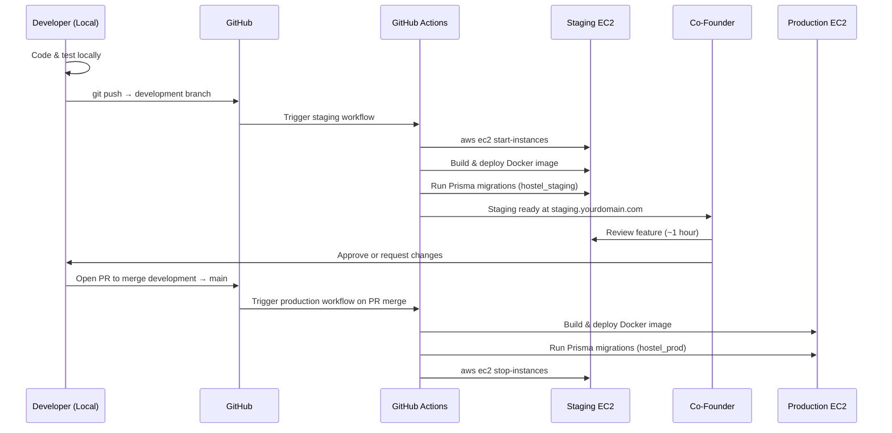

## 3.4 Free Tier Hours Calculation

| Instance | Runtime | Hours/Month |
|---|---|---|
| Production EC2 | 24/7 | 720 hrs |
| Staging EC2 | ~1 hr × 20 sessions | ~20 hrs |
| **Total** | | **740 hrs** |
| **Free Tier Limit** | | **750 hrs** ✅ |
| **Monthly Cost** | | **₹0** |

<div style="page-break-after: always;"></div>

# 4. Network Architecture & VPC Security

## 4.1 VPC Network Topology

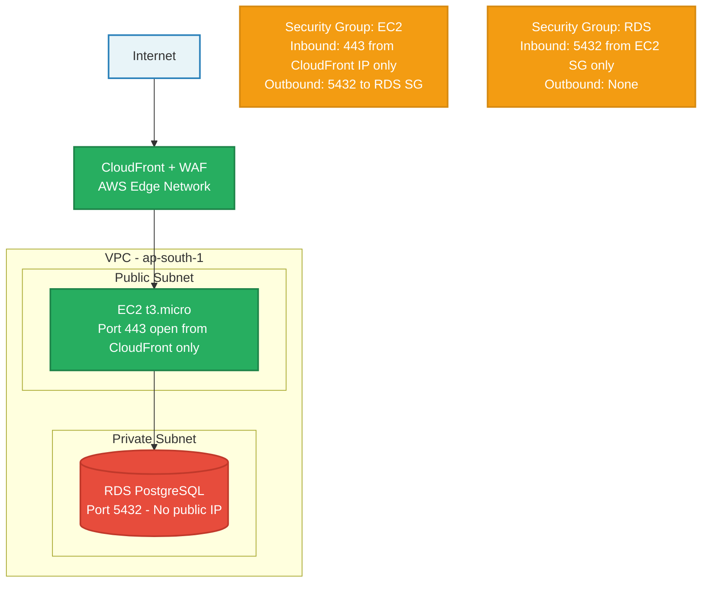

## 4.2 Security Group Rules

### EC2 Security Group
| Direction | Protocol | Port | Source | Purpose |
|---|---|---|---|---|
| Inbound | HTTPS | 443 | CloudFront IP ranges | App traffic |
| Inbound | SSH | 22 | Developer IP only | Deployments |
| Outbound | PostgreSQL | 5432 | RDS Security Group | DB queries |
| Outbound | HTTPS | 443 | 0.0.0.0/0 | ECR pulls, SSM, Cognito |

### RDS Security Group
| Direction | Protocol | Port | Source | Purpose |
|---|---|---|---|---|
| Inbound | PostgreSQL | 5432 | EC2 Security Group only | App queries |
| Outbound | None | — | — | No outbound |

**Critical:** The RDS instance has no public IP address. It is physically unreachable from the internet. The only path into the database is through the EC2 instance.

## 4.3 HTTPS / SSL (AWS Certificate Manager)

AWS ACM issues a free, auto-renewing SSL certificate for the domain. The certificate is attached to CloudFront, ensuring all traffic is encrypted end-to-end. There is zero manual certificate renewal required — ACM handles this automatically.

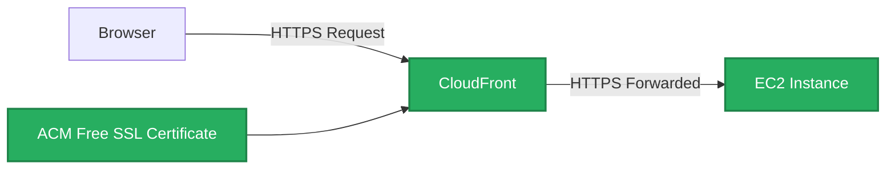

<div style="page-break-after: always;"></div>

# 5. Frontend Architecture & State Management

## 5.1 Frontend Data Flow

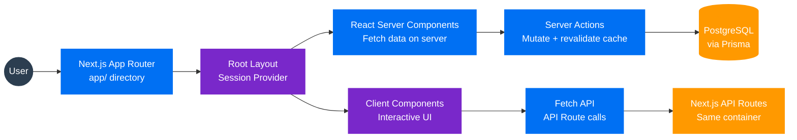

## 5.2 Why We Rejected Redux / Zustand

In traditional SPAs, Redux is required because the client needs to cache server responses manually. In Next.js App Router, this is completely unnecessary:

- **Server Components** fetch data directly from Prisma — no API call, no Redux store needed.
- **Server Actions** handle all mutations and call `revalidatePath()` or `revalidateTag()` to instantly refresh the correct UI without a full page reload.
- **Client Components** are strictly reserved for interactive elements (toggles, forms, real-time counters) — not for data fetching.

This eliminates thousands of lines of Redux boilerplate and eliminates entire categories of state synchronization bugs.

## 5.3 Next.js $0 Caching Strategy

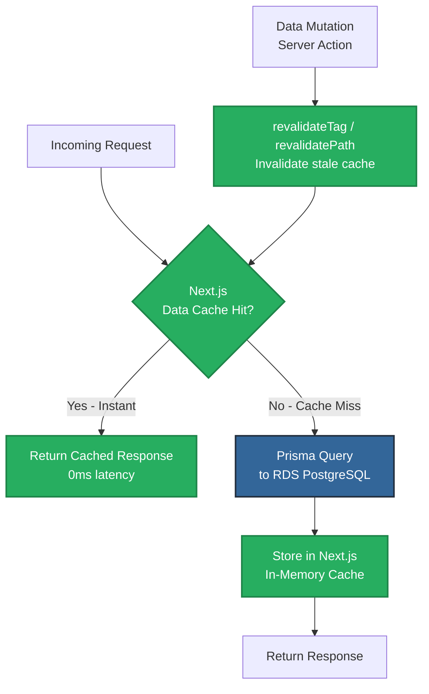

**Why this is sufficient for MVP:** Dashboard reads (available beds, hostel stats, tenant list) are extremely cache-friendly. The same data is requested by all wardens in a hostel. Caching it once serves all requests until a mutation occurs. This is functionally equivalent to Redis for our access patterns at ₹0 cost.

<div style="page-break-after: always;"></div>

# 6. Backend Architecture

## 6.1 Backend Service Flow

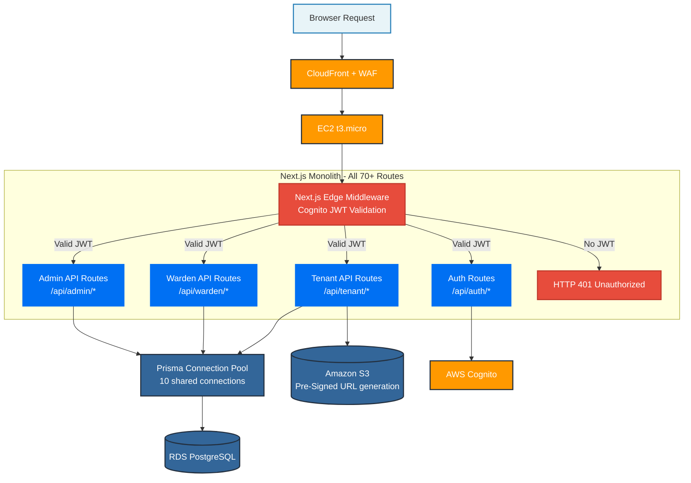

## 6.2 Why We Chose ECS Fargate Over Lambda (Phase 2)

### The Database Connection Problem with Lambda

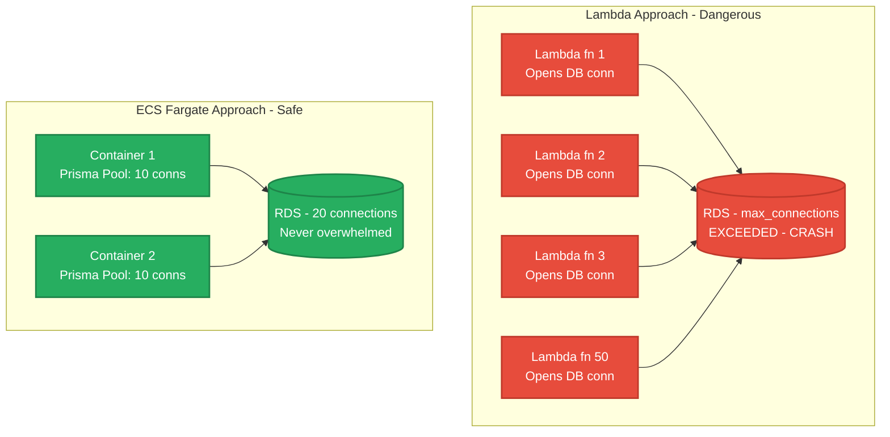

| Problem | Lambda | ECS Fargate |
|---|---|---|
| DB connections per 50 req | 50 new connections | 10 pooled connections |
| Cold start latency | 1-3 seconds | 0ms (always warm) |
| Cost at scale | Pay per invocation | Predictable flat rate |
| Next.js compatibility | Requires complex adapter | Native support |

<div style="page-break-after: always;"></div>

# 7. Full Database Schema & Architecture

## 7.1 Entity-Relationship Diagram

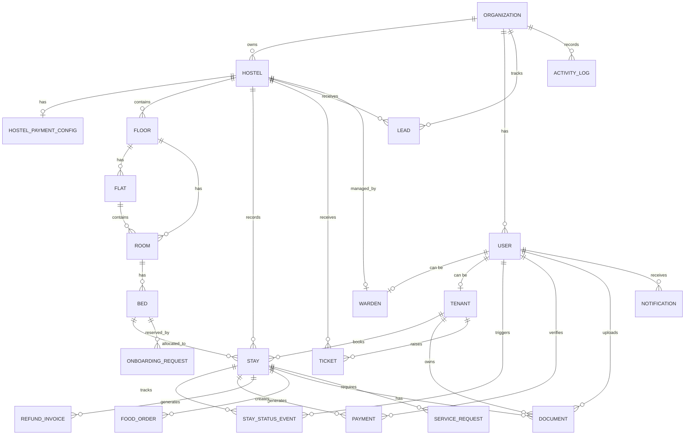

## 7.2 Deep-Dive Table Architecture

### 7.2.1 `Organization` — The Multi-Tenant Root
- **Purpose:** Every single record in the entire database traces back to an `organizationId`. This is the root of the multi-tenancy model.
- **Isolation Guarantee:** All Prisma queries at the service layer are scoped with `where: { organizationId }`. It is architecturally impossible for Admin A to see Hostel B's tenants.
- **Fields of note:** `domain` (unique) enables future white-label subdomain routing per client organization.

### 7.2.2 `User` + `Warden` + `Tenant` — Role Separation Pattern
- **Architecture:** A single `User` record holds credentials and role enum (`MAIN_ADMIN`, `WARDEN`, `TENANT`). Role-specific data lives in separate `Warden` and `Tenant` tables linked 1-to-1.
- **Justification:** This avoids the "God table" anti-pattern where a single users table has 50 nullable columns, most of which only apply to one role. A Warden's `hostelId` has zero relevance to a Tenant's `collegeName`.
- **Auth linkage:** `supabaseAuthId` (now Cognito sub ID) uniquely maps the AWS Cognito user to the internal User record.

### 7.2.3 `Hostel` → `Floor` → `Flat` → `Room` → `Bed` — Building Hierarchy
- **Architecture:** A 5-level physical hierarchy modelling the real-world building structure.
- **Flexibility:** `Room` has both `flatId` and `floorId` as optional fields. Exactly one must be set (enforced at application level). This allows the same schema to model both standard dorm layouts (Hostel → Floor → Room) and apartment-style layouts (Hostel → Floor → Flat → Room).
- **Cascading Deletes:** Every level uses `onDelete: Cascade`. Deleting a Floor automatically purges all its Rooms and Beds, preventing orphaned records.

### 7.2.4 `Stay` — The Core Operational Model
- **Purpose:** The most critical table. It binds a `Tenant` to a specific `Bed` for a defined period.
- **Denormalization decision:** `hostelId` is stored directly on `Stay` even though it could be derived via `Bed → Room → Floor → Hostel`. This intentional denormalization means "get all active stays for Hostel X" is a single indexed lookup instead of a 4-table JOIN. Dashboard performance is 100x faster.
- **State machine:** `StayStatus` enum acts as a finite-state machine: `ONBOARDING_PENDING` → `APPROVED_AWAITING_PAYMENT` → `ACTIVE` → `CHECKED_OUT`. Invalid transitions are rejected at the application layer.
- **Financial fields:** All monetary values stored in **Paise** (integer), never in floating-point rupees. This prevents floating-point rounding errors in financial calculations (e.g., 0.1 + 0.2 ≠ 0.3 in IEEE 754).

### 7.2.5 `Payment` + `RefundInvoice` — Financial Integrity
- **Receipt numbers:** Auto-incrementing `receiptNumber` is unique and sequential, making it auditable and tamper-evident.
- **Verification chain:** A `Payment` holds a 1-to-1 reference to a `Document` (the UPI screenshot). The Warden's verification is tracked with `verifiedByUserId` and `verifiedAt` timestamp, creating a complete audit chain.
- **Refunds:** `RefundInvoice` calculates the refund based on `daysUsed` vs `daysRemaining` and stores a reference to the generated PDF document.

### 7.2.6 `Document` — Polymorphic Storage Model
- **Architecture:** A document can belong to either a `Tenant` (KYC: Aadhaar, PAN) or a `Stay` (receipts, registration forms). The `ownerType` enum (`TENANT`, `STAY`) acts as the discriminator.
- **Storage:** `storagePath` stores the S3 object key, never the full URL. Pre-signed URLs are generated at request time, ensuring documents are never publicly accessible via a permanent link.

### 7.2.7 `ActivityLog` — Audit Trail
- **Purpose:** Every significant event (tenant onboarded, payment received, status changed) is written to `ActivityLog` with `actorName` and `subjectName` denormalized as strings.
- **Denormalization justification:** If a User is deleted, their name is preserved in the audit log via the denormalized string field, maintaining complete historical traceability.

<div style="page-break-after: always;"></div>

# 8. Cloud Storage & Document Management

## 8.1 S3 Pre-Signed URL Upload Architecture

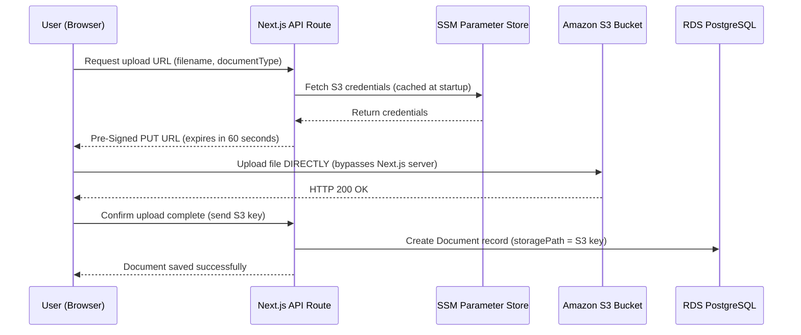

## 8.2 S3 Bucket Structure

```
hostel-prod-documents/
├── kyc/
│   └── {tenantId}/
│       ├── aadhaar.jpg
│       ├── pan.jpg
│       └── passport_photo.jpg
├── payments/
│   └── {stayId}/
│       └── {paymentId}/
│           └── screenshot.jpg
└── pdfs/
    └── {stayId}/
        ├── registration_form.pdf
        └── receipt_{receiptNumber}.pdf
```

## 8.3 Security Controls on S3
1. **No Public Access:** The bucket has Block All Public Access enabled. No document is ever accessible via a direct URL.
2. **Pre-Signed URL expiry:** All upload URLs expire in 60 seconds. All download URLs expire in 15 minutes.
3. **Versioning:** Enabled on the production bucket. Accidentally overwritten or deleted files are recoverable from version history.

<div style="page-break-after: always;"></div>

# 9. Identity, Access Management & Secrets

## 9.1 JWT Authentication Flow

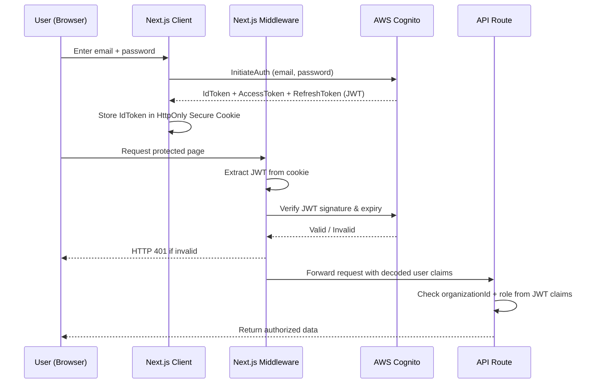

## 9.2 IAM Task Role — How the Container Gets AWS Permissions

This is critical: **no hardcoded AWS credentials exist anywhere in the codebase or Docker image.** The container gets permissions through AWS IAM Roles.

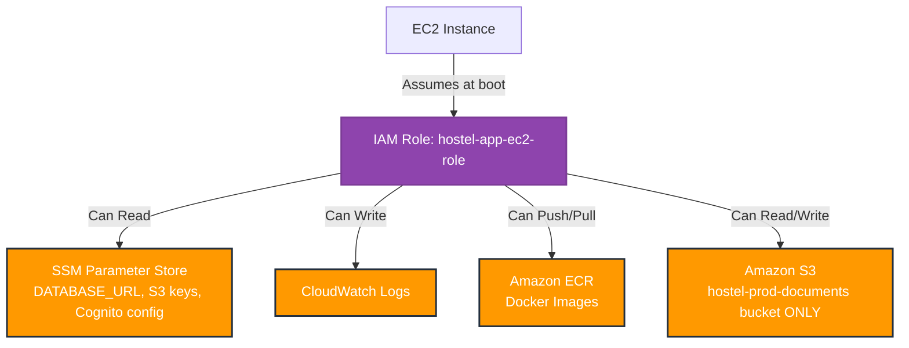

**The EC2 instance is assigned this IAM Role at launch.** The Next.js application uses the AWS SDK, which automatically inherits the role credentials from the EC2 instance metadata service. No access keys are ever stored anywhere.

## 9.3 Secrets Management (SSM Parameter Store)

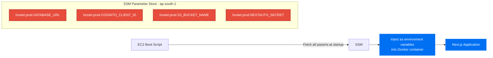

**Why SSM over hardcoded .env files:**
- If the EC2 instance is compromised, the attacker cannot read SSM secrets (they require IAM role permissions to fetch).
- Rotating a secret (e.g., a new database password) requires updating one SSM value — no redeployment needed.
- Every access to a secret is logged in CloudTrail for audit purposes.

<div style="page-break-after: always;"></div>

# 10. CI/CD Pipeline & Deployment

## 10.1 Complete CI/CD Architecture with ECR

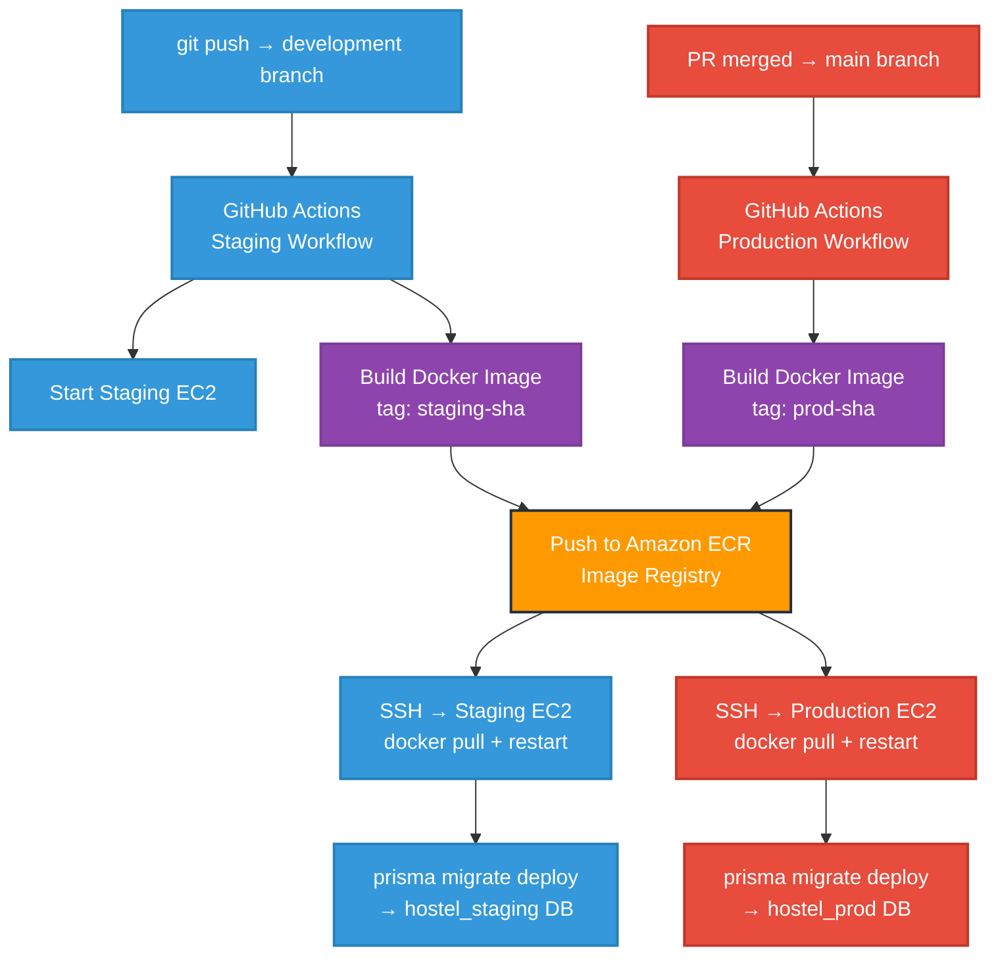

## 10.2 Git Branching Strategy

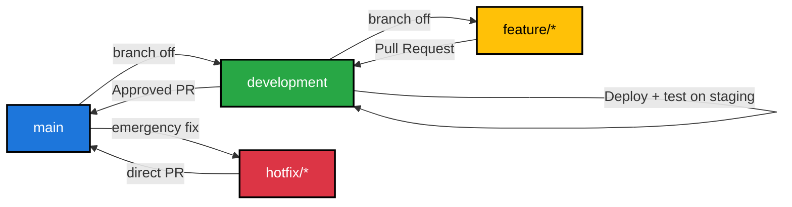

| Branch | Deploys to | Protection Rules |
|---|---|---|
| `main` | Production EC2 | Requires PR + review. No direct push. |
| `development` | Staging EC2 (auto-start) | Direct push allowed for developers |
| `feature/*` | Local only | No cloud deployment |
| `hotfix/*` | Production (emergency) | Requires PR to main |

## 10.3 Zero-Downtime Deployment Strategy

The production deployment is a rolling update:
1. GitHub Actions SSHs into the production EC2.
2. Pulls the new Docker image from ECR in the background while the old container still serves traffic.
3. Stops the old container and starts the new one. Total downtime: ~2-3 seconds during container swap.
4. Runs `prisma migrate deploy` — Prisma only runs additive, non-destructive migrations. Destructive migrations require explicit manual review.

<div style="page-break-after: always;"></div>

# 11. Observability & Monitoring

## 11.1 CloudWatch Integration Architecture

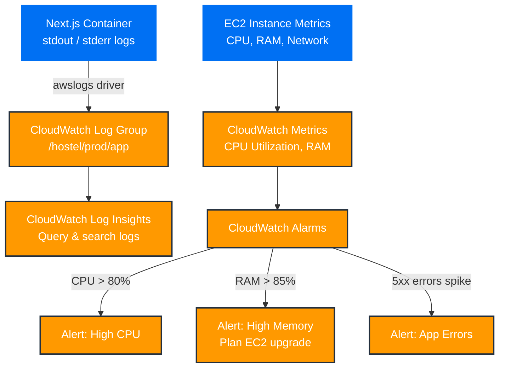

## 11.2 What is Logged

| Log Source | CloudWatch Log Group | Retention |
|---|---|---|
| Next.js server errors | `/hostel/prod/app` | 30 days |
| Prisma query errors | `/hostel/prod/app` | 30 days |
| EC2 system logs | `/hostel/prod/system` | 7 days |
| Nginx/Docker logs | `/hostel/prod/docker` | 7 days |

## 11.3 When to Act on Alarms

| Alarm | Threshold | Action |
|---|---|---|
| CPU Utilization | > 80% sustained | Review slow queries, consider EC2 upgrade |
| Memory | > 85% | Immediate: upgrade to t3.small (2GB RAM) |
| 5xx Error Rate | > 1% of requests | Investigate CloudWatch logs immediately |
| RDS Connections | > 80% of max | Review Prisma pool size |

<div style="page-break-after: always;"></div>

# 12. Disaster Recovery & Backup

## 12.1 RDS Automated Backups (PITR)

RDS automated backups are enabled with **Point-In-Time Recovery (PITR)**. This allows the database to be restored to any exact second within the last 35 days.

**Real-world scenario:** A warden accidentally runs a bulk operation that corrupts 500 tenant records. With PITR, the database is restored to the state it was in 5 minutes before the incident. Recovery Time Objective (RTO): ~15-30 minutes.

## 12.2 S3 Versioning

S3 Versioning is enabled on the production documents bucket. If a KYC document or legal PDF is accidentally overwritten or deleted, the previous version is instantly recoverable from the S3 version history.

## 12.3 Recovery Strategy

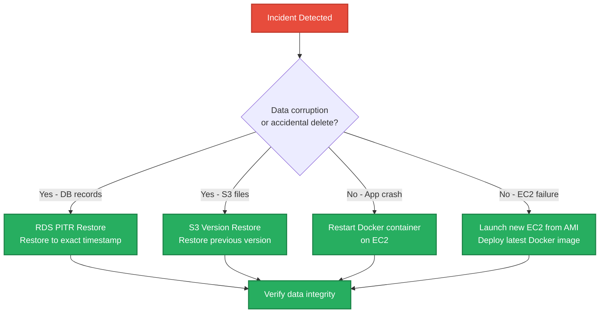

<div style="page-break-after: always;"></div>

# 13. Cost Optimization & MVP Budget

## 13.1 Phase 1 MVP — AWS Free Tier Budget (Year 1)

| AWS Service | Free Tier Limit | Expected Monthly Usage | Est. Monthly Cost |
|---|---|---|---|
| **EC2 t3.micro (Prod)** | 750 hrs/month combined | 720 hrs (24/7) | ₹0 |
| **EC2 t3.micro (Staging)** | (shared 750 hr pool) | ~20 hrs (on-demand) | ₹0 |
| **RDS t3.micro** | 750 hrs/month | 720 hrs (24/7, 1 instance) | ₹0 |
| **RDS Storage** | 20 GB SSD | ~2-5 GB | ₹0 |
| **Amazon S3** | 5 GB storage, 20k GET | ~1-2 GB, low requests | ₹0 |
| **AWS Cognito** | 50,000 MAU (permanent) | < 500 MAU | ₹0 |
| **CloudWatch Logs** | 5 GB/month (permanent) | < 1 GB | ₹0 |
| **CloudFront** | 1 TB data transfer/month | < 10 GB | ₹0 |
| **ACM SSL Certificate** | Free (permanent) | 1 certificate | ₹0 |
| **SSM Parameter Store** | 10,000 API calls/month | < 100 calls | ₹0 |
| **Amazon ECR** | 500 MB storage/month | < 200 MB | ₹0 |
| **Route 53** | N/A (not free) | 1 hosted zone | ~₹42/month |
| **TOTAL** | | | **~₹42/month** |

> **Note:** Route 53 charges $0.50/month (~₹42) per hosted zone. This is the only unavoidable cost. Everything else stays within free tier for 12 months assuming usage stays within the limits above.

## 13.2 Phase 2 Scale — Post Free Tier / Growth

| AWS Service | Configuration | Est. Monthly Cost |
|---|---|---|
| **ECS Fargate** | 0.5 vCPU, 1GB RAM, 2 tasks | ~₹2,500/month |
| **RDS t3.small** | Multi-AZ, 50GB storage | ~₹4,500/month |
| **Application Load Balancer** | 1 ALB | ~₹1,400/month |
| **CloudFront** | 100GB data transfer | ~₹700/month |
| **ElastiCache t3.micro** | Redis cache (if needed) | ~₹1,200/month |
| **TOTAL** | | **~₹10,300/month** |

**Trigger for Phase 2 migration:** When the platform onboards 8+ hostels or RAM utilization on EC2 consistently exceeds 80%.

<div style="page-break-after: always;"></div>

# 14. Exhaustive API Documentation

The following is the complete mapping of all Next.js API routes running inside the unified Docker container. All routes share the same Prisma PostgreSQL connection pool.

### `GET/POST/PUT/DELETE /api/admin/activity`
- **Domain:** `admin`
- **Auth:** JWT validated by Next.js Middleware (Cognito). Returns HTTP 401 if token is missing or expired.
- **DB Layer:** Prisma ORM on shared connection pool (RDS PostgreSQL). Zero new connections opened per request.
- **Caching:** High-frequency read endpoints leverage Next.js Data Cache with `revalidateTag` for instant invalidation on mutation.

### `GET/POST/PUT/DELETE /api/admin/activity/export`
- **Domain:** `admin`
- **Auth:** JWT validated by Next.js Middleware (Cognito). Returns HTTP 401 if token is missing or expired.
- **DB Layer:** Prisma ORM on shared connection pool (RDS PostgreSQL). Zero new connections opened per request.
- **Caching:** High-frequency read endpoints leverage Next.js Data Cache with `revalidateTag` for instant invalidation on mutation.

### `GET/POST/PUT/DELETE /api/admin/beds/[id]`
- **Domain:** `admin`
- **Auth:** JWT validated by Next.js Middleware (Cognito). Returns HTTP 401 if token is missing or expired.
- **DB Layer:** Prisma ORM on shared connection pool (RDS PostgreSQL). Zero new connections opened per request.
- **Caching:** High-frequency read endpoints leverage Next.js Data Cache with `revalidateTag` for instant invalidation on mutation.

### `GET/POST/PUT/DELETE /api/admin/dashboard/stats`
- **Domain:** `admin`
- **Auth:** JWT validated by Next.js Middleware (Cognito). Returns HTTP 401 if token is missing or expired.
- **DB Layer:** Prisma ORM on shared connection pool (RDS PostgreSQL). Zero new connections opened per request.
- **Caching:** High-frequency read endpoints leverage Next.js Data Cache with `revalidateTag` for instant invalidation on mutation.

### `GET/POST/PUT/DELETE /api/admin/flats`
- **Domain:** `admin`
- **Auth:** JWT validated by Next.js Middleware (Cognito). Returns HTTP 401 if token is missing or expired.
- **DB Layer:** Prisma ORM on shared connection pool (RDS PostgreSQL). Zero new connections opened per request.
- **Caching:** High-frequency read endpoints leverage Next.js Data Cache with `revalidateTag` for instant invalidation on mutation.

### `GET/POST/PUT/DELETE /api/admin/flats/[id]`
- **Domain:** `admin`
- **Auth:** JWT validated by Next.js Middleware (Cognito). Returns HTTP 401 if token is missing or expired.
- **DB Layer:** Prisma ORM on shared connection pool (RDS PostgreSQL). Zero new connections opened per request.
- **Caching:** High-frequency read endpoints leverage Next.js Data Cache with `revalidateTag` for instant invalidation on mutation.

### `GET/POST/PUT/DELETE /api/admin/floors`
- **Domain:** `admin`
- **Auth:** JWT validated by Next.js Middleware (Cognito). Returns HTTP 401 if token is missing or expired.
- **DB Layer:** Prisma ORM on shared connection pool (RDS PostgreSQL). Zero new connections opened per request.
- **Caching:** High-frequency read endpoints leverage Next.js Data Cache with `revalidateTag` for instant invalidation on mutation.

### `GET/POST/PUT/DELETE /api/admin/floors/[id]`
- **Domain:** `admin`
- **Auth:** JWT validated by Next.js Middleware (Cognito). Returns HTTP 401 if token is missing or expired.
- **DB Layer:** Prisma ORM on shared connection pool (RDS PostgreSQL). Zero new connections opened per request.
- **Caching:** High-frequency read endpoints leverage Next.js Data Cache with `revalidateTag` for instant invalidation on mutation.

### `GET/POST/PUT/DELETE /api/admin/hostels`
- **Domain:** `admin`
- **Auth:** JWT validated by Next.js Middleware (Cognito). Returns HTTP 401 if token is missing or expired.
- **DB Layer:** Prisma ORM on shared connection pool (RDS PostgreSQL). Zero new connections opened per request.
- **Caching:** High-frequency read endpoints leverage Next.js Data Cache with `revalidateTag` for instant invalidation on mutation.

### `GET/POST/PUT/DELETE /api/admin/hostels/[id]/payment-config`
- **Domain:** `admin`
- **Auth:** JWT validated by Next.js Middleware (Cognito). Returns HTTP 401 if token is missing or expired.
- **DB Layer:** Prisma ORM on shared connection pool (RDS PostgreSQL). Zero new connections opened per request.
- **Caching:** High-frequency read endpoints leverage Next.js Data Cache with `revalidateTag` for instant invalidation on mutation.

### `GET/POST/PUT/DELETE /api/admin/hostels/[id]/warden`
- **Domain:** `admin`
- **Auth:** JWT validated by Next.js Middleware (Cognito). Returns HTTP 401 if token is missing or expired.
- **DB Layer:** Prisma ORM on shared connection pool (RDS PostgreSQL). Zero new connections opened per request.
- **Caching:** High-frequency read endpoints leverage Next.js Data Cache with `revalidateTag` for instant invalidation on mutation.

### `GET/POST/PUT/DELETE /api/admin/locations`
- **Domain:** `admin`
- **Auth:** JWT validated by Next.js Middleware (Cognito). Returns HTTP 401 if token is missing or expired.
- **DB Layer:** Prisma ORM on shared connection pool (RDS PostgreSQL). Zero new connections opened per request.
- **Caching:** High-frequency read endpoints leverage Next.js Data Cache with `revalidateTag` for instant invalidation on mutation.

### `GET/POST/PUT/DELETE /api/admin/onboards`
- **Domain:** `admin`
- **Auth:** JWT validated by Next.js Middleware (Cognito). Returns HTTP 401 if token is missing or expired.
- **DB Layer:** Prisma ORM on shared connection pool (RDS PostgreSQL). Zero new connections opened per request.
- **Caching:** High-frequency read endpoints leverage Next.js Data Cache with `revalidateTag` for instant invalidation on mutation.

### `GET/POST/PUT/DELETE /api/admin/onboards/[id]/cancel`
- **Domain:** `admin`
- **Auth:** JWT validated by Next.js Middleware (Cognito). Returns HTTP 401 if token is missing or expired.
- **DB Layer:** Prisma ORM on shared connection pool (RDS PostgreSQL). Zero new connections opened per request.
- **Caching:** High-frequency read endpoints leverage Next.js Data Cache with `revalidateTag` for instant invalidation on mutation.

### `GET/POST/PUT/DELETE /api/admin/rooms`
- **Domain:** `admin`
- **Auth:** JWT validated by Next.js Middleware (Cognito). Returns HTTP 401 if token is missing or expired.
- **DB Layer:** Prisma ORM on shared connection pool (RDS PostgreSQL). Zero new connections opened per request.
- **Caching:** High-frequency read endpoints leverage Next.js Data Cache with `revalidateTag` for instant invalidation on mutation.

### `GET/POST/PUT/DELETE /api/admin/rooms/[id]`
- **Domain:** `admin`
- **Auth:** JWT validated by Next.js Middleware (Cognito). Returns HTTP 401 if token is missing or expired.
- **DB Layer:** Prisma ORM on shared connection pool (RDS PostgreSQL). Zero new connections opened per request.
- **Caching:** High-frequency read endpoints leverage Next.js Data Cache with `revalidateTag` for instant invalidation on mutation.

### `GET/POST/PUT/DELETE /api/admin/tickets`
- **Domain:** `admin`
- **Auth:** JWT validated by Next.js Middleware (Cognito). Returns HTTP 401 if token is missing or expired.
- **DB Layer:** Prisma ORM on shared connection pool (RDS PostgreSQL). Zero new connections opened per request.
- **Caching:** High-frequency read endpoints leverage Next.js Data Cache with `revalidateTag` for instant invalidation on mutation.

### `GET/POST/PUT/DELETE /api/admin/tickets/[id]/comments`
- **Domain:** `admin`
- **Auth:** JWT validated by Next.js Middleware (Cognito). Returns HTTP 401 if token is missing or expired.
- **DB Layer:** Prisma ORM on shared connection pool (RDS PostgreSQL). Zero new connections opened per request.
- **Caching:** High-frequency read endpoints leverage Next.js Data Cache with `revalidateTag` for instant invalidation on mutation.

### `GET/POST/PUT/DELETE /api/admin/users`
- **Domain:** `admin`
- **Auth:** JWT validated by Next.js Middleware (Cognito). Returns HTTP 401 if token is missing or expired.
- **DB Layer:** Prisma ORM on shared connection pool (RDS PostgreSQL). Zero new connections opened per request.
- **Caching:** High-frequency read endpoints leverage Next.js Data Cache with `revalidateTag` for instant invalidation on mutation.

### `GET/POST/PUT/DELETE /api/admin/users/[id]/reset-password`
- **Domain:** `admin`
- **Auth:** JWT validated by Next.js Middleware (Cognito). Returns HTTP 401 if token is missing or expired.
- **DB Layer:** Prisma ORM on shared connection pool (RDS PostgreSQL). Zero new connections opened per request.
- **Caching:** High-frequency read endpoints leverage Next.js Data Cache with `revalidateTag` for instant invalidation on mutation.

### `GET/POST/PUT/DELETE /api/admin/wardens`
- **Domain:** `admin`
- **Auth:** JWT validated by Next.js Middleware (Cognito). Returns HTTP 401 if token is missing or expired.
- **DB Layer:** Prisma ORM on shared connection pool (RDS PostgreSQL). Zero new connections opened per request.
- **Caching:** High-frequency read endpoints leverage Next.js Data Cache with `revalidateTag` for instant invalidation on mutation.

### `GET/POST/PUT/DELETE /api/admin/wardens/[id]`
- **Domain:** `admin`
- **Auth:** JWT validated by Next.js Middleware (Cognito). Returns HTTP 401 if token is missing or expired.
- **DB Layer:** Prisma ORM on shared connection pool (RDS PostgreSQL). Zero new connections opened per request.
- **Caching:** High-frequency read endpoints leverage Next.js Data Cache with `revalidateTag` for instant invalidation on mutation.

### `GET/POST/PUT/DELETE /api/admin/wardens/[id]/reset-password`
- **Domain:** `admin`
- **Auth:** JWT validated by Next.js Middleware (Cognito). Returns HTTP 401 if token is missing or expired.
- **DB Layer:** Prisma ORM on shared connection pool (RDS PostgreSQL). Zero new connections opened per request.
- **Caching:** High-frequency read endpoints leverage Next.js Data Cache with `revalidateTag` for instant invalidation on mutation.

### `GET/POST/PUT/DELETE /api/auth/login`
- **Domain:** `auth`
- **Auth:** JWT validated by Next.js Middleware (Cognito). Returns HTTP 401 if token is missing or expired.
- **DB Layer:** Prisma ORM on shared connection pool (RDS PostgreSQL). Zero new connections opened per request.
- **Caching:** High-frequency read endpoints leverage Next.js Data Cache with `revalidateTag` for instant invalidation on mutation.

### `GET/POST/PUT/DELETE /api/auth/logout`
- **Domain:** `auth`
- **Auth:** JWT validated by Next.js Middleware (Cognito). Returns HTTP 401 if token is missing or expired.
- **DB Layer:** Prisma ORM on shared connection pool (RDS PostgreSQL). Zero new connections opened per request.
- **Caching:** High-frequency read endpoints leverage Next.js Data Cache with `revalidateTag` for instant invalidation on mutation.

### `GET/POST/PUT/DELETE /api/auth/reset-password`
- **Domain:** `auth`
- **Auth:** JWT validated by Next.js Middleware (Cognito). Returns HTTP 401 if token is missing or expired.
- **DB Layer:** Prisma ORM on shared connection pool (RDS PostgreSQL). Zero new connections opened per request.
- **Caching:** High-frequency read endpoints leverage Next.js Data Cache with `revalidateTag` for instant invalidation on mutation.

### `GET/POST/PUT/DELETE /api/auth/set-password`
- **Domain:** `auth`
- **Auth:** JWT validated by Next.js Middleware (Cognito). Returns HTTP 401 if token is missing or expired.
- **DB Layer:** Prisma ORM on shared connection pool (RDS PostgreSQL). Zero new connections opened per request.
- **Caching:** High-frequency read endpoints leverage Next.js Data Cache with `revalidateTag` for instant invalidation on mutation.

### `GET/POST/PUT/DELETE /api/hostel-structure/[hostelId]`
- **Domain:** `hostel-structure`
- **Auth:** JWT validated by Next.js Middleware (Cognito). Returns HTTP 401 if token is missing or expired.
- **DB Layer:** Prisma ORM on shared connection pool (RDS PostgreSQL). Zero new connections opened per request.
- **Caching:** High-frequency read endpoints leverage Next.js Data Cache with `revalidateTag` for instant invalidation on mutation.

### `GET/POST/PUT/DELETE /api/hostel-structure/mine`
- **Domain:** `hostel-structure`
- **Auth:** JWT validated by Next.js Middleware (Cognito). Returns HTTP 401 if token is missing or expired.
- **DB Layer:** Prisma ORM on shared connection pool (RDS PostgreSQL). Zero new connections opened per request.
- **Caching:** High-frequency read endpoints leverage Next.js Data Cache with `revalidateTag` for instant invalidation on mutation.

### `GET/POST/PUT/DELETE /api/internal/auth-check`
- **Domain:** `internal`
- **Auth:** JWT validated by Next.js Middleware (Cognito). Returns HTTP 401 if token is missing or expired.
- **DB Layer:** Prisma ORM on shared connection pool (RDS PostgreSQL). Zero new connections opened per request.
- **Caching:** High-frequency read endpoints leverage Next.js Data Cache with `revalidateTag` for instant invalidation on mutation.

### `GET/POST/PUT/DELETE /api/notifications`
- **Domain:** `notifications`
- **Auth:** JWT validated by Next.js Middleware (Cognito). Returns HTTP 401 if token is missing or expired.
- **DB Layer:** Prisma ORM on shared connection pool (RDS PostgreSQL). Zero new connections opened per request.
- **Caching:** High-frequency read endpoints leverage Next.js Data Cache with `revalidateTag` for instant invalidation on mutation.

### `GET/POST/PUT/DELETE /api/notifications/[id]`
- **Domain:** `notifications`
- **Auth:** JWT validated by Next.js Middleware (Cognito). Returns HTTP 401 if token is missing or expired.
- **DB Layer:** Prisma ORM on shared connection pool (RDS PostgreSQL). Zero new connections opened per request.
- **Caching:** High-frequency read endpoints leverage Next.js Data Cache with `revalidateTag` for instant invalidation on mutation.

### `GET/POST/PUT/DELETE /api/pdf/download/[documentId]`
- **Domain:** `pdf`
- **Auth:** JWT validated by Next.js Middleware (Cognito). Returns HTTP 401 if token is missing or expired.
- **DB Layer:** Prisma ORM on shared connection pool (RDS PostgreSQL). Zero new connections opened per request.
- **Caching:** High-frequency read endpoints leverage Next.js Data Cache with `revalidateTag` for instant invalidation on mutation.

### `GET/POST/PUT/DELETE /api/pdf/receipt/[paymentId]`
- **Domain:** `pdf`
- **Auth:** JWT validated by Next.js Middleware (Cognito). Returns HTTP 401 if token is missing or expired.
- **DB Layer:** Prisma ORM on shared connection pool (RDS PostgreSQL). Zero new connections opened per request.
- **Caching:** High-frequency read endpoints leverage Next.js Data Cache with `revalidateTag` for instant invalidation on mutation.

### `GET/POST/PUT/DELETE /api/pdf/refund-invoice/[refundInvoiceId]`
- **Domain:** `pdf`
- **Auth:** JWT validated by Next.js Middleware (Cognito). Returns HTTP 401 if token is missing or expired.
- **DB Layer:** Prisma ORM on shared connection pool (RDS PostgreSQL). Zero new connections opened per request.
- **Caching:** High-frequency read endpoints leverage Next.js Data Cache with `revalidateTag` for instant invalidation on mutation.

### `GET/POST/PUT/DELETE /api/pdf/registration-form/[stayId]`
- **Domain:** `pdf`
- **Auth:** JWT validated by Next.js Middleware (Cognito). Returns HTTP 401 if token is missing or expired.
- **DB Layer:** Prisma ORM on shared connection pool (RDS PostgreSQL). Zero new connections opened per request.
- **Caching:** High-frequency read endpoints leverage Next.js Data Cache with `revalidateTag` for instant invalidation on mutation.

### `GET/POST/PUT/DELETE /api/public/hostels/[id]/payment-config`
- **Domain:** `public`
- **Auth:** JWT validated by Next.js Middleware (Cognito). Returns HTTP 401 if token is missing or expired.
- **DB Layer:** Prisma ORM on shared connection pool (RDS PostgreSQL). Zero new connections opened per request.
- **Caching:** High-frequency read endpoints leverage Next.js Data Cache with `revalidateTag` for instant invalidation on mutation.

### `GET/POST/PUT/DELETE /api/public/onboard-request/[id]`
- **Domain:** `public`
- **Auth:** JWT validated by Next.js Middleware (Cognito). Returns HTTP 401 if token is missing or expired.
- **DB Layer:** Prisma ORM on shared connection pool (RDS PostgreSQL). Zero new connections opened per request.
- **Caching:** High-frequency read endpoints leverage Next.js Data Cache with `revalidateTag` for instant invalidation on mutation.

### `GET/POST/PUT/DELETE /api/public/onboard-request/[id]/register`
- **Domain:** `public`
- **Auth:** JWT validated by Next.js Middleware (Cognito). Returns HTTP 401 if token is missing or expired.
- **DB Layer:** Prisma ORM on shared connection pool (RDS PostgreSQL). Zero new connections opened per request.
- **Caching:** High-frequency read endpoints leverage Next.js Data Cache with `revalidateTag` for instant invalidation on mutation.

### `GET/POST/PUT/DELETE /api/public/onboarding/[id]`
- **Domain:** `public`
- **Auth:** JWT validated by Next.js Middleware (Cognito). Returns HTTP 401 if token is missing or expired.
- **DB Layer:** Prisma ORM on shared connection pool (RDS PostgreSQL). Zero new connections opened per request.
- **Caching:** High-frequency read endpoints leverage Next.js Data Cache with `revalidateTag` for instant invalidation on mutation.

### `GET/POST/PUT/DELETE /api/public/onboarding/[id]/finalize`
- **Domain:** `public`
- **Auth:** JWT validated by Next.js Middleware (Cognito). Returns HTTP 401 if token is missing or expired.
- **DB Layer:** Prisma ORM on shared connection pool (RDS PostgreSQL). Zero new connections opened per request.
- **Caching:** High-frequency read endpoints leverage Next.js Data Cache with `revalidateTag` for instant invalidation on mutation.

### `GET/POST/PUT/DELETE /api/public/onboarding/[id]/progress`
- **Domain:** `public`
- **Auth:** JWT validated by Next.js Middleware (Cognito). Returns HTTP 401 if token is missing or expired.
- **DB Layer:** Prisma ORM on shared connection pool (RDS PostgreSQL). Zero new connections opened per request.
- **Caching:** High-frequency read endpoints leverage Next.js Data Cache with `revalidateTag` for instant invalidation on mutation.

### `GET/POST/PUT/DELETE /api/public/onboarding/[id]/validate`
- **Domain:** `public`
- **Auth:** JWT validated by Next.js Middleware (Cognito). Returns HTTP 401 if token is missing or expired.
- **DB Layer:** Prisma ORM on shared connection pool (RDS PostgreSQL). Zero new connections opened per request.
- **Caching:** High-frequency read endpoints leverage Next.js Data Cache with `revalidateTag` for instant invalidation on mutation.

### `GET/POST/PUT/DELETE /api/tenant/food-orders`
- **Domain:** `tenant`
- **Auth:** JWT validated by Next.js Middleware (Cognito). Returns HTTP 401 if token is missing or expired.
- **DB Layer:** Prisma ORM on shared connection pool (RDS PostgreSQL). Zero new connections opened per request.
- **Caching:** High-frequency read endpoints leverage Next.js Data Cache with `revalidateTag` for instant invalidation on mutation.

### `GET/POST/PUT/DELETE /api/tenant/payment/screenshot`
- **Domain:** `tenant`
- **Auth:** JWT validated by Next.js Middleware (Cognito). Returns HTTP 401 if token is missing or expired.
- **DB Layer:** Prisma ORM on shared connection pool (RDS PostgreSQL). Zero new connections opened per request.
- **Caching:** High-frequency read endpoints leverage Next.js Data Cache with `revalidateTag` for instant invalidation on mutation.

### `GET/POST/PUT/DELETE /api/tenant/service-requests/[id]/payment`
- **Domain:** `tenant`
- **Auth:** JWT validated by Next.js Middleware (Cognito). Returns HTTP 401 if token is missing or expired.
- **DB Layer:** Prisma ORM on shared connection pool (RDS PostgreSQL). Zero new connections opened per request.
- **Caching:** High-frequency read endpoints leverage Next.js Data Cache with `revalidateTag` for instant invalidation on mutation.

### `GET/POST/PUT/DELETE /api/tenant/settings`
- **Domain:** `tenant`
- **Auth:** JWT validated by Next.js Middleware (Cognito). Returns HTTP 401 if token is missing or expired.
- **DB Layer:** Prisma ORM on shared connection pool (RDS PostgreSQL). Zero new connections opened per request.
- **Caching:** High-frequency read endpoints leverage Next.js Data Cache with `revalidateTag` for instant invalidation on mutation.

### `GET/POST/PUT/DELETE /api/tenant/settings/password`
- **Domain:** `tenant`
- **Auth:** JWT validated by Next.js Middleware (Cognito). Returns HTTP 401 if token is missing or expired.
- **DB Layer:** Prisma ORM on shared connection pool (RDS PostgreSQL). Zero new connections opened per request.
- **Caching:** High-frequency read endpoints leverage Next.js Data Cache with `revalidateTag` for instant invalidation on mutation.

### `GET/POST/PUT/DELETE /api/tenant/stay`
- **Domain:** `tenant`
- **Auth:** JWT validated by Next.js Middleware (Cognito). Returns HTTP 401 if token is missing or expired.
- **DB Layer:** Prisma ORM on shared connection pool (RDS PostgreSQL). Zero new connections opened per request.
- **Caching:** High-frequency read endpoints leverage Next.js Data Cache with `revalidateTag` for instant invalidation on mutation.

### `GET/POST/PUT/DELETE /api/tenant/tickets`
- **Domain:** `tenant`
- **Auth:** JWT validated by Next.js Middleware (Cognito). Returns HTTP 401 if token is missing or expired.
- **DB Layer:** Prisma ORM on shared connection pool (RDS PostgreSQL). Zero new connections opened per request.
- **Caching:** High-frequency read endpoints leverage Next.js Data Cache with `revalidateTag` for instant invalidation on mutation.

### `GET/POST/PUT/DELETE /api/tickets/[id]/comments`
- **Domain:** `tickets`
- **Auth:** JWT validated by Next.js Middleware (Cognito). Returns HTTP 401 if token is missing or expired.
- **DB Layer:** Prisma ORM on shared connection pool (RDS PostgreSQL). Zero new connections opened per request.
- **Caching:** High-frequency read endpoints leverage Next.js Data Cache with `revalidateTag` for instant invalidation on mutation.

### `GET/POST/PUT/DELETE /api/warden/action-counts`
- **Domain:** `warden`
- **Auth:** JWT validated by Next.js Middleware (Cognito). Returns HTTP 401 if token is missing or expired.
- **DB Layer:** Prisma ORM on shared connection pool (RDS PostgreSQL). Zero new connections opened per request.
- **Caching:** High-frequency read endpoints leverage Next.js Data Cache with `revalidateTag` for instant invalidation on mutation.

### `GET/POST/PUT/DELETE /api/warden/activity`
- **Domain:** `warden`
- **Auth:** JWT validated by Next.js Middleware (Cognito). Returns HTTP 401 if token is missing or expired.
- **DB Layer:** Prisma ORM on shared connection pool (RDS PostgreSQL). Zero new connections opened per request.
- **Caching:** High-frequency read endpoints leverage Next.js Data Cache with `revalidateTag` for instant invalidation on mutation.

### `GET/POST/PUT/DELETE /api/warden/activity/export`
- **Domain:** `warden`
- **Auth:** JWT validated by Next.js Middleware (Cognito). Returns HTTP 401 if token is missing or expired.
- **DB Layer:** Prisma ORM on shared connection pool (RDS PostgreSQL). Zero new connections opened per request.
- **Caching:** High-frequency read endpoints leverage Next.js Data Cache with `revalidateTag` for instant invalidation on mutation.

### `GET/POST/PUT/DELETE /api/warden/beds/[id]/status`
- **Domain:** `warden`
- **Auth:** JWT validated by Next.js Middleware (Cognito). Returns HTTP 401 if token is missing or expired.
- **DB Layer:** Prisma ORM on shared connection pool (RDS PostgreSQL). Zero new connections opened per request.
- **Caching:** High-frequency read endpoints leverage Next.js Data Cache with `revalidateTag` for instant invalidation on mutation.

### `GET/POST/PUT/DELETE /api/warden/beds/available`
- **Domain:** `warden`
- **Auth:** JWT validated by Next.js Middleware (Cognito). Returns HTTP 401 if token is missing or expired.
- **DB Layer:** Prisma ORM on shared connection pool (RDS PostgreSQL). Zero new connections opened per request.
- **Caching:** High-frequency read endpoints leverage Next.js Data Cache with `revalidateTag` for instant invalidation on mutation.

### `GET/POST/PUT/DELETE /api/warden/dashboard/stats`
- **Domain:** `warden`
- **Auth:** JWT validated by Next.js Middleware (Cognito). Returns HTTP 401 if token is missing or expired.
- **DB Layer:** Prisma ORM on shared connection pool (RDS PostgreSQL). Zero new connections opened per request.
- **Caching:** High-frequency read endpoints leverage Next.js Data Cache with `revalidateTag` for instant invalidation on mutation.

### `GET/POST/PUT/DELETE /api/warden/food-mark`
- **Domain:** `warden`
- **Auth:** JWT validated by Next.js Middleware (Cognito). Returns HTTP 401 if token is missing or expired.
- **DB Layer:** Prisma ORM on shared connection pool (RDS PostgreSQL). Zero new connections opened per request.
- **Caching:** High-frequency read endpoints leverage Next.js Data Cache with `revalidateTag` for instant invalidation on mutation.

### `GET/POST/PUT/DELETE /api/warden/food-stats`
- **Domain:** `warden`
- **Auth:** JWT validated by Next.js Middleware (Cognito). Returns HTTP 401 if token is missing or expired.
- **DB Layer:** Prisma ORM on shared connection pool (RDS PostgreSQL). Zero new connections opened per request.
- **Caching:** High-frequency read endpoints leverage Next.js Data Cache with `revalidateTag` for instant invalidation on mutation.

### `GET/POST/PUT/DELETE /api/warden/food-week`
- **Domain:** `warden`
- **Auth:** JWT validated by Next.js Middleware (Cognito). Returns HTTP 401 if token is missing or expired.
- **DB Layer:** Prisma ORM on shared connection pool (RDS PostgreSQL). Zero new connections opened per request.
- **Caching:** High-frequency read endpoints leverage Next.js Data Cache with `revalidateTag` for instant invalidation on mutation.

### `GET/POST/PUT/DELETE /api/warden/leads`
- **Domain:** `warden`
- **Auth:** JWT validated by Next.js Middleware (Cognito). Returns HTTP 401 if token is missing or expired.
- **DB Layer:** Prisma ORM on shared connection pool (RDS PostgreSQL). Zero new connections opened per request.
- **Caching:** High-frequency read endpoints leverage Next.js Data Cache with `revalidateTag` for instant invalidation on mutation.

### `GET/POST/PUT/DELETE /api/warden/leads/[id]`
- **Domain:** `warden`
- **Auth:** JWT validated by Next.js Middleware (Cognito). Returns HTTP 401 if token is missing or expired.
- **DB Layer:** Prisma ORM on shared connection pool (RDS PostgreSQL). Zero new connections opened per request.
- **Caching:** High-frequency read endpoints leverage Next.js Data Cache with `revalidateTag` for instant invalidation on mutation.

### `GET/POST/PUT/DELETE /api/warden/onboard`
- **Domain:** `warden`
- **Auth:** JWT validated by Next.js Middleware (Cognito). Returns HTTP 401 if token is missing or expired.
- **DB Layer:** Prisma ORM on shared connection pool (RDS PostgreSQL). Zero new connections opened per request.
- **Caching:** High-frequency read endpoints leverage Next.js Data Cache with `revalidateTag` for instant invalidation on mutation.

### `GET/POST/PUT/DELETE /api/warden/onboarding-requests/[id]/regenerate-password`
- **Domain:** `warden`
- **Auth:** JWT validated by Next.js Middleware (Cognito). Returns HTTP 401 if token is missing or expired.
- **DB Layer:** Prisma ORM on shared connection pool (RDS PostgreSQL). Zero new connections opened per request.
- **Caching:** High-frequency read endpoints leverage Next.js Data Cache with `revalidateTag` for instant invalidation on mutation.

### `GET/POST/PUT/DELETE /api/warden/onboards`
- **Domain:** `warden`
- **Auth:** JWT validated by Next.js Middleware (Cognito). Returns HTTP 401 if token is missing or expired.
- **DB Layer:** Prisma ORM on shared connection pool (RDS PostgreSQL). Zero new connections opened per request.
- **Caching:** High-frequency read endpoints leverage Next.js Data Cache with `revalidateTag` for instant invalidation on mutation.

### `GET/POST/PUT/DELETE /api/warden/onboards/[id]`
- **Domain:** `warden`
- **Auth:** JWT validated by Next.js Middleware (Cognito). Returns HTTP 401 if token is missing or expired.
- **DB Layer:** Prisma ORM on shared connection pool (RDS PostgreSQL). Zero new connections opened per request.
- **Caching:** High-frequency read endpoints leverage Next.js Data Cache with `revalidateTag` for instant invalidation on mutation.

### `GET/POST/PUT/DELETE /api/warden/onboards/[id]/approve`
- **Domain:** `warden`
- **Auth:** JWT validated by Next.js Middleware (Cognito). Returns HTTP 401 if token is missing or expired.
- **DB Layer:** Prisma ORM on shared connection pool (RDS PostgreSQL). Zero new connections opened per request.
- **Caching:** High-frequency read endpoints leverage Next.js Data Cache with `revalidateTag` for instant invalidation on mutation.

### `GET/POST/PUT/DELETE /api/warden/onboards/[id]/payment`
- **Domain:** `warden`
- **Auth:** JWT validated by Next.js Middleware (Cognito). Returns HTTP 401 if token is missing or expired.
- **DB Layer:** Prisma ORM on shared connection pool (RDS PostgreSQL). Zero new connections opened per request.
- **Caching:** High-frequency read endpoints leverage Next.js Data Cache with `revalidateTag` for instant invalidation on mutation.

### `GET/POST/PUT/DELETE /api/warden/onboards/[id]/reject`
- **Domain:** `warden`
- **Auth:** JWT validated by Next.js Middleware (Cognito). Returns HTTP 401 if token is missing or expired.
- **DB Layer:** Prisma ORM on shared connection pool (RDS PostgreSQL). Zero new connections opened per request.
- **Caching:** High-frequency read endpoints leverage Next.js Data Cache with `revalidateTag` for instant invalidation on mutation.

### `GET/POST/PUT/DELETE /api/warden/onboards/[id]/verify`
- **Domain:** `warden`
- **Auth:** JWT validated by Next.js Middleware (Cognito). Returns HTTP 401 if token is missing or expired.
- **DB Layer:** Prisma ORM on shared connection pool (RDS PostgreSQL). Zero new connections opened per request.
- **Caching:** High-frequency read endpoints leverage Next.js Data Cache with `revalidateTag` for instant invalidation on mutation.

### `GET/POST/PUT/DELETE /api/warden/service-requests/[id]/verify`
- **Domain:** `warden`
- **Auth:** JWT validated by Next.js Middleware (Cognito). Returns HTTP 401 if token is missing or expired.
- **DB Layer:** Prisma ORM on shared connection pool (RDS PostgreSQL). Zero new connections opened per request.
- **Caching:** High-frequency read endpoints leverage Next.js Data Cache with `revalidateTag` for instant invalidation on mutation.

### `GET/POST/PUT/DELETE /api/warden/stays/[id]`
- **Domain:** `warden`
- **Auth:** JWT validated by Next.js Middleware (Cognito). Returns HTTP 401 if token is missing or expired.
- **DB Layer:** Prisma ORM on shared connection pool (RDS PostgreSQL). Zero new connections opened per request.
- **Caching:** High-frequency read endpoints leverage Next.js Data Cache with `revalidateTag` for instant invalidation on mutation.

### `GET/POST/PUT/DELETE /api/warden/stays/[id]/early-checkout`
- **Domain:** `warden`
- **Auth:** JWT validated by Next.js Middleware (Cognito). Returns HTTP 401 if token is missing or expired.
- **DB Layer:** Prisma ORM on shared connection pool (RDS PostgreSQL). Zero new connections opened per request.
- **Caching:** High-frequency read endpoints leverage Next.js Data Cache with `revalidateTag` for instant invalidation on mutation.

### `GET/POST/PUT/DELETE /api/warden/stays/[id]/extend`
- **Domain:** `warden`
- **Auth:** JWT validated by Next.js Middleware (Cognito). Returns HTTP 401 if token is missing or expired.
- **DB Layer:** Prisma ORM on shared connection pool (RDS PostgreSQL). Zero new connections opened per request.
- **Caching:** High-frequency read endpoints leverage Next.js Data Cache with `revalidateTag` for instant invalidation on mutation.

### `GET/POST/PUT/DELETE /api/warden/stays/[id]/refund-estimate`
- **Domain:** `warden`
- **Auth:** JWT validated by Next.js Middleware (Cognito). Returns HTTP 401 if token is missing or expired.
- **DB Layer:** Prisma ORM on shared connection pool (RDS PostgreSQL). Zero new connections opened per request.
- **Caching:** High-frequency read endpoints leverage Next.js Data Cache with `revalidateTag` for instant invalidation on mutation.

### `GET/POST/PUT/DELETE /api/warden/stays/[id]/revoke-food`
- **Domain:** `warden`
- **Auth:** JWT validated by Next.js Middleware (Cognito). Returns HTTP 401 if token is missing or expired.
- **DB Layer:** Prisma ORM on shared connection pool (RDS PostgreSQL). Zero new connections opened per request.
- **Caching:** High-frequency read endpoints leverage Next.js Data Cache with `revalidateTag` for instant invalidation on mutation.

### `GET/POST/PUT/DELETE /api/warden/stays/[id]/service-request`
- **Domain:** `warden`
- **Auth:** JWT validated by Next.js Middleware (Cognito). Returns HTTP 401 if token is missing or expired.
- **DB Layer:** Prisma ORM on shared connection pool (RDS PostgreSQL). Zero new connections opened per request.
- **Caching:** High-frequency read endpoints leverage Next.js Data Cache with `revalidateTag` for instant invalidation on mutation.

### `GET/POST/PUT/DELETE /api/warden/stays/natural-checkout`
- **Domain:** `warden`
- **Auth:** JWT validated by Next.js Middleware (Cognito). Returns HTTP 401 if token is missing or expired.
- **DB Layer:** Prisma ORM on shared connection pool (RDS PostgreSQL). Zero new connections opened per request.
- **Caching:** High-frequency read endpoints leverage Next.js Data Cache with `revalidateTag` for instant invalidation on mutation.

### `GET/POST/PUT/DELETE /api/warden/tickets`
- **Domain:** `warden`
- **Auth:** JWT validated by Next.js Middleware (Cognito). Returns HTTP 401 if token is missing or expired.
- **DB Layer:** Prisma ORM on shared connection pool (RDS PostgreSQL). Zero new connections opened per request.
- **Caching:** High-frequency read endpoints leverage Next.js Data Cache with `revalidateTag` for instant invalidation on mutation.

### `GET/POST/PUT/DELETE /api/warden/worklists`
- **Domain:** `warden`
- **Auth:** JWT validated by Next.js Middleware (Cognito). Returns HTTP 401 if token is missing or expired.
- **DB Layer:** Prisma ORM on shared connection pool (RDS PostgreSQL). Zero new connections opened per request.
- **Caching:** High-frequency read endpoints leverage Next.js Data Cache with `revalidateTag` for instant invalidation on mutation.


---
**End of Document — Software Design Document v1.5**
*TrueNorth Hostel Management Platform*
