<div style="text-align:center; padding: 60px 0 20px 0;">

# AWS Cloud Architecture &
# Infrastructure Design Document

## TrueNorth — Hostel Management Platform

**Version 1.6**

---

| Field | Detail |
|---|---|
| **Document Version** | v1.6 |
| **Prepared By** | Zenxvio Internal Team |
| **Date** | July 13, 2026 |
| **Classification** | Internal Review |
| **Status** | Working Draft |
| **Region** | ap-south-1 (Mumbai, India) |

</div>

> [!NOTE]
> **Working Draft:** This document is actively maintained and subject to revision as the platform evolves. All revenue and infrastructure cost figures in Section 14 are hypothetical projections for planning purposes only. Actual pricing strategy is not fixed.

<div style="page-break-after: always;"></div>

# Table of Contents

1. Introduction
2. Complete System Architecture
3. Dual-Environment Strategy (Staging & Production)
4. Network Architecture & VPC Security
5. Frontend Architecture & State Management
6. Backend Architecture
7. Full Database Schema & Architecture
8. Cloud Storage & Document Management
9. Identity, Access Management & Secrets
10. CI/CD Pipeline & Deployment
11. Observability & Monitoring
12. Disaster Recovery & Backup
13. Cost Optimization & MVP Budget
14. Revenue & Infrastructure Forecast *(Hypothetical)*
15. Exhaustive API Documentation

<div style="page-break-after: always;"></div>

# 1. Introduction

## 1.1 Purpose
The TrueNorth Hostel Management Platform is a comprehensive, multi-tenant SaaS portal designed to streamline daily operations for Admins, Wardens, and Tenants across multiple hostel properties. This document serves as the authoritative engineering reference for the platform's complete AWS cloud infrastructure, database schema, deployment strategy, security posture, and financial forecasting.

## 1.2 Scope
This document covers the complete architectural footprint across two deliberate deployment phases:
- **Phase 1 (MVP — Current):** Single EC2 t3.micro on AWS Free Tier (ap-south-1), serving up to 2,000 registered users across 30 hostels at ~₹42/month.
- **Phase 2 (Scale — Future):** Migration to ECS Fargate with Auto-Scaling, Multi-AZ RDS, and ElastiCache — triggered only when the platform exceeds 30 active hostels.

## 1.3 Definitions & Acronyms

| Acronym | Definition | Context in Platform |
|---|---|---|
| **AWS** | Amazon Web Services | Primary cloud provider (Mumbai region) |
| **EC2** | Elastic Compute Cloud | Phase 1 virtual server hosting the Docker container |
| **ECS** | Elastic Container Service | Phase 2 managed container orchestration |
| **RDS** | Relational Database Service | Managed PostgreSQL in ap-south-1 |
| **ECR** | Elastic Container Registry | Docker image registry used by CI/CD pipeline |
| **S3** | Simple Storage Service | Object storage for KYC docs and PDF receipts |
| **ACM** | AWS Certificate Manager | Free auto-renewing SSL certificate |
| **WAF** | Web Application Firewall | Edge protection against SQLi, XSS, DDoS |
| **SSM** | Systems Manager Parameter Store | Secure secrets & environment variable storage |
| **JWT** | JSON Web Token | Auth token issued by AWS Cognito |
| **ALB** | Application Load Balancer | Phase 2 only — not in MVP |
| **VPC** | Virtual Private Cloud | Isolated AWS network in ap-south-1 |
| **PITR** | Point-In-Time Recovery | RDS backup restore to any second in 35 days |
| **MAU** | Monthly Active Users | Cognito billing unit (50k free permanently) |
| **CDN** | Content Delivery Network | CloudFront caches static assets at edge |

<div style="page-break-after: always;"></div>

# 2. Complete System Architecture

## 2.1 Phase 1 — MVP Architecture (Current, ap-south-1)

The MVP runs entirely on the AWS Free Tier in the Mumbai region. A single EC2 t3.micro instance runs the Docker container which hosts the entire Next.js application — all 70+ API routes, the frontend renderer, and the Prisma ORM connection pool — as a unified process.

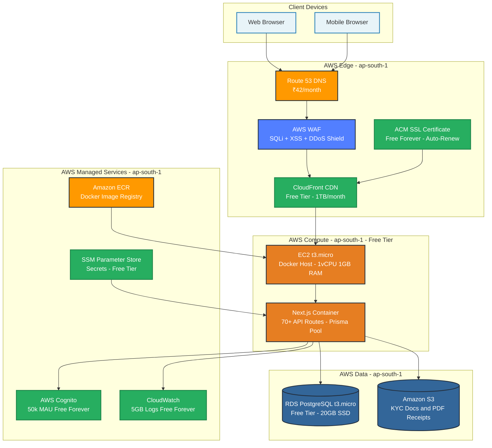

## 2.2 Phase 2 — Scale Architecture (Future, 30+ Hostels)

Phase 2 is triggered when the platform grows beyond 30 active hostels. The same Docker container image is migrated from EC2 to ECS Fargate for managed auto-scaling. An Application Load Balancer distributes traffic across multiple container replicas.

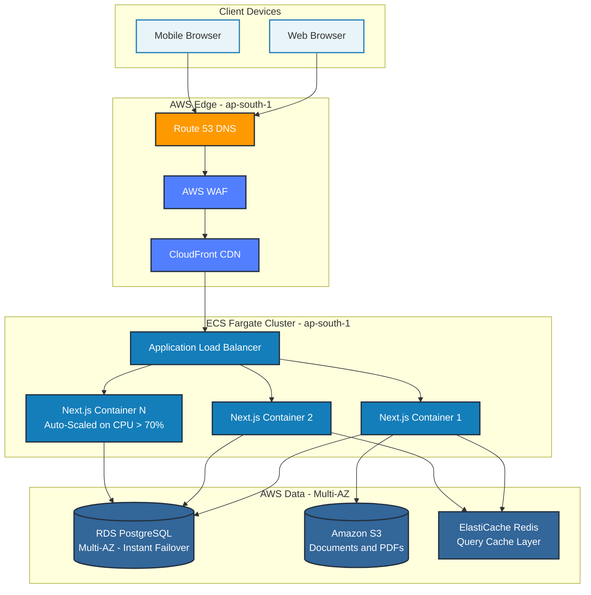

<div style="page-break-after: always;"></div>

# 3. Dual-Environment Strategy

## 3.1 Environment Comparison

| Component | Staging | Production |
|---|---|---|
| **Purpose** | Feature testing & co-founder review | Live system — real tenants |
| **Region** | ap-south-1 (Mumbai) | ap-south-1 (Mumbai) |
| **Server** | EC2 t3.micro (off when idle) | EC2 t3.micro (24/7) |
| **Database** | `hostel_staging` on shared RDS | `hostel_prod` on shared RDS |
| **S3 Bucket** | `hostel-staging-documents` | `hostel-prod-documents` |
| **Cognito Pool** | Separate pool (test users only) | Separate pool (real users) |
| **Domain** | `staging.yourdomain.com` | `app.yourdomain.com` |
| **SSL** | ACM (free, auto-renew) | ACM (free, auto-renew) |
| **Deploys from** | `development` branch | `main` branch via PR only |
| **Runtime/month** | ~20 hrs (on-demand only) | 720 hrs (always on) |
| **Monthly Cost** | ₹0 | ₹0 |

## 3.2 Shared RDS — Two Isolated Databases

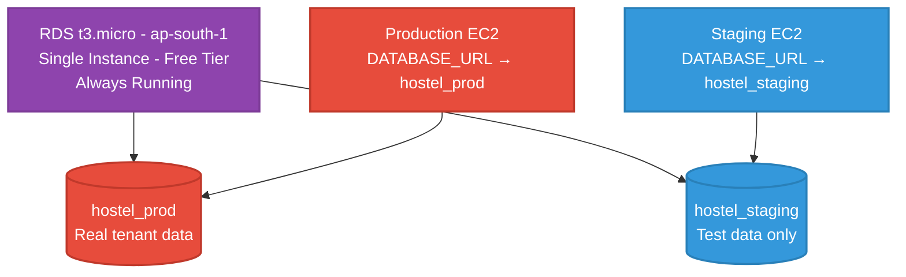

The `DATABASE_URL` secret in SSM Parameter Store is completely different per environment. A staging deployment cannot physically access production data.

## 3.3 Developer Workflow Sequence

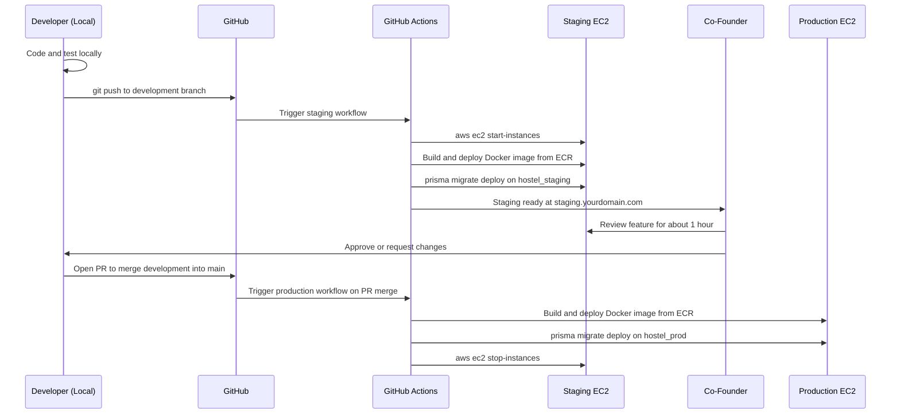

## 3.4 Free Tier Hours — Stays Under Limit

| Instance | Runtime | Hours/Month |
|---|---|---|
| Production EC2 (24/7) | Always on | 720 hrs |
| Staging EC2 (on-demand ~1hr/session) | ~20 sessions | 20 hrs |
| **Combined Total** | | **740 hrs** |
| **AWS Free Tier Limit (shared)** | | **750 hrs ✅** |
| **Monthly Cost** | | **₹0** |

<div style="page-break-after: always;"></div>

# 4. Network Architecture & VPC Security

## 4.1 VPC Network Topology — ap-south-1

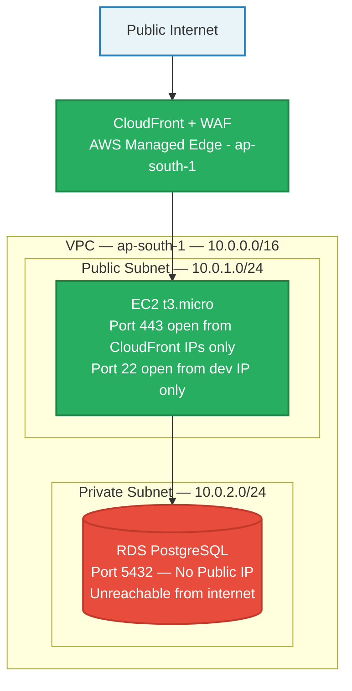

## 4.2 Security Group Rules

### EC2 Security Group (sg-app)
| Direction | Protocol | Port | Source | Purpose |
|---|---|---|---|---|
| Inbound | HTTPS | 443 | CloudFront managed prefix list | App traffic only |
| Inbound | SSH | 22 | Developer static IP | Deployments |
| Outbound | PostgreSQL | 5432 | sg-rds (RDS Security Group) | DB queries |
| Outbound | HTTPS | 443 | 0.0.0.0/0 | ECR, SSM, Cognito, CloudWatch |

### RDS Security Group (sg-rds)
| Direction | Protocol | Port | Source | Purpose |
|---|---|---|---|---|
| Inbound | PostgreSQL | 5432 | sg-app only | App DB queries |
| Outbound | None | — | — | No outbound access |

> [!IMPORTANT]
> The RDS instance has zero public IP address. It is physically unreachable from the internet. The only network path into the database is from the EC2 instance through the internal VPC routing.

## 4.3 HTTPS / SSL — AWS Certificate Manager (Free)

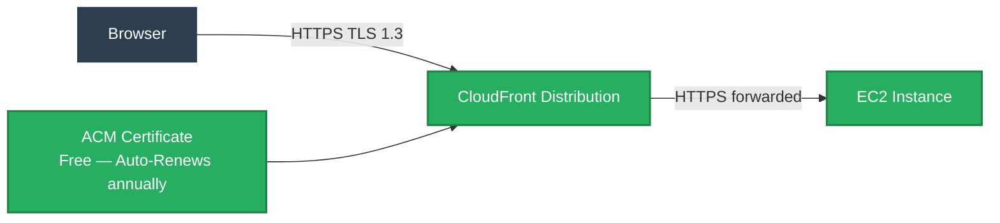

ACM issues a wildcard certificate covering both `app.yourdomain.com` and `staging.yourdomain.com`. Zero manual renewal — AWS renews it automatically 60 days before expiry.

<div style="page-break-after: always;"></div>

# 5. Frontend Architecture & State Management

## 5.1 Frontend Data Flow

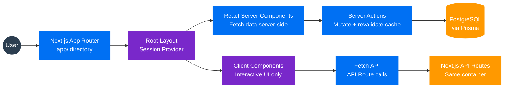

## 5.2 Why We Rejected Redux / Zustand
- **Server Components** fetch data directly from Prisma on the server — zero API call, zero Redux store needed.
- **Server Actions** handle all mutations and call `revalidatePath()` to instantly refresh the UI without a full reload.
- **Client Components** are reserved strictly for interactive elements — not data fetching.

## 5.3 Next.js Native $0 Caching (No Redis Needed)

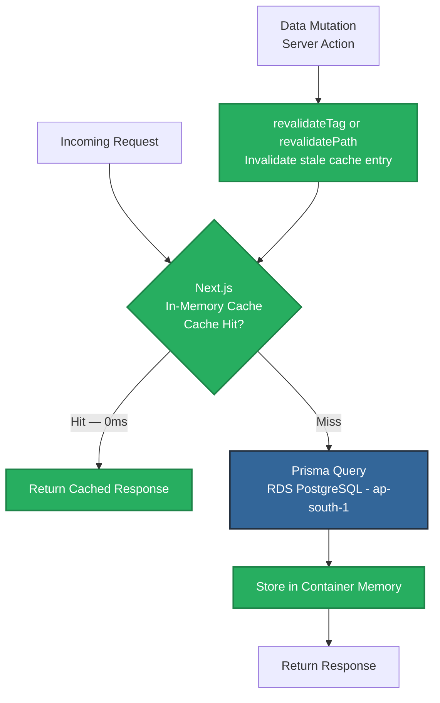

Dashboard reads (available beds, hostel stats, tenant lists) are cached in the container's memory. All wardens in a hostel share the same cached response until a mutation invalidates it. This is functionally equivalent to Redis for our read patterns — at ₹0 cost. ElastiCache is planned only for Phase 2 at 30+ hostels.

<div style="page-break-after: always;"></div>

# 6. Backend Architecture

## 6.1 Backend Service Flow — All 70+ Routes in One Container

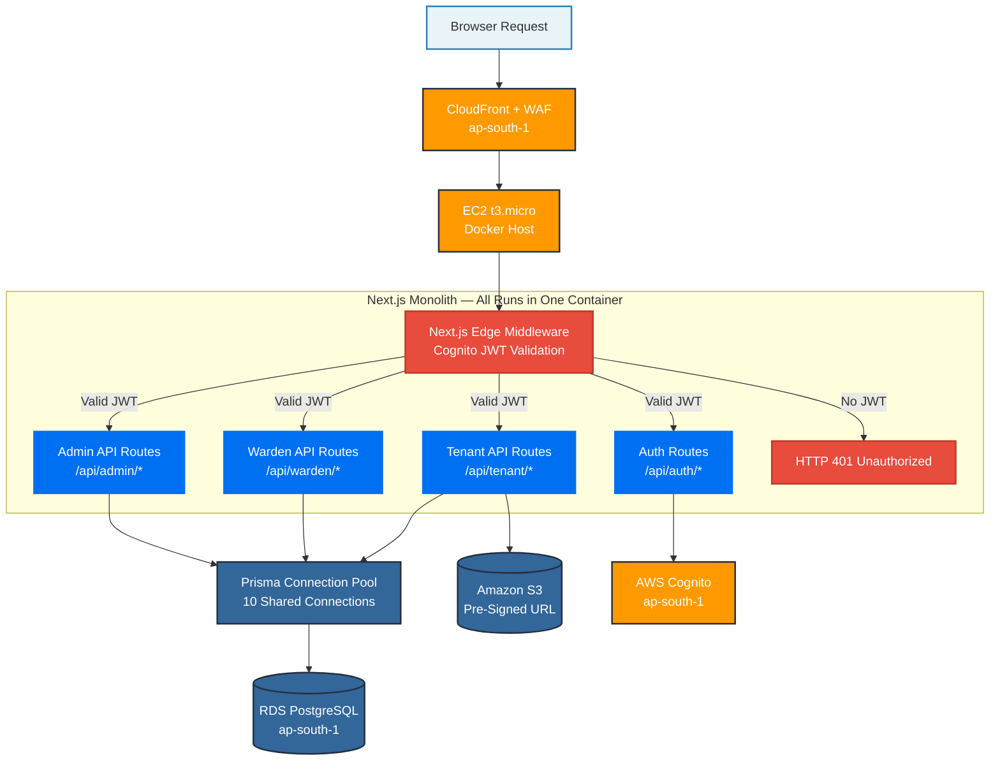

## 6.2 Why Container Monolith Over Lambda (Architectural Justification)

This diagram explains why the Prisma connection pool pattern used in our architecture is architecturally superior to splitting routes across Lambda functions — applicable whether running on EC2 (Phase 1) or ECS Fargate (Phase 2).

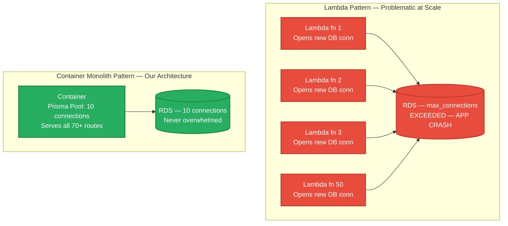

| Comparison | Lambda Approach | Container Monolith (Our Choice) |
|---|---|---|
| DB connections per 50 concurrent req | 50 new connections | 10 pooled, reused connections |
| Cold start latency | 1–3 seconds per request | 0ms — always warm |
| Cost at scale | Pay per invocation | Predictable flat monthly rate |
| Next.js compatibility | Requires complex workarounds | Native, first-class support |

<div style="page-break-after: always;"></div>

# 7. Full Database Schema & Architecture

## 7.1 Entity-Relationship Diagram

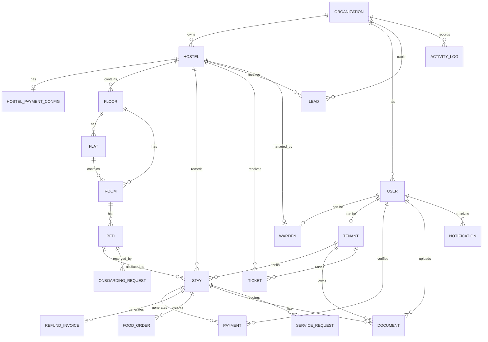

## 7.2 Deep-Dive Table Architecture

### 7.2.1 `Organization` — Multi-Tenant Root
The root of the entire SaaS data model. Every record in the system traces back to `organizationId`. This guarantees strict tenant isolation — Organization A can never see Organization B's hostels, tenants, or payments.

### 7.2.2 `User` + `Warden` + `Tenant` — Role Separation
A single `User` holds credentials and a `UserRole` enum (`MAIN_ADMIN`, `WARDEN`, `TENANT`). Role-specific data lives in dedicated `Warden` and `Tenant` child tables linked 1-to-1. Avoids the "God table" anti-pattern where one table has 50 nullable columns irrelevant to most roles.

### 7.2.3 Building Hierarchy — `Hostel → Floor → Flat → Room → Bed`
Five-level recursive hierarchy. `Room.flatId` and `Room.floorId` are both optional (one must be set), enabling the same schema to model both standard dorm layouts and apartment-style hostel layouts without any code change.

### 7.2.4 `Stay` — The Core Operational Model
Links a `Tenant` to a `Bed`. Stores `hostelId` directly (intentional denormalization) to avoid 4-table JOINs on every dashboard query. `StayStatus` enum acts as a strict finite-state machine: `ONBOARDING_PENDING → ACTIVE → CHECKED_OUT`.

**Financial precision:** All monetary values stored as **Paise (integer)** — never floating-point rupees. This prevents IEEE 754 floating-point rounding errors in all financial calculations.

### 7.2.5 `Payment` + `RefundInvoice` — Financial Audit Trail
Auto-incrementing `receiptNumber` is sequential and tamper-evident. Each Payment holds a 1-to-1 reference to an S3 document (UPI screenshot). `verifiedByUserId` and `verifiedAt` create a complete, auditable verification chain.

### 7.2.6 `Document` — Polymorphic Storage
A Document can belong to a `Tenant` (KYC: Aadhaar, PAN) or a `Stay` (receipts, registration forms). `storagePath` stores the S3 object key only — never the full URL. Pre-signed download URLs are generated at request time, ensuring no document is permanently publicly accessible.

### 7.2.7 `ActivityLog` — Complete Audit Trail
Every significant event writes to `ActivityLog` with `actorName` and `subjectName` stored as denormalized strings. If a User is later deleted, their name is preserved in the audit log permanently — full historical traceability is maintained.

<div style="page-break-after: always;"></div>

# 8. Cloud Storage & Document Management

## 8.1 Why S3 Over Database BLOBs
Storing file contents directly in PostgreSQL is a severe anti-pattern: it balloons the RDS volume, cripples backup/restore times, and forces all file traffic through the database connection pool. Amazon S3 is purpose-built for binary object storage — infinitely scalable, independently priced, and decoupled from the database.

## 8.2 Pre-Signed URL Upload Flow

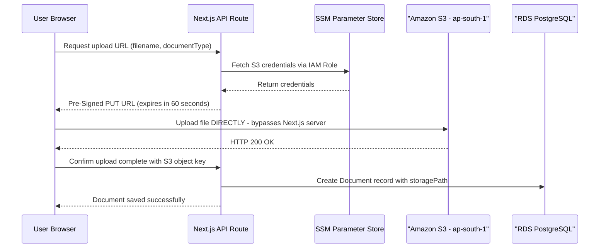

**Key benefit:** The file bytes never pass through the Next.js server. The EC2 container's RAM and CPU are completely unaffected by large file uploads.

## 8.3 S3 Bucket Layout

```
hostel-prod-documents/  (ap-south-1)
├── kyc/{tenantId}/
│   ├── aadhaar.jpg
│   ├── pan.jpg
│   └── passport_photo.jpg
├── payments/{stayId}/{paymentId}/
│   └── upi_screenshot.jpg
└── pdfs/{stayId}/
    ├── registration_form.pdf
    └── receipt_{receiptNumber}.pdf
```

**Security controls:**
1. Block All Public Access is enabled — no document is directly accessible via URL.
2. Upload Pre-Signed URLs expire in 60 seconds. Download URLs expire in 15 minutes.
3. S3 Versioning is enabled — accidentally overwritten documents are recoverable from version history.

<div style="page-break-after: always;"></div>

# 9. Identity, Access Management & Secrets

## 9.1 JWT Authentication Flow

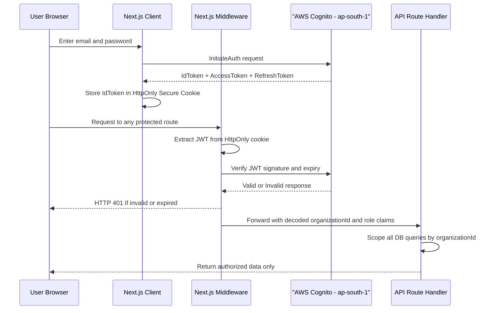

## 9.2 IAM Task Role — Zero Hardcoded Credentials

No AWS access keys exist anywhere in the codebase, Docker image, or environment files. The EC2 instance is assigned an IAM Role at launch. The AWS SDK automatically inherits credentials from the EC2 instance metadata service.

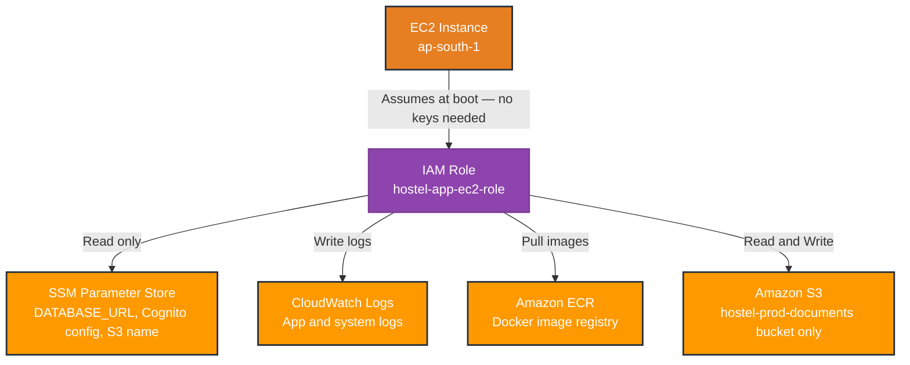

## 9.3 Secrets Management — SSM Parameter Store

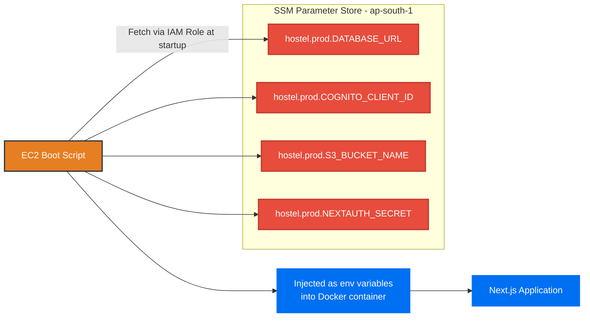

**Why SSM over .env files:**
- If EC2 is compromised, SSM secrets are not accessible without IAM role permissions
- Secret rotation (e.g., new DB password) requires updating one SSM value — no redeployment
- Every secret access is logged in AWS CloudTrail for compliance auditing

<div style="page-break-after: always;"></div>

# 10. CI/CD Pipeline & Deployment

## 10.1 Complete Pipeline with ECR — Dual Environment

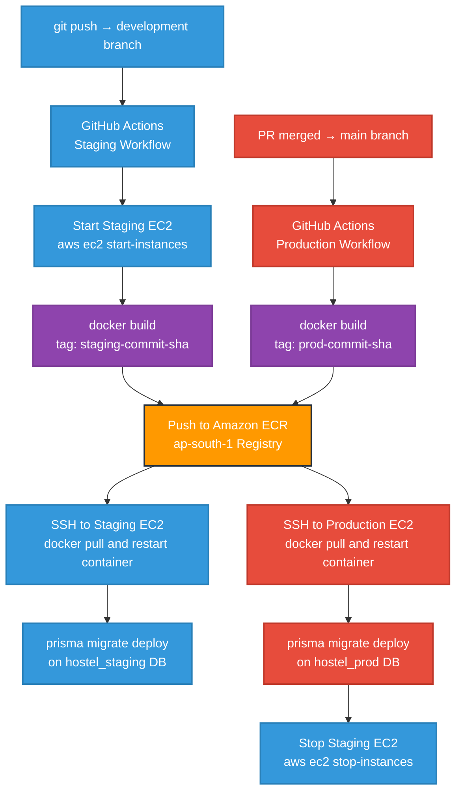

## 10.2 Git Branching Strategy

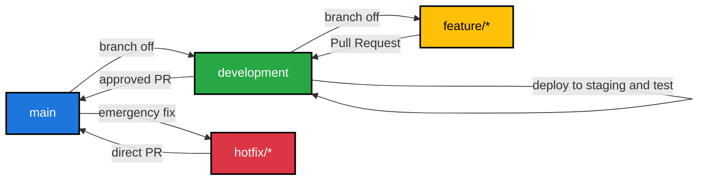

| Branch | Deploys To | Rules |
|---|---|---|
| `main` | Production EC2 | Requires PR + review. No direct push. |
| `development` | Staging EC2 (auto-start) | Developer direct push allowed |
| `feature/*` | Local machine only | No cloud deployment |
| `hotfix/*` | Production (emergency path) | Requires PR directly to main |

<div style="page-break-after: always;"></div>

# 11. Observability & Monitoring

## 11.1 CloudWatch Integration

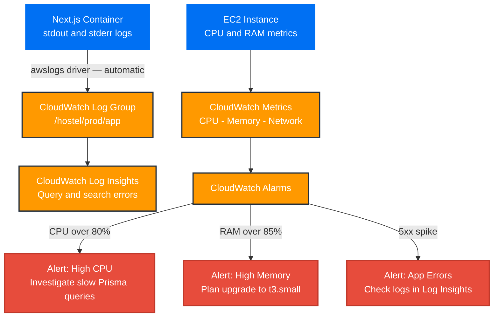

## 11.2 Log Retention Policy

| Log Source | CloudWatch Group | Retention |
|---|---|---|
| Next.js app errors | `/hostel/prod/app` | 30 days |
| Prisma query errors | `/hostel/prod/app` | 30 days |
| EC2 system logs | `/hostel/prod/system` | 7 days |
| Docker container logs | `/hostel/prod/docker` | 7 days |

All within the 5GB/month permanent free tier. Zero cost.

<div style="page-break-after: always;"></div>

# 12. Disaster Recovery & Backup

## 12.1 RDS Point-In-Time Recovery (PITR)

RDS automated backups with PITR are enabled. The database can be restored to any exact second within the last 35 days.

**Example scenario:** A warden runs a bulk operation that corrupts 500 tenant records at 3:00 PM. The database is restored to its state at 2:55 PM. Zero data loss beyond 5 minutes. Recovery Time Objective (RTO): approximately 15–30 minutes.

## 12.2 Recovery Decision Tree

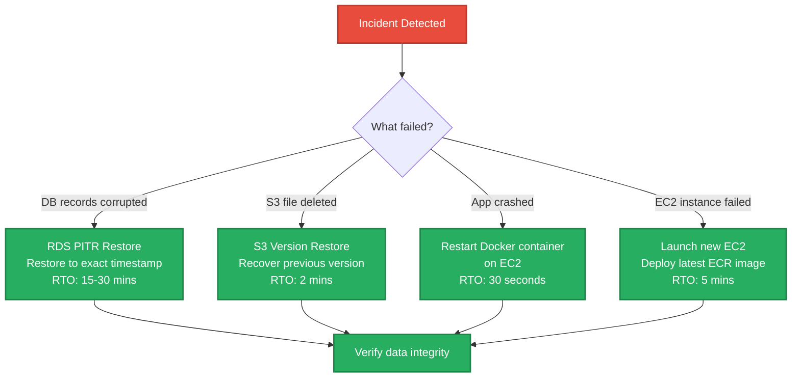

<div style="page-break-after: always;"></div>

# 13. Cost Optimization & MVP Budget

## 13.1 Phase 1 MVP — AWS Free Tier (ap-south-1, Year 1)

| AWS Service | Free Tier Limit | Expected Usage | Monthly Cost |
|---|---|---|---|
| EC2 t3.micro (Production) | 750 hrs/month combined | 720 hrs (24/7) | ₹0 |
| EC2 t3.micro (Staging) | (shared 750 hr pool) | ~20 hrs (on-demand) | ₹0 |
| RDS t3.micro (1 instance) | 750 hrs/month | 720 hrs (24/7) | ₹0 |
| RDS Storage | 20 GB SSD | ~3–5 GB | ₹0 |
| Amazon S3 | 5 GB + 20k GETs/month | ~1–2 GB | ₹0 |
| AWS Cognito | 50,000 MAU (permanent) | < 500 MAU | ₹0 |
| CloudWatch Logs | 5 GB/month (permanent) | < 1 GB | ₹0 |
| CloudFront | 1 TB data transfer/month | < 10 GB | ₹0 |
| ACM SSL Certificate | Free (permanent) | 1 wildcard cert | ₹0 |
| SSM Parameter Store | 10,000 API calls/month | < 100 calls | ₹0 |
| Amazon ECR | 500 MB storage/month | < 200 MB | ₹0 |
| Route 53 | Not free | 1 hosted zone | ~₹42/month |
| **TOTAL** | | | **~₹42/month** |

> [!NOTE]
> Route 53 at $0.50/month (~₹42) is the only unavoidable cost. Every other service stays within the AWS Free Tier limits for 12 months at MVP scale.

## 13.2 Phase Migration Triggers

| Trigger Condition | Current Phase | Upgrade To | New Infra Cost |
|---|---|---|---|
| RAM consistently > 80% | Phase 1 EC2 t3.micro | EC2 t3.small (2GB RAM) | ~₹2,500/month |
| 15+ active hostels | Phase 1 | Phase 1.5 (t3.small) | ~₹2,500/month |
| 30+ active hostels | Phase 1.5 | Phase 2 (ECS Fargate) | ~₹10,300/month |
| 100+ active hostels | Phase 2 | Phase 2 scaled (bigger RDS) | ~₹18,000/month |

## 13.3 Phase 2 Scale Budget (30+ Hostels)

| AWS Service | Configuration | Monthly Cost (ap-south-1) |
|---|---|---|
| ECS Fargate | 0.5 vCPU, 1GB RAM, 2 tasks | ~₹2,500 |
| RDS t3.small | Single-AZ, 50GB SSD | ~₹2,800 |
| Application Load Balancer | 1 ALB | ~₹1,400 |
| CloudFront | 100GB data transfer | ~₹700 |
| CloudWatch + ECR + SSM | Combined | ~₹500 |
| ElastiCache t3.micro | Redis (if needed at scale) | ~₹1,200 |
| Route 53 | 1 hosted zone | ~₹42 |
| RDS Multi-AZ (optional) | Add-on for HA | +₹1,200 |
| **TOTAL** | | **~₹10,300/month** |

<div style="page-break-after: always;"></div>

# 14. Revenue & Infrastructure Forecast

> [!IMPORTANT]
> **This section contains hypothetical projections only.** The pricing figures (₹1,000/hostel/month) are used purely to illustrate the relationship between customer growth, revenue, and infrastructure cost. Actual pricing strategy is not fixed and will be determined based on market research, feature completeness, and competitive positioning.

## 14.1 The SaaS Infrastructure Economics Principle

Infrastructure costs in a SaaS product scale **sub-linearly** — meaning that doubling the number of customers does not double the infrastructure cost. A single ECS Fargate cluster or EC2 instance that handles 30 hostels can handle 100 hostels with little to no cost increase. This is the fundamental reason SaaS margins improve dramatically at scale.

## 14.2 Revenue vs Infrastructure — Hypothetical at ₹1,000/Hostel/Month

| Phase | Active Hostels | Monthly Revenue | Infra Cost | Gross Profit | Margin |
|---|---|---|---|---|---|
| **Phase 1 — Free Tier** | 5 | ₹5,000 | ₹42 | ₹4,958 | **99%** |
| **Phase 1 — Growing** | 9 | ₹9,000 | ₹42 | ₹8,958 | **99%** |
| **Phase 1 — Full** | 15 | ₹15,000 | ₹42 | ₹14,958 | **99%** |
| **Phase 1.5 — Upgrade** | 20 | ₹20,000 | ₹2,500 | ₹17,500 | **87%** |
| **Phase 2 — Migration** | 30 | ₹30,000 | ₹10,300 | ₹19,700 | **65%** |
| **Phase 2 — Sweet Spot** | 50 | ₹50,000 | ₹10,300 | ₹39,700 | **79%** |
| **Phase 2 — Scale** | 100 | ₹1,00,000 | ₹10,300 | ₹89,700 | **89%** |
| **Phase 2 — Enterprise** | 150 | ₹1,50,000 | ₹10,300 | ₹1,39,700 | **93%** |

> [!NOTE]
> After crossing 30 hostels and migrating to Phase 2, every additional hostel added costs approximately ₹0 more in infrastructure. The ₹10,300/month Phase 2 infra serves 30 hostels and 150 hostels almost identically — demonstrating classic SaaS margin expansion at scale.

## 14.3 The Price Increase Strategy

The platform is designed to launch at a competitive introductory price and increase as the product matures with additional features.

| Product Stage | Planned Feature Set | Justifiable Price |
|---|---|---|
| **MVP Launch** | Core hostel management, payments, KYC | ₹1,000/hostel/month |
| **Growth Phase** | Food billing, task management, service requests, analytics | ₹2,000/hostel/month |
| **Mature Product** | WhatsApp bot, tenant mobile app, multi-hostel reporting | ₹3,000+/hostel/month |

## 14.4 Revised Forecast at Higher Pricing

| Active Hostels | At ₹2,000/hostel | Infra Cost | Margin |
|---|---|---|---|
| 30 | ₹60,000 | ₹10,300 | **82%** |
| 50 | ₹1,00,000 | ₹10,300 | **89%** |
| 100 | ₹2,00,000 | ₹10,300 | **94%** |

> [!TIP]
> The migration from Phase 1 to Phase 2 infra (₹42 → ₹10,300) should only happen when revenue has already grown enough to sustain it comfortably. At 30 hostels × ₹1,000 = ₹30,000 revenue, the infra is 34% of revenue which is acceptable. At 30 hostels × ₹2,000 = ₹60,000, infra is only 17% — a healthy SaaS ratio.

<div style="page-break-after: always;"></div>

# 15. Exhaustive API Documentation

All routes below run inside the single Next.js Docker container on EC2 (ap-south-1). All share one Prisma connection pool against RDS PostgreSQL.

### `GET/POST/PUT/DELETE /api/admin/activity`
- **Domain:** `admin` module
- **Region:** ap-south-1 (Mumbai)
- **Auth:** Cognito JWT validated by Next.js Middleware. HTTP 401 if token missing or expired.
- **DB Layer:** Prisma ORM on shared connection pool (RDS PostgreSQL ap-south-1). Zero new connections per request.
- **Caching:** Read-heavy endpoints use Next.js Data Cache with `revalidateTag` for instant invalidation on mutation.

### `GET/POST/PUT/DELETE /api/admin/activity/export`
- **Domain:** `admin` module
- **Region:** ap-south-1 (Mumbai)
- **Auth:** Cognito JWT validated by Next.js Middleware. HTTP 401 if token missing or expired.
- **DB Layer:** Prisma ORM on shared connection pool (RDS PostgreSQL ap-south-1). Zero new connections per request.
- **Caching:** Read-heavy endpoints use Next.js Data Cache with `revalidateTag` for instant invalidation on mutation.

### `GET/POST/PUT/DELETE /api/admin/beds/[id]`
- **Domain:** `admin` module
- **Region:** ap-south-1 (Mumbai)
- **Auth:** Cognito JWT validated by Next.js Middleware. HTTP 401 if token missing or expired.
- **DB Layer:** Prisma ORM on shared connection pool (RDS PostgreSQL ap-south-1). Zero new connections per request.
- **Caching:** Read-heavy endpoints use Next.js Data Cache with `revalidateTag` for instant invalidation on mutation.

### `GET/POST/PUT/DELETE /api/admin/dashboard/stats`
- **Domain:** `admin` module
- **Region:** ap-south-1 (Mumbai)
- **Auth:** Cognito JWT validated by Next.js Middleware. HTTP 401 if token missing or expired.
- **DB Layer:** Prisma ORM on shared connection pool (RDS PostgreSQL ap-south-1). Zero new connections per request.
- **Caching:** Read-heavy endpoints use Next.js Data Cache with `revalidateTag` for instant invalidation on mutation.

### `GET/POST/PUT/DELETE /api/admin/flats`
- **Domain:** `admin` module
- **Region:** ap-south-1 (Mumbai)
- **Auth:** Cognito JWT validated by Next.js Middleware. HTTP 401 if token missing or expired.
- **DB Layer:** Prisma ORM on shared connection pool (RDS PostgreSQL ap-south-1). Zero new connections per request.
- **Caching:** Read-heavy endpoints use Next.js Data Cache with `revalidateTag` for instant invalidation on mutation.

### `GET/POST/PUT/DELETE /api/admin/flats/[id]`
- **Domain:** `admin` module
- **Region:** ap-south-1 (Mumbai)
- **Auth:** Cognito JWT validated by Next.js Middleware. HTTP 401 if token missing or expired.
- **DB Layer:** Prisma ORM on shared connection pool (RDS PostgreSQL ap-south-1). Zero new connections per request.
- **Caching:** Read-heavy endpoints use Next.js Data Cache with `revalidateTag` for instant invalidation on mutation.

### `GET/POST/PUT/DELETE /api/admin/floors`
- **Domain:** `admin` module
- **Region:** ap-south-1 (Mumbai)
- **Auth:** Cognito JWT validated by Next.js Middleware. HTTP 401 if token missing or expired.
- **DB Layer:** Prisma ORM on shared connection pool (RDS PostgreSQL ap-south-1). Zero new connections per request.
- **Caching:** Read-heavy endpoints use Next.js Data Cache with `revalidateTag` for instant invalidation on mutation.

### `GET/POST/PUT/DELETE /api/admin/floors/[id]`
- **Domain:** `admin` module
- **Region:** ap-south-1 (Mumbai)
- **Auth:** Cognito JWT validated by Next.js Middleware. HTTP 401 if token missing or expired.
- **DB Layer:** Prisma ORM on shared connection pool (RDS PostgreSQL ap-south-1). Zero new connections per request.
- **Caching:** Read-heavy endpoints use Next.js Data Cache with `revalidateTag` for instant invalidation on mutation.

### `GET/POST/PUT/DELETE /api/admin/hostels`
- **Domain:** `admin` module
- **Region:** ap-south-1 (Mumbai)
- **Auth:** Cognito JWT validated by Next.js Middleware. HTTP 401 if token missing or expired.
- **DB Layer:** Prisma ORM on shared connection pool (RDS PostgreSQL ap-south-1). Zero new connections per request.
- **Caching:** Read-heavy endpoints use Next.js Data Cache with `revalidateTag` for instant invalidation on mutation.

### `GET/POST/PUT/DELETE /api/admin/hostels/[id]/payment-config`
- **Domain:** `admin` module
- **Region:** ap-south-1 (Mumbai)
- **Auth:** Cognito JWT validated by Next.js Middleware. HTTP 401 if token missing or expired.
- **DB Layer:** Prisma ORM on shared connection pool (RDS PostgreSQL ap-south-1). Zero new connections per request.
- **Caching:** Read-heavy endpoints use Next.js Data Cache with `revalidateTag` for instant invalidation on mutation.

### `GET/POST/PUT/DELETE /api/admin/hostels/[id]/warden`
- **Domain:** `admin` module
- **Region:** ap-south-1 (Mumbai)
- **Auth:** Cognito JWT validated by Next.js Middleware. HTTP 401 if token missing or expired.
- **DB Layer:** Prisma ORM on shared connection pool (RDS PostgreSQL ap-south-1). Zero new connections per request.
- **Caching:** Read-heavy endpoints use Next.js Data Cache with `revalidateTag` for instant invalidation on mutation.

### `GET/POST/PUT/DELETE /api/admin/locations`
- **Domain:** `admin` module
- **Region:** ap-south-1 (Mumbai)
- **Auth:** Cognito JWT validated by Next.js Middleware. HTTP 401 if token missing or expired.
- **DB Layer:** Prisma ORM on shared connection pool (RDS PostgreSQL ap-south-1). Zero new connections per request.
- **Caching:** Read-heavy endpoints use Next.js Data Cache with `revalidateTag` for instant invalidation on mutation.

### `GET/POST/PUT/DELETE /api/admin/onboards`
- **Domain:** `admin` module
- **Region:** ap-south-1 (Mumbai)
- **Auth:** Cognito JWT validated by Next.js Middleware. HTTP 401 if token missing or expired.
- **DB Layer:** Prisma ORM on shared connection pool (RDS PostgreSQL ap-south-1). Zero new connections per request.
- **Caching:** Read-heavy endpoints use Next.js Data Cache with `revalidateTag` for instant invalidation on mutation.

### `GET/POST/PUT/DELETE /api/admin/onboards/[id]/cancel`
- **Domain:** `admin` module
- **Region:** ap-south-1 (Mumbai)
- **Auth:** Cognito JWT validated by Next.js Middleware. HTTP 401 if token missing or expired.
- **DB Layer:** Prisma ORM on shared connection pool (RDS PostgreSQL ap-south-1). Zero new connections per request.
- **Caching:** Read-heavy endpoints use Next.js Data Cache with `revalidateTag` for instant invalidation on mutation.

### `GET/POST/PUT/DELETE /api/admin/rooms`
- **Domain:** `admin` module
- **Region:** ap-south-1 (Mumbai)
- **Auth:** Cognito JWT validated by Next.js Middleware. HTTP 401 if token missing or expired.
- **DB Layer:** Prisma ORM on shared connection pool (RDS PostgreSQL ap-south-1). Zero new connections per request.
- **Caching:** Read-heavy endpoints use Next.js Data Cache with `revalidateTag` for instant invalidation on mutation.

### `GET/POST/PUT/DELETE /api/admin/rooms/[id]`
- **Domain:** `admin` module
- **Region:** ap-south-1 (Mumbai)
- **Auth:** Cognito JWT validated by Next.js Middleware. HTTP 401 if token missing or expired.
- **DB Layer:** Prisma ORM on shared connection pool (RDS PostgreSQL ap-south-1). Zero new connections per request.
- **Caching:** Read-heavy endpoints use Next.js Data Cache with `revalidateTag` for instant invalidation on mutation.

### `GET/POST/PUT/DELETE /api/admin/tickets`
- **Domain:** `admin` module
- **Region:** ap-south-1 (Mumbai)
- **Auth:** Cognito JWT validated by Next.js Middleware. HTTP 401 if token missing or expired.
- **DB Layer:** Prisma ORM on shared connection pool (RDS PostgreSQL ap-south-1). Zero new connections per request.
- **Caching:** Read-heavy endpoints use Next.js Data Cache with `revalidateTag` for instant invalidation on mutation.

### `GET/POST/PUT/DELETE /api/admin/tickets/[id]/comments`
- **Domain:** `admin` module
- **Region:** ap-south-1 (Mumbai)
- **Auth:** Cognito JWT validated by Next.js Middleware. HTTP 401 if token missing or expired.
- **DB Layer:** Prisma ORM on shared connection pool (RDS PostgreSQL ap-south-1). Zero new connections per request.
- **Caching:** Read-heavy endpoints use Next.js Data Cache with `revalidateTag` for instant invalidation on mutation.

### `GET/POST/PUT/DELETE /api/admin/users`
- **Domain:** `admin` module
- **Region:** ap-south-1 (Mumbai)
- **Auth:** Cognito JWT validated by Next.js Middleware. HTTP 401 if token missing or expired.
- **DB Layer:** Prisma ORM on shared connection pool (RDS PostgreSQL ap-south-1). Zero new connections per request.
- **Caching:** Read-heavy endpoints use Next.js Data Cache with `revalidateTag` for instant invalidation on mutation.

### `GET/POST/PUT/DELETE /api/admin/users/[id]/reset-password`
- **Domain:** `admin` module
- **Region:** ap-south-1 (Mumbai)
- **Auth:** Cognito JWT validated by Next.js Middleware. HTTP 401 if token missing or expired.
- **DB Layer:** Prisma ORM on shared connection pool (RDS PostgreSQL ap-south-1). Zero new connections per request.
- **Caching:** Read-heavy endpoints use Next.js Data Cache with `revalidateTag` for instant invalidation on mutation.

### `GET/POST/PUT/DELETE /api/admin/wardens`
- **Domain:** `admin` module
- **Region:** ap-south-1 (Mumbai)
- **Auth:** Cognito JWT validated by Next.js Middleware. HTTP 401 if token missing or expired.
- **DB Layer:** Prisma ORM on shared connection pool (RDS PostgreSQL ap-south-1). Zero new connections per request.
- **Caching:** Read-heavy endpoints use Next.js Data Cache with `revalidateTag` for instant invalidation on mutation.

### `GET/POST/PUT/DELETE /api/admin/wardens/[id]`
- **Domain:** `admin` module
- **Region:** ap-south-1 (Mumbai)
- **Auth:** Cognito JWT validated by Next.js Middleware. HTTP 401 if token missing or expired.
- **DB Layer:** Prisma ORM on shared connection pool (RDS PostgreSQL ap-south-1). Zero new connections per request.
- **Caching:** Read-heavy endpoints use Next.js Data Cache with `revalidateTag` for instant invalidation on mutation.

### `GET/POST/PUT/DELETE /api/admin/wardens/[id]/reset-password`
- **Domain:** `admin` module
- **Region:** ap-south-1 (Mumbai)
- **Auth:** Cognito JWT validated by Next.js Middleware. HTTP 401 if token missing or expired.
- **DB Layer:** Prisma ORM on shared connection pool (RDS PostgreSQL ap-south-1). Zero new connections per request.
- **Caching:** Read-heavy endpoints use Next.js Data Cache with `revalidateTag` for instant invalidation on mutation.

### `GET/POST/PUT/DELETE /api/auth/login`
- **Domain:** `auth` module
- **Region:** ap-south-1 (Mumbai)
- **Auth:** Cognito JWT validated by Next.js Middleware. HTTP 401 if token missing or expired.
- **DB Layer:** Prisma ORM on shared connection pool (RDS PostgreSQL ap-south-1). Zero new connections per request.
- **Caching:** Read-heavy endpoints use Next.js Data Cache with `revalidateTag` for instant invalidation on mutation.

### `GET/POST/PUT/DELETE /api/auth/logout`
- **Domain:** `auth` module
- **Region:** ap-south-1 (Mumbai)
- **Auth:** Cognito JWT validated by Next.js Middleware. HTTP 401 if token missing or expired.
- **DB Layer:** Prisma ORM on shared connection pool (RDS PostgreSQL ap-south-1). Zero new connections per request.
- **Caching:** Read-heavy endpoints use Next.js Data Cache with `revalidateTag` for instant invalidation on mutation.

### `GET/POST/PUT/DELETE /api/auth/reset-password`
- **Domain:** `auth` module
- **Region:** ap-south-1 (Mumbai)
- **Auth:** Cognito JWT validated by Next.js Middleware. HTTP 401 if token missing or expired.
- **DB Layer:** Prisma ORM on shared connection pool (RDS PostgreSQL ap-south-1). Zero new connections per request.
- **Caching:** Read-heavy endpoints use Next.js Data Cache with `revalidateTag` for instant invalidation on mutation.

### `GET/POST/PUT/DELETE /api/auth/set-password`
- **Domain:** `auth` module
- **Region:** ap-south-1 (Mumbai)
- **Auth:** Cognito JWT validated by Next.js Middleware. HTTP 401 if token missing or expired.
- **DB Layer:** Prisma ORM on shared connection pool (RDS PostgreSQL ap-south-1). Zero new connections per request.
- **Caching:** Read-heavy endpoints use Next.js Data Cache with `revalidateTag` for instant invalidation on mutation.

### `GET/POST/PUT/DELETE /api/hostel-structure/[hostelId]`
- **Domain:** `hostel-structure` module
- **Region:** ap-south-1 (Mumbai)
- **Auth:** Cognito JWT validated by Next.js Middleware. HTTP 401 if token missing or expired.
- **DB Layer:** Prisma ORM on shared connection pool (RDS PostgreSQL ap-south-1). Zero new connections per request.
- **Caching:** Read-heavy endpoints use Next.js Data Cache with `revalidateTag` for instant invalidation on mutation.

### `GET/POST/PUT/DELETE /api/hostel-structure/mine`
- **Domain:** `hostel-structure` module
- **Region:** ap-south-1 (Mumbai)
- **Auth:** Cognito JWT validated by Next.js Middleware. HTTP 401 if token missing or expired.
- **DB Layer:** Prisma ORM on shared connection pool (RDS PostgreSQL ap-south-1). Zero new connections per request.
- **Caching:** Read-heavy endpoints use Next.js Data Cache with `revalidateTag` for instant invalidation on mutation.

### `GET/POST/PUT/DELETE /api/internal/auth-check`
- **Domain:** `internal` module
- **Region:** ap-south-1 (Mumbai)
- **Auth:** Cognito JWT validated by Next.js Middleware. HTTP 401 if token missing or expired.
- **DB Layer:** Prisma ORM on shared connection pool (RDS PostgreSQL ap-south-1). Zero new connections per request.
- **Caching:** Read-heavy endpoints use Next.js Data Cache with `revalidateTag` for instant invalidation on mutation.

### `GET/POST/PUT/DELETE /api/notifications`
- **Domain:** `notifications` module
- **Region:** ap-south-1 (Mumbai)
- **Auth:** Cognito JWT validated by Next.js Middleware. HTTP 401 if token missing or expired.
- **DB Layer:** Prisma ORM on shared connection pool (RDS PostgreSQL ap-south-1). Zero new connections per request.
- **Caching:** Read-heavy endpoints use Next.js Data Cache with `revalidateTag` for instant invalidation on mutation.

### `GET/POST/PUT/DELETE /api/notifications/[id]`
- **Domain:** `notifications` module
- **Region:** ap-south-1 (Mumbai)
- **Auth:** Cognito JWT validated by Next.js Middleware. HTTP 401 if token missing or expired.
- **DB Layer:** Prisma ORM on shared connection pool (RDS PostgreSQL ap-south-1). Zero new connections per request.
- **Caching:** Read-heavy endpoints use Next.js Data Cache with `revalidateTag` for instant invalidation on mutation.

### `GET/POST/PUT/DELETE /api/pdf/download/[documentId]`
- **Domain:** `pdf` module
- **Region:** ap-south-1 (Mumbai)
- **Auth:** Cognito JWT validated by Next.js Middleware. HTTP 401 if token missing or expired.
- **DB Layer:** Prisma ORM on shared connection pool (RDS PostgreSQL ap-south-1). Zero new connections per request.
- **Caching:** Read-heavy endpoints use Next.js Data Cache with `revalidateTag` for instant invalidation on mutation.

### `GET/POST/PUT/DELETE /api/pdf/receipt/[paymentId]`
- **Domain:** `pdf` module
- **Region:** ap-south-1 (Mumbai)
- **Auth:** Cognito JWT validated by Next.js Middleware. HTTP 401 if token missing or expired.
- **DB Layer:** Prisma ORM on shared connection pool (RDS PostgreSQL ap-south-1). Zero new connections per request.
- **Caching:** Read-heavy endpoints use Next.js Data Cache with `revalidateTag` for instant invalidation on mutation.

### `GET/POST/PUT/DELETE /api/pdf/refund-invoice/[refundInvoiceId]`
- **Domain:** `pdf` module
- **Region:** ap-south-1 (Mumbai)
- **Auth:** Cognito JWT validated by Next.js Middleware. HTTP 401 if token missing or expired.
- **DB Layer:** Prisma ORM on shared connection pool (RDS PostgreSQL ap-south-1). Zero new connections per request.
- **Caching:** Read-heavy endpoints use Next.js Data Cache with `revalidateTag` for instant invalidation on mutation.

### `GET/POST/PUT/DELETE /api/pdf/registration-form/[stayId]`
- **Domain:** `pdf` module
- **Region:** ap-south-1 (Mumbai)
- **Auth:** Cognito JWT validated by Next.js Middleware. HTTP 401 if token missing or expired.
- **DB Layer:** Prisma ORM on shared connection pool (RDS PostgreSQL ap-south-1). Zero new connections per request.
- **Caching:** Read-heavy endpoints use Next.js Data Cache with `revalidateTag` for instant invalidation on mutation.

### `GET/POST/PUT/DELETE /api/public/hostels/[id]/payment-config`
- **Domain:** `public` module
- **Region:** ap-south-1 (Mumbai)
- **Auth:** Cognito JWT validated by Next.js Middleware. HTTP 401 if token missing or expired.
- **DB Layer:** Prisma ORM on shared connection pool (RDS PostgreSQL ap-south-1). Zero new connections per request.
- **Caching:** Read-heavy endpoints use Next.js Data Cache with `revalidateTag` for instant invalidation on mutation.

### `GET/POST/PUT/DELETE /api/public/onboard-request/[id]`
- **Domain:** `public` module
- **Region:** ap-south-1 (Mumbai)
- **Auth:** Cognito JWT validated by Next.js Middleware. HTTP 401 if token missing or expired.
- **DB Layer:** Prisma ORM on shared connection pool (RDS PostgreSQL ap-south-1). Zero new connections per request.
- **Caching:** Read-heavy endpoints use Next.js Data Cache with `revalidateTag` for instant invalidation on mutation.

### `GET/POST/PUT/DELETE /api/public/onboard-request/[id]/register`
- **Domain:** `public` module
- **Region:** ap-south-1 (Mumbai)
- **Auth:** Cognito JWT validated by Next.js Middleware. HTTP 401 if token missing or expired.
- **DB Layer:** Prisma ORM on shared connection pool (RDS PostgreSQL ap-south-1). Zero new connections per request.
- **Caching:** Read-heavy endpoints use Next.js Data Cache with `revalidateTag` for instant invalidation on mutation.

### `GET/POST/PUT/DELETE /api/public/onboarding/[id]`
- **Domain:** `public` module
- **Region:** ap-south-1 (Mumbai)
- **Auth:** Cognito JWT validated by Next.js Middleware. HTTP 401 if token missing or expired.
- **DB Layer:** Prisma ORM on shared connection pool (RDS PostgreSQL ap-south-1). Zero new connections per request.
- **Caching:** Read-heavy endpoints use Next.js Data Cache with `revalidateTag` for instant invalidation on mutation.

### `GET/POST/PUT/DELETE /api/public/onboarding/[id]/finalize`
- **Domain:** `public` module
- **Region:** ap-south-1 (Mumbai)
- **Auth:** Cognito JWT validated by Next.js Middleware. HTTP 401 if token missing or expired.
- **DB Layer:** Prisma ORM on shared connection pool (RDS PostgreSQL ap-south-1). Zero new connections per request.
- **Caching:** Read-heavy endpoints use Next.js Data Cache with `revalidateTag` for instant invalidation on mutation.

### `GET/POST/PUT/DELETE /api/public/onboarding/[id]/progress`
- **Domain:** `public` module
- **Region:** ap-south-1 (Mumbai)
- **Auth:** Cognito JWT validated by Next.js Middleware. HTTP 401 if token missing or expired.
- **DB Layer:** Prisma ORM on shared connection pool (RDS PostgreSQL ap-south-1). Zero new connections per request.
- **Caching:** Read-heavy endpoints use Next.js Data Cache with `revalidateTag` for instant invalidation on mutation.

### `GET/POST/PUT/DELETE /api/public/onboarding/[id]/validate`
- **Domain:** `public` module
- **Region:** ap-south-1 (Mumbai)
- **Auth:** Cognito JWT validated by Next.js Middleware. HTTP 401 if token missing or expired.
- **DB Layer:** Prisma ORM on shared connection pool (RDS PostgreSQL ap-south-1). Zero new connections per request.
- **Caching:** Read-heavy endpoints use Next.js Data Cache with `revalidateTag` for instant invalidation on mutation.

### `GET/POST/PUT/DELETE /api/tenant/food-orders`
- **Domain:** `tenant` module
- **Region:** ap-south-1 (Mumbai)
- **Auth:** Cognito JWT validated by Next.js Middleware. HTTP 401 if token missing or expired.
- **DB Layer:** Prisma ORM on shared connection pool (RDS PostgreSQL ap-south-1). Zero new connections per request.
- **Caching:** Read-heavy endpoints use Next.js Data Cache with `revalidateTag` for instant invalidation on mutation.

### `GET/POST/PUT/DELETE /api/tenant/payment/screenshot`
- **Domain:** `tenant` module
- **Region:** ap-south-1 (Mumbai)
- **Auth:** Cognito JWT validated by Next.js Middleware. HTTP 401 if token missing or expired.
- **DB Layer:** Prisma ORM on shared connection pool (RDS PostgreSQL ap-south-1). Zero new connections per request.
- **Caching:** Read-heavy endpoints use Next.js Data Cache with `revalidateTag` for instant invalidation on mutation.

### `GET/POST/PUT/DELETE /api/tenant/service-requests/[id]/payment`
- **Domain:** `tenant` module
- **Region:** ap-south-1 (Mumbai)
- **Auth:** Cognito JWT validated by Next.js Middleware. HTTP 401 if token missing or expired.
- **DB Layer:** Prisma ORM on shared connection pool (RDS PostgreSQL ap-south-1). Zero new connections per request.
- **Caching:** Read-heavy endpoints use Next.js Data Cache with `revalidateTag` for instant invalidation on mutation.

### `GET/POST/PUT/DELETE /api/tenant/settings`
- **Domain:** `tenant` module
- **Region:** ap-south-1 (Mumbai)
- **Auth:** Cognito JWT validated by Next.js Middleware. HTTP 401 if token missing or expired.
- **DB Layer:** Prisma ORM on shared connection pool (RDS PostgreSQL ap-south-1). Zero new connections per request.
- **Caching:** Read-heavy endpoints use Next.js Data Cache with `revalidateTag` for instant invalidation on mutation.

### `GET/POST/PUT/DELETE /api/tenant/settings/password`
- **Domain:** `tenant` module
- **Region:** ap-south-1 (Mumbai)
- **Auth:** Cognito JWT validated by Next.js Middleware. HTTP 401 if token missing or expired.
- **DB Layer:** Prisma ORM on shared connection pool (RDS PostgreSQL ap-south-1). Zero new connections per request.
- **Caching:** Read-heavy endpoints use Next.js Data Cache with `revalidateTag` for instant invalidation on mutation.

### `GET/POST/PUT/DELETE /api/tenant/stay`
- **Domain:** `tenant` module
- **Region:** ap-south-1 (Mumbai)
- **Auth:** Cognito JWT validated by Next.js Middleware. HTTP 401 if token missing or expired.
- **DB Layer:** Prisma ORM on shared connection pool (RDS PostgreSQL ap-south-1). Zero new connections per request.
- **Caching:** Read-heavy endpoints use Next.js Data Cache with `revalidateTag` for instant invalidation on mutation.

### `GET/POST/PUT/DELETE /api/tenant/tickets`
- **Domain:** `tenant` module
- **Region:** ap-south-1 (Mumbai)
- **Auth:** Cognito JWT validated by Next.js Middleware. HTTP 401 if token missing or expired.
- **DB Layer:** Prisma ORM on shared connection pool (RDS PostgreSQL ap-south-1). Zero new connections per request.
- **Caching:** Read-heavy endpoints use Next.js Data Cache with `revalidateTag` for instant invalidation on mutation.

### `GET/POST/PUT/DELETE /api/tickets/[id]/comments`
- **Domain:** `tickets` module
- **Region:** ap-south-1 (Mumbai)
- **Auth:** Cognito JWT validated by Next.js Middleware. HTTP 401 if token missing or expired.
- **DB Layer:** Prisma ORM on shared connection pool (RDS PostgreSQL ap-south-1). Zero new connections per request.
- **Caching:** Read-heavy endpoints use Next.js Data Cache with `revalidateTag` for instant invalidation on mutation.

### `GET/POST/PUT/DELETE /api/warden/action-counts`
- **Domain:** `warden` module
- **Region:** ap-south-1 (Mumbai)
- **Auth:** Cognito JWT validated by Next.js Middleware. HTTP 401 if token missing or expired.
- **DB Layer:** Prisma ORM on shared connection pool (RDS PostgreSQL ap-south-1). Zero new connections per request.
- **Caching:** Read-heavy endpoints use Next.js Data Cache with `revalidateTag` for instant invalidation on mutation.

### `GET/POST/PUT/DELETE /api/warden/activity`
- **Domain:** `warden` module
- **Region:** ap-south-1 (Mumbai)
- **Auth:** Cognito JWT validated by Next.js Middleware. HTTP 401 if token missing or expired.
- **DB Layer:** Prisma ORM on shared connection pool (RDS PostgreSQL ap-south-1). Zero new connections per request.
- **Caching:** Read-heavy endpoints use Next.js Data Cache with `revalidateTag` for instant invalidation on mutation.

### `GET/POST/PUT/DELETE /api/warden/activity/export`
- **Domain:** `warden` module
- **Region:** ap-south-1 (Mumbai)
- **Auth:** Cognito JWT validated by Next.js Middleware. HTTP 401 if token missing or expired.
- **DB Layer:** Prisma ORM on shared connection pool (RDS PostgreSQL ap-south-1). Zero new connections per request.
- **Caching:** Read-heavy endpoints use Next.js Data Cache with `revalidateTag` for instant invalidation on mutation.

### `GET/POST/PUT/DELETE /api/warden/beds/[id]/status`
- **Domain:** `warden` module
- **Region:** ap-south-1 (Mumbai)
- **Auth:** Cognito JWT validated by Next.js Middleware. HTTP 401 if token missing or expired.
- **DB Layer:** Prisma ORM on shared connection pool (RDS PostgreSQL ap-south-1). Zero new connections per request.
- **Caching:** Read-heavy endpoints use Next.js Data Cache with `revalidateTag` for instant invalidation on mutation.

### `GET/POST/PUT/DELETE /api/warden/beds/available`
- **Domain:** `warden` module
- **Region:** ap-south-1 (Mumbai)
- **Auth:** Cognito JWT validated by Next.js Middleware. HTTP 401 if token missing or expired.
- **DB Layer:** Prisma ORM on shared connection pool (RDS PostgreSQL ap-south-1). Zero new connections per request.
- **Caching:** Read-heavy endpoints use Next.js Data Cache with `revalidateTag` for instant invalidation on mutation.

### `GET/POST/PUT/DELETE /api/warden/dashboard/stats`
- **Domain:** `warden` module
- **Region:** ap-south-1 (Mumbai)
- **Auth:** Cognito JWT validated by Next.js Middleware. HTTP 401 if token missing or expired.
- **DB Layer:** Prisma ORM on shared connection pool (RDS PostgreSQL ap-south-1). Zero new connections per request.
- **Caching:** Read-heavy endpoints use Next.js Data Cache with `revalidateTag` for instant invalidation on mutation.

### `GET/POST/PUT/DELETE /api/warden/food-mark`
- **Domain:** `warden` module
- **Region:** ap-south-1 (Mumbai)
- **Auth:** Cognito JWT validated by Next.js Middleware. HTTP 401 if token missing or expired.
- **DB Layer:** Prisma ORM on shared connection pool (RDS PostgreSQL ap-south-1). Zero new connections per request.
- **Caching:** Read-heavy endpoints use Next.js Data Cache with `revalidateTag` for instant invalidation on mutation.

### `GET/POST/PUT/DELETE /api/warden/food-stats`
- **Domain:** `warden` module
- **Region:** ap-south-1 (Mumbai)
- **Auth:** Cognito JWT validated by Next.js Middleware. HTTP 401 if token missing or expired.
- **DB Layer:** Prisma ORM on shared connection pool (RDS PostgreSQL ap-south-1). Zero new connections per request.
- **Caching:** Read-heavy endpoints use Next.js Data Cache with `revalidateTag` for instant invalidation on mutation.

### `GET/POST/PUT/DELETE /api/warden/food-week`
- **Domain:** `warden` module
- **Region:** ap-south-1 (Mumbai)
- **Auth:** Cognito JWT validated by Next.js Middleware. HTTP 401 if token missing or expired.
- **DB Layer:** Prisma ORM on shared connection pool (RDS PostgreSQL ap-south-1). Zero new connections per request.
- **Caching:** Read-heavy endpoints use Next.js Data Cache with `revalidateTag` for instant invalidation on mutation.

### `GET/POST/PUT/DELETE /api/warden/leads`
- **Domain:** `warden` module
- **Region:** ap-south-1 (Mumbai)
- **Auth:** Cognito JWT validated by Next.js Middleware. HTTP 401 if token missing or expired.
- **DB Layer:** Prisma ORM on shared connection pool (RDS PostgreSQL ap-south-1). Zero new connections per request.
- **Caching:** Read-heavy endpoints use Next.js Data Cache with `revalidateTag` for instant invalidation on mutation.

### `GET/POST/PUT/DELETE /api/warden/leads/[id]`
- **Domain:** `warden` module
- **Region:** ap-south-1 (Mumbai)
- **Auth:** Cognito JWT validated by Next.js Middleware. HTTP 401 if token missing or expired.
- **DB Layer:** Prisma ORM on shared connection pool (RDS PostgreSQL ap-south-1). Zero new connections per request.
- **Caching:** Read-heavy endpoints use Next.js Data Cache with `revalidateTag` for instant invalidation on mutation.

### `GET/POST/PUT/DELETE /api/warden/onboard`
- **Domain:** `warden` module
- **Region:** ap-south-1 (Mumbai)
- **Auth:** Cognito JWT validated by Next.js Middleware. HTTP 401 if token missing or expired.
- **DB Layer:** Prisma ORM on shared connection pool (RDS PostgreSQL ap-south-1). Zero new connections per request.
- **Caching:** Read-heavy endpoints use Next.js Data Cache with `revalidateTag` for instant invalidation on mutation.

### `GET/POST/PUT/DELETE /api/warden/onboarding-requests/[id]/regenerate-password`
- **Domain:** `warden` module
- **Region:** ap-south-1 (Mumbai)
- **Auth:** Cognito JWT validated by Next.js Middleware. HTTP 401 if token missing or expired.
- **DB Layer:** Prisma ORM on shared connection pool (RDS PostgreSQL ap-south-1). Zero new connections per request.
- **Caching:** Read-heavy endpoints use Next.js Data Cache with `revalidateTag` for instant invalidation on mutation.

### `GET/POST/PUT/DELETE /api/warden/onboards`
- **Domain:** `warden` module
- **Region:** ap-south-1 (Mumbai)
- **Auth:** Cognito JWT validated by Next.js Middleware. HTTP 401 if token missing or expired.
- **DB Layer:** Prisma ORM on shared connection pool (RDS PostgreSQL ap-south-1). Zero new connections per request.
- **Caching:** Read-heavy endpoints use Next.js Data Cache with `revalidateTag` for instant invalidation on mutation.

### `GET/POST/PUT/DELETE /api/warden/onboards/[id]`
- **Domain:** `warden` module
- **Region:** ap-south-1 (Mumbai)
- **Auth:** Cognito JWT validated by Next.js Middleware. HTTP 401 if token missing or expired.
- **DB Layer:** Prisma ORM on shared connection pool (RDS PostgreSQL ap-south-1). Zero new connections per request.
- **Caching:** Read-heavy endpoints use Next.js Data Cache with `revalidateTag` for instant invalidation on mutation.

### `GET/POST/PUT/DELETE /api/warden/onboards/[id]/approve`
- **Domain:** `warden` module
- **Region:** ap-south-1 (Mumbai)
- **Auth:** Cognito JWT validated by Next.js Middleware. HTTP 401 if token missing or expired.
- **DB Layer:** Prisma ORM on shared connection pool (RDS PostgreSQL ap-south-1). Zero new connections per request.
- **Caching:** Read-heavy endpoints use Next.js Data Cache with `revalidateTag` for instant invalidation on mutation.

### `GET/POST/PUT/DELETE /api/warden/onboards/[id]/payment`
- **Domain:** `warden` module
- **Region:** ap-south-1 (Mumbai)
- **Auth:** Cognito JWT validated by Next.js Middleware. HTTP 401 if token missing or expired.
- **DB Layer:** Prisma ORM on shared connection pool (RDS PostgreSQL ap-south-1). Zero new connections per request.
- **Caching:** Read-heavy endpoints use Next.js Data Cache with `revalidateTag` for instant invalidation on mutation.

### `GET/POST/PUT/DELETE /api/warden/onboards/[id]/reject`
- **Domain:** `warden` module
- **Region:** ap-south-1 (Mumbai)
- **Auth:** Cognito JWT validated by Next.js Middleware. HTTP 401 if token missing or expired.
- **DB Layer:** Prisma ORM on shared connection pool (RDS PostgreSQL ap-south-1). Zero new connections per request.
- **Caching:** Read-heavy endpoints use Next.js Data Cache with `revalidateTag` for instant invalidation on mutation.

### `GET/POST/PUT/DELETE /api/warden/onboards/[id]/verify`
- **Domain:** `warden` module
- **Region:** ap-south-1 (Mumbai)
- **Auth:** Cognito JWT validated by Next.js Middleware. HTTP 401 if token missing or expired.
- **DB Layer:** Prisma ORM on shared connection pool (RDS PostgreSQL ap-south-1). Zero new connections per request.
- **Caching:** Read-heavy endpoints use Next.js Data Cache with `revalidateTag` for instant invalidation on mutation.

### `GET/POST/PUT/DELETE /api/warden/service-requests/[id]/verify`
- **Domain:** `warden` module
- **Region:** ap-south-1 (Mumbai)
- **Auth:** Cognito JWT validated by Next.js Middleware. HTTP 401 if token missing or expired.
- **DB Layer:** Prisma ORM on shared connection pool (RDS PostgreSQL ap-south-1). Zero new connections per request.
- **Caching:** Read-heavy endpoints use Next.js Data Cache with `revalidateTag` for instant invalidation on mutation.

### `GET/POST/PUT/DELETE /api/warden/stays/[id]`
- **Domain:** `warden` module
- **Region:** ap-south-1 (Mumbai)
- **Auth:** Cognito JWT validated by Next.js Middleware. HTTP 401 if token missing or expired.
- **DB Layer:** Prisma ORM on shared connection pool (RDS PostgreSQL ap-south-1). Zero new connections per request.
- **Caching:** Read-heavy endpoints use Next.js Data Cache with `revalidateTag` for instant invalidation on mutation.

### `GET/POST/PUT/DELETE /api/warden/stays/[id]/early-checkout`
- **Domain:** `warden` module
- **Region:** ap-south-1 (Mumbai)
- **Auth:** Cognito JWT validated by Next.js Middleware. HTTP 401 if token missing or expired.
- **DB Layer:** Prisma ORM on shared connection pool (RDS PostgreSQL ap-south-1). Zero new connections per request.
- **Caching:** Read-heavy endpoints use Next.js Data Cache with `revalidateTag` for instant invalidation on mutation.

### `GET/POST/PUT/DELETE /api/warden/stays/[id]/extend`
- **Domain:** `warden` module
- **Region:** ap-south-1 (Mumbai)
- **Auth:** Cognito JWT validated by Next.js Middleware. HTTP 401 if token missing or expired.
- **DB Layer:** Prisma ORM on shared connection pool (RDS PostgreSQL ap-south-1). Zero new connections per request.
- **Caching:** Read-heavy endpoints use Next.js Data Cache with `revalidateTag` for instant invalidation on mutation.

### `GET/POST/PUT/DELETE /api/warden/stays/[id]/refund-estimate`
- **Domain:** `warden` module
- **Region:** ap-south-1 (Mumbai)
- **Auth:** Cognito JWT validated by Next.js Middleware. HTTP 401 if token missing or expired.
- **DB Layer:** Prisma ORM on shared connection pool (RDS PostgreSQL ap-south-1). Zero new connections per request.
- **Caching:** Read-heavy endpoints use Next.js Data Cache with `revalidateTag` for instant invalidation on mutation.

### `GET/POST/PUT/DELETE /api/warden/stays/[id]/revoke-food`
- **Domain:** `warden` module
- **Region:** ap-south-1 (Mumbai)
- **Auth:** Cognito JWT validated by Next.js Middleware. HTTP 401 if token missing or expired.
- **DB Layer:** Prisma ORM on shared connection pool (RDS PostgreSQL ap-south-1). Zero new connections per request.
- **Caching:** Read-heavy endpoints use Next.js Data Cache with `revalidateTag` for instant invalidation on mutation.

### `GET/POST/PUT/DELETE /api/warden/stays/[id]/service-request`
- **Domain:** `warden` module
- **Region:** ap-south-1 (Mumbai)
- **Auth:** Cognito JWT validated by Next.js Middleware. HTTP 401 if token missing or expired.
- **DB Layer:** Prisma ORM on shared connection pool (RDS PostgreSQL ap-south-1). Zero new connections per request.
- **Caching:** Read-heavy endpoints use Next.js Data Cache with `revalidateTag` for instant invalidation on mutation.

### `GET/POST/PUT/DELETE /api/warden/stays/natural-checkout`
- **Domain:** `warden` module
- **Region:** ap-south-1 (Mumbai)
- **Auth:** Cognito JWT validated by Next.js Middleware. HTTP 401 if token missing or expired.
- **DB Layer:** Prisma ORM on shared connection pool (RDS PostgreSQL ap-south-1). Zero new connections per request.
- **Caching:** Read-heavy endpoints use Next.js Data Cache with `revalidateTag` for instant invalidation on mutation.

### `GET/POST/PUT/DELETE /api/warden/tickets`
- **Domain:** `warden` module
- **Region:** ap-south-1 (Mumbai)
- **Auth:** Cognito JWT validated by Next.js Middleware. HTTP 401 if token missing or expired.
- **DB Layer:** Prisma ORM on shared connection pool (RDS PostgreSQL ap-south-1). Zero new connections per request.
- **Caching:** Read-heavy endpoints use Next.js Data Cache with `revalidateTag` for instant invalidation on mutation.

### `GET/POST/PUT/DELETE /api/warden/worklists`
- **Domain:** `warden` module
- **Region:** ap-south-1 (Mumbai)
- **Auth:** Cognito JWT validated by Next.js Middleware. HTTP 401 if token missing or expired.
- **DB Layer:** Prisma ORM on shared connection pool (RDS PostgreSQL ap-south-1). Zero new connections per request.
- **Caching:** Read-heavy endpoints use Next.js Data Cache with `revalidateTag` for instant invalidation on mutation.


---

*AWS Cloud Architecture & Infrastructure Design Document — TrueNorth Hostel Management Platform*
*Version 1.6 — Zenxvio Internal Team — Working Draft — ap-south-1 (Mumbai)*
