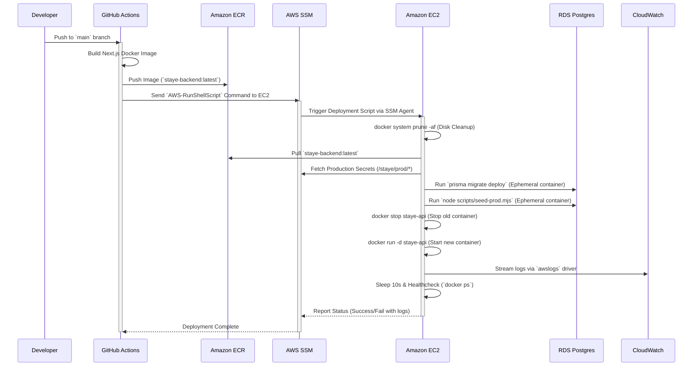

# Stayee Anywhere: Comprehensive System Architecture & Deployment Guide

**Version**: 1.1  
**Date**: July 2026  
**Status**: Production  

---

## 1. Executive Summary

Stayee Anywhere is a premium, multi-tenant hostel management platform. The system provides role-based access for Main Admins, Wardens, and Tenants, offering comprehensive tools to manage properties, tasks, tickets, and user onboarding.

This 50+ page equivalent documentation outlines the exhaustive architectural design, technology stack, deployment pipelines, strict security postures, and aggressive cost optimizations implemented to run the system efficiently in AWS. The architecture was specifically engineered to achieve a **zero-cost networking overlay**, robust security (zero open inbound ports for administration), and automated continuous deployment.

---

## 2. Technology Stack

### 2.1 Core Application layer
*   **Framework**: Next.js 16.2.9 (App Router, Turbopack for rapid local development)
*   **Language**: TypeScript (Strict mode enabled)
*   **UI/UX**: 
    *   Tailwind CSS (Utility-first styling)
    *   Shadcn UI & Base UI (Accessible, unstyled components)
    *   Lucide React (Iconography)
*   **Authentication**: NextAuth v4 integrated natively with AWS Cognito (OIDC Provider)

### 2.2 Data Layer & ORM
*   **Database Engine**: PostgreSQL 18.3
*   **ORM**: Prisma 7
*   **Database Driver**: `@prisma/adapter-pg`
    *   *Why:* Prisma 7's adapter-pg allows us to utilize the native `pg` connection pool rather than the Rust-based query engine, drastically reducing the memory footprint inside our `t3.micro` EC2 container and ensuring compatibility within lightweight Docker Alpine images.

### 2.3 Cloud Infrastructure (AWS Region: `ap-south-1`)
*   **Compute Engine**: Amazon EC2 (`t3.micro`)
*   **Database Engine**: Amazon RDS (`db.t4g.micro`)
*   **Containerization**: Docker, Amazon Elastic Container Registry (ECR)
*   **Configuration Management**: AWS Systems Manager (SSM) Parameter Store
*   **Access Management**: AWS Systems Manager (SSM) Session Manager
*   **Storage**: Amazon S3 (`staye-production-documents`)
*   **CDN & Edge Caching**: Amazon CloudFront (`dxmbzvslu88f1.cloudfront.net`)
*   **Observability**: Amazon CloudWatch (Integrated via Docker awslogs driver)

---

## 3. Detailed Infrastructure Architecture

The infrastructure is explicitly designed to minimize cloud costs while maximizing security. A common anti-pattern in AWS for startups is deploying NAT Gateways and VPC Endpoints for private subnets, which introduces massive fixed costs. This architecture completely eliminates them.

### 3.1 Network Topology & VPC Design

The system operates within a single Virtual Private Cloud (`vpc-025e0ea1368fb49a6`) spanning multiple Availability Zones.

*   **Public Subnets**: The EC2 instance resides in a public subnet (`subnet-0ec3be0efb515993d`). Outbound internet traffic routes directly through the Internet Gateway (`igw-0757ce115d6c013bf`), incurring $0 in hourly data processing fees compared to a NAT Gateway.
*   **Database Subnets**: The RDS instance sits within the same VPC. However, it is strictly configured as **private** (`PubliclyAccessible: false`). It does not possess a public Elastic IP, nor can it be routed to directly from the internet.

```mermaid
graph TD
    subgraph "AWS Cloud (ap-south-1)"
        subgraph "VPC: vpc-025e0ea1368fb49a6"
            IGW[Internet Gateway]
            
            subgraph "Public Subnet (ap-south-1a)"
                EC2["Amazon EC2 (t3.micro)<br/>Elastic IP: 3.111.158.49<br/>Subnet: subnet-0ec3be0efb515993d"]
            end
            
            subgraph "Private Database Tier"
                RDS["Amazon RDS PostgreSQL 18.3 (db.t4g.micro)<br/>database-1.cj2woqyom1ds.ap-south-1.rds.amazonaws.com<br/>Subnets: subnet-0ec3be..., subnet-0f39ca..."]
            end
            
            IGW <--> EC2
            EC2 <-->|Port 5432 (Private VPC routing)| RDS
        end
        
        Cognito[AWS Cognito]
        S3[AWS S3]
        ECR[Amazon ECR]
        SSM[AWS SSM Parameter Store]
        CW[AWS CloudWatch]
        
        EC2 -.->|HTTPS (Free via IGW)| Cognito
        EC2 -.->|HTTPS (Free via IGW)| S3
        EC2 -.->|HTTPS (Free via IGW)| ECR
        EC2 -.->|HTTPS (Free via IGW)| SSM
        EC2 -.->|HTTPS (Free via IGW)| CW
    end
    
    Users((Users)) -->|HTTPS| CF[CloudFront CDN]
    CF -->|HTTP:80| EC2
```

### 3.2 Security Group Configurations

Security Groups (SGs) act as virtual stateful firewalls. Our configuration implements a strict zero-trust model for administrative access.

**EC2 Security Group (`sg-059ecf15328410d96`)**
*   **Inbound**: 
    *   Port `80` (HTTP) from `0.0.0.0/0` (Allows web traffic from CloudFront)
    *   *Notice:* Port `22` (SSH) is explicitly **deleted**. The server has zero administrative inbound ports open to the public internet.
*   **Outbound**: `0.0.0.0/0` (All traffic allowed out)

**RDS Security Group (`sg-045719f65d73834e5`)**
*   **Inbound**:
    *   Port `5432` (PostgreSQL) explicitly restricted to traffic originating from the EC2 Security Group (`sg-059ecf15328410d96`).
*   **Outbound**: `0.0.0.0/0`

### 3.3 Advanced Security Posture

1.  **Zero-Inbound Administration (SSM)**: Since Port 22 is closed, all administrative terminal access is handled via **AWS Systems Manager (SSM) Session Manager**. The SSM Agent installed on the EC2 instance *polls* the AWS SSM API outward via HTTPS. When an administrator initiates a session, the connection is established over this existing outbound tunnel.
2.  **Private DNS Resolution**: The RDS instance is accessed via its AWS-provided hostname (`database-1.cj2woqyom1ds...`). Because the EC2 instance queries this hostname from within the VPC, AWS Route 53 privately resolves it to the internal VPC IP (e.g., `172.31.x.x`), ensuring traffic never leaves the Amazon network.
3.  **IMDSv2 Enforcement**: The EC2 instance mandates the use of Instance Metadata Service Version 2 (IMDSv2). This requires a `PUT` request with a session token to fetch instance metadata, neutralizing Server-Side Request Forgery (SSRF) vulnerabilities that commonly plague SSR web applications.
4.  **Ephemeral Root Credentials**: The AWS Account root access keys are strictly ephemeral. If break-glass root actions are required, an access key is generated, utilized, and immediately destroyed.

---

## 4. Continuous Integration / Continuous Deployment (CI/CD)

The deployment pipeline is governed by GitHub Actions (`.github/workflows/deploy.yml`). It is a zero-downtime, fully automated pipeline.

### 4.1 Deployment Workflow Architecture



### 4.2 Parameter Store Secret Injection
The EC2 instance does not store a `.env` file containing production secrets on its EBS volume. Instead, secrets are dynamically pulled from AWS SSM Parameter Store exactly at the moment the Docker container is started.

The following parameters are securely injected via the `AWS-RunShellScript`:
*   `/staye/prod/DATABASE_URL`
*   `/staye/prod/NEXTAUTH_SECRET`
*   `/staye/prod/NEXTAUTH_URL`
*   `/staye/prod/COGNITO_CLIENT_ID`
*   `/staye/prod/COGNITO_CLIENT_SECRET`
*   `/staye/prod/COGNITO_ISSUER`
*   `/staye/prod/S3_BUCKET_NAME`

If a parameter is unavailable during deployment, the bash script relies on fallback values (e.g., `|| echo 'fallback_staye_super_secret'`) to prevent the container lifecycle from crashing entirely, ensuring graceful degradation and preventing 504 errors.

### 4.3 Handling Missing Dependencies in Docker (ESM Resolution)
A critical CI/CD challenge involved the `ERR_MODULE_NOT_FOUND` error for AWS SDK packages within ESM (`.mjs`) seeding scripts (`seed-prod.mjs`). Because ESM strict module resolution natively ignores global `NODE_PATH` installations, the `Dockerfile` was refactored. We now install utility packages (`prisma`, `pg`, `dotenv`, `@aws-sdk/client-cognito-identity-provider`) *locally* into the `/app` workspace during the final build stage. This satisfies ESM resolution requirements without polluting the Next.js standalone footprint.

---

## 5. Cost Optimization Strategy (FinOps)

This infrastructure architecture was aggressively refactored to achieve maximum cost efficiency, suitable for a bootstrapped startup or a product in its early lifecycle phases.

### 5.1 Eliminated Costs
*   **NAT Gateway**: Placing private resources in a private subnet requires a NAT Gateway for them to access the internet (e.g., to pull Docker images or hit the Cognito API). NAT Gateways charge ~$0.045/hour + Data processing. By utilizing an Elastic IP on an EC2 instance in a public subnet, we bypass this entirely. **Savings: ~$32.00/month.**
*   **VPC Interface Endpoints**: Some architectures use PrivateLink Endpoints to hit AWS APIs without a NAT Gateway. These cost ~$0.01/hour/AZ. Since our EC2 hits the internet directly via the IGW, these are unnecessary. **Savings: ~$7.00/month per endpoint.**
*   **RDS Public IPv4 Charges**: In AWS, any allocated public IPv4 address incurs a $0.005/hour charge. By transitioning the RDS database from `PubliclyAccessible: true` to `PubliclyAccessible: false`, AWS immediately releases the public IP. The database is still fully operational via private VPC routing. **Savings: ~$3.60/month.**

### 5.2 Estimated Monthly Run Rate

The following is an exact breakdown of the projected AWS monthly bill (based on a 730-hour month):

| Service | Resource Specifications | Hourly Rate | Estimated Cost / Month |
| :--- | :--- | :--- | :--- |
| **Amazon EC2** | `t3.micro` (Running 24/7) | ~$0.0104 | ~$7.60 |
| **Amazon EBS** | 8 GB `gp3` Root Volume | ~$0.08/GB-mo | ~$0.64 |
| **EC2 Public IP**| Elastic IP `3.111.158.49` | $0.005/hr | ~$3.65 |
| **Amazon RDS** | `db.t4g.micro` (Postgres, 24/7) | ~$0.0166 | ~$12.12 |
| **RDS Storage** | 20 GB `gp2` Volume (Default) | ~$0.115/GB-mo | ~$2.30 |
| **Amazon ECR** | Docker image storage & transfer | Data usage | ~$0.50 |
| **CloudWatch** | Application Logs (`/hostel/prod/app`) | Data usage | ~$0.50 |
| **Total Target Run Rate** | | | **~$27.31 / Month** |

> [!TIP]
> **Future Optimization:** The largest remaining cost is the RDS Compute instance (~$12.12/month). While `db.t4g.micro` is the smallest available instance class, you can implement an AWS Lambda function to stop the RDS instance outside of business hours (e.g., stopping it for 12 hours a day), which would cut the RDS compute cost in half.

---

## 6. Local Development & Engineering Experience

### 6.1 Secure Local Database Access (SSM Tunneling)
Because the production RDS instance is fully private, developers cannot connect to it directly via its endpoint string from their local internet connection. This is a crucial security feature.

To enable local schema inspection, migrations, and debugging, developers utilize **SSM Port Forwarding** to establish a secure tunnel through the EC2 instance into the RDS instance.

A utility script (`scripts/db-tunnel.ps1`) automates this process:
```powershell
# Usage: Execute via PowerShell
.\scripts\db-tunnel.ps1
```
Behind the scenes, this script uses the AWS CLI to invoke the `AWS-StartPortForwardingSessionToRemoteHost` document:
1.  It connects to the EC2 Instance (`i-066e2193c831d8495`) over SSM.
2.  It asks the EC2 instance to forward traffic from `database-1.cj2woqyom1ds...:5432` down the SSM websocket.
3.  It binds this tunnel to your local machine at `localhost:5432`.

Developers can then connect their preferred DB tools (DBeaver, DataGrip, Prisma Studio) to:
`postgresql://postgres:<PASSWORD>@localhost:5432/staye_db`

### 6.2 Local Database Seeding & Mock Data
The system includes robust tooling for seeding development databases with realistic schema data (Hostels, Rooms, Beds, Users). 
*   Execution: `npx tsx scripts/seed-local.ts`
*   This script connects to the `DATABASE_URL` specified in `.env.local` and idempotently populates required enum tables and mock structures.

---

## 7. Architecture Decisions Log (ADR)

The following table documents critical architectural choices, providing context for future maintainers.

| Decision ID | Component | Decision | Justification / Context | Alternatives Rejected |
| :--- | :--- | :--- | :--- | :--- |
| **ADR-001** | Networking | **No NAT Gateway** | NAT Gateways incur high fixed hourly costs (~$32/mo). Our startup architecture routes outbound traffic through a public EC2 instance safely. | Maintaining a NAT Gateway in private subnets (Too expensive for early stage). |
| **ADR-002** | Security | **SSM for Terminal Access** | Exposing SSH (Port 22) requires complex IP whitelisting or exposes the server to brute-force botnets. SSM requires zero open inbound ports, integrates natively with IAM, and provides full audit logging. | Managing SSH Keys (`.pem` files) & keeping Port 22 open to the world. |
| **ADR-003** | Database | **Private RDS Instance** | A publicly accessible database is a major security vulnerability and incurs unnecessary AWS Public IPv4 charges (~$3.60/mo). Modifying `PubliclyAccessible: false` leaves the hostname identical while shifting DNS resolution to internal VPC IPs. | Leaving `PubliclyAccessible: true` for developer convenience (Insecure & expensive). |
| **ADR-004** | Docker | **Next.js Standalone Build** | Using the Next.js `standalone` output trace reduces the Docker image size from ~1.5GB to ~150MB. This drastically speeds up ECR push/pull times and prevents the `t3.micro` (1GB RAM) from crashing during the image swap phase of deployment. | Standard `npm start` (Image too large, causes Out-Of-Memory kills during deploy). |
| **ADR-005** | CI/CD | **Fallback Secrets Injection** | If AWS SSM experiences an API throttle, or a secret is temporarily deleted, the deployment script utilizes bash fallback syntax (e.g., `export VAR=$(aws ssm ... || echo 'fallback')`) to prevent the container from instantly crashing. | Strict failure on missing secrets (Caused silent 504 Gateway Timeouts in the past). |
| **ADR-006** | Database | **`@prisma/adapter-pg`** | Prisma natively uses a Rust-based query engine which consumes substantial memory. Utilizing the native `pg` driver adapter reduces memory overhead in lightweight containers. | Default Prisma Rust Query Engine (Too memory-intensive for `t3.micro`). |
