# Hostel Management Platform
## V1 Product Concept Document

---

| Field | Value |
|---|---|
| **Document Title** | Hostel Management Platform — Version 1.0 Concept Document |
| **Document Status** | Draft for Review |
| **Classification** | Internal — Product & Engineering |
| **Prepared By** | Zenxvio Internal Team |
| **Document Version** | 1.0 |
| **Date** | July 2026 |
| **Supersedes** | MVP Architecture (pre-V1) |

---

> **Purpose of This Document**
>
> This document serves as the foundational product specification for the Version 1 release of the Hostel Management Platform. It is authored as a CTO-level design blueprint, structured to guide the product, engineering, and design teams through the full scope of V1. It covers every feature module, user journey, data architecture, infrastructure decisions, and the reasoning behind every major design choice.
>
> This document is the source of truth before the Product Requirements Document (PRD) is authored. All subsequent engineering tickets, design specs, and API contracts must trace back to this document.

---

<div style="page-break-after: always;"></div>

# Table of Contents

1. [Executive Summary](#1-executive-summary)
2. [MVP to V1: The Evolution](#2-mvp-to-v1-the-evolution)
3. [Product Philosophy & Design Direction](#3-product-philosophy--design-direction)
4. [User Roles & Permission Architecture](#4-user-roles--permission-architecture)
5. [System Architecture Overview](#5-system-architecture-overview)
6. [Module 01: Dashboard & Analytics](#6-module-01-dashboard--analytics)
7. [Module 02: Booking & Onboarding System](#7-module-02-booking--onboarding-system)
8. [Module 03: Billing Engine](#8-module-03-billing-engine)
9. [Module 04: Finance Center](#9-module-04-finance-center)
10. [Module 05: Expense Management](#10-module-05-expense-management)
11. [Module 06: Food Management System](#11-module-06-food-management-system)
12. [Module 07: Smart Bed Operations](#12-module-07-smart-bed-operations)
13. [Module 08: Stay Pass System](#13-module-08-stay-pass-system)
14. [Module 09: Lease Renewal Workflow](#14-module-09-lease-renewal-workflow)
15. [Module 10: Service Requests](#15-module-10-service-requests)
16. [Module 11: Visitor & Guest Log](#16-module-11-visitor--guest-log)
17. [Module 12: Employee & Attendance Management](#17-module-12-employee--attendance-management)
18. [Module 13: Performance Scoring Engine](#18-module-13-performance-scoring-engine)
19. [Module 14: Comparisons & Reporting](#19-module-14-comparisons--reporting)
20. [Module 15: Announcements](#20-module-15-announcements)
21. [Module 16: Inventory & Asset Management](#21-module-16-inventory--asset-management)
22. [Module 17: Housekeeping Management](#22-module-17-housekeeping-management)
23. [Module 18: Settings & Configuration](#23-module-18-settings--configuration)
24. [Module 19: Social Authentication](#24-module-19-social-authentication)
25. [Module 20: DPDP Compliance & Privacy](#25-module-20-dpdp-compliance--privacy)
26. [Data Architecture](#26-data-architecture)
27. [Infrastructure & AWS Architecture](#27-infrastructure--aws-architecture)
28. [V1.1 Roadmap — Deferred Features](#28-v11-roadmap--deferred-features)
29. [MVP vs V1 Gap Analysis](#29-mvp-vs-v1-gap-analysis)
30. [Appendix A: Glossary](#appendix-a-glossary)
31. [Appendix B: Open Items & Pending Decisions](#appendix-b-open-items--pending-decisions)

---

<div style="page-break-after: always;"></div>

# 1. Executive Summary

The Hostel Management Platform began as a Minimum Viable Product (MVP) designed to digitize the core operations of a multi-hostel PG management business: tenant onboarding, room allocation, basic rent tracking, and food billing. The MVP validated the core hypothesis — that hostel operators in India are deeply underserved by generic property management tools and need a purpose-built solution.

**Version 1 is not an incremental improvement. It is a fundamental architectural and product evolution.**

V1 transforms the platform from a **digital ledger** — a system that records what happened — into a **Hostel Operating System (HOS)**: a comprehensive, intelligence-driven platform that manages every operational dimension of running a hostel business at scale.

### What V1 Introduces

- A QR-code-driven, self-service tenant onboarding funnel with real-time bed locking
- A sophisticated multi-mode billing engine with normalization, proration, tax groups, and late fees
- A complete food management system with per-meal pricing, food wallets, procurement reporting, and configurable cancellation windows
- Smart bed operations — transfer, swap, reservation, and waiting list management
- A legally-compliant digital Stay Pass with automated lifecycle management
- An employee attendance system with geolocation verification and leave management
- A multi-metric hostel performance scoring engine with transparent sub-scores
- A Finance Center with invoicing, receipts, expense governance, and bill vault
- DPDP Act 2023 compliance infrastructure
- A complete Visitor and Guest log for security and compliance
- Social login (Google, Facebook) for the tenant portal

### What V1 Explicitly Defers to V1.1

- Canvas/drag-and-drop dashboard widget system
- Regional language assistant (Malayalam)

### Infrastructure Commitment

V1 operates on the AWS Free Tier (ap-south-1, Mumbai) with a target infrastructure cost of under Rs.500/month for the first 12 months.

---

<div style="page-break-after: always;"></div>

# 2. MVP to V1: The Evolution

## 2.1 What the MVP Established

The MVP successfully delivered the foundational scaffolding of the platform:

| Capability | MVP Status |
|---|---|
| Multi-tenant organizational structure | Complete |
| Hostel / Floor / Flat / Room / Bed hierarchy | Complete |
| Warden-initiated onboarding with admin approval | Complete |
| Tenant portal with rent and stay visibility | Complete |
| Basic payment proof upload (UPI screenshot) | Complete |
| Food billing system (admin-managed) | Complete |
| KYC document upload (Aadhaar, PAN) | Complete |
| Activity logs and audit trail | Complete |
| Basic task assignment for wardens | Partial |
| In-app notifications | Partial |
| AWS deployment (EC2 + RDS + S3 + CloudFront) | Complete |

## 2.2 The MVP's Structural Limitations

While the MVP proved the concept, it has identifiable gaps that prevent deployment to real customers at scale:

**1. Onboarding is warden-dependent.** Every tenant onboarding requires a warden to initiate the flow and send a link manually. There is no self-service mechanism where a prospective tenant can scan a QR code, see available rooms, and begin the booking process independently.

**2. Billing is manual.** Rent amounts are entered manually per tenant with no engine to automatically calculate prorated bills, apply normalization cycles, or compute late fees. This does not scale past 20 tenants.

**3. Food is not tenant-driven.** Tenants cannot manage their own food plan, book specific meals, or view what is being served. The food system is entirely admin-managed with no procurement intelligence.

**4. No financial intelligence.** The platform cannot tell the admin how much the business made last month, what the expenses were, which category of expense grew, or what next month's expected revenue is.

**5. No employee operations.** There is no system for tracking hostel staff — their attendance, their tasks, their leave, or their operational expenses.

**6. No bed lifecycle management.** Once a tenant checks into a bed, there is no workflow to transfer, swap, or reserve beds. Bed history for audit purposes is incomplete.

**7. No legal compliance.** The platform stores Aadhaar and PAN data without explicit DPDP consent workflows or document deletion mechanisms — a legal liability for any commercial deployment.

## 2.3 V1 Design Principles

V1 is built around five non-negotiable principles:

| Principle | What It Means |
|---|---|
| **Self-service over manual** | Every tenant interaction that requires warden intervention should have a self-service option |
| **Financial clarity** | Every rupee in and out of every hostel should be visible, categorized, and queryable in real time |
| **Operational completeness** | A warden should run their entire hostel from this platform without any other tool |
| **Compliance by design** | Privacy, consent, and audit requirements are built into the core data model, not added as an afterthought |
| **Scale without re-architecture** | V1 is designed to handle 10x growth from the MVP without requiring fundamental re-architecture |

---

<div style="page-break-after: always;"></div>

# 3. Product Philosophy & Design Direction

## 3.1 Visual Design Language

V1 introduces a complete visual redesign. The design system is inspired by modern fintech dashboard aesthetics — specifically the Pinpoint/Finponin design language — characterized by:

- **Primary Accent:** Rich, saturated orange (approximately HSL 28, 95%, 55%) used for key metrics, primary CTAs, and performance indicators
- **Neutral Base:** Near-black dark grays (`#111827`, `#1F2937`) for backgrounds and data containers
- **Positive/Negative Indicators:** Orange for revenue and positive outcomes; muted red for deficits, overdue items, and urgent states
- **Typography:** Plus Jakarta Sans or Inter — clean, modern, with strong numerical weight for financial figures
- **Card Architecture:** Bento-box style card grid layouts with subtle elevation. No heavy drop shadows.
- **Fixed Dashboard Layout (V1):** A carefully designed, fixed widget layout. The drag-and-drop canvas is a V1.1 feature.

## 3.2 Mobile-First for Tenants and Employees

The tenant portal and QR booking flow must be optimized for mobile browsers. All tenant-facing and employee-facing screens must be designed mobile-first because:

- Prospective tenants scan QR codes on their phones in the field
- Tenants access their Stay Pass, food calendar, and payment status from their phones
- Employees mark attendance on their phones at the hostel premises

## 3.3 Desktop-First for Operations

The admin dashboard, warden panel, comparisons module, expense management, and reporting are primarily used on desktop browsers. Responsive mobile support is required but the layout priority is desktop.

## 3.4 Design Reference

The left navigation pane, color usage, and financial metric card layout follows the Pinpoint/Finponin reference design:
- **Left pane:** Dark background, orange accents on active items, icon + label per module
- **Top bar:** Contextual to the current page — dropdowns and actions relevant to what the user is viewing
- **Main content:** Card-based, data-dense but not cluttered
- **Financial figures:** Large, bold, prominently placed with MoM trend indicators

---

<div style="page-break-after: always;"></div>

# 4. User Roles & Permission Architecture

## 4.1 Role Hierarchy

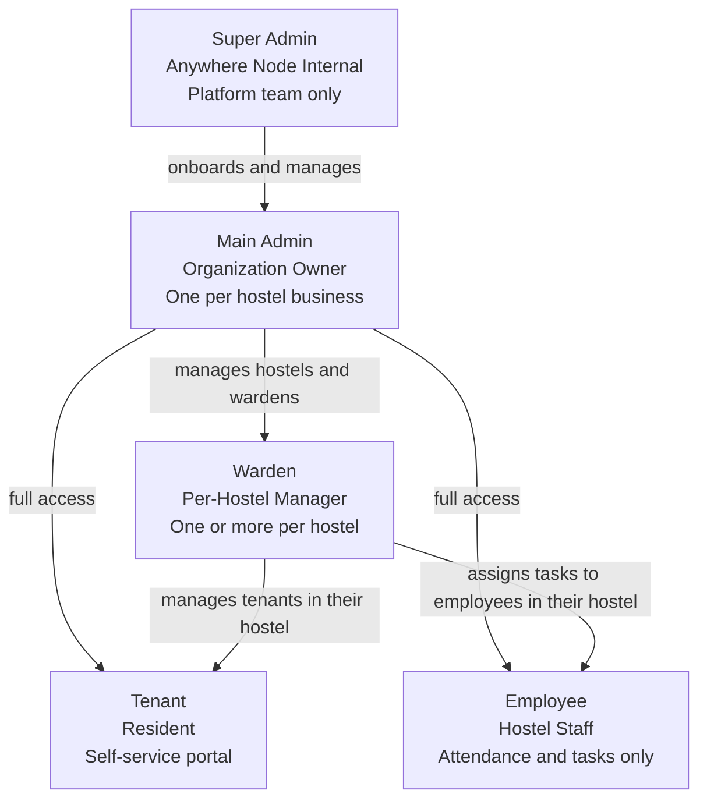
```mermaid
graph TD
    SA["Super Admin<br/>Anywhere Node Internal<br/>Platform team only"]
    MA["Main Admin<br/>Organization Owner<br/>One per hostel business"]
    WA["Warden<br/>Per-Hostel Manager<br/>One or more per hostel"]
    TE["Tenant<br/>Resident<br/>Self-service portal"]
    EM["Employee<br/>Hostel Staff<br/>Attendance and tasks only"]

    SA -->|onboards and manages| MA
    MA -->|manages hostels and wardens| WA
    MA -->|full access| TE
    MA -->|full access| EM
    WA -->|manages tenants in their hostel| TE
    WA -->|assigns tasks to employees in their hostel| EM
```

## 4.2 Role Definitions

### Super Admin — Anywhere Node Internal

The highest privilege tier, used exclusively by the Anywhere Node platform team. Never exposed to hostel operators.

Capabilities:
- Onboard new organizations and create Main Admin accounts
- Manage platform-wide settings and feature flags per organization
- Access any organization for support and debugging
- Monitor platform-wide health and usage metrics

### Main Admin — Organization Owner

One per organization (e.g., a PG business with 5 hostels has one Main Admin). Owns all configuration decisions.

Capabilities:
- Full read/write access to all hostels, wardens, tenants, and employees in their organization
- Configure all financial settings: UPI ID, QR, tax groups, currency display, normalization, late fees
- Create and manage expense entities and expense tags
- Approve or reject all warden-submitted expenses and expense vouchers
- Approve or reject employee leave requests (exclusive to Main Admin)
- Access all analytics, comparisons, MRR reports, and financial statements
- Generate and review all invoices, receipts, and expense vouchers
- Create and maintain the weekly food menu and food pricing
- Access the DPDP data deletion panel

### Warden — Per-Hostel Manager

One or more wardens per hostel. The operational layer between admin and tenants.

Capabilities:
- Manage onboarding, bed assignment, and tenant lifecycle within their hostel
- Review and verify tenant payment proofs
- Generate bills and issue Stay Passes
- Apply discounts to bills
- Log expenses (only for expense entities/tags they have been granted access to)
- Access their hostel's food procurement report
- Manage the visitor/guest log for their hostel
- Assign tasks to employees in their hostel
- Schedule housekeeping for their hostel
- Send announcements to tenants in their hostel
- Toggle bill normalization for their own hostel only
- Create expense voucher requests

### Tenant — Resident

The end resident. Access is scoped entirely to their own data.

Capabilities:
- View their own stay details, rent, and payment history
- Manage their food plan, food wallet, and meal bookings
- Submit service requests (maintenance requests, complaints)
- View, download, and share their Stay Pass
- Request stay renewal or extension
- View and respond to announcements

### Employee — Hostel Staff

Hostel operational staff. Minimal, task-focused access.

Capabilities:
- Mark daily attendance (geolocation-verified)
- Mark daily checkout (geolocation-verified)
- Submit leave requests
- View their own attendance history and working hours
- View and update tasks assigned to them

## 4.3 Permission Matrix

| Feature | Super Admin | Main Admin | Warden | Tenant | Employee |
|---|---|---|---|---|---|
| Manage organizations | Yes | - | - | - | - |
| View all hostels | Yes | Yes | Own only | - | - |
| Create warden accounts | Yes | Yes | - | - | - |
| Create tenant accounts | Yes | Yes | Yes | - | - |
| Create employee accounts | Yes | Yes | Yes (own hostel) | - | - |
| Onboard tenant (initiate) | Yes | Yes | Yes | Self via QR | - |
| Approve tenant onboarding | Yes | Yes | Yes | - | - |
| Generate bills | Yes | Yes | Yes | - | - |
| Apply discounts to bills | Yes | Yes | Yes | - | - |
| Verify payments | Yes | Yes | Yes | - | - |
| Issue Stay Pass | Yes | Yes | Yes | - | - |
| Configure UPI QR | Yes | Yes | - | - | - |
| Create and manage tax groups | Yes | Yes | - | - | - |
| Toggle bill normalization | Yes | Yes (all hostels) | Yes (own hostel) | - | - |
| Configure late fee policy | Yes | Yes | - | - | - |
| Create expense entities | Yes | Yes | - | - | - |
| Create expense tags | Yes | Yes | - | - | - |
| Log expenses | Yes | Yes | Yes (by entity access) | - | - |
| Approve expenses | Yes | Yes | - | - | - |
| Create expense vouchers | - | Yes | Yes | - | - |
| Approve expense vouchers | Yes | Yes | - | - | - |
| View food procurement report | Yes | Yes | Yes (own hostel) | - | - |
| Set weekly food menu | Yes | Yes | - | - | - |
| Manage food pricing | Yes | Yes | - | - | - |
| Book and manage meals | - | - | - | Yes | - |
| Access comparisons module | Yes | Yes | - | - | - |
| View MRR report | Yes | Yes | - | - | - |
| Mark attendance | - | - | - | - | Yes (own) |
| Request leave | - | - | - | - | Yes (own) |
| Approve leave | Yes | Yes | - | - | - |
| Assign tasks to employees | Yes | Yes | Yes (own hostel) | - | - |
| View visitor log | Yes | Yes | Yes (own hostel) | - | - |
| Log visitor entry and exit | Yes | Yes | Yes | - | - |
| Submit service requests | - | Yes | Yes (incidents) | Yes (complaints/maintenance) | - |
| Resolve service requests | Yes | Yes | Yes | - | - |
| Delete KYC documents (DPDP) | Yes | Yes | - | - | - |
| Generate comparison reports | Yes | Yes | - | - | - |
| Configure geofence radius | Yes | Yes | - | - | - |
| Manage asset register | Yes | Yes | Yes (own hostel) | - | - |
| Schedule housekeeping | Yes | Yes | Yes (own hostel) | - | - |
| Send announcements | Yes | Yes (all hostels) | Yes (own hostel) | - | - |

---

<div style="page-break-after: always;"></div>

# 5. System Architecture Overview

## 5.1 High-Level Architecture

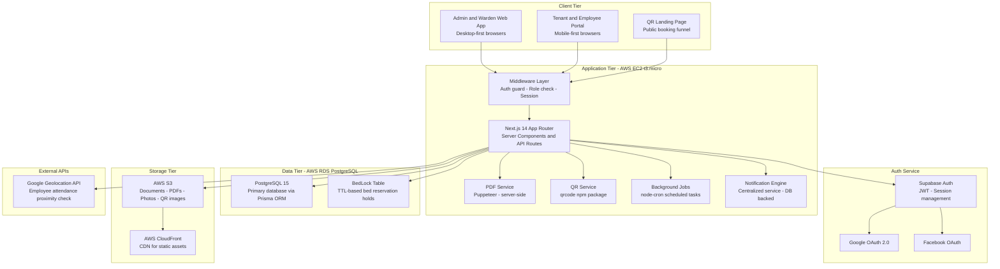
```mermaid
graph TD
    subgraph "Client Tier"
        WEB["Admin and Warden Web App<br/>Desktop-first browsers"]
        MOB["Tenant and Employee Portal<br/>Mobile-first browsers"]
        QRL["QR Landing Page<br/>Public booking funnel"]
    end

    subgraph "Application Tier - AWS EC2 t3.micro"
        NEXT["Next.js 14 App Router<br/>Server Components and API Routes"]
        MID["Middleware Layer<br/>Auth guard - Role check - Session"]
        PDF["PDF Service<br/>Puppeteer - server-side"]
        QRS["QR Service<br/>qrcode npm package"]
        CRON["Background Jobs<br/>node-cron scheduled tasks"]
        NOTIF["Notification Engine<br/>Centralized service - DB backed"]
    end

    subgraph "Auth Service"
        SUPA["Supabase Auth<br/>JWT - Session management"]
        GOAUTH["Google OAuth 2.0"]
        FBOAUTH["Facebook OAuth"]
    end

    subgraph "Data Tier - AWS RDS PostgreSQL"
        PG["PostgreSQL 15<br/>Primary database via Prisma ORM"]
        LOCK["BedLock Table<br/>TTL-based bed reservation holds"]
    end

    subgraph "Storage Tier"
        S3["AWS S3<br/>Documents - PDFs - Photos - QR images"]
        CF["AWS CloudFront<br/>CDN for static assets"]
    end

    subgraph "External APIs"
        GMAP["Google Geolocation API<br/>Employee attendance proximity check"]
    end

    WEB --> MID
    MOB --> MID
    QRL --> MID
    MID --> NEXT
    NEXT --> SUPA
    SUPA --> GOAUTH
    SUPA --> FBOAUTH
    NEXT --> PG
    NEXT --> LOCK
    NEXT --> S3
    NEXT --> PDF
    NEXT --> QRS
    NEXT --> NOTIF
    NEXT --> CRON
    NEXT --> GMAP
    S3 --> CF
```

## 5.2 AWS Services — V1 Scope

| Service | Purpose | Cost Tier |
|---|---|---|
| EC2 t3.micro | Next.js application server (Dockerized) | Free Tier - 750 hrs/month |
| RDS PostgreSQL t3.micro | Primary relational database | Free Tier - 750 hrs/month |
| S3 | Document, photo, PDF, and QR image storage | Free Tier - 5 GB |
| CloudFront | CDN for static assets and media delivery | Free Tier - 1 TB transfer |
| ACM | SSL certificate for custom domain | Free |
| SSM Parameter Store | Secrets management (DB URL, API keys) | Free Tier |
| CloudWatch | Application logs, metrics, alarms | Free Tier - 5 GB |
| IAM | Role-based AWS resource access control | Free |

**Infrastructure Cost Target:** Under Rs.500/month for the first 12 months of operation.

## 5.3 Core Technical Stack

| Layer | Technology | Rationale |
|---|---|---|
| Framework | Next.js 14 App Router | Full-stack SSR, API routes, Server Components in one package |
| Database ORM | Prisma | Type-safe queries, schema migrations, excellent developer experience |
| Database | PostgreSQL 15 via AWS RDS | ACID compliance, relational integrity for financial data |
| Auth | Supabase Auth | Managed auth, JWT, OAuth providers, Row Level Security |
| File Storage | AWS S3 with pre-signed URLs | Secure, cost-effective, no permanent public URLs for sensitive docs |
| PDF Generation | Puppeteer (headless Chromium, server-side) | Pixel-perfect HTML-to-PDF, full design control |
| QR Generation | qrcode npm package | Server-side generation, no third-party dependency |
| Real-Time Data | SWR polling at 5-second interval | Zero infrastructure overhead, smart pausing when tab is hidden |
| Geolocation | Browser Geolocation API + Google Maps SDK | Proximity verification for employee attendance |
| Language | TypeScript end-to-end | Type safety across frontend, backend, and database layer |
| Background Jobs | node-cron inside Next.js process | No separate infrastructure, minimal complexity |

## 5.4 Real-Time Strategy

V1 uses **SWR polling every 5 seconds** for real-time dashboard updates — a deliberate architectural choice detailed in SDD v1.7. This applies to: admin dashboard financial metrics, new onboarding requests, pending payment queue, expense approval queue, service request status, bed availability counts, and food order counts.

SWR pauses automatically when the browser tab is backgrounded. Server-Sent Events (SSE) is the planned Phase 2 upgrade when real-time requirements become more demanding at scale.

## 5.5 Bed Locking Architecture

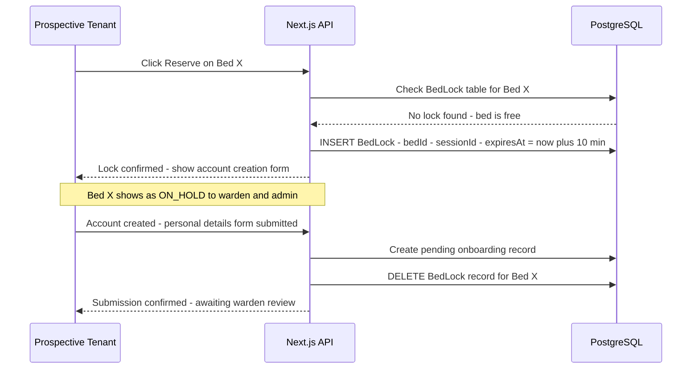
```mermaid
sequenceDiagram
    participant T as Prospective Tenant
    participant API as Next.js API
    participant DB as PostgreSQL

    T->>API: Click Reserve on Bed X
    API->>DB: Check BedLock table for Bed X
    DB-->>API: No lock found - bed is free
    API->>DB: INSERT BedLock - bedId - sessionId - expiresAt = now plus 10 min
    API-->>T: Lock confirmed - show account creation form
    Note over T,API: Bed X shows as ON_HOLD to warden and admin
    T->>API: Account created - personal details form submitted
    API->>DB: Create pending onboarding record
    API->>DB: DELETE BedLock record for Bed X
    API-->>T: Submission confirmed - awaiting warden review
```

A node-cron job runs every 5 minutes to clean expired BedLock records, automatically restoring abandoned beds to AVAILABLE status.

## 5.6 Centralized PDF Generation Service

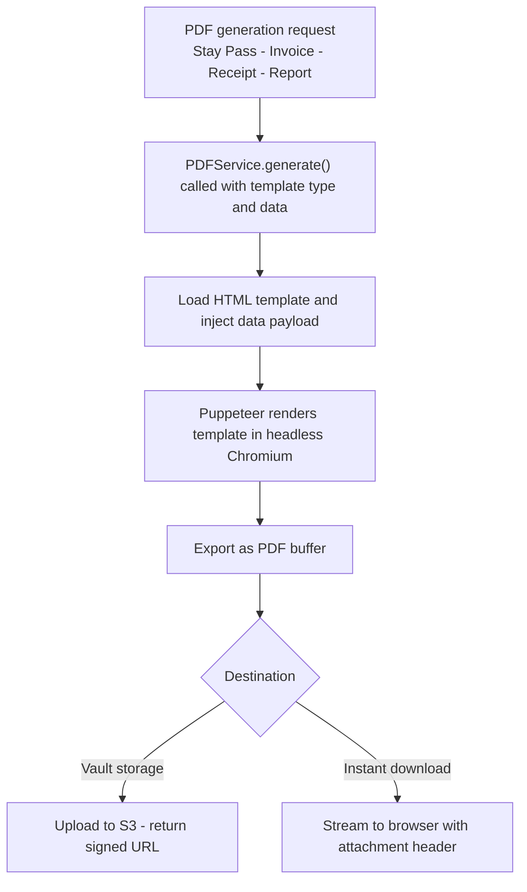
```mermaid
graph TD
    A["PDF generation request<br/>Stay Pass - Invoice - Receipt - Report"]
    A --> B["PDFService.generate() called with template type and data"]
    B --> C["Load HTML template and inject data payload"]
    C --> D["Puppeteer renders template in headless Chromium"]
    D --> E["Export as PDF buffer"]
    E --> DEST{"Destination"}
    DEST -->|Vault storage| F["Upload to S3 - return signed URL"]
    DEST -->|Instant download| G["Stream to browser with attachment header"]
```

All PDFs share consistent branding, headers, footers, and page formatting. No feature builds ad-hoc PDF logic.

## 5.7 Centralized Notification Engine

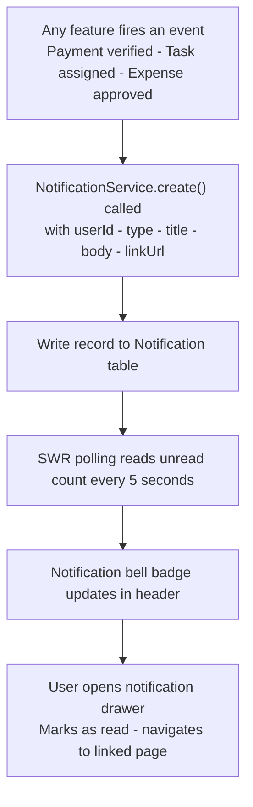
```mermaid
graph TD
    A["Any feature fires an event<br/>Payment verified - Task assigned - Expense approved"]
    A --> B["NotificationService.create() called<br/>with userId - type - title - body - linkUrl"]
    B --> C["Write record to Notification table"]
    C --> D["SWR polling reads unread count every 5 seconds"]
    D --> E["Notification bell badge updates in header"]
    E --> F["User opens notification drawer<br/>Marks as read - navigates to linked page"]
```

**V1 Notification Types:**

| Type | Triggered By | Recipients |
|---|---|---|
| `PAYMENT_VERIFIED` | Warden verifies payment | Tenant |
| `BILL_GENERATED` | Bill created after onboarding approval | Tenant |
| `STAY_EXPIRING` | Cron - X days before stay end | Tenant and Warden |
| `STAY_PASS_READY` | Stay Pass generated | Tenant |
| `ONBOARDING_SUBMITTED` | Prospective tenant submits form | Warden and Admin |
| `EXPENSE_PENDING` | Warden submits expense | Admin |
| `EXPENSE_APPROVED` | Admin approves expense | Warden |
| `VOUCHER_APPROVED` | Admin approves expense voucher | Warden |
| `TASK_ASSIGNED` | Admin or Warden assigns task | Employee |
| `LEAVE_APPROVED` | Admin approves leave | Employee |
| `LEAVE_REJECTED` | Admin rejects leave | Employee |
| `SERVICE_REQUEST_UPDATED` | Warden updates status | Tenant |
| `BED_AVAILABLE` | Cron - bed freed while tenant on waitlist | Warden to contact |
| `FOOD_CUTOFF_WARNING` | Cron - 1 hour before cutoff | Tenants with unbooked meals |
| `FOOD_WALLET_LOW` | Food booking - wallet below threshold | Tenant |

## 5.8 Integration-Ready API Design

V1 does not integrate with any third-party tools. However, the APIs are designed for future integrations without refactoring:

1. **API Key Infrastructure:** The `Organization` model contains an auto-generated `apiKey` (UUID). Future integrations authenticate using this key.
2. **Webhook Architecture Foundation:** `WebhookEndpoint` and `WebhookLog` models are defined in the schema. `webhookService.emit(event, payload)` is a no-op in V1 but becomes a real HTTP call when integrations are enabled.
3. **Structured Event Naming:** All internal events follow `resource.action` convention: `tenant.onboarded`, `payment.verified`, `expense.approved`, `stay_pass.issued`.

---

<div style="page-break-after: always;"></div>

# 6. Module 01: Dashboard & Analytics

## 6.1 Overview

The main dashboard is the command center for the Main Admin, providing a real-time financial and operational overview of the entire organization. V1 ships with a carefully designed fixed layout.

## 6.2 Main Admin Dashboard Layout

**Section A — Organization Financial Summary (Top Row)**

Three headline metrics for the current month:
- **Total Sales** (highlighted prominently — the primary gross revenue indicator)
- **Total Expenses** (broken down by category on hover)
- **Net Revenue / Net Profit** = Total Sales minus Total Expenses (displayed in orange — the primary brand metric)

Month-over-Month (MoM) trend indicator beside each metric (percentage up or down vs previous month).

**Section B — Expense Breakdown Cards**

Utility-icon cards, one per expense category, showing current month total:
- WiFi, Electricity (lightning bolt icon), Water (droplet), Housekeeping (broom), Building Rent (building), Food/Beverages (fork icon), Others (tag)

**Section C — Facility Selector**

Dropdown in the top bar: "All Facilities" by default. Selecting a specific hostel filters all dashboard metrics to that hostel only.

**Section D — Hostel Allocation Performance Grid**

Grid of hostel performance cards (Pinpoint/Finponin bento-box style). Each card shows:
- Hostel name, revenue contribution as % of total, occupancy rate, Performance Score badge (Green/Amber/Red), quick stats

Clicking any hostel card navigates to that hostel's isolated dashboard.

**Section E — Insights Panel**

System-generated operational observations:
- "NextHome Paradise occupancy dropped 15% in the last 7 days"
- "3 tenants at NHC have payments overdue by 7+ days"
- "Food plan adoption at NHP is below 30% this month"

## 6.3 Financial Metric Definitions

| Metric | Formula | Scope |
|---|---|---|
| Gross Rent Revenue | Sum of all verified rent payments | Per hostel or org |
| Food Revenue | Sum of all food wallet top-ups verified | Per hostel or org |
| Total Revenue | Gross Rent plus Food Revenue | Per hostel or org |
| Total Expenses | Sum of all admin-approved expenses | Per hostel or org |
| Net Profit | Total Revenue minus Total Expenses | Per hostel or org |
| Occupancy Rate | (Occupied Beds / Total Beds) x 100% | Per hostel |
| Food Adoption | (Tenants with active food plan / Total) x 100% | Per hostel |

---

<div style="page-break-after: always;"></div>

# 7. Module 02: Booking & Onboarding System

## 7.1 The Three Booking Flows

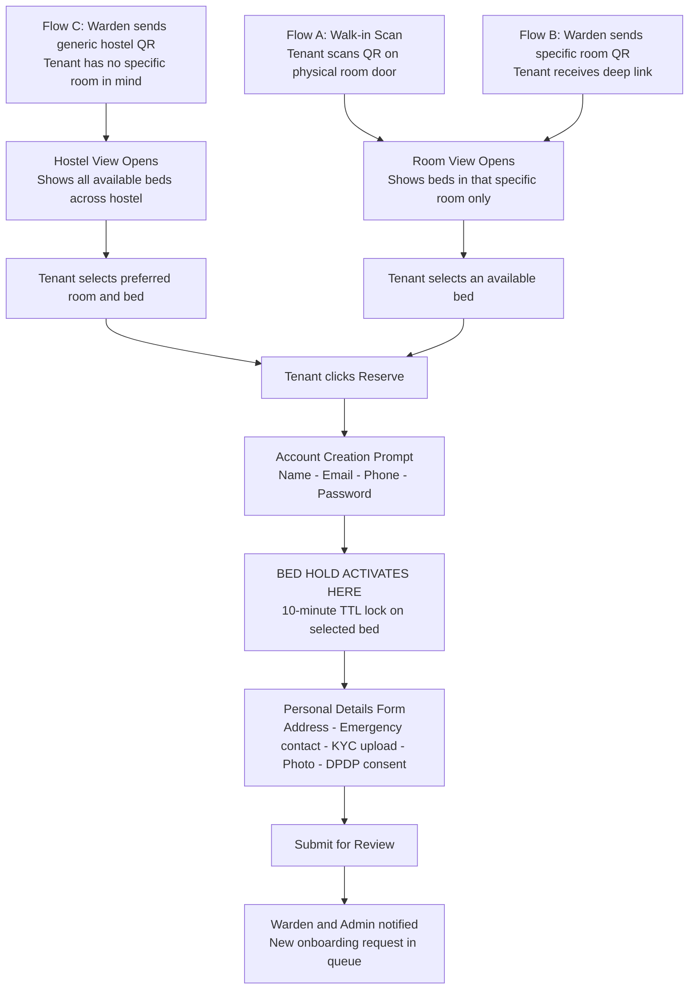
```mermaid
graph TD
    FA["Flow A: Walk-in Scan<br/>Tenant scans QR on physical room door"]
    FB["Flow B: Warden sends specific room QR<br/>Tenant receives deep link"]
    FC["Flow C: Warden sends generic hostel QR<br/>Tenant has no specific room in mind"]

    FA --> RV["Room View Opens<br/>Shows beds in that specific room only"]
    FB --> RV
    FC --> HV["Hostel View Opens<br/>Shows all available beds across hostel"]
    HV --> SEL["Tenant selects preferred room and bed"]
    RV --> SEL2["Tenant selects an available bed"]
    SEL --> RES["Tenant clicks Reserve"]
    SEL2 --> RES
    RES --> ACC["Account Creation Prompt<br/>Name - Email - Phone - Password"]
    ACC --> HOLD["BED HOLD ACTIVATES HERE<br/>10-minute TTL lock on selected bed"]
    HOLD --> FORM["Personal Details Form<br/>Address - Emergency contact - KYC upload - Photo - DPDP consent"]
    FORM --> SUB["Submit for Review"]
    SUB --> NOTIFY["Warden and Admin notified<br/>New onboarding request in queue"]
```

**Privacy Rule:** QR URLs encode a signed JWT token scoped to a specific room (Flows A/B) or specific hostel (Flow C). A prospective tenant cannot browse beyond what the QR authorizes.

## 7.2 Bed Selection UI

A mobile-optimized page showing:
- Hostel name and logo
- Room identifier
- Visual bed layout with color-coded status: Green (Available), Gray (Occupied), Yellow (On Hold), Blue (Reserved)
- Tapping a bed: slide-up sheet with details and "Reserve This Bed" CTA

## 7.3 Bed Hold Activation

The bed hold activates at the exact moment the prospective tenant creates their account (not at the "Reserve" click). This is the right balance — we confirm interest (account creation) before locking the bed.

## 7.4 Personal Details Form

| Field | Required | Notes |
|---|---|---|
| Date of Birth | Yes | |
| Permanent Address | Yes | Full address with pin code |
| Emergency Contact Name | Yes | |
| Emergency Contact Phone | Yes | |
| KYC Document Type | Yes | Aadhaar / PAN / Driving License |
| KYC Document Number | Yes | |
| KYC Document Scan | Yes | Photo upload to S3 |
| Tenant Photo | Yes | Photo or camera capture to S3 |
| DPDP Consent Checkbox | Yes | With timestamp recorded server-side |

## 7.5 Group Booking Flow

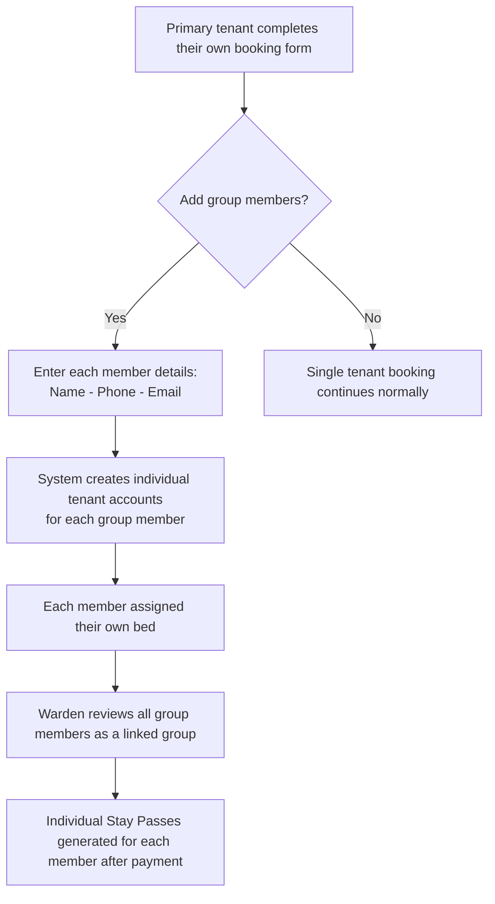
```mermaid
graph TD
    P["Primary tenant completes their own booking form"]
    P --> G{"Add group members?"}
    G -->|Yes| A["Enter each member details:<br/>Name - Phone - Email"]
    A --> B["System creates individual tenant accounts<br/>for each group member"]
    B --> C["Each member assigned their own bed"]
    C --> D["Warden reviews all group members as a linked group"]
    D --> E["Individual Stay Passes generated for each member after payment"]
    G -->|No| S["Single tenant booking continues normally"]
```

## 7.6 Warden Review and Bill Creation

After submission, warden/admin sees:
1. **Details Tab:** All personal information submitted
2. **Documents Tab:** KYC scan and tenant photo with zoom
3. **Bill Creation Tab:** Select rent type, enter amount, apply tax group, apply discount, assign Admission ID
4. **Action:** Click "Verified and Create Bill"

## 7.7 Payment Verification Flow

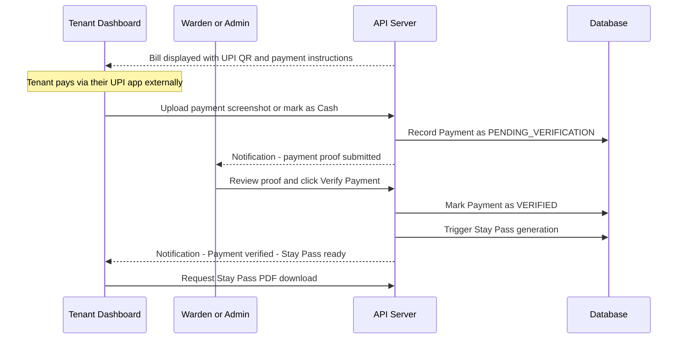
```mermaid
sequenceDiagram
    participant T as Tenant Dashboard
    participant W as Warden or Admin
    participant API as API Server
    participant DB as Database

    API-->>T: Bill displayed with UPI QR and payment instructions
    Note over T: Tenant pays via their UPI app externally
    T->>API: Upload payment screenshot or mark as Cash
    API->>DB: Record Payment as PENDING_VERIFICATION
    API-->>W: Notification - payment proof submitted
    W->>API: Review proof and click Verify Payment
    API->>DB: Mark Payment as VERIFIED
    API->>DB: Trigger Stay Pass generation
    API-->>T: Notification - Payment verified - Stay Pass ready
    T->>API: Request Stay Pass PDF download
```

---

<div style="page-break-after: always;"></div>

# 8. Module 03: Billing Engine

## 8.1 Rent Types

| Type | Description | Normalization Compatible |
|---|---|---|
| **Daily** | Rent calculated per day | No |
| **Weekly** | Rent per 7-day period | No |
| **Monthly** | Rent per 30-day period | Yes |

## 8.2 Bill Normalization

Aligns all monthly-rate tenant billing cycles to the 1st of each calendar month.

**Control:** Main Admin can enable for any hostel. Wardens can enable only for their own hostel.

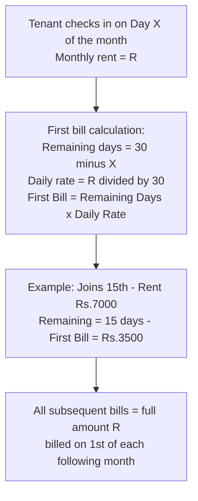
```mermaid
flowchart TD
    START["Tenant checks in on Day X of the month<br/>Monthly rent = R"]
    START --> FIRST["First bill calculation:<br/>Remaining days = 30 minus X<br/>Daily rate = R divided by 30<br/>First Bill = Remaining Days x Daily Rate"]
    FIRST --> EX["Example: Joins 15th - Rent Rs.7000<br/>Remaining = 15 days - First Bill = Rs.3500"]
    EX --> NEXT["All subsequent bills = full amount R<br/>billed on 1st of each following month"]
```

**Normalization applies only to monthly-rate tenants.** Daily and weekly tenants are not subject to normalization.

## 8.3 Discount Application

At any bill creation step, warden or admin can apply:
- Fixed amount (e.g., Rs.500 off)
- Percentage (e.g., 10% off)

Discount reason is required for audit trail. Visible on invoice and receipt.

## 8.4 Tax Groups

Created by Main Admin with: name, tax percentage, applicability (rent/food/both). Applied at bill creation. Invoice shows: Base Amount, Tax Amount, Total Payable.

## 8.5 Late Payment Fees

When enabled by Main Admin:
- Grace period (days after due date before fee applies)
- Fee type: Fixed amount OR percentage of overdue amount
- A cron job runs on the 1st of each month for normalized hostels, appending late fees to overdue bills
- Only available on hostels with normalization enabled (predictable due dates required)

## 8.6 Advance Rent Refunds

When a tenant leaves before their paid period ends:
1. Admin/Warden opens tenant record, clicks "Issue Refund"
2. System shows: days remaining and calculated refund amount
3. Admin/Warden enters actual refund amount (may differ — e.g., deductions)
4. Refund reason required for audit
5. Recorded in tenant payment history and org financial records

## 8.7 Stay Extension

Warden/Admin selects extension type:
- Add X more days (at daily rate)
- Add X more weeks (at weekly rate)
- Switch to monthly

System generates extension bill. Standard payment flow initiates. New Stay Pass generated after payment.

## 8.8 Next Month MRR Report

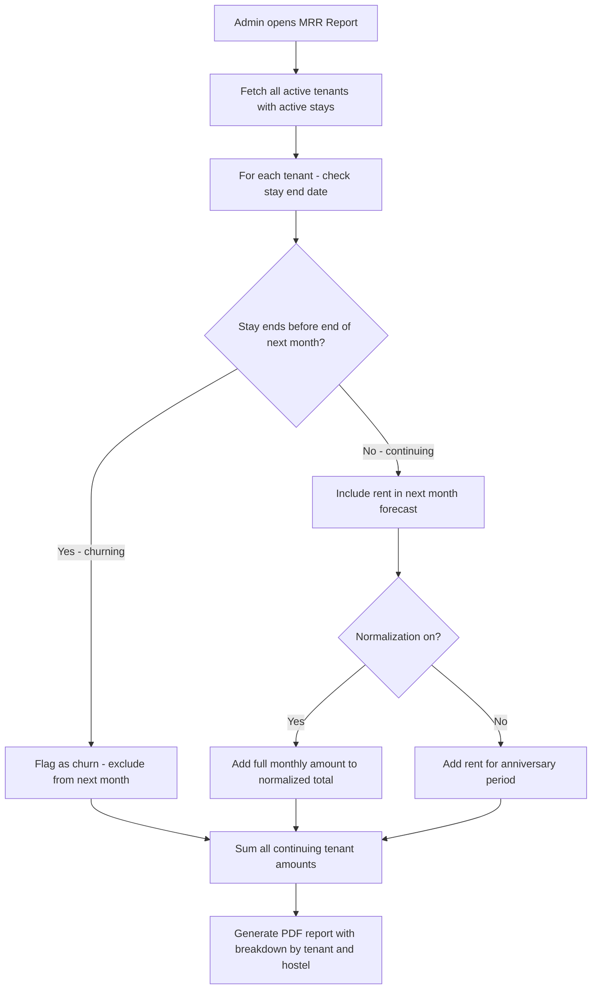
```mermaid
flowchart TD
    A["Admin opens MRR Report"]
    A --> B["Fetch all active tenants with active stays"]
    B --> C["For each tenant - check stay end date"]
    C --> D{"Stay ends before end of next month?"}
    D -->|Yes - churning| E["Flag as churn - exclude from next month"]
    D -->|No - continuing| F["Include rent in next month forecast"]
    F --> G{"Normalization on?"}
    G -->|Yes| H["Add full monthly amount to normalized total"]
    G -->|No| I["Add rent for anniversary period"]
    E --> J["Sum all continuing tenant amounts"]
    H --> J
    I --> J
    J --> K["Generate PDF report with breakdown by tenant and hostel"]
```

---

<div style="page-break-after: always;"></div>

# 9. Module 04: Finance Center

## 9.1 Three Financial Documents

**Invoice (Pre-Payment Bill):**
Generated after onboarding verification. Contains: invoice number (sequential), invoice date, due date, tenant details, room/bed, billing period, base rent, tax, discount, total payable, UPI QR code and UPI ID, payment instructions.

**Tenant Payment Receipt:**
Generated after payment is verified. Contains: receipt number, verification date and time, tenant details, amount paid, payment method (UPI/Cash), billing period covered, "PAID IN FULL" stamp.

Both are downloadable as PDF by the tenant and stored in the Bill Vault.

**Expense Voucher (Petty Cash):**
Warden-initiated cash request for operational expenses. Contains: voucher number, purpose, amount, expense tag, attachment, approval timestamp, approved by (admin name).

Vouchers appear in the org P&L as approved expenses after admin approval.

## 9.2 Bill Vault

Searchable archive of all financial documents. Filters: Document type, Tenant name/Admission ID, Hostel, Date range, Amount range, Status.

S3 storage structure: `{orgId}/hostels/{hostelId}/tenants/{tenantId}/documents/{type}/{year}/{month}/{documentId}.pdf`

---

<div style="page-break-after: always;"></div>

# 10. Module 05: Expense Management

## 10.1 Expense Entities

Named, recurring expense obligations. Created exclusively by Main Admin.

**Entity Definition:** Name, description, applicable hostels (multi-select), authorized wardens (multi-select), expected frequency, approximate expected amount.

**Example:** 5 building rent entities — one per hostel, each scoped to its respective warden. NHP warden can only log "Building Rent — NHP."

## 10.2 Expense Tags

Sub-category labels created by Main Admin. Wardens must select from predefined tags — they cannot create new tags.

**Examples:**
- Entity: Electricity → Tags: "Meter 1 Ground Floor", "Meter 2 First Floor", "Common Area Meter"
- Entity: Water → Tags: "BWSSB Main Supply", "Borewell Maintenance"
- Entity: Others → Tags: "Hardware Purchase", "Plumbing Supplies", "Grocery Run"

If no tag fits: warden selects "Other" and types a description. Expense goes to admin for both financial approval and tag categorization (admin can create a new tag if this type recurs).

## 10.3 Expense Entry and Approval Flow

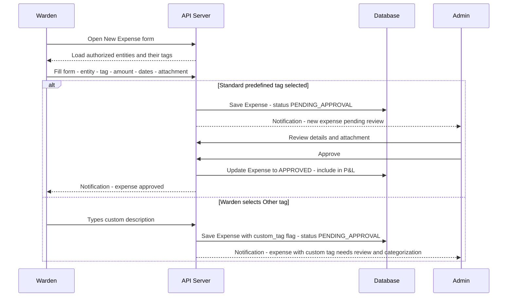
```mermaid
sequenceDiagram
    participant W as Warden
    participant API as API Server
    participant DB as Database
    participant A as Admin

    W->>API: Open New Expense form
    API-->>W: Load authorized entities and their tags
    W->>API: Fill form - entity - tag - amount - dates - attachment
    alt Standard predefined tag selected
        API->>DB: Save Expense - status PENDING_APPROVAL
        API-->>A: Notification - new expense pending review
        A->>API: Review details and attachment
        A->>API: Approve
        API->>DB: Update Expense to APPROVED - include in P&L
        API-->>W: Notification - expense approved
    else Warden selects Other tag
        W->>API: Types custom description
        API->>DB: Save Expense with custom_tag flag - status PENDING_APPROVAL
        API-->>A: Notification - expense with custom tag needs review and categorization
    end
```

## 10.4 Expense Form Fields

| Field | Required | Notes |
|---|---|---|
| Expense Entity | Yes | Filtered by warden's access grants |
| Tag | Yes | Predefined list or "Other" |
| Custom Tag Description | If "Other" | Free text |
| Bill Date | Yes | Date bill was issued by vendor |
| Due Date | No | Payment deadline |
| Amount | Yes | |
| Attachment | Strongly recommended | PDF or phone camera photo |
| Notes | No | Additional context |

---

<div style="page-break-after: always;"></div>

# 11. Module 06: Food Management System

## 11.1 Per-Meal Pricing

Food is priced per individual meal (not per day as a package). Prices set per hostel by Main Admin:
- Breakfast price, Lunch price, Dinner price
- Add-on items: individually priced with name, availability window, and max quantity per tenant

## 11.2 Food Wallet — Prepaid Balance

Tenants maintain a prepaid Food Wallet. Top-up follows the standard payment flow (UPI/Cash + warden verification). When a meal is booked, the meal price is deducted. When balance falls below a configurable threshold, a low-balance notification fires.

**Wallet Transaction Log (per tenant):**
- `+Rs.2000 | Top-up | Verified by Warden Priya`
- `-Rs.80 | Breakfast booked Mon 21st July`
- `+Rs.80 | Breakfast cancelled Mon 21st July`

## 11.3 Booking Rules

| Rule | Value | Configurable |
|---|---|---|
| Minimum booking period | 7 days | No — fixed |
| Maximum booking period | 28 days or remaining stay | No |
| Single-day ordering allowed | Yes — within cutoff window | No |
| Default cutoff time | 10:00 PM previous night | Yes — admin per hostel |

## 11.4 Cancellation Logic

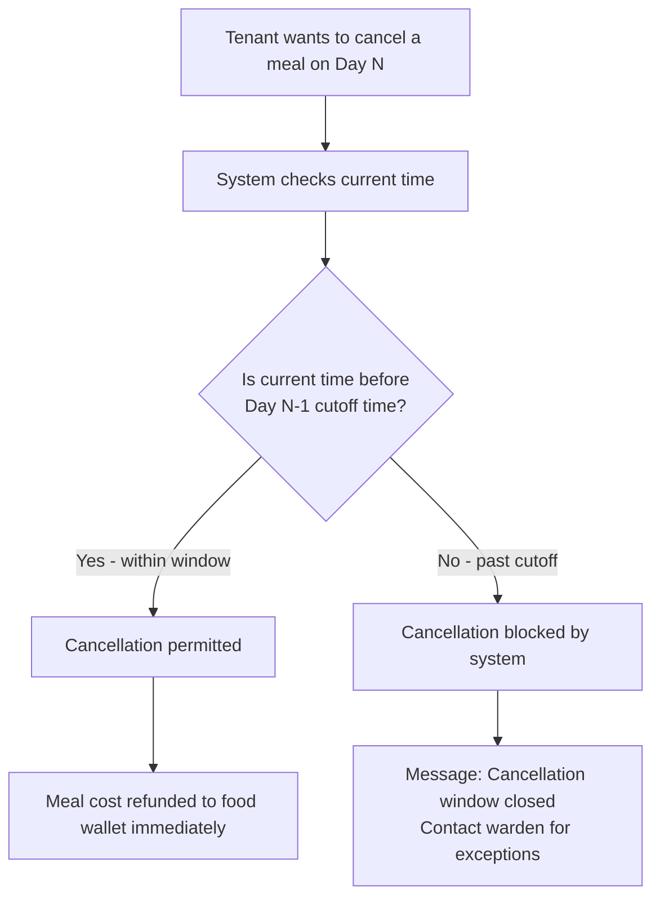
```mermaid
flowchart TD
    A["Tenant wants to cancel a meal on Day N"]
    A --> B["System checks current time"]
    B --> C{"Is current time before<br/>Day N-1 cutoff time?"}
    C -->|Yes - within window| D["Cancellation permitted"]
    D --> E["Meal cost refunded to food wallet immediately"]
    C -->|No - past cutoff| F["Cancellation blocked by system"]
    F --> G["Message: Cancellation window closed<br/>Contact warden for exceptions"]
```

The same cutoff window applies for both cancellations and single-day additions.

## 11.5 Admin Weekly Menu Management

Main Admin sets the meal menu for each day of the week: Breakfast item, Lunch item, Dinner item. Weekly menu repeats unless manually updated. Individual days can be overridden without changing the weekly template.

## 11.6 Tenant Food Calendar View

- Week/Month toggle
- Each day card: B / L / D indicators (orange = booked, gray = not booked)
- Tapping any day: bottom sheet showing menu items, prices, booking/cancellation actions (disabled if past cutoff)
- Food wallet balance displayed prominently at top

## 11.7 Food Procurement Report

Daily report (generated for tomorrow):
```
[Hostel Name] - Food Procurement Report | Date: [Tomorrow]

BREAKFAST:    44 portions
LUNCH:        40 portions  (4 cancellations received)
DINNER:       44 portions

ADD-ONS:
  Protein Shake:  7 units
  Evening Snack:  12 units

ALERTS: 3 tenants wallet balance below Rs.300
```

Weekly report: Aggregated 7-day view.
Access: Warden (own hostel), Main Admin (all hostels).

---

<div style="page-break-after: always;"></div>

# 12. Module 07: Smart Bed Operations

## 12.1 Bed Status Model

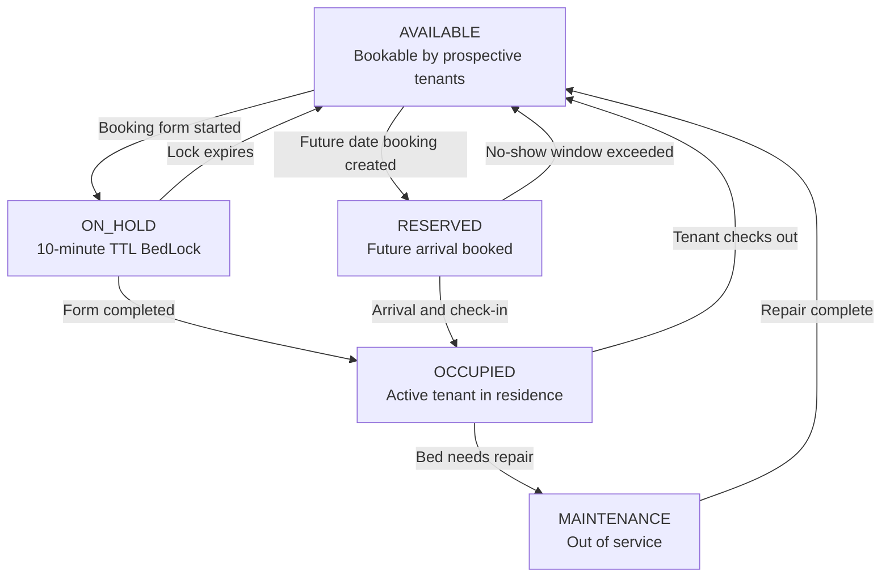
```mermaid
graph TD
    AV["AVAILABLE<br/>Bookable by prospective tenants"]
    AV -->|Booking form started| OH["ON_HOLD<br/>10-minute TTL BedLock"]
    OH -->|Form completed| OC["OCCUPIED<br/>Active tenant in residence"]
    OH -->|Lock expires| AV
    AV -->|Future date booking created| RE["RESERVED<br/>Future arrival booked"]
    RE -->|Arrival and check-in| OC
    RE -->|No-show window exceeded| AV
    OC -->|Tenant checks out| AV
    OC -->|Bed needs repair| MA["MAINTENANCE<br/>Out of service"]
    MA -->|Repair complete| AV
```

## 12.2 Room QR Code Generation

Admin generates per room from Room Management panel. QR encodes a signed URL with a JWT scoped to that room. Token is permanent (room identity does not change). Downloads as high-resolution PNG for printing.

## 12.3 Bed Transfer

Move one tenant from their current bed to a different bed within the same hostel.

1. Warden selects tenant, clicks "Transfer Bed"
2. Selects destination bed (from AVAILABLE beds)
3. Selects effective transfer date and enters reason
4. System: source bed marked AVAILABLE, destination marked OCCUPIED, BedHistory updated for both with exact date ranges, new Stay Pass generated with updated bed details

**Audit Guarantee:** BedHistory records every occupancy period per bed permanently.

## 12.4 Bed Swap

Two existing tenants exchange beds atomically:

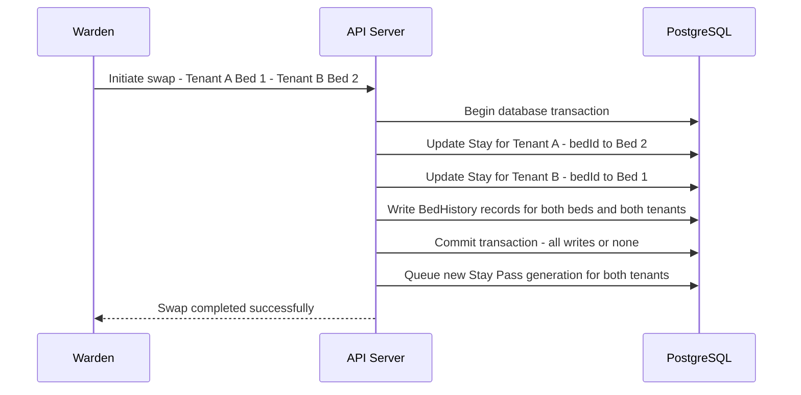
```mermaid
sequenceDiagram
    participant W as Warden
    participant API as API Server
    participant DB as PostgreSQL

    W->>API: Initiate swap - Tenant A Bed 1 - Tenant B Bed 2
    API->>DB: Begin database transaction
    API->>DB: Update Stay for Tenant A - bedId to Bed 2
    API->>DB: Update Stay for Tenant B - bedId to Bed 1
    API->>DB: Write BedHistory records for both beds and both tenants
    API->>DB: Commit transaction - all writes or none
    API->>DB: Queue new Stay Pass generation for both tenants
    API-->>W: Swap completed successfully
```

## 12.5 Bed Reservation (Future Date)

Admin/Warden creates a reservation: select bed, enter prospective tenant details, arrival date, expected stay duration. Bed status set to RESERVED. No-show release: configurable window (default 3 days after arrival date) after which bed auto-returns to AVAILABLE.

## 12.6 Waiting List

When a prospective tenant's QR scan shows all beds occupied:
- System shows "No beds available — Join Waiting List"
- Tenant enters Name, Phone, Email
- Record added to WaitingList (FIFO)
- When any bed becomes AVAILABLE: first person on list is notified, has a configurable response window before next person is notified

---

<div style="page-break-after: always;"></div>

# 13. Module 08: Stay Pass System

## 13.1 Stay Pass PDF Content

| Element | Details |
|---|---|
| Platform Logo | Top header with organization logo |
| Hostel Name and Address | Full address |
| Tenant Full Name | As submitted at onboarding |
| Tenant Photo | From onboarding upload |
| Admission ID | Auto-generated sequential unique ID |
| Room and Bed Number | e.g., Block G - Floor 1 - Room 01 - Bed A |
| Stay Period | Valid From date and Valid To date |
| KYC Verified | Document type shown (Aadhaar / PAN / License) — number NOT printed |
| Issue Date | |
| Issued By | Warden or Admin name |
| Verification QR Code | Links to real-time pass validity check page |
| Pass Status | VALID stamp (green) |

## 13.2 Stay Pass Lifecycle

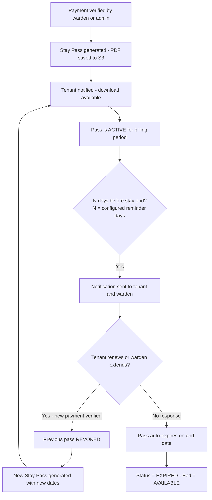
```mermaid
flowchart TD
    A["Payment verified by warden or admin"]
    A --> B["Stay Pass generated - PDF saved to S3"]
    B --> C["Tenant notified - download available"]
    C --> D["Pass is ACTIVE for billing period"]
    D --> E{"N days before stay end?<br/>N = configured reminder days"}
    E -->|Yes| F["Notification sent to tenant and warden"]
    F --> G{"Tenant renews or warden extends?"}
    G -->|Yes - new payment verified| H["Previous pass REVOKED"]
    H --> I["New Stay Pass generated with new dates"]
    I --> C
    G -->|No response| J["Pass auto-expires on end date"]
    J --> K["Status = EXPIRED - Bed = AVAILABLE"]
```

## 13.3 Pass Validity Check

QR on the pass links to a public verification URL showing: Tenant name, Hostel, Bed number, VALID (green) or EXPIRED (red), Valid until date. Scannable by any phone camera — no app required.

---

<div style="page-break-after: always;"></div>

# 14. Module 09: Lease Renewal Workflow

## 14.1 Renewal Flow

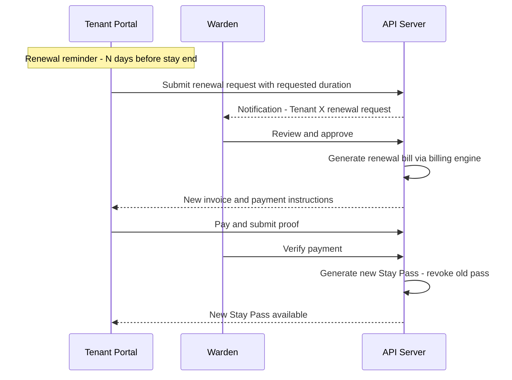
```mermaid
sequenceDiagram
    participant T as Tenant Portal
    participant W as Warden
    participant API as API Server

    Note over T: Renewal reminder - N days before stay end
    T->>API: Submit renewal request with requested duration
    API-->>W: Notification - Tenant X renewal request
    W->>API: Review and approve
    API->>API: Generate renewal bill via billing engine
    API-->>T: New invoice and payment instructions
    T->>API: Pay and submit proof
    W->>API: Verify payment
    API->>API: Generate new Stay Pass - revoke old pass
    API-->>T: New Stay Pass available
```

## 14.2 Overstay Detection

If a tenant's stay end date passes without renewal or extension:
- Warden receives immediate notification: "Tenant X stay expired today — no renewal received"
- Tenant portal shows "Stay Expired" banner
- Stay Pass status automatically changes to EXPIRED
- Bed marked AVAILABLE in the system
- Configurable grace period (default 3 days) allows manual extension without full re-onboarding

---

<div style="page-break-after: always;"></div>

# 15. Module 10: Service Requests

## 15.1 Categories

| Category | Who Creates | Routing | Notes |
|---|---|---|---|
| Maintenance Request | Tenant | Assigned to hostel warden | AC broken, tap leaking, etc. |
| Complaint | Tenant | Assigned to hostel warden | Service quality, food, noise, etc. |
| Incident Report | Warden | Escalated to Admin | Safety, property damage, major events |

## 15.2 Service Request Lifecycle

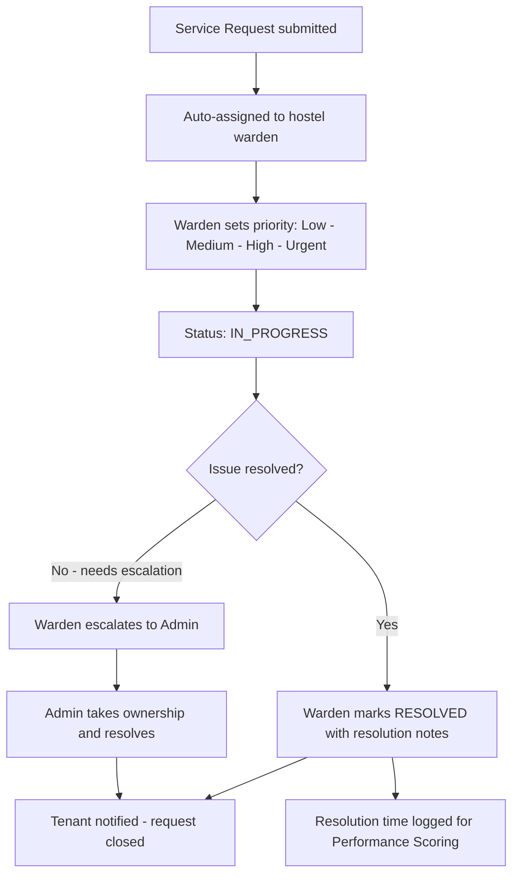
```mermaid
flowchart TD
    A["Service Request submitted"]
    A --> B["Auto-assigned to hostel warden"]
    B --> C["Warden sets priority: Low - Medium - High - Urgent"]
    C --> D["Status: IN_PROGRESS"]
    D --> E{"Issue resolved?"}
    E -->|Yes| F["Warden marks RESOLVED with resolution notes"]
    F --> G["Tenant notified - request closed"]
    F --> H["Resolution time logged for Performance Scoring"]
    E -->|No - needs escalation| I["Warden escalates to Admin"]
    I --> J["Admin takes ownership and resolves"]
    J --> G
```

## 15.3 Fields

Category, Title (max 100 chars), Description, Photo Attachment (optional), Priority (set by warden/admin), Status (OPEN / IN_PROGRESS / ESCALATED / RESOLVED / CLOSED), Resolution Notes, Resolution Time (auto-calculated).

SLA: Unresolved requests older than 7 days trigger automatic escalation notification to Admin.

---

<div style="page-break-after: always;"></div>

# 16. Module 11: Visitor & Guest Log

## 16.1 Log Entry Fields

| Field | Required | Notes |
|---|---|---|
| Visitor Full Name | Yes | |
| Visitor Phone Number | Yes | |
| Tenant Being Visited | Yes | Dropdown from active tenants |
| Relationship | No | Family / Friend / Professional / Other |
| Purpose of Visit | No | |
| ID Proof Type | Recommended | Aadhaar / License / Passport |
| Entry Time | Yes | Auto-filled from system clock |
| Expected Exit Time | No | |
| Actual Exit Time | Yes | Filled when visitor leaves |

## 16.2 Access and Compliance

- **Warden:** Create entries and view all logs for their hostel
- **Main Admin:** View all logs across all hostels
- **Filters:** Date range, tenant visited, hostel
- **Export:** PDF export in compliance-ready format
- **Retention:** 12 months active, then archived (not deleted)

---

<div style="page-break-after: always;"></div>

# 17. Module 12: Employee & Attendance Management

## 17.1 Employee Onboarding

Added by Main Admin or hostel Warden. Fields: Full Name, Phone (login ID), Email (optional), Designation, Assigned Hostel, Work Start Time, Work End Time, Date Joined.

## 17.2 Geolocation Attendance Flow

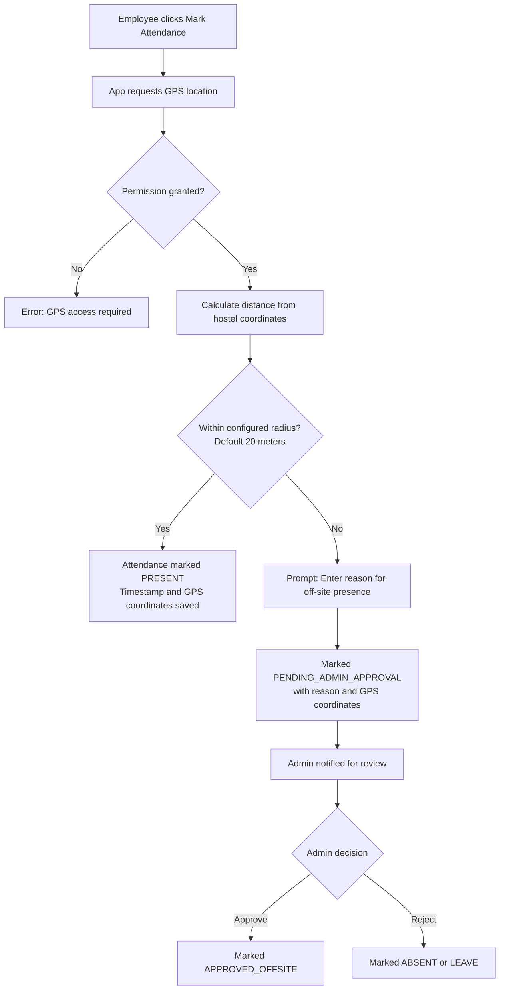
```mermaid
flowchart TD
    E["Employee clicks Mark Attendance"]
    E --> G["App requests GPS location"]
    G --> H{"Permission granted?"}
    H -->|No| ERR["Error: GPS access required"]
    H -->|Yes| DIST["Calculate distance from hostel coordinates"]
    DIST --> CHECK{"Within configured radius?<br/>Default 20 meters"}
    CHECK -->|Yes| MARK["Attendance marked PRESENT<br/>Timestamp and GPS coordinates saved"]
    CHECK -->|No| REASON["Prompt: Enter reason for off-site presence"]
    REASON --> PEND["Marked PENDING_ADMIN_APPROVAL<br/>with reason and GPS coordinates"]
    PEND --> NOTIF["Admin notified for review"]
    NOTIF --> DEC{"Admin decision"}
    DEC -->|Approve| AP["Marked APPROVED_OFFSITE"]
    DEC -->|Reject| REJ["Marked ABSENT or LEAVE"]
```

## 17.3 Employee Portal Scope

| Feature | Access |
|---|---|
| Mark attendance | Yes |
| Mark checkout | Yes |
| View own attendance history (calendar) | Yes |
| View own working hours log | Yes |
| Submit leave request | Yes |
| View own leave request status | Yes |
| View assigned tasks | Yes |
| Update task status (In Progress / Completed) | Yes |
| Upload task completion photo | Yes |
| Access any financial or tenant data | No |

## 17.4 Leave Management

Employees submit leave requests with: date(s), leave type (Casual / Sick / Emergency / Other), reason, optional supporting document.

**Only the Main Admin can approve or reject leave requests. Wardens have no access to this module.**

After admin decision: Approved = day marked as LEAVE on attendance calendar. Rejected = admin adds rejection reason.

## 17.5 Task Assignment

Admin or hostel Warden assigns tasks to employees: employee selection, title, description, category (Housekeeping/Maintenance/Delivery/Other), due date, priority, optional linked room. Employees see and update tasks in their portal.

## 17.6 Attendance Reports (Admin Only)

Monthly attendance summary per employee (Present/Absent/Leave/Half-Day/Pending counts), working hours per employee, hostel-level attendance overview.

---

<div style="page-break-after: always;"></div>

# 18. Module 13: Performance Scoring Engine

## 18.1 Scoring Architecture

Each hostel receives a Performance Score (0 to 100) computed from five weighted components:

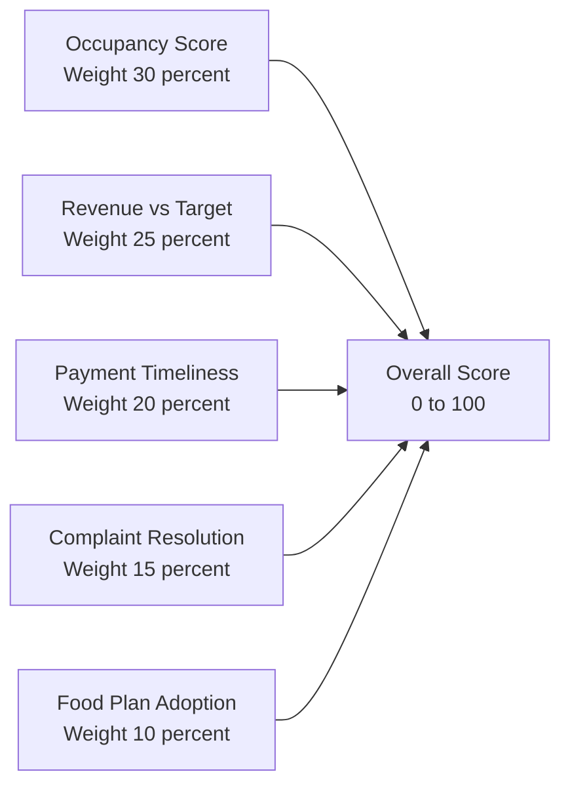
```mermaid
graph LR
    OCC["Occupancy Score<br/>Weight 30 percent"]
    REV["Revenue vs Target<br/>Weight 25 percent"]
    PAY["Payment Timeliness<br/>Weight 20 percent"]
    COMP["Complaint Resolution<br/>Weight 15 percent"]
    FOOD["Food Plan Adoption<br/>Weight 10 percent"]
    TOTAL["Overall Score<br/>0 to 100"]

    OCC --> TOTAL
    REV --> TOTAL
    PAY --> TOTAL
    COMP --> TOTAL
    FOOD --> TOTAL
```

## 18.2 Component Calculations

| Component | Formula |
|---|---|
| Occupancy Score | (Occupied Beds / Total Beds) x 100 |
| Revenue vs Target | (Actual Verified Revenue / Target Revenue at full occupancy) x 100, capped at 100 |
| Payment Timeliness | (Payments made within grace period / Total payments due) x 100 |
| Complaint Resolution | (Issues resolved within 48 hours / Total issues) x 100. Unresolved issues older than 7 days = 0 for this component |
| Food Plan Adoption | (Tenants with at least one meal booked this month / Total active tenants) x 100 |

## 18.3 Transparent Score Display

```
NextHome Paradise              Performance Score: 74/100  [Amber]

Occupancy          82/100  [Good]       22 of 27 beds occupied
Revenue vs Target  78/100  [Good]       Rs.154,000 of Rs.189,000 target
Payment Timeliness 65/100  [Average]    4 tenants paid outside grace period
Issue Resolution   55/100  [Low]        Avg resolution: 3.2 days
Food Adoption      88/100  [Excellent]  19 of 22 tenants on food plan

Monthly Trend: Score decreased 6 points from last month
Main drag: Issue Resolution time increased from 1.8 to 3.2 days
Suggestion: 2 service requests are 5+ days old and unresolved
```

## 18.4 Score Color Bands

| Range | Color | Meaning |
|---|---|---|
| 80 to 100 | Green | Excellent |
| 60 to 79 | Amber | Needs attention in specific areas |
| Below 60 | Red | Critical — immediate focus required |

---

<div style="page-break-after: always;"></div>

# 19. Module 14: Comparisons & Reporting

## 19.1 View Modes

**Consolidated View:** Aggregates all hostels into one organization-level view.

**Compare Mode:** Admin selects 2 or more hostels for side-by-side comparison.

**Available Metrics:** Monthly Revenue, Net Profit, Occupancy Rate, Payment Timeliness, Food Adoption, Overall Performance Score, Complaint Volume, Average Resolution Time.

**Date Range:** Last 7 days / Last 30 days / Last 3 months / Custom range.

## 19.2 Report Output

Downloadable as **PDF only** (V1). Report contains:
- Organization name, logo, generation timestamp
- Date range and hostels compared
- Side-by-side values and percentage differences for each metric
- Trend charts per metric
- Narrative summary: "NHP generated 23% more revenue than NHC in June 2026. However, NHC has a 12% higher food plan adoption rate."

**Access:** Main Admin only. Wardens cannot access this module.

---

<div style="page-break-after: always;"></div>

# 20. Module 15: Announcements

## 20.1 Creation

**Main Admin:** Can broadcast to all hostels or select specific hostels.
**Warden:** Can broadcast to tenants of their own hostel only.

**Fields:** Title, Body/Message, Type (General / Food / Maintenance / Urgent), Target hostel(s), Expiry date.

## 20.2 Delivery Channels (V1 — In-App Only)

- Banner at top of tenant portal (for active/unexpired announcements)
- In-app notification entry
- Dedicated "Announcements" section with full history

## 20.3 Examples

- `[General]` "Water supply off Sunday 20th July 8 AM to 12 PM — tank maintenance"
- `[Food]` "No dinner service this Saturday — kitchen deep cleaning"
- `[Maintenance]` "Elevator under maintenance — use staircase"
- `[Urgent]` "Emergency: All tenants please evacuate the first floor immediately"

---

<div style="page-break-after: always;"></div>

# 21. Module 16: Inventory & Asset Management

## 21.1 Asset Record Fields

| Field | Notes |
|---|---|
| Asset Name | e.g., "Daikin 1.5 Ton AC — Room G01" |
| Category | Furniture / Appliance / Electronics / Linen / Kitchen / Other |
| Hostel | Which hostel |
| Location | Floor, room, or common area |
| Purchase Date | |
| Purchase Cost | |
| Current Condition | Good / Fair / Poor / Out of Service |
| Serial Number or Asset Tag | Optional |
| Photo | Optional |
| Notes | |

When an asset undergoes repair, the associated expense entry can be linked to it for lifecycle cost tracking.

**Access:** Main Admin (all hostels), Warden (own hostel only).

---

<div style="page-break-after: always;"></div>

# 22. Module 17: Housekeeping Management

## 22.1 Schedule Creation

Warden or Admin creates housekeeping schedules: select room(s) or area, select frequency (Daily/Weekly/On-demand), assign to a specific employee, set preferred time window.

## 22.2 Photo Verification Protocol

Employee opens assigned task, clicks "Start Task" and uploads **Before photo** (via phone camera). Completes cleaning. Clicks "Complete Task" and uploads **After photo**. Both stored in S3, linked to the task record. Warden views before/after comparison for verification.

## 22.3 Reports

Weekly completion report: rooms cleaned, by whom, at what time, and any overdue or skipped tasks. Accessible by Warden (own hostel) and Main Admin (all hostels).

---

<div style="page-break-after: always;"></div>

# 23. Module 18: Settings & Configuration

## 23.1 Organization Settings (Main Admin Only)

| Setting | Description |
|---|---|
| Organization Name and Logo | Displayed on all documents |
| UPI ID | Organization-wide UPI ID for all tenant payments |
| UPI QR Image | Upload existing or auto-generate from UPI ID |
| Default Currency | INR (default) or AED |
| Additional Currencies | Enable AED or others for display switch |
| Tax Groups | Create, edit, manage |
| Late Fee Policy | Enable/disable, grace period, fee type |
| Stay Expiry Notification Days | Days before expiry to send renewal reminders |
| No-Show Release Window | Days before auto-releasing an unchecked reservation |

## 23.2 Hostel Settings

| Setting | Set By | Description |
|---|---|---|
| Bill Normalization Toggle | Admin (any hostel) or Warden (own hostel) | Align billing to 1st of month |
| Food Cutoff Time | Admin | Next-day order/cancel deadline |
| Food Pricing | Admin | Breakfast, lunch, dinner prices |
| Geofence Radius | Admin | Employee attendance proximity (default 20m) |
| Low Wallet Alert Threshold | Admin | Minimum food wallet balance before alert |
| Hostel Coordinates | Admin | Latitude/longitude for geofence |

## 23.3 Currency Display

Currency is **display-only in V1** (no actual multi-currency transactions). Admin sets default display currency. Exchange rate is entered manually by admin and updated manually when needed. All financial figures respect the active currency selection.

---

<div style="page-break-after: always;"></div>

# 24. Module 19: Social Authentication

## 24.1 Overview

Social login is available **exclusively on the Tenant Portal**. Admin and Warden logins remain email/password only for security.

## 24.2 Supported Providers (V1)

| Provider | Implementation |
|---|---|
| Google | Supabase Auth Google OAuth 2.0 |
| Facebook | Supabase Auth Facebook OAuth |

## 24.3 Logic

**Returning tenant — account exists:** Social OAuth flow completes, Supabase matches email to existing account, session created.

**New user — no account:** OAuth completes, no matching account found, tenant redirected to QR booking entry point with name and email pre-filled. Cannot self-register outside the booking flow.

**Password recovery:** V1 has no email-based reset (no email service configured). Tenants contact warden directly. Warden or Admin resets via admin panel.

---

<div style="page-break-after: always;"></div>

# 25. Module 20: DPDP Compliance & Privacy

## 25.1 Consent Collection

At the onboarding form, before any personal data fields appear, a clear consent section is shown listing exactly what data is collected and why. Tenant checks a mandatory checkbox. Submission is blocked if unchecked.

Consent record stored: `{ tenantId, consentedAt, consentVersion, ipAddress }`.

## 25.2 Data Deletion Workflow

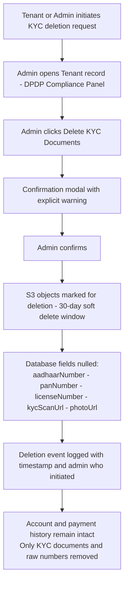
```mermaid
flowchart TD
    A["Tenant or Admin initiates KYC deletion request"]
    A --> B["Admin opens Tenant record - DPDP Compliance Panel"]
    B --> C["Admin clicks Delete KYC Documents"]
    C --> D["Confirmation modal with explicit warning"]
    D --> E["Admin confirms"]
    E --> F["S3 objects marked for deletion - 30-day soft delete window"]
    F --> G["Database fields nulled:<br/>aadhaarNumber - panNumber - licenseNumber - kycScanUrl - photoUrl"]
    G --> H["Deletion event logged with timestamp and admin who initiated"]
    H --> I["Account and payment history remain intact<br/>Only KYC documents and raw numbers removed"]
```

## 25.3 Data Retention Policy

| Data Type | Retention Period | Justification |
|---|---|---|
| KYC Documents (S3 files) | Stay duration + 30 days | Deleted on DPDP request after stay |
| KYC Document Numbers | Stay duration + 30 days | Nulled on DPDP deletion |
| Payment Records | 7 years | Income Tax Act - financial audit |
| Activity Logs | 3 years | Internal audit and compliance |
| Visitor Logs | 12 months | Security and law enforcement |
| Service Requests | 2 years | Operational record keeping |
| Attendance Records | 3 years | Labour law compliance |
| Food Transaction History | 2 years | Financial audit trail |

---

<div style="page-break-after: always;"></div>

# 26. Data Architecture

## 26.1 Domain: Users and Authentication

```mermaid
erDiagram
    Organization {
        string id PK
        string name
        string logoUrl
        string upiId
        string upiQrUrl
        string defaultCurrency
        string apiKey
        datetime createdAt
    }

    User {
        string id PK
        string organizationId FK
        string supabaseAuthId
        string email
        string phone
        string name
        string role
        datetime passwordSetAt
        datetime createdAt
    }

    TenantProfile {
        string id PK
        string userId FK
        string hostelId FK
        string admissionId
        string photoUrl
        string aadhaarNumber
        string panNumber
        string licenseNumber
        string kycDocumentType
        string kycDocumentScanUrl
        string emergencyContactName
        string emergencyContactPhone
        boolean dpdpConsentGiven
        datetime dpdpConsentAt
        datetime kycDeletedAt
        datetime createdAt
    }

    EmployeeProfile {
        string id PK
        string userId FK
        string hostelId FK
        string designation
        string workStartTime
        string workEndTime
        datetime joinedAt
    }

    Organization ||--o{ User : has
    User ||--o| TenantProfile : has
    User ||--o| EmployeeProfile : has
```

## 26.2 Domain: Hostel and Bed Hierarchy

```mermaid
erDiagram
    Hostel {
        string id PK
        string organizationId FK
        string name
        string address
        float latitude
        float longitude
        int geofenceRadius
        boolean billNormalizationEnabled
        int foodCutoffHour
        int foodCutoffMinute
        int stayExpiryNotificationDays
        int noShowReleaseDays
    }

    Floor {
        string id PK
        string hostelId FK
        string name
        int floorNumber
    }

    Room {
        string id PK
        string floorId FK
        string hostelId FK
        string name
        string qrCode
        string qrImageUrl
    }

    Bed {
        string id PK
        string roomId FK
        string hostelId FK
        string bedIdentifier
        string status
        decimal dailyRate
        decimal weeklyRate
        decimal monthlyRate
    }

    BedLock {
        string id PK
        string bedId FK
        string sessionId
        datetime expiresAt
    }

    BedHistory {
        string id PK
        string bedId FK
        string tenantProfileId FK
        datetime occupiedFrom
        datetime occupiedTo
        string notes
    }

    WaitingList {
        string id PK
        string hostelId FK
        string name
        string phone
        string email
        string status
        datetime notifiedAt
        datetime createdAt
    }

    Hostel ||--o{ Floor : has
    Floor ||--o{ Room : has
    Room ||--o{ Bed : has
    Bed ||--o| BedLock : has
    Bed ||--o{ BedHistory : tracks
    Hostel ||--o{ WaitingList : has
```

## 26.3 Domain: Stay and Billing

```mermaid
erDiagram
    Stay {
        string id PK
        string tenantProfileId FK
        string bedId FK
        string hostelId FK
        string rentType
        decimal rentAmount
        datetime startDate
        datetime endDate
        string status
    }

    Bill {
        string id PK
        string stayId FK
        string tenantProfileId FK
        string hostelId FK
        string taxGroupId FK
        string invoiceNumber
        decimal baseAmount
        decimal taxAmount
        decimal discountAmount
        decimal totalAmount
        string billType
        date billingPeriodFrom
        date billingPeriodTo
        date dueDate
        string status
        string discountReason
    }

    Payment {
        string id PK
        string billId FK
        string tenantProfileId FK
        decimal amount
        string method
        string status
        string proofUrl
        datetime paidAt
        string verifiedBy FK
        datetime verifiedAt
    }

    TaxGroup {
        string id PK
        string organizationId FK
        string name
        decimal percentage
        boolean appliesToRent
        boolean appliesToFood
    }

    Refund {
        string id PK
        string stayId FK
        string tenantProfileId FK
        decimal calculatedAmount
        decimal actualAmount
        string reason
        string issuedBy FK
        datetime issuedAt
    }

    StayPass {
        string id PK
        string stayId FK
        string tenantProfileId FK
        string billId FK
        string pdfUrl
        date validFrom
        date validTo
        string status
        string verificationToken
    }

    Stay ||--o{ Bill : generates
    Bill ||--o{ Payment : tracks
    Bill ||--|| TaxGroup : applies
    Stay ||--o{ Refund : can_have
    Bill ||--o| StayPass : generates
```

## 26.4 Domain: Food Management

```mermaid
erDiagram
    FoodSettings {
        string id PK
        string hostelId FK
        decimal breakfastPrice
        decimal lunchPrice
        decimal dinnerPrice
        int cutoffHour
        int cutoffMinute
        int minBookingDays
        int maxBookingDays
        decimal lowWalletThreshold
    }

    FoodMenu {
        string id PK
        string hostelId FK
        string dayOfWeek
        string breakfastItem
        string lunchItem
        string dinnerItem
        date overrideDate
    }

    FoodAddOn {
        string id PK
        string hostelId FK
        string name
        string description
        decimal price
        string availableFrom
        string availableTo
        boolean isActive
    }

    FoodWallet {
        string id PK
        string tenantProfileId FK
        string hostelId FK
        decimal balance
        datetime updatedAt
    }

    FoodWalletTransaction {
        string id PK
        string foodWalletId FK
        string type
        decimal amount
        string description
        string referenceId
        datetime createdAt
    }

    FoodBooking {
        string id PK
        string tenantProfileId FK
        string hostelId FK
        date bookingDate
        boolean breakfastBooked
        boolean lunchBooked
        boolean dinnerBooked
        string status
        decimal totalCost
    }

    FoodAddOnBooking {
        string id PK
        string tenantProfileId FK
        string foodAddOnId FK
        date bookingDate
        int quantity
        decimal cost
        string status
    }

    FoodWallet ||--o{ FoodWalletTransaction : logs
    FoodWallet ||--o{ FoodBooking : funds
    FoodBooking ||--o{ FoodAddOnBooking : includes
    FoodAddOn ||--o{ FoodAddOnBooking : booked_via
```

## 26.5 Domain: Expense Management

```mermaid
erDiagram
    ExpenseEntity {
        string id PK
        string organizationId FK
        string name
        string description
        string frequency
        decimal expectedAmount
    }

    ExpenseEntityHostelScope {
        string id PK
        string expenseEntityId FK
        string hostelId FK
    }

    ExpenseEntityAccessGrant {
        string id PK
        string expenseEntityId FK
        string userId FK
    }

    ExpenseTag {
        string id PK
        string organizationId FK
        string expenseEntityId FK
        string name
    }

    Expense {
        string id PK
        string hostelId FK
        string expenseEntityId FK
        string expenseTagId FK
        string submittedBy FK
        string approvedBy FK
        decimal amount
        date billDate
        date dueDate
        string customTagDescription
        string attachmentUrl
        string notes
        string status
        datetime submittedAt
        datetime approvedAt
    }

    ExpenseVoucher {
        string id PK
        string hostelId FK
        string requestedBy FK
        string approvedBy FK
        string expenseTagId FK
        decimal amount
        string purpose
        string attachmentUrl
        string status
        datetime requestedAt
        datetime approvedAt
    }

    ExpenseEntity ||--o{ ExpenseEntityHostelScope : scoped_to
    ExpenseEntity ||--o{ ExpenseEntityAccessGrant : grants_access
    ExpenseEntity ||--o{ ExpenseTag : categorized_by
    ExpenseTag ||--o{ Expense : labels
    ExpenseEntity ||--o{ Expense : contains
```

## 26.6 Domain: Employee and Attendance

```mermaid
erDiagram
    AttendanceRecord {
        string id PK
        string employeeProfileId FK
        string hostelId FK
        date date
        datetime checkinTime
        float checkinLat
        float checkinLng
        datetime checkoutTime
        float checkoutLat
        float checkoutLng
        string status
        string offsiteReason
        string approvedBy FK
        decimal hoursWorked
    }

    LeaveRequest {
        string id PK
        string employeeProfileId FK
        date leaveDate
        date leaveDateEnd
        string leaveType
        string reason
        string supportingDocUrl
        string status
        string decidedBy FK
        string rejectionReason
        datetime decidedAt
        datetime requestedAt
    }

    EmployeeTask {
        string id PK
        string employeeProfileId FK
        string hostelId FK
        string assignedBy FK
        string title
        string description
        string category
        string linkedRoomId FK
        datetime dueAt
        string priority
        string status
        string completionNote
        string completionPhotoUrl
        datetime completedAt
    }

    EmployeeProfile ||--o{ AttendanceRecord : has
    EmployeeProfile ||--o{ LeaveRequest : submits
    EmployeeProfile ||--o{ EmployeeTask : receives
```

## 26.7 Domain: Service Requests, Visitors, and Notifications

```mermaid
erDiagram
    ServiceRequest {
        string id PK
        string hostelId FK
        string submittedBy FK
        string assignedTo FK
        string category
        string title
        string description
        string photoUrl
        string priority
        string status
        string resolutionNotes
        datetime resolvedAt
        datetime createdAt
    }

    VisitorLog {
        string id PK
        string hostelId FK
        string loggedBy FK
        string tenantProfileId FK
        string visitorName
        string visitorPhone
        string relationship
        string purpose
        string idProofType
        datetime entryTime
        datetime expectedExitTime
        datetime actualExitTime
    }

    Notification {
        string id PK
        string userId FK
        string organizationId FK
        string type
        string title
        string body
        string linkUrl
        boolean isRead
        datetime readAt
        datetime createdAt
    }

    Announcement {
        string id PK
        string organizationId FK
        string hostelId FK
        string createdBy FK
        string title
        string body
        string type
        date expiryDate
        datetime createdAt
    }
```

---

<div style="page-break-after: always;"></div>

# 27. Infrastructure & AWS Architecture

## 27.1 V1 Infrastructure — Additions Over MVP

| Component | MVP | V1 Change |
|---|---|---|
| EC2 t3.micro | App server | Same — new features are additional API routes, not new services |
| RDS PostgreSQL t3.micro | Primary database | Schema significantly expanded — no tier change |
| S3 | KYC documents | Expanded: PDFs, housekeeping photos, expense attachments, QR images, reports |
| CloudFront | Static assets | Same |
| Supabase Auth | Email/password | Extended with Google OAuth and Facebook OAuth |
| Google Maps API | Not used | Added for employee geolocation attendance |

## 27.2 Background Jobs (Cron) — V1

All cron jobs run inside the Next.js process using node-cron. No separate infrastructure required.

| Job | Schedule | Purpose |
|---|---|---|
| Bed Lock Cleanup | Every 5 minutes | Release expired BedLock records |
| Stay Expiry Checker | Daily at 8:00 AM | Identify expiring stays — fire notifications |
| No-Show Reservation Release | Daily at 9:00 AM | Auto-release reservations past no-show window |
| Food Cutoff Reminder | Daily at 9:00 PM | Notify tenants with unbooked meals for tomorrow |
| Food Wallet Low Balance Check | Daily at 8:00 AM | Notify tenants below wallet threshold |
| Late Fee Calculator | 1st of month at 6:00 AM | Append late fees for normalized billing |
| Stay Pass Expiry Processor | Daily at midnight | Update expired pass statuses |

## 27.3 S3 Bucket Structure

```
hostel-platform-prod/
├── organizations/{orgId}/
│   ├── logo.png
│   └── upi-qr.png
└── hostels/{hostelId}/
    ├── rooms/{roomId}/qr.png
    ├── tenants/{tenantId}/
    │   ├── photo.jpg
    │   ├── kyc-document.jpg
    │   └── documents/
    │       ├── stay-pass-{passId}.pdf
    │       ├── invoice-{billId}.pdf
    │       └── receipt-{paymentId}.pdf
    ├── expenses/{expenseId}/attachment.pdf
    ├── housekeeping/{taskId}/
    │   ├── before.jpg
    │   └── after.jpg
    └── reports/{reportId}.pdf
```

## 27.4 Scaling Thresholds

| Trigger | Recommended Action |
|---|---|
| EC2 CPU consistently above 70% | Upgrade to t3.small |
| RDS storage above 15 GB | Enable RDS storage autoscaling |
| 30+ active hostels live | Evaluate ECS Fargate migration |
| S3 exceeding 5 GB | Standard S3 pricing kicks in |
| SWR polling load visible in CloudWatch | Begin SSE upgrade planning |

---

<div style="page-break-after: always;"></div>

# 28. V1.1 Roadmap — Deferred Features

## 28.1 Customizable Canvas Dashboard

**What it is:** Admins and wardens toggle an "Edit Dashboard" mode to drag, drop, resize, add, and remove widget tiles. Layouts persist per-user in the database.

**Why deferred:** A production-quality drag-and-drop widget system is a 3-4 week engineering effort. V1 ships with a carefully designed fixed layout that covers all operational needs.

**V1.1 Technical Plan:**
- Library: react-grid-layout
- Schema: DashboardLayout table with `{ userId, widgetType, x, y, w, h }` per widget
- Available widgets: Vacant Beds, Daily Revenue, Food Orders Today, Pending Payments, Active Service Requests, Complaint Count, Attendance Summary, Performance Score Badge

## 28.2 Regional Language Assistant — Malayalam

**What it is:** A toggle enabling contextual translation of specific UI elements (food menu items, room labels, hostel-specific terminology) into regional languages. Malayalam is first.

**Why deferred:** Correct contextual translation of custom hostel content cannot use Google Translate API at runtime — results are inaccurate for Indian food names and local terms. Requires a `Translation` database table where admins enter Malayalam equivalents of their custom content.

**V1.1 Technical Plan:**
- `TranslationEntry` table: `{ organizationId, entityType, entityId, language, translatedValue }`
- Languages enum: MALAYALAM (expandable to Tamil, Telugu, Hindi, Kannada)
- UI: Toggle in header, 'i' icon on translatable elements, admin translation management screen

---

<div style="page-break-after: always;"></div>

# 29. MVP vs V1 Gap Analysis

| Capability | MVP Status | V1 Status | Effort |
|---|---|---|---|
| QR-based self-service booking funnel | Not built | New | High |
| Bed hold mechanism with TTL | Not built | New | Medium |
| Visual room and bed selection UI | Not built | New | Medium |
| Group booking with linked accounts | Not built | New | Medium |
| Daily/Weekly rent types | Basic | Full engine | Low |
| Monthly rent with normalization | Basic | Full engine with normalization | High |
| Prorated first bill calculation | Not built | New | Medium |
| Tax groups on bills | Not built | New | Low |
| Discount application on bills | Not built | New | Low |
| Late payment fees | Not built | New | Medium |
| Advance rent refund workflow | Not built | New | Medium |
| Stay extension billing | Basic | Enhanced | Low |
| Next Month MRR Report | Not built | New | Medium |
| Finance Center and Bill Vault | Not built | New | Medium |
| Invoice PDF generation | Not built | New | Medium |
| Tenant payment receipt PDF | Not built | New | Low |
| Expense voucher (petty cash) | Not built | New | Low |
| Expense entities with access control | Not built | New | High |
| Expense tags system | Not built | New | Medium |
| Expense approval workflow | Not built | New | Medium |
| Expense attachment upload | Not built | New | Low |
| Per-meal food pricing model | Not built | New | High |
| Food wallet prepaid balance | Partial | Full system | Medium |
| Food calendar booking UI (tenant) | Basic | Enhanced with full cutoff logic | High |
| 7-day minimum food booking rule | Not built | New | Medium |
| Admin-configurable food cutoff time | Not built | New | Low |
| Food cancellation within cutoff window | Not built | New | Medium |
| Daily food procurement report | Not built | New | Medium |
| Weekly food menu management | Partial | Enhanced | Low |
| Food add-on items | Not built | New | Medium |
| Bed Transfer workflow | Not built | New | Medium |
| Bed Swap workflow (atomic) | Not built | New | Low |
| Bed Reservation for future date | Not built | New | Medium |
| Waiting list for full hostels | Not built | New | Low |
| Stay Pass PDF generation | Not built | New | Medium |
| Stay Pass QR verification page | Not built | New | Low |
| Stay Pass auto-expiry lifecycle | Not built | New | Medium |
| Lease renewal self-service flow | Basic | Full workflow | Medium |
| Overstay detection and alerting | Not built | New | Low |
| Unified service request module | Ticketing partial | Full - 3 categories | Medium |
| Service request SLA tracking | Not built | New | Low |
| Visitor and Guest log | Not built | New | Low |
| Employee user type and portal | Not built | New | High |
| Geolocation attendance marking | Not built | New | High |
| Out-of-premises attendance approval | Not built | New | Medium |
| Employee leave request system | Not built | New | Medium |
| Employee task assignment (enhanced) | Partial | Enhanced | Low |
| Housekeeping scheduling module | Not built | New | Medium |
| Housekeeping photo verification | Not built | New | Low |
| Hostel performance scoring engine | Not built | New | High |
| Comparisons and benchmarking module | Not built | New | High |
| PDF comparison report generation | Not built | New | Medium |
| Announcements module (enhanced) | Partial | Enhanced | Low |
| Asset and inventory management | Not built | New | Medium |
| Currency display switch (INR to AED) | Not built | New | Low |
| Google OAuth for tenants | Not built | New | Medium |
| Facebook OAuth for tenants | Not built | New | Medium |
| DPDP consent collection at onboarding | Not built | New | Low |
| KYC document deletion workflow | Not built | New | Low |
| Room QR code generation and download | Not built | New | Low |
| Admin dashboard full Pinpoint redesign | Basic | Full redesign | High |
| Hostel performance dashboard cards | Basic | Full scoring cards | High |
| Integration-ready API key schema | Not built | Schema and design only | Low |
| Webhook event architecture (foundation) | Not built | Schema and design only | Low |

---

<div style="page-break-after: always;"></div>

# Appendix A: Glossary

| Term | Definition |
|---|---|
| **HOS** | Hostel Operating System — the V1 platform positioning |
| **Normalization** | Aligning all monthly tenant billing cycles to the 1st of the calendar month |
| **Bed Hold** | A time-limited (10-minute TTL) database lock placed on a bed while a prospective tenant fills the booking form |
| **Stay Pass** | The official digital credential (PDF) confirming a tenant's right to reside in the hostel |
| **Admission ID** | A unique sequential identifier assigned to each tenant at the time of onboarding approval |
| **Bill Vault** | The searchable archive of all financial documents (invoices, receipts, vouchers) stored in S3 |
| **Procurement Report** | A daily or weekly count of food portions needed by the kitchen for the next day or week |
| **Food Wallet** | A prepaid balance maintained by each tenant to fund their meal bookings |
| **Expense Entity** | A named, recurring expense obligation (e.g., "Building Rent — NHP") with access control |
| **Expense Tag** | A sub-category label within an expense entity for granular categorization |
| **Expense Voucher** | A warden-initiated petty cash request for on-premises operational expenses |
| **MRR** | Monthly Recurring Revenue — the forecasted revenue for the next calendar month |
| **Geofence** | A virtual geographic perimeter around the hostel location for employee attendance proximity verification |
| **DPDP** | Digital Personal Data Protection Act 2023 (India) |
| **SSE** | Server-Sent Events — the planned Phase 2 real-time data upgrade deferred from V1 |
| **SWR** | Stale-While-Revalidate — the data fetching strategy used for real-time dashboard polling |
| **TTL** | Time-To-Live — the expiry duration on bed locks and other temporary records |
| **BedLock** | The database record implementing a bed hold with a TTL expiry timestamp |
| **Stay Extension** | Adding additional days, weeks, or months to an existing stay |
| **Renewal** | A formal restart of a new billing cycle, typically month-to-month |
| **Waiting List** | A FIFO queue of prospective tenants who registered interest when the hostel had no available beds |

---

<div style="page-break-after: always;"></div>

# Appendix B: Open Items & Pending Decisions

| Item | Status | Owner |
|---|---|---|
| Platform branding — "Stayee" vs "Anywhere Node" vs other name | Pending co-founder confirmation | Founders |
| Hostel scoring algorithm weight calibration | Weights defined — validate with first 2-3 pilot hostels | Product |
| Employee leave types annual count and carry-forward rules | Casual/Sick/Emergency defined — leave count and carryover TBD | Product |
| Visitor log export format for law enforcement compliance | Confirm acceptable format with legal review | Legal / Compliance |
| WhatsApp notification integration | Deferred — evaluate for V1.1 | Engineering |
| Multi-hostel employee edge cases | Basic support defined — full multi-hostel schedule management TBD | Engineering |
| Super Admin portal feature scope | Minimal V1 scope — expand in V2 | Product |
| Tally / Zoho Books integration | API architecture is integration-ready — actual integration deferred | Future |
| Employee salary and payroll module | Explicitly out of V1 and V1.1 scope | Future |
| 360-degree room view for booking funnel | Explicitly deferred to V3 | Future |
| Room photos in booking funnel | Explicitly deferred to V3 | Future |

---

*This document is version 1.0. It will be updated as decisions are finalized and engineering assessments are completed.*

*Next step: Review and approval of this Concept Document, followed by authoring the Product Requirements Document (PRD) with detailed acceptance criteria per module.*

---

**End of Document**

*Hostel Management Platform — V1 Concept Document*
*Prepared by Zenxvio Internal Team — July 2026*
*Classification: Internal — Product and Engineering*
]]>
