# Staye — Hostel Management Platform
## V1 Product Concept Document · Revision 3

---

| Field | Value |
|---|---|
| **Product Name** | Staye |
| **Powered By** | Anywhere Node |
| **Document Title** | Staye — Version 1.0 Product Concept Document |
| **Revision** | 3.0 |
| **Document Status** | Draft for Internal Review |
| **Classification** | Internal — Product, Engineering & Design |
| **Prepared By** | Zenxvio Engineering Team |
| **Date** | July 2026 |
| **Supersedes** | V1 Concept Document Revision 2 (July 2026) |

---

> **Purpose of This Document**
>
> This document is the definitive V1 specification for Staye — a purpose-built Hostel Operating System designed for multi-hostel PG management businesses in India. It is written as a CTO-level design blueprint and serves as the single source of truth before the PRD is authored.
>
> Revision 2 expands every feature module with full prose explanations, use case walkthroughs, worked example scenarios, business rule definitions, edge case handling, and UI interaction detail. Every feature is described from first principles so that any product manager, designer, or engineer reading this document can independently understand the intent, logic, and boundaries of each feature without requiring additional verbal explanation.

---

<div style="page-break-after: always;"></div>

# Table of Contents

1. [Executive Summary](#1-executive-summary)
2. [Product Branding — Staye powered by Anywhere Node](#2-product-branding)
3. [MVP to V1 — The Evolution](#3-mvp-to-v1-the-evolution)
4. [Product Philosophy & Design Direction](#4-product-philosophy--design-direction)
5. [User Roles & Permission Architecture](#5-user-roles--permission-architecture)
6. [System Architecture Overview](#6-system-architecture-overview)
7. [Module 01 — Dashboard & Analytics](#7-module-01--dashboard--analytics)
8. [Module 02 — Booking & Onboarding System](#8-module-02--booking--onboarding-system)
9. [Module 03 — Billing Engine](#9-module-03--billing-engine)
10. [Module 04 — Finance Center](#10-module-04--finance-center)
11. [Module 05 — Expense Management](#11-module-05--expense-management)
12. [Module 06 — Food Management System](#12-module-06--food-management-system)
13. [Module 07 — Smart Bed Operations](#13-module-07--smart-bed-operations)
14. [Module 08 — Stay Pass System](#14-module-08--stay-pass-system)
15. [Module 09 — Lease Renewal & Overstay Management](#15-module-09--lease-renewal--overstay-management)
16. [Module 10 — Service Requests](#16-module-10--service-requests)
17. [Module 11 — Visitor & Guest Log](#17-module-11--visitor--guest-log)
18. [Module 12 — Employee & Attendance Management](#18-module-12--employee--attendance-management)
19. [Module 13 — Performance Scoring Engine](#19-module-13--performance-scoring-engine)
20. [Module 14 — Comparisons & Reporting](#20-module-14--comparisons--reporting)
21. [Module 15 — Announcements](#21-module-15--announcements)
22. [Module 16 — Inventory & Asset Management](#22-module-16--inventory--asset-management)
23. [Module 17 — Housekeeping Management](#23-module-17--housekeeping-management)
24. [Module 18 — Settings & Configuration](#24-module-18--settings--configuration)
25. [Module 19 — Social Authentication](#25-module-19--social-authentication)
26. [Module 20 — DPDP Compliance & Privacy](#26-module-20--dpdp-compliance--privacy)
27. [Data Architecture](#27-data-architecture)
28. [Infrastructure & AWS Architecture](#28-infrastructure--aws-architecture)
29. [V1.1 Roadmap — Deferred Features](#29-v11-roadmap--deferred-features)
30. [MVP vs V1 Gap Analysis](#30-mvp-vs-v1-gap-analysis)
31. [Appendix A — Glossary](#appendix-a--glossary)
32. [Appendix B — Open Items & Pending Decisions](#appendix-b--open-items--pending-decisions)

---

<div style="page-break-after: always;"></div>

# 1. Executive Summary

The Anywhere Node team built a Minimum Viable Product to test one core hypothesis: that hostel operators running multi-property PG businesses in India are deeply underserved by generic software tools and are willing to use a purpose-built digital platform. That hypothesis was confirmed. The MVP delivered tenant onboarding, room allocation, basic rent tracking, and food billing. It proved the model.

**Version 1 is not an incremental update. It is a ground-up product evolution that transforms Staye from a digital notebook into a complete Hostel Operating System.**

The MVP required a warden to manually initiate every tenant interaction. Every rent amount was hand-typed. There was no financial intelligence, no employee tracking, no food procurement, no performance visibility, and no legal compliance framework. These are not cosmetic gaps — they are structural barriers to deploying this product at real customer hostels.

V1 eliminates every one of those barriers. A prospective tenant can scan a QR code at a hostel gate, browse available beds on their phone, select a bed, create an account, fill their onboarding form, and submit for review — entirely without warden involvement until the verification step. The billing engine automatically calculates prorated amounts, applies tax groups, computes late fees, and generates normalization cycles. The food system lets tenants manage their own meal plans with a prepaid wallet. Employees mark attendance with geolocation verification. The admin gets a real-time financial dashboard that tells them exactly how much every hostel earned, spent, and netted — broken down to the rupee.

Staye V1 is built for commercial deployment to paying hostel operator customers. Every design decision in this document is made with that bar in mind.

### What V1 Introduces

- A QR-code-driven self-service tenant onboarding funnel with real-time bed locking
- A sophisticated multi-mode billing engine with normalization, proration, tax groups, and late fees
- A complete food management system with per-meal pricing, food wallets, procurement reporting, and configurable cancellation windows
- Smart bed operations covering transfers, swaps, reservations, and the waiting list
- A legally-compliant digital Stay Pass with an automated lifecycle
- An employee attendance system with geolocation verification and leave management
- A multi-metric hostel performance scoring engine with transparent sub-scores
- A Finance Center with invoices, tenant payment receipts, expense vouchers, and the Bill Vault
- A Visitor and Guest Log for security and compliance
- A Social Authentication option for tenants (Google OAuth)
- DPDP Act 2023 compliance infrastructure

### What V1 Explicitly Defers to V1.1

- WhatsApp notification integration (WAME/API)
- Canvas drag-and-drop dashboard widget system
- Regional language assistant (Malayalam)
- Facebook OAuth (Google only in V1)

### Infrastructure Commitment

V1 targets an AWS infrastructure cost of under Rs.500/month for the first 12 months, entirely within AWS Free Tier bounds.

---

<div style="page-break-after: always;"></div>

# 2. Product Branding

## 2.1 The Name — Staye

The product is named **Staye**. Staye is the customer-facing product brand that hostel operators and their tenants will see, interact with, and recognize. Every public-facing surface — the Stay Pass, tenant portal, QR booking landing page, and all PDF documents — displays the Staye brand.

The name is pending final co-founder confirmation as noted in Appendix B.

## 2.2 Powered by Anywhere Node

Staye is **powered by Anywhere Node**. Anywhere Node is the parent technology company behind Staye. This relationship is displayed in the product as a secondary tagline — similar to how consumer apps display "Powered by [company]" in the footer.

## 2.3 Branding Hierarchy

| Surface | Primary Brand | Secondary Brand |
|---|---|---|
| Tenant Stay Pass PDF | Staye | Powered by Anywhere Node |
| QR Booking Landing Page | Staye | Powered by Anywhere Node |
| Tenant Portal (web app) | Staye | Powered by Anywhere Node |
| Admin Dashboard | Staye / Anywhere Node | — |
| Invoices and Receipts | Organization name and logo | Staye footer |

## 2.4 Visual Identity

The Staye visual identity follows the Finponin/Pinpoint design language reference:

- **Primary Accent Color:** Rich saturated orange — HSL(28, 95%, 55%) — `#F97316`. Used for primary CTAs, key financial metrics, navigation active states, and section borders.
- **Background System:** Near-black dark gray (`#0F172A`, `#1E293B`) for administrative dashboards; clean white with subtle gray scaffolding for tenant-facing portals.
- **Typography:** Plus Jakarta Sans for headings and financial figures; Inter for body text and data tables.
- **Card Architecture:** Bento-box style card grids with subtle elevation. Financial figures are large, bold, and numerically weighted.
- **Color Semantics:** Orange = primary/positive. Red = deficit/urgent/overdue. Green = verified/complete/excellent. Amber = needs attention.

---

<div style="page-break-after: always;"></div>

# 3. MVP to V1 — The Evolution

## 3.1 What the MVP Established

| Capability | MVP Status |
|---|---|
| Multi-tenant organizational structure | Complete |
| Hostel / Floor / Flat / Room / Bed hierarchy | Complete |
| Warden-initiated onboarding with admin approval | Complete |
| Tenant portal with rent and stay visibility | Complete |
| Basic payment proof upload (UPI screenshot) | Complete |
| Food billing system (admin-managed) | Complete |
| KYC document upload (Aadhaar, PAN) | Complete |
| Activity logs and audit trail | Complete |
| Basic task assignment for wardens | Partial |
| In-app notifications | Partial |
| AWS deployment (EC2 + RDS + S3 + CloudFront) | Complete |

## 3.2 The MVP's Seven Structural Limitations

**Limitation 1 — Onboarding is warden-dependent.** Every new tenant must be onboarded by a warden who manually initiates the flow and sends a link. There is no self-service path. A warden must be physically present or reachable every time a prospective tenant wants to book. For a hostel with 50 beds, this creates a constant operational bottleneck.

**Limitation 2 — Billing is entirely manual.** Rent amounts are hand-typed per tenant. There is no engine to calculate prorated bills for tenants who join mid-month, no automatic normalization, no late fee computation, and no tax application. A hostel with 30 tenants joining on different dates has 30 different billing cycles — impossible to manage manually.

**Limitation 3 — Food is not tenant-driven.** Tenants cannot manage their own food plans, book specific meals, view the weekly menu, or cancel bookings before the cutoff. The food system is entirely admin-controlled. There is also no procurement intelligence.

**Limitation 4 — No financial intelligence.** The platform cannot tell an admin how much their business made last month, what their total expenses were, or what next month's expected revenue will be.

**Limitation 5 — No employee operations.** There is no system for tracking hostel staff — attendance, shift times, leave requests, or task completion.

**Limitation 6 — No bed lifecycle management.** Once a tenant occupies a bed, there is no workflow to transfer, swap, reserve, or handle maintenance periods. Bed history is incomplete.

**Limitation 7 — No legal compliance.** The platform stores Aadhaar and PAN data without explicit consent workflows, deletion mechanisms, or a retention policy. This is a legal liability under India's DPDP Act 2023.

## 3.3 V1 Design Principles

| Principle | What It Means in Practice |
|---|---|
| **Self-service over manual** | Every tenant interaction requiring warden intervention must have a self-service option. The warden reviews; they do not initiate. |
| **Financial clarity** | Every rupee entering and leaving every hostel is visible, categorized, and queryable in real time. |
| **Operational completeness** | A warden runs their entire hostel from Staye without using any other tool. |
| **Compliance by design** | Privacy consent, data retention, audit trails, and document deletion are built into the core data model. |
| **Scale without re-architecture** | V1 handles 10x growth from the MVP without requiring schema changes or architectural refactoring. |

---

<div style="page-break-after: always;"></div>

# 4. Product Philosophy & Design Direction

## 4.1 User Mental Models

**The Main Admin** thinks like a business owner. Primary questions: How much did I make this month? Which hostel is performing? What are my costs? They access the platform primarily on desktop in a dedicated review session. They want data density.

**The Warden** is the operational frontline. They manage check-ins, complaints, expenses, and payments — often from a phone. Every warden action must be achievable in 3 taps or less on mobile. They think in terms of queues: what needs attention right now?

**The Tenant** is a young professional or student comfortable with apps. They expect a consumer-quality experience — clean, fast, mobile-first. They scan a QR and expect to see something immediately.

**The Employee** may have limited smartphone experience. Their portal is intentionally minimal: mark attendance, see tasks, nothing else. Every screen must be operable by someone with basic smartphone literacy.

## 4.2 Mobile-First for Tenants and Employees

The QR booking flow, tenant portal, and employee portal are optimized first for mobile. Tenants scan QR codes from room doors using their phones. Employees mark attendance from within the hostel on their personal phones. Responsive design alone is insufficient — mobile-first means the layout was designed for 390px first and adapted upward.

## 4.3 Desktop-First for Administration

The admin dashboard, comparisons module, expense management, and reporting are data-dense by necessity and are designed primarily for 1280px to 1440px desktop viewports. Mobile-responsive support is required for emergency access but is not the primary design target.

## 4.4 The Orange Design Language

Orange (`#F97316`) is semantic, not decorative. It means **primary, important, or positive performance**. Red is reserved for deficits, overdue states, urgent alerts, and critical scores. Green is for verified, complete, and excellent states. Amber indicates states requiring attention. These color semantics are applied consistently across the entire product.

---

<div style="page-break-after: always;"></div>

# 5. User Roles & Permission Architecture

## 5.1 The Five Roles

### Role 1 — Super Admin (Anywhere Node Internal)

The Super Admin is not a hostel operator. This role is exclusively for the Anywhere Node platform team. Super Admins onboard new organizations, create the first Main Admin account for each organization, manage platform-wide feature flags, and have full read access to any organization for support.

### Role 2 — Main Admin (Organization Owner)

One per organization — the business owner running the PG business. The Main Admin has full read/write access to everything within their organization. They are the only person who can configure financial settings (UPI ID, tax groups, late fee policies, expense entity structures), approve employee leaves, and access the comparisons module.

**Use Case:** Rajan owns five hostels in Bangalore under "NextHome." He sets up the organization, configures the UPI QR, creates tax groups, defines expense categories for each hostel, and assigns wardens. Every Monday morning he reviews the week's performance across all five properties on the dashboard.

### Role 3 — Warden (Per-Hostel Manager)

One or more wardens per hostel. Access is scoped to their assigned hostel(s). Wardens handle day-to-day operations: verifying tenant onboarding, verifying payments, managing the visitor log, assigning tasks, logging expenses (within their granted scope), and sending announcements. They can toggle bill normalization for their own hostel.

**Use Case:** Priya is the warden at NextHome Paradise (NHP). She receives a notification that a new tenant submitted an onboarding form overnight via QR code. She reviews the form, verifies KYC, creates the bill, and approves. Three days later, the tenant uploads a payment screenshot. Priya reviews it, confirms the UPI reference, and verifies. The Stay Pass is generated automatically.

### Role 4 — Tenant (Resident)

A resident of a hostel. Access is scoped entirely to their own data — stays, bills, payment history, food plan, service requests, and Stay Pass. Tenants manage their food plan, submit service requests, request renewals, and track payments without needing warden involvement (except for verification steps).

**Use Case:** Aditya scans a QR at a hostel gate, selects Bed B in Room 204, creates an account, fills the onboarding form including KYC upload and DPDP consent, and submits. After warden verification and payment, Aditya receives a notification: "Your Stay Pass is ready." From then on, every interaction happens through his tenant portal.

### Role 5 — Employee (Hostel Staff)

Hostel operational staff: cleaners, security, maintenance workers. The employee portal is intentionally minimal. Employees mark daily attendance (geolocation-verified), mark checkout, submit leave requests, and view and update assigned tasks. Zero access to financial data, tenant information, or any administrative function.

**Use Case:** Ramu is a cleaning staff member at NHP. Every morning he opens the Staye portal on his phone, clicks "Mark Attendance," and the app checks his GPS location against the hostel's registered coordinates. He's within the geofence — attendance marked PRESENT with timestamp.

## 5.2 Role Hierarchy Diagram

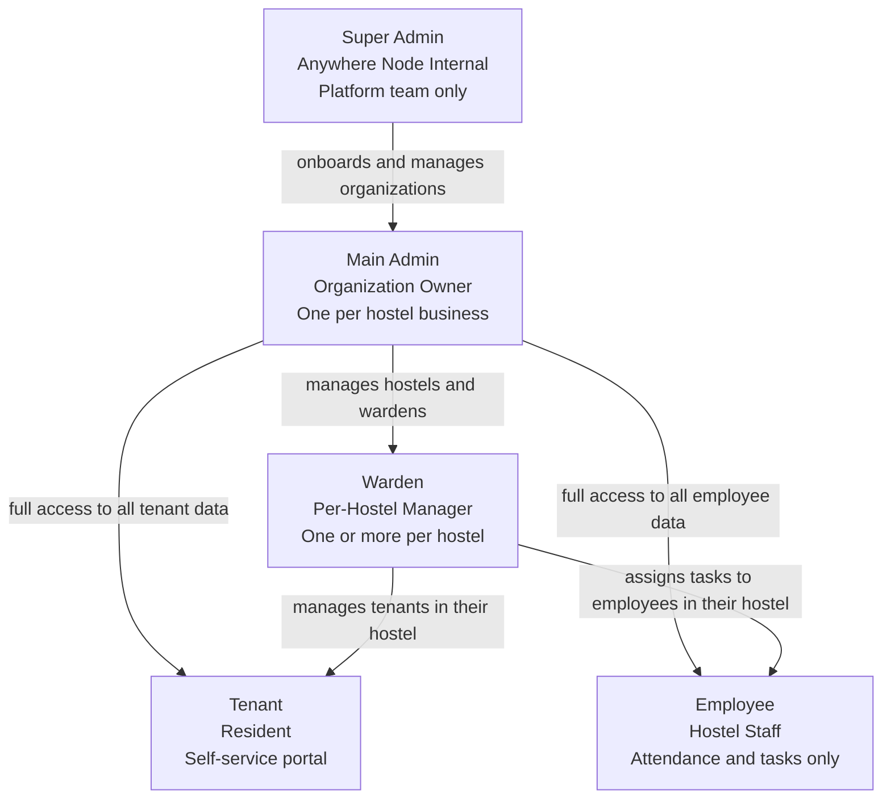

## 5.3 Permission Matrix

| Capability | Super Admin | Main Admin | Warden | Tenant | Employee |
|---|---|---|---|---|---|
| Onboard new organizations | Yes | — | — | — | — |
| View all hostels in org | Yes | Yes | Own only | — | — |
| Create warden accounts | Yes | Yes | — | — | — |
| Create tenant accounts | Yes | Yes | Yes | — | — |
| Create employee accounts | Yes | Yes | Yes (own hostel) | — | — |
| Initiate tenant onboarding | Yes | Yes | Yes | Self via QR | — |
| Approve tenant onboarding | Yes | Yes | Yes | — | — |
| Generate bills | Yes | Yes | Yes | — | — |
| Apply discounts to bills | Yes | Yes | Yes | — | — |
| Verify payments | Yes | Yes | Yes | — | — |
| Issue Stay Pass | Yes | Yes | Yes | — | — |
| Configure UPI QR | Yes | Yes | — | — | — |
| Create and manage tax groups | Yes | Yes | — | — | — |
| Toggle bill normalization | Yes | Yes (all hostels) | Yes (own hostel only) | — | — |
| Configure late fee policy | Yes | Yes | — | — | — |
| Create expense entities | Yes | Yes | — | — | — |
| Create expense tags | Yes | Yes | — | — | — |
| Log expenses | Yes | Yes | Yes (by entity access) | — | — |
| Approve expenses | Yes | Yes | — | — | — |
| Create expense vouchers | — | Yes | Yes | — | — |
| Approve expense vouchers | Yes | Yes | — | — | — |
| View food procurement report | Yes | Yes | Yes (own hostel) | — | — |
| Set weekly food menu | Yes | Yes | — | — | — |
| Manage food pricing | Yes | Yes | — | — | — |
| Book and manage own meals | — | — | — | Yes | — |
| Access comparisons module | Yes | Yes | — | — | — |
| View MRR report | Yes | Yes | — | — | — |
| View visitor log | Yes | Yes | Yes (own hostel) | — | — |
| Log visitor entry and exit | Yes | Yes | Yes | — | — |
| Export visitor log as PDF | Yes | Yes | Yes (own hostel) | — | — |
| Mark own attendance | — | — | — | — | Yes |
| Submit leave request | — | — | — | — | Yes |
| Approve leave requests | Yes | Yes | — | — | — |
| Assign tasks to employees | Yes | Yes | Yes (own hostel) | — | — |
| Submit service requests | — | Yes | Yes (incidents) | Yes (complaints/maintenance) | — |
| Resolve service requests | Yes | Yes | Yes | — | — |
| Delete KYC documents (DPDP) | Yes | Yes | — | — | — |
| View hostel performance scores | Yes | Yes | Yes (own hostel) | — | — |
| Generate comparison reports | Yes | Yes | — | — | — |
| Configure geofence radius | Yes | Yes | — | — | — |
| Manage asset register | Yes | Yes | Yes (own hostel) | — | — |
| Schedule housekeeping | Yes | Yes | Yes (own hostel) | — | — |
| Send announcements | Yes | Yes (all hostels) | Yes (own hostel) | — | — |
| Access DPDP compliance panel | Yes | Yes | — | — | — |

---

<div style="page-break-after: always;"></div>

# 6. System Architecture Overview

## 6.1 Architecture Philosophy

Staye V1 is intentionally built as a **monolithic Next.js application** hosted on a single EC2 instance. This is a deliberate architectural choice. At the scale of V1, a monolith is operationally simpler, cheaper, faster to develop, and easier to debug than microservices. The architecture is designed with all components replaceable or extractable as the platform scales.

> [!NOTE]
> **AWS Architecture Scope:** Please note that a detailed, production-grade AWS infrastructure design (including auto-scaling, Fargate migration, VPC security, and load balancing) is intentionally excluded from this document. A dedicated AWS Architecture and Infrastructure Design Document will be authored separately to cover those technical cloud requirements.

## 6.2 High-Level Architecture Diagram

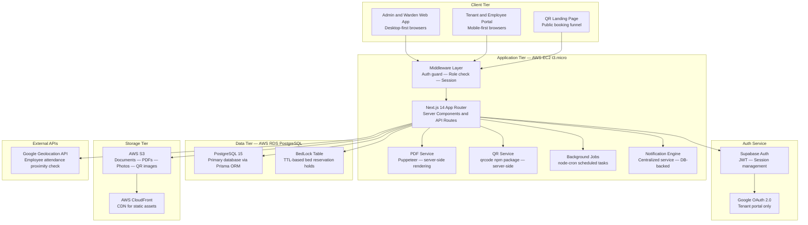

## 6.3 Technology Stack

| Layer | Technology | Why This Choice |
|---|---|---|
| Framework | Next.js 14 App Router | Full-stack SSR, API routes, Server Components in one package. No separate backend service needed. |
| Database ORM | Prisma | Type-safe queries, schema migrations, runtime safety on financial data. |
| Database | PostgreSQL 15 via AWS RDS | ACID compliance for financial transactions. Relational integrity for complex tenant-bed-billing relationships. |
| Auth | Supabase Auth | Managed JWT sessions, OAuth providers, Row Level Security. |
| File Storage | AWS S3 with pre-signed URLs | Pre-signed URLs ensure KYC documents are never permanently public. |
| PDF Generation | Puppeteer (headless Chromium) | HTML/CSS templates to pixel-perfect PDF. Full design control. |
| QR Generation | qrcode npm package | Server-side generation. No external API dependency. |
| Real-Time Updates | SWR polling (5-second interval) | Zero infrastructure overhead. Auto-pauses when browser tab is hidden. |
| Geolocation | Browser Geolocation API + Google Maps | Browser-native location capture; Google API for distance calculation. |
| Background Jobs | node-cron inside Next.js process | No separate worker infrastructure. |
| Language | TypeScript end-to-end | Type safety across frontend, backend, and database layer. |

## 6.4 Bed Locking Architecture — Race Condition Prevention

Consider this scenario: Two wardens share the QR code for Room G01 with different prospective tenants. Both open the booking form simultaneously. Both see Bed A as available. Without a locking mechanism, both could successfully submit forms for the same bed — creating a double-booking.

The BedLock mechanism prevents this at the database level:

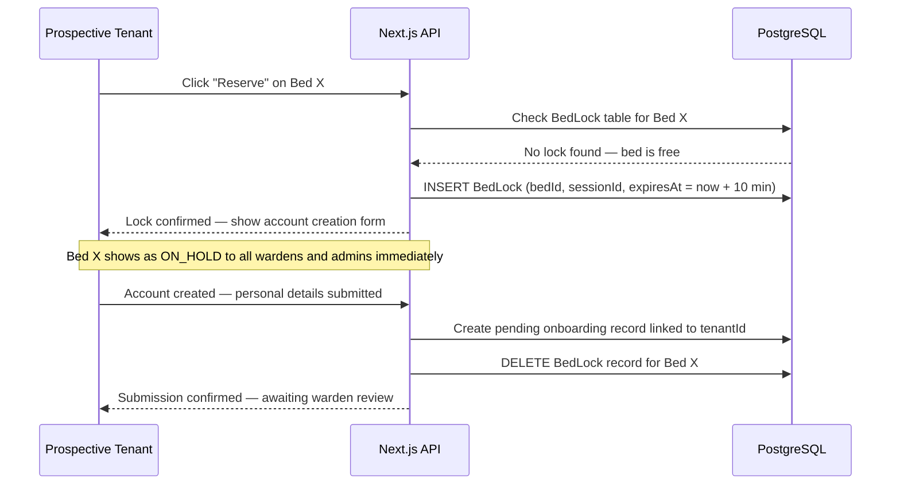

**The hold activates at account creation, not at the "Reserve" click.** Clicking Reserve is a low-commitment action. Account creation signals genuine intent. A `node-cron` job runs every 5 minutes to clean expired BedLock records, restoring abandoned beds to AVAILABLE.

## 6.5 Centralized PDF Generation Service

All PDFs — Stay Passes, invoices, receipts, expense vouchers, reports — flow through one centralized PDF service. No feature builds its own ad-hoc PDF logic.

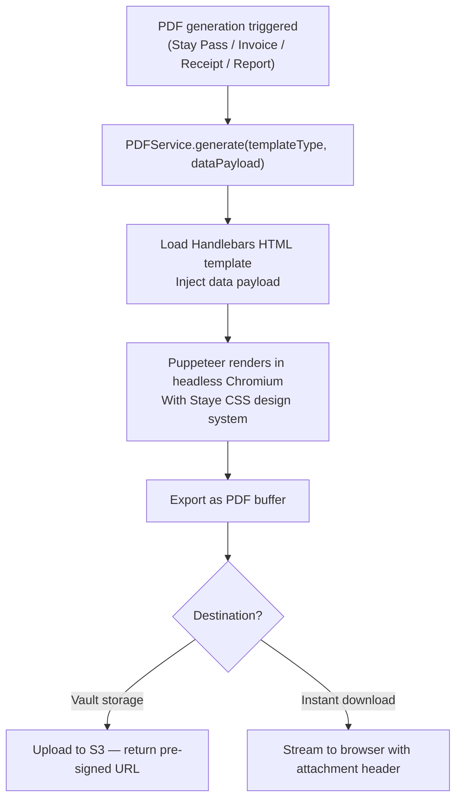

## 6.6 Background Cron Jobs

| Job | Schedule | Action |
|---|---|---|
| BedLock cleanup | Every 5 minutes | Delete expired BedLock records, restore beds to AVAILABLE |
| Stay expiry check | Daily at 7 AM | Find stays expiring in N days, send notifications to tenant and warden |
| Late fee application | 1st of month at 00:01 AM | For normalized hostels, append late fee to all overdue bills |
| Food cutoff notifications | 1 hour before cutoff | Notify tenants who haven't booked meals for tomorrow |
| Overstay detection | Daily at 8 AM | Find stays whose end date has passed, notify wardens |
| Waiting list notification | On bed AVAILABLE event | Notify first waiting list entry for that hostel |
| MRR report pre-generation | 28th of month at 10 PM | Pre-generate draft next-month MRR report |

## 6.7 Centralized Notification Engine

Every event requiring user notification flows through a single `NotificationService`.

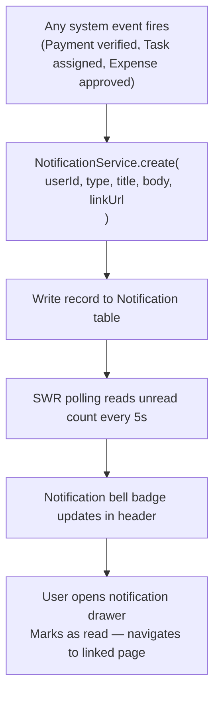

**V1 notification channels are in-app only.** WhatsApp and email notifications are deferred to V1.1.

---

<div style="page-break-after: always;"></div>

# 7. Module 01 — Dashboard & Analytics

## 7.1 What the Dashboard Solves

Before Staye V1, a hostel owner wanting to answer "How much did my business make last month?" would have to ask wardens via WhatsApp, manually aggregate numbers in different formats, and arrive at an approximate figure with no confidence in accuracy. The Staye dashboard eliminates this. Every number is derived from verified transactions in the database — not estimates, not manual entries.

## 7.2 Main Admin Dashboard Layout

The dashboard is organized into five sections on a single scrollable page. Layout is fixed in V1 (drag-and-drop customization is V1.1).

### Section A — Organization Financial Summary (Top Row)

Three large headline metric cards at the top:

**Card 1 — Total Revenue (This Month):** Sum of all verified rent payments and food wallet top-ups across all hostels for the current calendar month. Displayed in large orange text. Month-over-Month (MoM) percentage indicator below: "▲ 12% vs last month" in green, or "▼ 8% vs last month" in red.

**Card 2 — Total Expenses (This Month):** Sum of all admin-approved expenses across all hostels. Hovering expands a mini breakdown by expense category. MoM indicator shown.

**Card 3 — Net Revenue / Net Profit (This Month):** Total Revenue minus Total Expenses. Displayed in orange — the primary brand metric from the Finponin design reference. If negative (expenses exceed revenue), displayed in red with alert state.

**Use Case Example:** Rajan opens his dashboard on 15th August. He sees: Total Revenue Rs.3,24,000 | Total Expenses Rs.67,500 | Net Revenue Rs.2,56,500 ▲ 8% vs July. He immediately knows his business health without asking anyone.

### Section B — Expense Breakdown by Category

A row of icon-driven cards, one per expense category, showing current month approved expense totals:

- WiFi (signal bars icon)
- Electricity (lightning bolt)
- Water (droplet)
- Housekeeping (broom)
- Building Rent (building icon)
- Food/Beverages (fork icon)
- Others (tag icon)

Clicking any card filters to show only that expense category in detail.

### Section C — Facility Selector Dropdown

A dropdown in the top bar defaults to "All Facilities." Selecting a specific hostel causes every metric on the dashboard — revenue, expenses, net profit, performance scores, insights — to recalculate for only that hostel. The selected hostel is highlighted in the performance grid below.

### Section D — Hostel Performance Grid

A bento-box card grid, one card per hostel. Each card shows:
- Hostel name and thumbnail (if uploaded)
- Current month revenue contribution as % of org total
- Occupancy rate (occupied beds / total beds)
- Performance Score badge: Green (80-100), Amber (60-79), Red (below 60)
- Quick stats: e.g., "22/27 beds | 3 pending payments | 1 open complaint"

Clicking a hostel card navigates to that hostel's isolated dashboard.

### Section E — Insights Panel

System-generated actionable observations derived from data analysis:
- "NextHome Paradise occupancy dropped 15% in the last 7 days — 4 beds have been vacant for more than 5 days."
- "3 tenants at NextHome Classic have payments overdue by more than 7 days. Total outstanding: Rs.21,000."
- "Food plan adoption at NextHome Paradise is below 30% — 16 tenants have no active food bookings this month."
- "Issue Resolution score at NextHome Elite dropped below 50. 2 service requests are 6+ days old."

## 7.3 Warden Dashboard

When a warden logs in, they see a simplified dashboard scoped to their hostel only. The top cards show their hostel's revenue, expenses, and net profit. Below: a pending action queue — new onboarding forms awaiting review, payments awaiting verification, expense approvals pending admin decision, open service requests by age. Every item in the queue links directly to the relevant action screen.

## 7.4 Financial Metric Definitions

| Metric | Definition | Scope |
|---|---|---|
| Gross Rent Revenue | Sum of all bills with VERIFIED payment status (rent-type bills only) | Per hostel or org |
| Food Revenue | Sum of all food wallet top-up transactions with VERIFIED status | Per hostel or org |
| Total Revenue | Gross Rent Revenue + Food Revenue | Per hostel or org |
| Total Expenses | Sum of all expense entries with APPROVED status | Per hostel or org |
| Net Profit | Total Revenue − Total Expenses | Per hostel or org |
| Occupancy Rate | (OCCUPIED beds ÷ Total beds) × 100% | Per hostel |
| Food Adoption | (Tenants with ≥1 meal booking this month ÷ Total active tenants) × 100% | Per hostel |
| Payment Timeliness | (Payments within grace period ÷ Total rent payments due) × 100% | Per hostel |

## 7.5 Real-Time Data Strategy

Dashboard metrics refresh automatically every 5 seconds using SWR polling. If a warden verifies a payment in another browser tab, the admin's dashboard revenue figure updates within 5 seconds without a page refresh. SWR auto-pauses polling when the browser tab is not visible, preventing unnecessary database load from idle sessions.

---

<div style="page-break-after: always;"></div>

# 8. Module 02 — Booking & Onboarding System

## 8.1 The Onboarding Problem

The MVP required a warden to manually initiate every tenant onboarding. This model breaks at scale — a hostel with 50 beds and regular turnover cannot function with warden-bottlenecked onboarding. V1 introduces three self-service flows triggered by QR codes. A warden's involvement is now limited to the review and verification step.

## 8.2 The Three Booking Flows

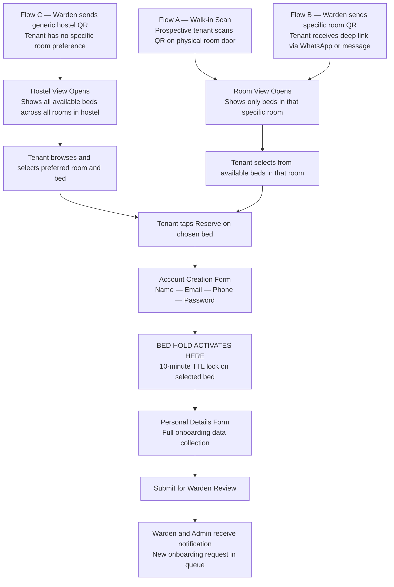

**Flow A — Walk-in Scan:** A prospective tenant visits the hostel and scans a QR code on a room door. The Staye booking page opens showing only beds in that specific room with real-time availability status. The QR encodes a signed JWT scoped to that room — tenants cannot access other rooms.

**Flow B — Warden sends specific room QR:** A warden has shown a prospect a specific room and sends the room's deep link via WhatsApp or SMS. The prospect opens it later and sees that room's bed availability.

**Flow C — Warden sends generic hostel QR:** For prospects with no specific room preference. The hostel landing page shows all available beds across all rooms, organized by floor.

## 8.3 Bed Selection UI (Mobile-First)

The bed selection page shows:
- Staye logo and hostel name at the top
- Visual bed grid with color-coded status: Green (Available), Gray (Occupied), Yellow (On Hold), Blue (Reserved), Red (Maintenance)
- Each bed tile: bed identifier (e.g., "Bed A"), price per month/week/day

Tapping an Available bed opens a bottom slide-up sheet with bed details and a prominent "Reserve This Bed" CTA in orange. Tapping an Occupied or On Hold bed shows an informational state with an option to join the waiting list.

## 8.4 Account Creation and Bed Hold Activation

When the prospective tenant taps "Reserve This Bed" and confirms, they see the account creation form:
- Full Name, Email Address, Phone Number, Password (minimum 8 characters)

**The moment they submit the account creation form successfully, the bed hold activates.** A BedLock record is created with a 10-minute TTL. The bed immediately shows as ON_HOLD to any warden or admin. If another prospect tries to reserve the same bed during this window, they see: "This bed is currently being booked by another person" with an option to join the waiting list.

**Why activate hold at account creation, not at Reserve click?** Clicking Reserve is low-commitment — many users browse and tap without intent to complete. Account creation is high-commitment, confirming genuine interest. This prevents casual browsing from locking beds.

## 8.5 Personal Details Form

After account creation, the tenant fills the full onboarding form — their permanent record on the platform.

| Field | Required | Notes |
|---|---|---|
| Date of Birth | Yes | Age verification |
| Permanent Home Address | Yes | Full address with pin code |
| Emergency Contact Name | Yes | Person to contact in emergencies |
| Emergency Contact Phone | Yes | Mobile number |
| Emergency Contact Relationship | No | e.g., Father, Spouse, Friend |
| KYC Document Type | Yes | Aadhaar Card / PAN Card / Driving License |
| KYC Document Number | Yes | Stored encrypted |
| KYC Document Scan | Yes | Clear photo upload — stored in S3 |
| Tenant Photo | Yes | Phone camera capture or upload |
| DPDP Consent | Yes | Explicit mandatory checkbox — form cannot be submitted without it |

**DPDP Consent is mandatory.** The consent text displays exactly what data is collected, why, how long it is retained, and the tenant's right to request deletion. Consent record is stored: `{ tenantId, consentedAt (UTC), consentVersion, ipAddress }`.

## 8.6 Group Booking Flow

When a group of friends, colleagues, or family want to book multiple beds simultaneously:

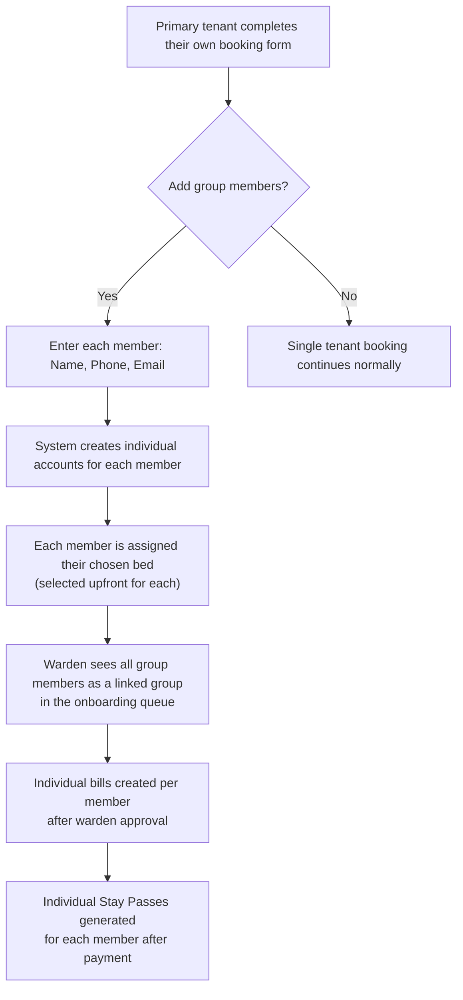

All group members' beds are held simultaneously with the primary tenant's hold. All beds are released together if the primary form is abandoned. The warden reviews the group as a unit but approves and bills each member individually.

## 8.7 Warden Review and Verification

After submission, the warden receives a notification: "New onboarding request — Aditya Kumar, Bed B, Room G01." The warden opens the onboarding queue and reviews three tabs:

**Tab 1 — Details:** All personal information submitted — name, DOB, address, emergency contact, KYC type and number.

**Tab 2 — Documents:** KYC scan and tenant photo with zoom capability. The warden verifies document legitimacy.

**Tab 3 — Bill Creation:** The warden sets financial terms:
- Rent type: Daily / Weekly / Monthly
- Rent amount
- Tax group (if applicable)
- Discount (optional — requires reason for audit trail)
- Admission ID (the organization's internal reference number)
- Stay start date and expected end date

**"Verified and Create Bill" action:** When clicked, the system atomically:
1. Marks the tenant onboarding as APPROVED
2. Marks the bed as OCCUPIED
3. Deletes the BedLock record (if still active)
4. Generates an invoice using the billing engine
5. Notifies the tenant: "Your onboarding is approved. Your first bill is ready."

**Rejection:** If the warden rejects, they enter a rejection reason. The tenant is notified. The bed returns to AVAILABLE. The tenant account remains (they can re-apply with corrected documents).

## 8.8 Payment Verification Flow

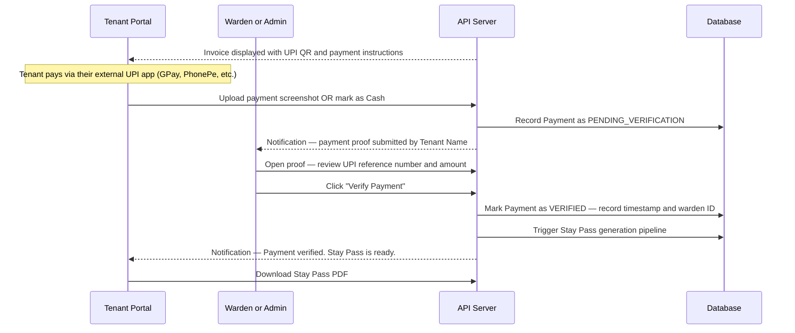

Payment verification is manual by design. Automatic UPI confirmation requires direct banking API integration — out of V1 scope. The warden manually cross-checks the UPI transaction reference. This is the same process operators currently use — V1 digitizes and tracks it.

---

<div style="page-break-after: always;"></div>

# 9. Module 03 — Billing Engine

## 9.1 Overview

The billing engine is one of the most complex and consequential systems in Staye V1. Every rupee in the platform flows through or is tracked against it. It handles three rent types, normalization, proration, tax groups, discounts, late fees, advance refunds, and stay extensions. It must be correct to the paisa, transparent in its logic, and auditable end-to-end.

## 9.2 Rent Types

| Rent Type | Description | Normalization Compatible | Late Fee Compatible |
|---|---|---|---|
| **Daily** | Rent calculated per calendar day | No | No |
| **Weekly** | Rent per 7-day period | No | No |
| **Monthly** | Rent per calendar month | Yes | Yes |

Daily and weekly are useful for short-term or transient tenants. Monthly is the standard model for PG hostels in India and the primary billing type Staye is designed around.

## 9.3 Bill Normalization — The Monthly Cycle Alignment Problem

**The Problem Without Normalization:** In a 30-bed hostel, tenants join on different dates. Tenant A joined on the 3rd, Tenant B on the 15th, Tenant C on the 28th. Without normalization, the warden must remember to generate bills on the 3rd, 15th, and 28th of every month. With 50 tenants across 5 hostels, this becomes unmanageable. Revenue projection becomes impossible.

**The Solution:** Normalization aligns all monthly-rate tenants in a hostel to a single billing cycle starting on the 1st of each calendar month. The first bill is prorated to cover only the partial month from join date to month end.

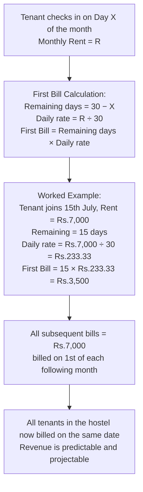

**Who controls normalization:** Main Admin can enable for any hostel. Warden can toggle for their own hostel only. When toggled mid-cycle, applies to new bills going forward — existing bills in the current cycle are not retroactively changed.

## 9.4 Discount Application

Discounts can be applied at bill creation or post-creation by warden or admin:
- **Fixed Amount:** e.g., Rs.500 off. Use case: loyalty gesture for a long-term tenant.
- **Percentage:** e.g., 10% off. Use case: promotional discount for a new hostel's launch.

A discount reason is **mandatory** for audit trail purposes. It appears on the invoice and is visible to the admin. This prevents wardens from silently discounting bills without accountability.

Invoice line: `Base Amount Rs.7,000 — Discount (Loyalty Discount) −Rs.500 — Total Payable Rs.6,500`

## 9.5 Tax Groups

Created by the Main Admin with: name, tax percentage, applicability (rent bills only / food bills only / both). Applied at bill creation.

Invoice breakdown:
```
Base Rent:         Rs.7,000.00
GST 12%:          +Rs.840.00
─────────────────────────────
Total Payable:     Rs.7,840.00
```

Tax groups are optional — no tax line appears if none is applied. Staye computes taxes correctly but does not determine which tax group is legally applicable — that is the operator's business decision.

## 9.6 Late Payment Fees

When enabled by the Main Admin:
- **Grace period:** Days after due date before fee activates (e.g., 5 days)
- **Fee type:** Fixed amount (e.g., Rs.250 flat) OR percentage of overdue amount (e.g., 2%)

A cron job runs on the 1st of each month at 00:01 AM. It fetches all active tenants in normalized hostels whose latest bill is unpaid and whose grace period has expired. For each such tenant, a late fee line item is appended to their outstanding bill and the tenant is notified.

**Late fees only apply to normalized hostels** because normalization gives everyone a predictable due date (1st of month). Non-normalized hostels have per-tenant anniversary dates — implementing late fees would require per-tenant cron triggers, deferred to V2.

## 9.7 Advance Rent Refunds

When a tenant checks out before their paid period expires:

1. Admin/Warden opens the tenant record and clicks "Process Early Checkout"
2. System displays: "Tenant has paid for 1st Aug to 31st Aug. Today is 18th Aug. Remaining: 13 days. Calculated refund: Rs.7,000 ÷ 30 × 13 = Rs.3,033."
3. Admin enters actual refund amount (may differ — e.g., deductions for damages)
4. Reason for difference is required
5. Refund record is created, bed is marked AVAILABLE, Stay Pass status → REVOKED
6. Refund is recorded in the financial ledger as a negative revenue line item

## 9.8 Stay Extensions

1. Warden/admin opens tenant record, selects "Extend Stay"
2. Selects extension type: Add X more days / Add X more weeks / Full month
3. System generates an extension bill
4. Standard payment flow initiates (tenant pays, uploads proof, warden verifies)
5. After verification, new Stay Pass generated with updated dates

## 9.9 Next Month MRR Report

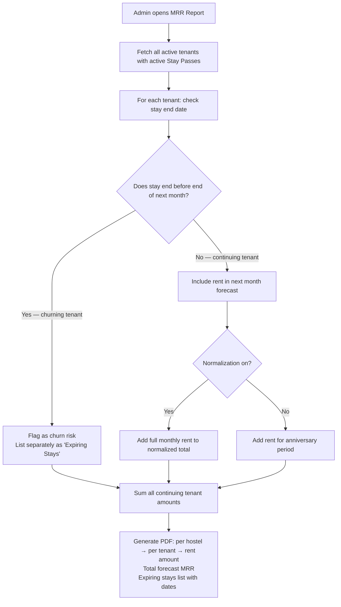

**Use Case:** On 28th August, Rajan opens the MRR report. It shows: "Forecasted September Revenue: Rs.3,18,000. 4 stays expiring in September — potential revenue at risk: Rs.28,000. Action needed: follow up with Tenants X, Y, Z, W for renewal."

---

<div style="page-break-after: always;"></div>

# 10. Module 04 — Finance Center

## 10.1 Overview

The Finance Center is the document management layer of the financial system. Where the Billing Engine computes amounts and records transactions, the Finance Center produces and stores the physical artifacts — the PDFs, receipts, and vouchers that serve as legal proof of financial activity.

## 10.2 The Three Core Financial Documents

### Document 1 — Invoice (Pre-Payment Bill)

Generated immediately after the warden approves a tenant's onboarding and creates a bill. It is the formal request for payment — what the tenant owes before paying.

**Invoice Contents:**
- Staye header with organization name and logo
- Invoice number (sequential, e.g., INV-2026-0047)
- Invoice date and payment due date
- Tenant name, Admission ID, hostel, room, bed
- Billing period (e.g., "01 August 2026 — 31 August 2026")
- Base rent amount
- Tax group applied (name and percentage, if any)
- Discount applied (amount and reason, if any)
- **Total Payable (prominently displayed)**
- Organization's UPI QR code (generated from UPI ID)
- Organization's UPI ID in text
- Payment instructions

### Document 2 — Tenant Payment Receipt

Generated after a payment is verified by the warden or admin. Legal proof of payment that tenants can show to anyone requiring documentation.

**Receipt Contents:**
- Staye header with organization name and logo
- Receipt number (sequential, e.g., REC-2026-0031)
- Receipt/Verification date and exact time
- Tenant name, Admission ID, hostel, room, bed
- Amount paid
- Payment method (UPI / Cash)
- UPI transaction reference (as entered by the verifying warden)
- Billing period covered
- Verified by (warden/admin name)
- Large **"PAID IN FULL"** stamp

Both invoice and receipt are downloadable as PDFs by the tenant from their portal and stored in the Bill Vault.

### Document 3 — Expense Voucher (Petty Cash Request)

Warden-initiated formal cash request for operational expenses requiring admin approval.

**Example Scenario:** The water pump at NextHome Paradise broke on a Saturday. The plumber charges Rs.2,800. The warden creates an expense voucher: "Emergency plumber — water pump repair — Rs.2,800." She attaches a photo of the plumber's bill. The Main Admin reviews it and approves. The warden is authorized to collect Rs.2,800. The expense is recorded in the P&L under "Maintenance."

**Voucher Contents:** Voucher number, date, warden name and hostel, purpose, expense entity and tag, amount, attachment, approval timestamp, approver name, status.

## 10.3 Bill Vault

The Bill Vault is a searchable archive of every financial document ever generated.

**Available Filters:** Document type (Invoice / Receipt / Voucher), Tenant name or Admission ID, Hostel, Date range, Amount range, Status.

**S3 Storage Path:** `{orgId}/hostels/{hostelId}/tenants/{tenantId}/documents/{type}/{year}/{month}/{documentId}.pdf`

**Use Case:** The Main Admin needs all rent payment records for NextHome Classic for FY 2025-26 for their accountant. They filter: Hostel = NextHome Classic, Type = Receipt, Date Range = April 2025 to March 2026. All 420 payment receipts are listed. Downloadable individually.

---

<div style="page-break-after: always;"></div>

# 11. Module 05 — Expense Management

## 11.1 The Expense Control Problem

Before Staye, hostel expense management typically looked like this: A warden pays for something, sends a WhatsApp photo to the admin, the admin makes a note somewhere, and the expense is never tracked consistently. At month-end, the admin has no idea what was spent where or whether bills were legitimate.

V1 replaces this with a structured, multi-level expense governance system.

## 11.2 Expense Entities — First Level of Control

An **Expense Entity** is a named, recurring expense obligation scoped to specific hostels and wardens. Created exclusively by the Main Admin.

**Entity Fields:** Name, description, applicable hostels (multi-select), authorized wardens (multi-select), expected frequency, approximate expected amount.

**Why Entities Matter:** Entities define the buckets where expenses can be logged. A warden can only log against an entity they have been granted access to. A warden at NextHome Paradise cannot log a building rent expense for NextHome Classic — even accidentally.

**Example Entity Structure for a 5-Hostel Organization:**
- "Building Rent — NextHome Paradise" → NHP warden only
- "Building Rent — NextHome Classic" → NHC warden only
- "Electricity — NextHome Paradise" → NHP warden
- "WiFi — All Properties" → All wardens
- "Maintenance — Shared Pool" → All wardens

## 11.3 Expense Tags — Second Level of Control

Within each entity, **Expense Tags** provide sub-categorization. Tags are predefined by the Main Admin. Wardens select from tags — they cannot create new ones.

**Example Tags for "Electricity" entity:**
- "Meter 1 — Ground Floor"
- "Meter 2 — First Floor"
- "Common Area Meter"

**Example Tags for "Maintenance" entity:**
- "Plumbing Repair" | "Electrical Repair" | "AC Service" | "Carpentry"

**The "Other" Tag:** If no predefined tag fits, the warden selects "Other" and types a description. This expense is flagged for admin review. The admin can approve it and, if the type recurs, create a new formal tag.

## 11.4 Full Expense Entry and Approval Flow

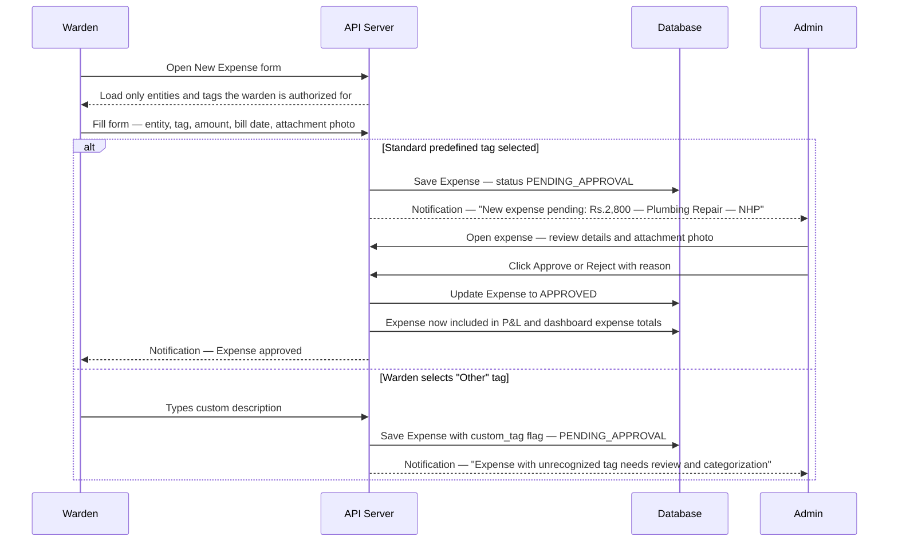

## 11.5 Expense Form Fields

| Field | Required | Notes |
|---|---|---|
| Expense Entity | Yes | Filtered to only entities the warden has access to |
| Tag | Yes | Predefined list from selected entity, or "Other" |
| Custom Tag Description | If "Other" | Free text max 200 chars |
| Bill Date | Yes | Date the vendor issued the bill |
| Due Date | No | Payment deadline if known |
| Amount | Yes | Amount in INR |
| Attachment | Strongly recommended | PDF of bill or photo of receipt |
| Notes | No | Additional context for the admin |

---

<div style="page-break-after: always;"></div>

# 12. Module 06 — Food Management System

## 12.1 Overview and Philosophy

The fundamental philosophy shift in V1: **tenants manage their own food plan, and the admin manages the menu and pricing.**

A tenant should be able to decide in the morning whether they want lunch today, cancel a dinner booking they won't use, top up their food wallet, and check what's being served on Friday — all without calling or messaging anyone. The admin's food responsibility is: set the menu and prices, review the daily procurement report. The warden's food responsibility is limited to verifying food wallet top-up payments.

## 12.2 Per-Meal Pricing

Food is priced per individual meal by the Main Admin per hostel:
- Breakfast: Rs.X per meal
- Lunch: Rs.Y per meal
- Dinner: Rs.Z per meal
- Add-on items: individually priced, with name, availability window, and optional max quantity per tenant per day

There is no "daily package" — tenants book individual meals, giving maximum flexibility and precise data on meal popularity.

## 12.3 Food Wallet — The Prepaid Balance System

Every tenant on the food plan maintains a prepaid Food Wallet debited each time a meal is booked.

**How top-up works:**
1. Tenant requests a top-up in their portal, specifies amount (e.g., Rs.2,000)
2. Top-up goes through the standard payment flow: tenant pays via UPI, uploads proof, warden verifies
3. Upon verification, Rs.2,000 is credited to the food wallet
4. Every meal booking deducts the meal price immediately
5. Every cancellation (within the window) refunds the meal price back to the wallet immediately

**Low Balance Alert:** When wallet balance falls below a configurable threshold (e.g., Rs.300), the tenant receives an in-app notification: "Your food wallet balance is Rs.280. Please top up to continue booking meals."

**Wallet Transaction Log (as seen by tenant):**
```
+Rs.2,000 | Top-up | Verified by Warden Priya | 15 Jul 2026
  −Rs.80  | Breakfast booked | Mon 21 Jul          | 14 Jul 2026
  −Rs.120 | Lunch booked | Mon 21 Jul              | 14 Jul 2026
  +Rs.80  | Breakfast cancelled | Mon 21 Jul        | 14 Jul 2026
  −Rs.150 | Dinner booked | Mon 21 Jul              | 14 Jul 2026
```

## 12.4 Booking Rules

| Rule | Value | Configurable? |
|---|---|---|
| Minimum booking period for a food plan | 7 days | No — fixed to prevent abuse |
| Maximum booking period | 28 days or remaining stay (whichever less) | No |
| Single-day meal ordering | Allowed within cutoff window | No |
| Default meal cutoff time | 10:00 PM of the previous night | Yes — admin configures per hostel |

**The Cutoff Rule in Plain English:** If you want breakfast on Monday, you must book it before Sunday 10:00 PM. After 10:00 PM, the system locks new bookings and cancellations for the next day's meals — giving the kitchen certainty about quantities.

## 12.5 Cancellation Logic

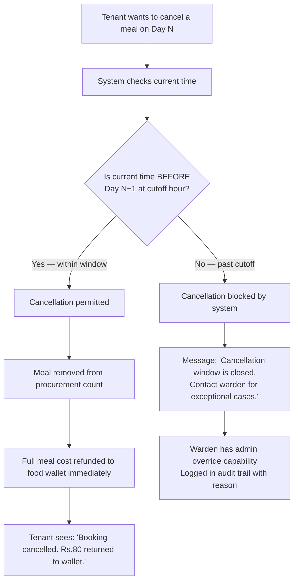

**Warden Override:** If a tenant falls sick and misses a meal after cutoff, the warden can manually override the cancellation. This override is logged in the audit trail with the warden's name, timestamp, and reason. The admin can see all override actions.

## 12.6 Weekly Menu Management

The Main Admin sets the meal menu for each day of the week — three slots per day: Breakfast, Lunch, Dinner, each with a description (e.g., "Idli Sambar and Coffee" for Monday breakfast).

The weekly menu repeats unless explicitly updated. Individual days can be overridden without changing the weekly template. The menu is visible to tenants in their Food Calendar, allowing them to plan bookings in advance.

## 12.7 Tenant Food Calendar View

A mobile-optimized calendar interface:
- Week/Month toggle
- Each day's card: three meal status indicators — **B** (Breakfast), **L** (Lunch), **D** (Dinner)
  - Orange filled circle = Booked
  - Gray empty circle = Not booked
  - Strikethrough = Past cutoff or past date
- Food wallet balance displayed prominently at the top
- Tapping any future day (before cutoff) opens a bottom sheet showing:
  - Menu for that day (what's being served)
  - Per-meal prices
  - Booking/cancellation action buttons
  - Add-on items available (if any)

## 12.8 Food Procurement Report

The procurement report tells the kitchen how many portions to prepare for tomorrow.

**Daily Report (generated post-cutoff for the following day):**
```
Staye — NextHome Paradise
Food Procurement Report | Tomorrow: Monday, 21 July 2026
Generated: Sunday, 20 July 2026 at 10:05 PM (post-cutoff)

BREAKFAST:     44 portions
LUNCH:         40 portions    (4 cancellations processed before cutoff)
DINNER:        44 portions

ADD-ONS:
  Protein Shake (dinner):    7 units
  Evening Snack:            12 units

WALLET ALERTS:
  3 tenants have food wallet balance below Rs.300
  Rs. Rohit Sharma: Rs.145 | Priya Das: Rs.220 | Suresh K: Rs.280
```

**Weekly Aggregated Report:** 7-day totals for weekly grocery planning.
**Access:** Warden (own hostel), Main Admin (all hostels).

---

<div style="page-break-after: always;"></div>

# 13. Module 07 — Smart Bed Operations

## 13.1 Bed Status Model

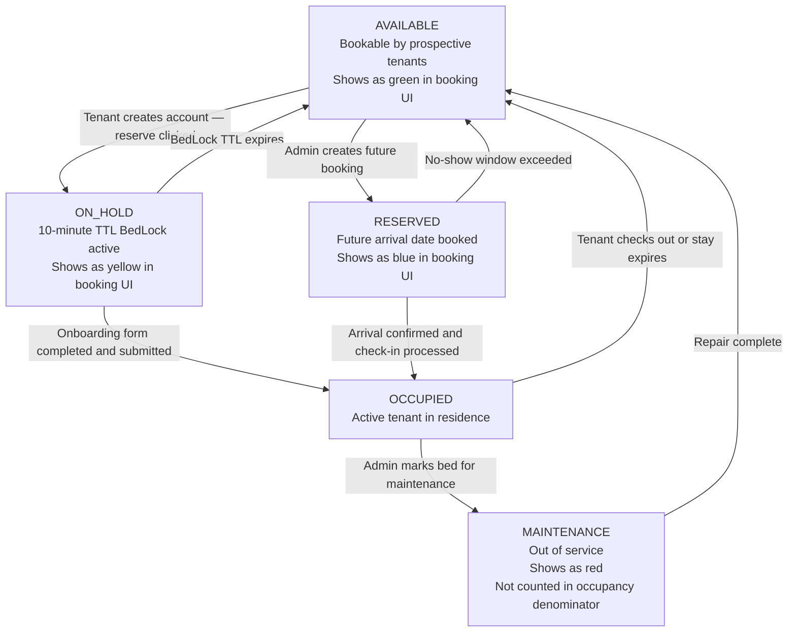

## 13.2 Room QR Code Generation

Each room has a permanent QR code encoding a signed JWT scoped to that specific room. The token is permanent — the room's identity doesn't change. Generated from the Room Management panel by the admin. Downloads as a high-resolution PNG for printing.

The QR can be regenerated at any time (e.g., if the physical sticker is damaged). The old token is invalidated and a new one is issued.

## 13.3 Bed Transfer — Moving One Tenant to a New Bed

**Common scenarios:**
- Tenant requests a private room that became available
- Tenant's bed needs maintenance and they must temporarily relocate
- Tenant requested a different floor

**Transfer Flow:**
1. Warden opens the tenant's record and selects "Transfer Bed"
2. System shows all AVAILABLE beds in the hostel
3. Warden selects destination bed, enters effective transfer date, and provides reason
4. System executes atomically:
   - Source bed status → AVAILABLE (BedHistory record closed with today's date)
   - Destination bed status → OCCUPIED (new BedHistory record opened)
   - Tenant's active Stay record updated to point to new bedId
   - New Stay Pass generated with updated room/bed information
5. Tenant notified: "Your bed transfer is complete. Your new bed is Room 304, Bed C. Your updated Stay Pass is ready."

## 13.4 Bed Swap — Two Tenants Exchange Beds

An atomic operation that exchanges two tenants' beds simultaneously — no intermediate state where one has moved and the other hasn't.

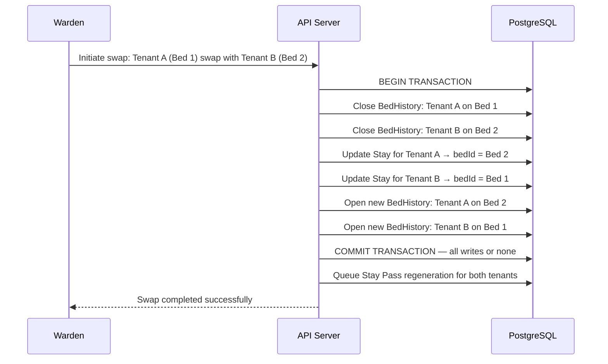

## 13.5 Bed Reservation — Booking for a Future Arrival

**Use Case:** Karthik contacts NextHome Classic on 10th August, confirms he's moving in on 1st September. The warden creates a reservation: select Bed B in Room 105, enter Karthik's details, set arrival date as 1st September, expected duration 6 months. The bed immediately shows as RESERVED — it won't appear as available to QR-scanning prospects.

If Karthik doesn't check in within the configured no-show window (default 3 days after arrival date), the system auto-releases the bed to AVAILABLE and notifies the warden.

## 13.6 Waiting List — Managing Full Occupancy

When all beds in a hostel are occupied and a prospect scans the QR:
- Page shows: "This hostel is currently fully occupied. Join the waiting list and we'll notify you when a bed becomes available."
- Prospect enters: Name, Phone Number, Email
- Added to the WaitingList for that hostel (FIFO queue)

When any bed becomes AVAILABLE:
- System identifies the first person on the waiting list
- Warden receives notification: "Bed G01-A is now available. Aditya Kumar is first on the waiting list. Phone: 98XXX XXXXX."
- Warden contacts Aditya directly (V1 notification is to warden — WhatsApp outreach to the waitlist is V1.1)
- If Aditya declines or doesn't respond within the response window, the next person on the list is surfaced

---

<div style="page-break-after: always;"></div>

# 14. Module 08 — Stay Pass System

## 14.1 What Is a Stay Pass?

A Stay Pass is Staye's digital identity and authorization document for a hostel tenant — a combination of a membership card, residency certificate, and proof of payment in one PDF.

The Stay Pass serves multiple practical purposes:
- **Gate identity verification:** Security or warden scans the QR on the pass to instantly verify the person is a valid current resident
- **Proof of address:** Contains the full hostel address and tenant name — usable as address proof in many informal contexts
- **Proof of payment:** Issued only after payment is verified
- **Digital portability:** Accessible from the tenant's phone anytime — no physical card needed

## 14.2 Stay Pass Contents

| Element | Details |
|---|---|
| Staye logo and organization branding | Top header with org name and logo |
| Hostel name and full address | Complete address with pin code |
| Tenant full name | As submitted during onboarding |
| Tenant photograph | Photo uploaded at onboarding |
| Admission ID | Organization's unique sequential reference |
| Room and bed reference | e.g., "NextHome Paradise — Block G, Floor 1, Room 01, Bed A" |
| Stay period | "Valid From: 01 August 2026 — Valid To: 31 August 2026" |
| KYC verification indicator | Document type shown — document NUMBER is NOT printed |
| Issue date | When the pass was generated |
| Issued by | Name of the warden or admin who verified payment |
| Verification QR code | Links to a real-time validity check page |
| Pass status | "VALID" stamp in green text |

## 14.3 Stay Pass Lifecycle

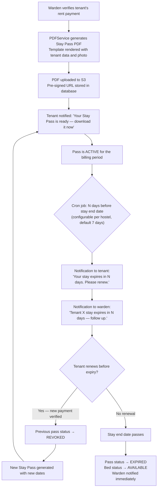

## 14.4 Pass Validity Verification (QR Scan)

The QR on the Stay Pass links to a public verification URL (no login required). Scanning shows:
- Tenant name and photo
- Hostel and bed
- VALID (green) or EXPIRED (red) or REVOKED (gray) status
- Valid until date

Returns live data from the database — if a pass is revoked, the verification page reflects REVOKED immediately. Any phone camera can scan it.

## 14.5 Tenant Portal Access

Tenants access their Stay Pass from the "My Stay Pass" section in their portal:
- View current pass in-browser (mobile-optimized rendered HTML)
- Download as PDF
- View all past passes (historical archive)

The pass is always accessible — even if the tenant forgets to download it, they can retrieve it from the portal immediately.

---

<div style="page-break-after: always;"></div>

# 15. Module 09 — Lease Renewal & Overstay Management

## 15.1 The Renewal Problem

Without a systematic renewal workflow, hostel operators realize a tenant's lease is expiring only days before it does — or after it already has. V1 solves this with automated renewal reminders and a self-service tenant renewal request flow.

## 15.2 Tenant-Initiated Renewal Flow

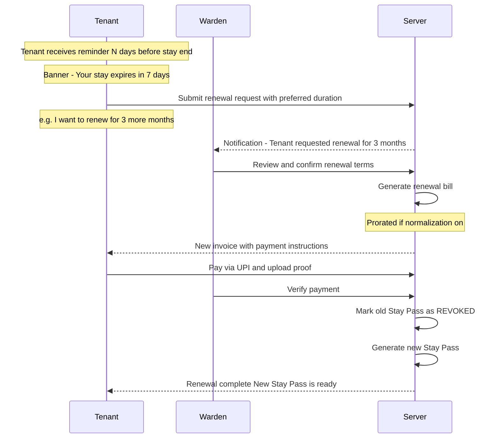

## 15.3 Warden-Initiated Extension

A warden can extend a tenant's stay without waiting for the tenant to initiate — useful when the warden has agreed on extension terms offline with the tenant. The warden opens the tenant record, clicks "Extend Stay," selects extension type and duration, generates the bill. The tenant receives a notification about their new bill.

## 15.4 Overstay Detection and Handling

The daily overstay detection cron (running at 8 AM) finds all stays whose end date has passed without renewal.

**For each expired stay:**
1. Stay Pass status → EXPIRED
2. Bed status → AVAILABLE
3. Warden receives notification: "Tenant Aditya Kumar's stay expired on 31 July. No renewal processed. Bed G01-A is now marked as available."
4. Tenant portal shows "EXPIRED STAY" banner with renewal prompt

**Grace Period (default 3 days):** Allows the warden to process a renewal without full re-onboarding. During the grace period, the tenant's account remains fully active. After the grace period expires with no renewal, food booking and active feature access is suspended (account and data are preserved).

---

<div style="page-break-after: always;"></div>

# 16. Module 10 — Service Requests

## 16.1 Three Request Categories

**Maintenance Request (Tenant-initiated):** Physical issues in the tenant's room or shared areas — broken AC, leaking tap, non-functional geyser, broken window, pest issue, WiFi down. Routed automatically to the hostel warden.

**Complaint (Tenant-initiated):** Service quality or interpersonal issues — food quality, excessive noise, cleanliness of common areas, delayed warden response. Routed to the warden.

**Incident Report (Warden-initiated):** Escalation-level events requiring admin documentation — property damage, safety incidents, altercations between tenants, major equipment failure, unauthorized visitor. Routed to the Main Admin.

## 16.2 Full Service Request Lifecycle

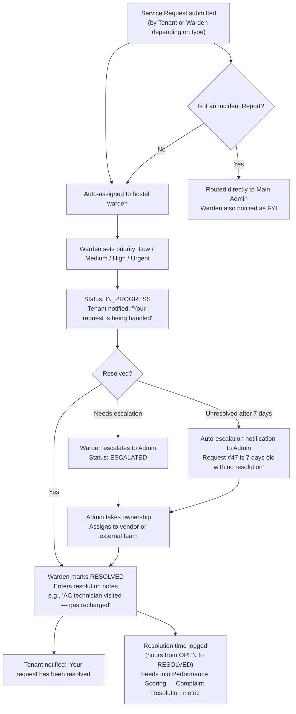

## 16.3 Fields and SLA

| Field | Notes |
|---|---|
| Category | Maintenance Request / Complaint / Incident Report |
| Title | Short description, max 100 characters |
| Description | Detailed explanation |
| Photo Attachment | Optional for tenant, recommended for warden |
| Priority | Set by warden: Low / Medium / High / Urgent |
| Status | OPEN / IN_PROGRESS / ESCALATED / RESOLVED / CLOSED |
| Resolution Notes | Required when marking RESOLVED |
| Resolution Time | Auto-calculated: hours from OPEN to RESOLVED |

**SLA Rule:** Any request older than 7 days without RESOLVED status triggers automatic escalation notification to the Main Admin. This prevents requests from being forgotten.

**Use Case:** Aditya's AC stops working. He opens Staye, goes to "Service Requests," taps "New Request," selects "Maintenance Request," types "AC not cooling — Room G01 Bed A," uploads a photo of the AC error code, and submits. Warden Priya gets a notification. She sets priority to "High." On Wednesday, the AC is fixed. Priya marks RESOLVED: "Komfort AC Service visited — low gas, recharged." Aditya receives a notification: "Your maintenance request has been resolved."

---

<div style="page-break-after: always;"></div>

# 17. Module 11 — Visitor & Guest Log

## 17.1 Why This Module Exists

Hostels have a legal and ethical obligation to know who enters their premises. In India, police or authorities can request visitor records from a PG hostel during a security investigation. Before Staye, visitor logging (if it happened) was a physical register — a book that could be lost, damaged, or simply not filled out. V1 digitizes this into a permanent, searchable, exportable record.

This module is non-negotiable for any hostel operator who takes compliance seriously. It is not complex technically, but its presence is essential for V1.

## 17.2 Visitor Log Entry Fields

| Field | Required | Notes |
|---|---|---|
| Visitor Full Name | Yes | As on their ID |
| Visitor Phone Number | Yes | Mobile number |
| Tenant Being Visited | Yes | Dropdown of all active tenants at this hostel |
| Relationship to Tenant | No | Family / Friend / Professional / Delivery / Other |
| Purpose of Visit | No | Brief description |
| ID Proof Type | Recommended | Aadhaar / Driving License / Passport / Other |
| ID Proof Last 4 Digits | Recommended | Not full number — reference only |
| Entry Time | Yes | Auto-filled from system clock — warden confirms or adjusts |
| Expected Exit Time | No | Informational |
| Actual Exit Time | Yes (at exit) | Filled when visitor leaves the premises |

Creating a visitor log entry takes approximately 30 seconds.

## 17.3 Exit Recording

When the visitor leaves, the warden finds the entry in the log (searchable by visitor name or tenant visited) and clicks "Record Exit." The system stamps the exit time and auto-calculates visit duration.

If a visitor's expected exit time passes without an exit being recorded, the warden receives a reminder: "Visitor [Name] was expected to exit at [time]. Please verify and update the log."

**Overstayed Visitor Detection:** The "Currently Inside" filter shows all visitors without an exit record — allowing the warden to quickly identify anyone who should have left.

## 17.4 Visitor Log View and Filters

Wardens see their hostel's log. Main Admin sees all hostels.

**Available Filters:** Date range, Tenant visited, Hostel (admin view), Status (All / Currently Inside / Exited).

## 17.5 PDF Export for Compliance

The visitor log exports as a PDF for a specified date range. Format: standardized table usable for police/authority requests, internal security audits, and monthly compliance reports.

Export contents: hostel name and address, date range, total visitor count, full entry table with all fields.

**Data Retention:** Visitor log records are retained for 12 months in the active database, then archived permanently. Records are never deleted.

## 17.6 Usage Scenarios

**Scenario 1 — Tenant's Family Visit:** Aditya's parents visit NextHome Paradise. The warden logs: Visitor: Rajesh Kumar, Phone: 98XXX XXXXX, Visiting: Aditya Kumar (Room G01), Relationship: Father, Entry: 2:30 PM, Expected Exit: 6:00 PM. At 5:45 PM, the warden logs exit. Record complete.

**Scenario 2 — Police Verification:** Police ask for visitor records for the past 3 months for a specific tenant. The warden filters by tenant name and date range, exports the PDF, and provides it to authorities within minutes — impossible without a digital system.

**Scenario 3 — Security Alert:** A visitor signed in at 4 PM is still showing as "Inside" at 10 PM. The warden receives an alert, investigates, locates the visitor, and ensures they exit before hostel curfew.

---

<div style="page-break-after: always;"></div>

# 18. Module 12 — Employee & Attendance Management

## 18.1 Overview

In the MVP, employees were invisible to the platform. V1 brings them into the system with a dedicated, minimal-footprint portal. The employee portal is deliberately limited: mark attendance, view tasks, submit leave. Zero access to financial data, tenant information, or administrative functions — by design and by security requirement.

## 18.2 Employee Onboarding

Created by Main Admin or hostel Warden (for their own hostel only).

**Fields collected:** Full Name, Phone Number (login credential), Email (optional), Designation (e.g., Cleaning Staff, Security Guard, Maintenance, Kitchen Helper), Assigned Hostel, Work Start Time, Work End Time, Date of Joining.

The employee uses their phone number as their user ID. No OTP or email verification — password-only login consistent with the platform's overall auth approach.

## 18.3 Geolocation Attendance Flow — Full Detail

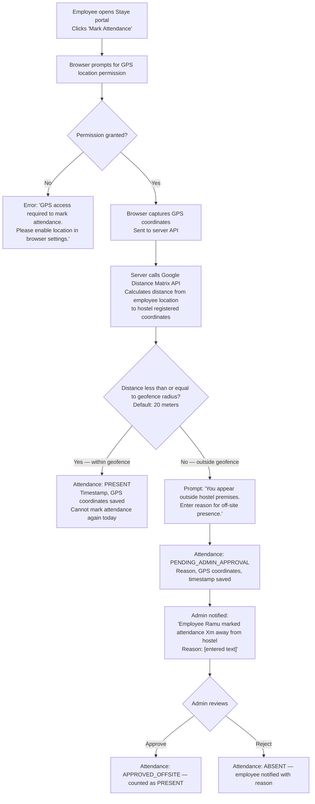

**Why 20 meters as default?** GPS accuracy on consumer smartphones is 3-10 meters in open areas, up to 30 meters in urban environments. 20 meters gives enough buffer for normal GPS drift while being tight enough to prevent spoofing from a nearby building.

**Why allow off-site approval?** There are legitimate reasons an employee might be off-site — running an errand, attending a vendor meeting, fixing an external issue. The approval mechanism handles these without blocking attendance entirely.

## 18.4 Checkout Flow

Mirrors the mark-in flow. Employee clicks "Mark Checkout" at end of shift — same geolocation check applies. Working hours calculated: checkout time minus check-in time.

If an employee forgets to mark checkout, working hours are estimated up to the configured work end time. A reminder notification fires 30 minutes after end time if no checkout is recorded.

## 18.5 Attendance Calendar — Employee View

Monthly calendar showing each day's status:
- Green dot = PRESENT
- Red dot = ABSENT
- Yellow dot = PENDING ADMIN APPROVAL
- Blue dot = LEAVE (approved)
- Gray dot = Holiday or weekend

Tapping any day shows: check-in time, checkout time, hours worked, status.

## 18.6 Leave Request Management

**Employee submits:** Select date(s), Leave type (Casual / Sick / Emergency / Other), Reason (required), Supporting document (optional — e.g., doctor's note for sick leave).

**Admin-Only Approval:** Only the Main Admin can approve or reject leave. Wardens can view leave requests from their hostel's employees but cannot act on them. This maintains clear accountability — leave decisions have financial and operational implications requiring admin-level authority.

**After approval:** The leave date is automatically marked on the attendance calendar. Employee does not need to mark attendance for an approved leave day.

## 18.7 Task Assignment

Both Main Admin and hostel Warden can assign tasks to employees at their hostel.

**Task Creation Fields:** Assigned employee, Title, Detailed description, Category (Housekeeping / Maintenance / Delivery / Security / Other), Due date and time, Priority (Low / Normal / High / Urgent), Linked room (optional).

**From the employee portal:** Employee sees tasks sorted by due date. Can update status: Not Started → In Progress → Completed. Uploads completion photo (required for housekeeping/maintenance tasks). Can add notes (e.g., "Could not complete — room door was locked").

## 18.8 Attendance Reports (Admin View)

- Per-employee monthly summary: PRESENT / ABSENT / LEAVE / PENDING counts
- Working hours per employee per month
- Hostel-level attendance overview (which hostel has the best attendance rate)
- Late arrivals (checked in more than X minutes after configured start time)

---

<div style="page-break-after: always;"></div>

# 19. Module 13 — Performance Scoring Engine

## 19.1 What Is the Performance Score?

The Performance Score is a single number from 0 to 100 representing the overall health and operational performance of a hostel. It is computed deterministically from operational data already present in the system — no manual input required. Every action wardens and tenants take within the platform contributes to or detracts from the score.

The score is designed to give the Main Admin an at-a-glance quality signal for each property, and to give wardens a clear, objective picture of how their hostel is performing — with full transparency into what is dragging the score down.

## 19.2 The Five Scoring Dimensions

### Component 1 — Occupancy Rate (Weight: 30%)

**What it measures:** Percentage of total beds currently occupied by active tenants.

**Formula:** `(Count of OCCUPIED beds ÷ Total beds in hostel) × 100`

**Score contribution:** Raw occupancy percentage × 0.30. 100% occupancy = 30.0 points. 50% occupancy = 15.0 points.

**Business Rationale:** Occupancy is the single most important metric for a hostel's financial health. An empty bed is pure lost revenue. At 30% weight, occupancy is the heaviest single factor.

### Component 2 — Revenue vs Target (Weight: 25%)

**What it measures:** How much of the potential maximum revenue (all beds fully occupied at full price all month) has been verified this month.

**Formula:** `(Verified Revenue This Month ÷ Target Revenue at Full Occupancy) × 100`, capped at 100.

**Target Revenue Calculation:** Sum of all beds' monthly rates × 100% occupancy × 1 month.

**Business Rationale:** Occupancy measures physical utilization; revenue measures financial utilization. High occupancy can coexist with low revenue if heavy discounts are applied. This component captures that distinction.

### Component 3 — Payment Timeliness (Weight: 20%)

**What it measures:** Percentage of rent payments due this month that were received within the grace period.

**Formula:** `(Payments received within grace period ÷ Total rent payments due this month) × 100`

**Business Rationale:** Late payments create cash flow problems and administrative overhead. A hostel where most tenants pay on time is operationally healthier even if total revenue collected is eventually the same.

### Component 4 — Complaint Resolution Rate and Speed (Weight: 15%)

**What it measures:** Percentage of service requests resolved within 48 hours of submission.

**Formula:** `(Service requests resolved within 48 hours ÷ Total service requests this month) × 100`

**Penalty Rule:** Any service request older than 7 days without resolution reduces this component to 0 for the scoring period — regardless of other resolutions. Unresolved old requests represent a critical operational failure.

**Business Rationale:** Complaint resolution directly impacts tenant satisfaction and renewal rates. The 48-hour threshold reflects a reasonable expectation for most maintenance and complaint categories.

### Component 5 — Food Plan Adoption (Weight: 10%)

**What it measures:** Percentage of active tenants who have made at least one food booking this month.

**Formula:** `(Tenants with ≥1 food booking this month ÷ Total active tenants) × 100`

**Business Rationale:** High food adoption correlates with tenant engagement and satisfaction. Tenants on the food plan are more integrated into the hostel community and tend to stay longer. Low adoption may indicate menu dissatisfaction.

## 19.3 Score Computation — Worked Example

**Scenario:** NextHome Paradise, August 2026.

```
Hostel: NextHome Paradise | Total Beds: 30 | Month: August 2026

Raw Data:
  Occupied beds:              26 of 30
  Target revenue (full occ):  Rs.1,89,000  (30 beds × Rs.6,300 avg)
  Actual verified revenue:    Rs.1,54,000
  Payments within grace:      22 of 26 due
  Service requests:           9 total — 6 resolved within 48h — 1 unresolved (8 days old)
  Tenants with food booking:  19 of 26

Component Calculation:
  Occupancy:     26/30 = 86.7%  ×  0.30  = 26.0 pts
  Revenue:       1,54,000/1,89,000 = 81.5%  ×  0.25  = 20.4 pts
  Timeliness:    22/26 = 84.6%  ×  0.20  = 16.9 pts
  Complaints:    1 request is 8 days old → PENALTY → 0%  ×  0.15  =  0.0 pts
  Food:          19/26 = 73.1%  ×  0.10  =  7.3 pts

Final Score: 26.0 + 20.4 + 16.9 + 0.0 + 7.3 = 70.6 / 100  [AMBER]
```

## 19.4 Transparent Score Breakdown Display

The score is never shown as a black box number. The admin and warden always see the full breakdown — making it actionable:

```
NextHome Paradise               Performance Score: 70.6/100  [AMBER]

Occupancy Rate        86.7%  ─────────────────░░  26.0/30 pts  [Good]
Revenue vs Target     81.5%  ────────────────░░░  20.4/25 pts  [Good]
Payment Timeliness    84.6%  ─────────────░░░░░░  16.9/20 pts  [Average]
Complaint Resolution   0.0%  ░░░░░░░░░░░░░░░░░░░░  0.0/15 pts  [CRITICAL — 1 request is 8 days old]
Food Plan Adoption    73.1%  ───────░░░░░░░░░░░░   7.3/10 pts  [Good]

Monthly Trend: Score decreased 4.2 points from July (74.8 → 70.6)
Critical Action: Resolve Request #47 (AC repair — submitted 6 Aug) to recover 15 points
```

Wardens understand exactly what to do to improve their score. Admins can hold wardens accountable for specific metrics.

## 19.5 Score Color Bands

| Score Range | Color | Label | Interpretation |
|---|---|---|---|
| 80 to 100 | Green | Excellent | Hostel performing well across all metrics |
| 60 to 79 | Amber | Needs Attention | Good in some areas but with identifiable gaps |
| Below 60 | Red | Critical | Multiple metrics underperforming — immediate focus required |

## 19.6 Score Recalculation and History

The performance score is recomputed daily at 2 AM for all hostels. The dashboard shows the latest computation with a timestamp. Historical scores are stored — allowing the comparisons module to show score trends over time.

## 19.7 Algorithm Calibration Note

The current weights (30/25/20/15/10) are initial calibrations based on product team judgment. They will be validated and refined with data from the first 2-3 pilot hostels. The algorithm is designed to be reconfigurable without code changes — weights are stored as organization-level configuration values, editable by Anywhere Node via the Super Admin panel.

---

<div style="page-break-after: always;"></div>

# 20. Module 14 — Comparisons & Reporting

## 20.1 Overview

The Comparisons module answers the question: "Which of my hostels is performing better, and by how much?" It provides individual hostel deep-dives and side-by-side comparisons across any metric. Built for desktop use by an admin doing a structured performance review. Accessible by Main Admin only — wardens cannot access comparisons.

## 20.2 View Modes

**Consolidated View:** Organization-level aggregated view of all hostels combined. Total portfolio health.

**Individual Hostel View:** All metrics for a single hostel across a selected time period, with month-over-month trend lines.

**Compare Mode:** Admin selects 2+ hostels for side-by-side comparison. Each metric appears as a row; each hostel as a column. Differences shown as absolute values and percentages.

## 20.3 Available Metrics

| Metric | What It Shows |
|---|---|
| Monthly Revenue | Verified rent + food revenue |
| Net Profit | Revenue minus approved expenses |
| Occupancy Rate | Beds occupied ÷ total beds |
| Payment Timeliness | % payments within grace period |
| Food Plan Adoption | % tenants with ≥1 food booking |
| Overall Performance Score | 0-100 composite score |
| Complaint Volume | Total service requests submitted |
| Average Resolution Time | Avg hours from OPEN to RESOLVED |
| MoM Revenue Growth | % change vs previous month |

## 20.4 Report Generation

Exportable as a PDF with:
- Organization name, logo, generation timestamp
- Date range and hostels compared
- Side-by-side metric table with differences highlighted
- System-generated narrative: "NextHome Paradise generated 23% more revenue than NextHome Classic in July 2026. However, NextHome Classic has a 12% higher food plan adoption rate and a significantly better complaint resolution time (1.8 days vs 3.2 days)."

---

<div style="page-break-after: always;"></div>

# 21. Module 15 — Announcements

## 21.1 Purpose

Announcements allow admins and wardens to communicate operational information to tenants in a structured, trackable way — replacing the current reality of sending WhatsApp messages to individual tenants or group chats.

## 21.2 Who Can Send and To Whom

| Sender | Can Send To |
|---|---|
| Main Admin | All tenants across all hostels, or specific hostel(s) |
| Warden | All tenants in their own hostel only |

## 21.3 Announcement Fields

| Field | Required | Notes |
|---|---|---|
| Title | Yes | Headline, max 100 characters |
| Body / Message | Yes | Full announcement text |
| Type | Yes | General / Food / Maintenance / Urgent / Event |
| Target | Yes | All hostels or select specific hostel(s) |
| Expiry Date | No | Announcement disappears from active banner after this date |
| Pinned | No | Pinned announcements stay at top of list |

## 21.4 Delivery and Visibility

In V1, announcements are delivered in-app only:
- **Active banner** at top of tenant's portal home screen for unexpired announcements
- **Notification entry** in the notification drawer when posted
- **Announcements section** with full history, filterable by type

Urgent-type announcements use red accent for visual distinction.

## 21.5 Real-World Examples

| Type | Example |
|---|---|
| Maintenance | "Water supply off Sunday 20th July 8 AM to 12 PM — overhead tank cleaning. Please store water in advance." |
| Food | "No dinner service this Saturday — kitchen deep cleaning. Alternate arrangements at your own cost." |
| Urgent | "URGENT: Power outage affecting all floors. Generator running — common areas and lights only. No AC until power is restored." |
| General | "Welcome to all new residents joining NextHome Paradise this August! Warden Priya is available Mon–Sat 9 AM to 6 PM for any queries." |
| Event | "Hostel movie night this Friday at 8 PM in the common area. All residents welcome!" |

---

<div style="page-break-after: always;"></div>

# 22. Module 16 — Inventory & Asset Management

## 22.1 Overview

Every hostel contains significant physical assets: air conditioners, beds, mattresses, water heaters, TVs, refrigerators, kitchen equipment, and fire extinguishers. Without a system, tracking these assets, their condition, repair history, and depreciation is impossible. V1's asset register is a permanent, searchable record of every asset in every hostel.

## 22.2 Asset Record Fields

| Field | Required | Notes |
|---|---|---|
| Asset Name | Yes | e.g., "Daikin 1.5 Ton AC — Room G01" |
| Category | Yes | Furniture / Appliance / Electronics / Linen / Kitchen / Fire Safety / Other |
| Assigned Hostel | Yes | Which hostel owns this asset |
| Location | Yes | Floor, room, or common area |
| Purchase Date | No | |
| Purchase Cost | No | In INR |
| Current Condition | Yes | Excellent / Good / Fair / Poor / Out of Service |
| Serial Number or Asset Tag | No | For warranty tracking |
| Photo | No | Uploaded to S3 |
| Notes | No | |

## 22.3 Expense Linkage

When an asset undergoes repair, the associated expense entry can be linked to the asset record. This creates a lifecycle cost history: "This AC has had Rs.12,400 in repair expenses over 18 months — consider replacement." This enables future total cost of ownership analytics.

## 22.4 Access

Main Admin: all hostels. Warden: own hostel only. Tenants and employees have no access.

---

<div style="page-break-after: always;"></div>

# 23. Module 17 — Housekeeping Management

## 23.1 Overview

Housekeeping in a hostel is a repetitive, high-frequency operational task. V1 integrates housekeeping scheduling directly with the task management system and adds photo-verified completion for accountability.

## 23.2 Schedule Creation

Warden or Main Admin creates housekeeping schedules:
- Select room(s), floor(s), or common area(s) to be cleaned
- Select frequency: Daily / Alternate Days / Weekly / On-Demand
- Assign to a specific employee (from hostel's employee list)
- Set preferred time window (e.g., "10 AM to 12 PM")

Scheduled tasks appear automatically in the assigned employee's task list on their portal at the configured frequency.

## 23.3 Photo Verification Protocol — Before and After

To prevent false completion reports:

1. Employee opens assigned cleaning task
2. Clicks "Start Task" — system records start timestamp
3. Uploads **Before photo** (current state of the room)
4. Performs the cleaning
5. Clicks "Complete Task" — uploads **After photo** (cleaned state)

Both photos are stored in S3 and linked to the task record. The warden reviews the before/after comparison from the warden panel — an irrefutable audit trail for every cleaning task.

## 23.4 Reports

Weekly report: rooms cleaned, by whom, at what time, completion status (on time / late / skipped). Per-employee completion rates. Rooms not cleaned in 7+ days (alert). Accessible by Warden (own hostel) and Main Admin (all hostels).

---

<div style="page-break-after: always;"></div>

# 24. Module 18 — Settings & Configuration

## 24.1 Organization-Level Settings (Main Admin Only)

| Setting | Description |
|---|---|
| Organization Name | Displayed on all PDF documents and admin header |
| Organization Logo | Appears on Stay Passes, invoices, receipts |
| UPI ID | Organization-wide UPI ID for all tenant payments |
| UPI QR Image | Upload existing or auto-generate from UPI ID |
| Default Currency | INR (default) |
| Additional Display Currencies | Enable AED or others for display-only switching |
| Tax Groups | Create, edit, deactivate |
| Late Fee Policy | Enable/disable, grace period, fee type |
| Stay Expiry Notification Days | Default: 7 days before expiry |
| No-Show Release Window | Default: 3 days after reservation arrival date |

**Single UPI ID Design Decision:** V1 uses one UPI ID for the entire organization. All tenant payments across all hostels go to this single destination. Individual per-hostel UPI accounts are a V2 feature.

## 24.2 Hostel-Level Settings

| Setting | Who Can Change | Description |
|---|---|---|
| Bill Normalization Toggle | Admin (any) / Warden (own only) | Align all monthly billing to 1st of month |
| Food Cutoff Time | Admin only | Hour and minute for next-day order/cancel deadline |
| Food Pricing | Admin only | Breakfast, lunch, dinner per-meal prices |
| Add-On Items | Admin only | Create, price, configure add-on menu items |
| Geofence Radius | Admin only | Employee attendance check-in radius (default: 20m) |
| Low Wallet Alert Threshold | Admin only | Minimum food wallet balance before notification |
| Hostel GPS Coordinates | Admin only | Latitude/longitude for geofence calculation |

## 24.3 Currency Display (Display-Only in V1)

V1 supports display currency switching for organizations with multi-country operations. **This is display-only — no actual multi-currency transactions.**

- Main Admin sets default display currency (INR)
- Can add additional currencies (e.g., AED) with a manual exchange rate
- Admin updates exchange rate manually when needed
- Users switch display currency via a dropdown in the top bar
- All financial figures render in the selected currency at the stored exchange rate
- All transactions are stored in INR in the database — the currency display is a presentation layer only

---

<div style="page-break-after: always;"></div>

# 25. Module 19 — Social Authentication

## 25.1 Scope

Social login is available **exclusively on the Tenant Portal**. Admin and warden logins remain email/password only — a security decision, as elevated-privilege accounts should not be linked to third-party identity providers whose account recovery flows are outside the organization's control.

**V1 Scope:** Google OAuth only. Facebook OAuth requires additional Meta app review and is deferred to V1.1.

## 25.2 Google OAuth Implementation

Implemented through Supabase Auth. Supabase handles the OAuth token exchange, session management, and JWT issuance. The result of a successful Google OAuth is identical to a successful email/password login from the platform's perspective.

The login page shows a "Continue with Google" button below the email/password form. Tapping triggers the Supabase Google OAuth redirect. User authenticates with their Google account. Platform checks: does a user account exist with this email?

## 25.3 Account Matching Logic

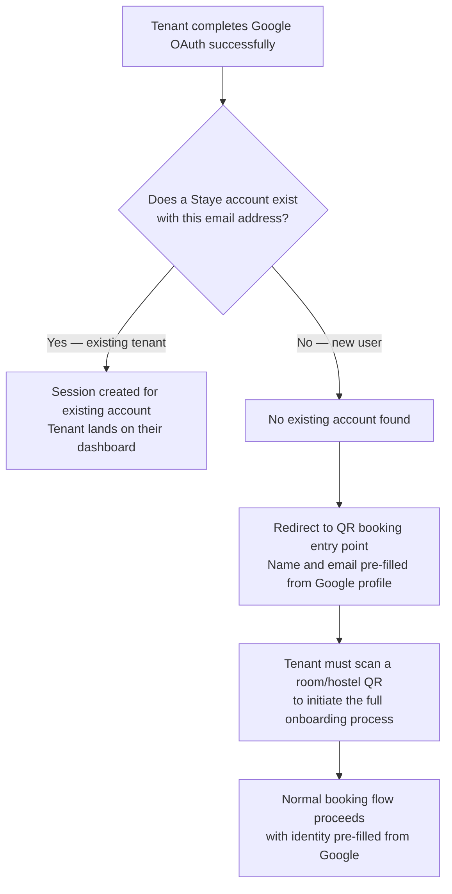

**No self-registration outside the booking flow.** A Google account alone cannot create a Staye tenant account. The tenant still needs the QR-initiated booking flow — Google handles authentication only.

## 25.4 Password Recovery Policy

V1 has no automated email-based password recovery. Tenants contact their warden, who resets the password via the admin panel. This is consistent with the platform's deliberate decision not to depend on email infrastructure in V1.

---

<div style="page-break-after: always;"></div>

# 26. Module 20 — DPDP Compliance & Privacy

## 26.1 Legal Context

India's **Digital Personal Data Protection (DPDP) Act 2023** applies to any entity processing personal data of Indian citizens. Staye collects highly sensitive personal data: Aadhaar numbers, PAN numbers, document scans, facial photographs, dates of birth, and home addresses.

Deploying a commercial SaaS product handling this data without a DPDP compliance framework is not legally permissible. V1 builds compliance into the core architecture — not as a retrofitted feature.

## 26.2 Consent Framework

**Consent is collected before any personal data is entered**, at the beginning of the onboarding form:

1. Clear statement of exactly what data is collected
2. Why each data item is collected (specific purpose)
3. How long it is retained
4. Tenant's right to request deletion
5. Contact information for data-related queries

A mandatory checkbox: "I have read and understood the data collection notice above and I consent to the processing of my personal data for the purposes described." **Form submission is blocked if unchecked.**

**Consent Record Stored:** `{ tenantId, consentedAt (UTC timestamp), consentVersion, ipAddress }`

If the consent text is updated (new data category added), the `consentVersion` changes. Any tenant whose consent was given against an older version is flagged for re-consent on next login.

## 26.3 Data Deletion Workflow

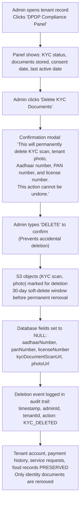

**Key Design Decision:** Only KYC documents and sensitive ID numbers are deleted. Payment records (required by income tax law — 7-year retention) and operational records remain. The DPDP right to deletion applies to sensitive personal data; financial records are retained under a different legal basis.

## 26.4 Data Retention Policy

| Data Type | Retention Period | Legal Basis |
|---|---|---|
| KYC Document Scans (S3) | Stay duration + 30 days, deleted on DPDP request | DPDP Act 2023 |
| KYC Document Numbers (Aadhaar, PAN) | Stay duration + 30 days, nulled on DPDP request | DPDP Act 2023 |
| Tenant Photo | Stay duration + 30 days, deleted on DPDP request | DPDP Act 2023 |
| Payment and Billing Records | 7 years | Income Tax Act, 1961 |
| Activity and Audit Logs | 3 years | Internal compliance |
| Visitor Logs | 12 months active, then archived permanently | Security and law enforcement |
| Service Request Records | 2 years | Operational record-keeping |
| Employee Attendance Records | 3 years | Labour law compliance |
| Food Transaction History | 2 years | Financial audit trail |
| DPDP Consent Records | Duration of relationship + 3 years | Proof of compliance |

---

<div style="page-break-after: always;"></div>

# 27. Data Architecture

## 27.1 Domain: Users and Authentication

```mermaid
erDiagram
    Organization {
        string id PK
        string name
        string logoUrl
        string upiId
        string upiQrUrl
        string defaultCurrency
        string apiKey
        datetime createdAt
    }

    User {
        string id PK
        string organizationId FK
        string supabaseAuthId
        string email
        string phone
        string name
        string role
        datetime createdAt
    }

    TenantProfile {
        string id PK
        string userId FK
        string hostelId FK
        string admissionId
        string photoUrl
        string aadhaarNumber
        string panNumber
        string licenseNumber
        string kycDocumentType
        string kycDocumentScanUrl
        string emergencyContactName
        string emergencyContactPhone
        boolean dpdpConsentGiven
        datetime dpdpConsentAt
        string dpdpConsentVersion
        datetime kycDeletedAt
        datetime createdAt
    }

    EmployeeProfile {
        string id PK
        string userId FK
        string hostelId FK
        string designation
        string workStartTime
        string workEndTime
        datetime joinedAt
    }

    Organization ||--o{ User : has
    User ||--o| TenantProfile : has
    User ||--o| EmployeeProfile : has
```

## 27.2 Domain: Hostel and Bed Hierarchy

```mermaid
erDiagram
    Hostel {
        string id PK
        string organizationId FK
        string name
        string address
        float latitude
        float longitude
        int geofenceRadius
        boolean billNormalizationEnabled
        int foodCutoffHour
        int foodCutoffMinute
        int stayExpiryNotificationDays
        int noShowReleaseDays
        int foodWalletLowThreshold
    }

    Floor {
        string id PK
        string hostelId FK
        string name
        int floorNumber
    }

    Room {
        string id PK
        string floorId FK
        string hostelId FK
        string name
        string qrToken
        string qrImageUrl
        datetime qrGeneratedAt
    }

    Bed {
        string id PK
        string roomId FK
        string hostelId FK
        string bedIdentifier
        string status
        decimal dailyRate
        decimal weeklyRate
        decimal monthlyRate
    }

    BedLock {
        string id PK
        string bedId FK
        string sessionId
        string prospectiveTenantEmail
        datetime expiresAt
        datetime createdAt
    }

    BedHistory {
        string id PK
        string bedId FK
        string tenantProfileId FK
        datetime occupiedFrom
        datetime occupiedTo
        string eventType
        string notes
    }

    WaitingList {
        string id PK
        string hostelId FK
        string name
        string phone
        string email
        int position
        string status
        datetime notifiedAt
        datetime createdAt
    }

    Hostel ||--o{ Floor : has
    Floor ||--o{ Room : has
    Room ||--o{ Bed : has
    Bed ||--o| BedLock : has
    Bed ||--o{ BedHistory : tracks
    Hostel ||--o{ WaitingList : has
```

## 27.3 Domain: Stay and Billing

```mermaid
erDiagram
    Stay {
        string id PK
        string tenantProfileId FK
        string bedId FK
        string hostelId FK
        string status
        date startDate
        date endDate
        string rentType
        decimal rentAmount
        datetime checkedInAt
        datetime checkedOutAt
    }

    Bill {
        string id PK
        string stayId FK
        string tenantProfileId FK
        string hostelId FK
        string invoiceNumber
        date billingPeriodStart
        date billingPeriodEnd
        decimal baseAmount
        decimal discountAmount
        string discountReason
        string taxGroupId FK
        decimal taxAmount
        decimal totalAmount
        string status
        date dueDate
        boolean isNormalized
        boolean hasLateFee
        decimal lateFeeAmount
        datetime generatedAt
    }

    Payment {
        string id PK
        string billId FK
        string tenantProfileId FK
        decimal amount
        string paymentMethod
        string upiReference
        string proofUrl
        string status
        datetime submittedAt
        datetime verifiedAt
        string verifiedById FK
    }

    TaxGroup {
        string id PK
        string organizationId FK
        string name
        decimal percentage
        string applicability
        boolean isActive
    }

    Stay ||--o{ Bill : has
    Bill ||--o{ Payment : has
    Bill }o--|| TaxGroup : uses
```

## 27.4 Domain: Food System

```mermaid
erDiagram
    FoodWallet {
        string id PK
        string tenantProfileId FK
        string hostelId FK
        decimal balance
        datetime lastTopUpAt
        datetime updatedAt
    }

    FoodWalletTransaction {
        string id PK
        string walletId FK
        string type
        decimal amount
        string description
        string referenceId
        datetime createdAt
    }

    WeeklyMenu {
        string id PK
        string hostelId FK
        int dayOfWeek
        string breakfastItem
        string lunchItem
        string dinnerItem
        date effectiveFrom
        date effectiveTo
    }

    MealBooking {
        string id PK
        string tenantProfileId FK
        string hostelId FK
        date mealDate
        string mealType
        decimal price
        string status
        datetime bookedAt
        datetime cancelledAt
        string cancelledById FK
    }

    FoodWallet ||--o{ FoodWalletTransaction : has
    FoodWallet ||--o{ MealBooking : funds
```

## 27.5 Domain: Expenses and Finance

```mermaid
erDiagram
    ExpenseEntity {
        string id PK
        string organizationId FK
        string name
        string description
        string applicableHostelIds
        string authorizedWardenIds
        string expectedFrequency
        decimal expectedAmount
        boolean isActive
    }

    ExpenseTag {
        string id PK
        string entityId FK
        string name
        boolean isActive
    }

    Expense {
        string id PK
        string entityId FK
        string tagId FK
        string hostelId FK
        string loggedById FK
        decimal amount
        date billDate
        date dueDate
        string attachmentUrl
        string notes
        string customTagDescription
        string status
        datetime submittedAt
        datetime reviewedAt
        string reviewedById FK
        string rejectionReason
    }

    ExpenseVoucher {
        string id PK
        string hostelId FK
        string requestedById FK
        string voucherNumber
        string purpose
        string entityId FK
        string tagId FK
        decimal amount
        string attachmentUrl
        string status
        datetime requestedAt
        datetime reviewedAt
        string reviewedById FK
    }

    ExpenseEntity ||--o{ ExpenseTag : has
    ExpenseEntity ||--o{ Expense : categorizes
```

## 27.6 Domain: Visitor Log

```mermaid
erDiagram
    VisitorLog {
        string id PK
        string hostelId FK
        string tenantProfileId FK
        string visitorName
        string visitorPhone
        string relationship
        string purpose
        string idProofType
        string idProofLastFour
        datetime entryTime
        datetime expectedExitTime
        datetime actualExitTime
        string loggedById FK
        string exitLoggedById FK
        datetime createdAt
    }
```

## 27.7 Domain: Employee and Attendance

```mermaid
erDiagram
    AttendanceRecord {
        string id PK
        string employeeProfileId FK
        string hostelId FK
        date attendanceDate
        string status
        datetime checkInTime
        float checkInLatitude
        float checkInLongitude
        float checkInDistanceFromHostel
        datetime checkOutTime
        float workingHours
        string offSiteReason
        string reviewedById FK
        datetime reviewedAt
    }

    LeaveRequest {
        string id PK
        string employeeProfileId FK
        date leaveDate
        string leaveType
        string reason
        string documentUrl
        string status
        string reviewerId FK
        string rejectionReason
        datetime submittedAt
        datetime reviewedAt
    }

    Task {
        string id PK
        string hostelId FK
        string assignedToId FK
        string assignedById FK
        string title
        string description
        string category
        string priority
        date dueDate
        string roomId FK
        string status
        string completionNotes
        string beforePhotoUrl
        string afterPhotoUrl
        datetime startedAt
        datetime completedAt
    }
```

## 27.8 Domain: Performance and Notifications

```mermaid
erDiagram
    PerformanceScore {
        string id PK
        string hostelId FK
        date scoreDate
        decimal occupancyScore
        decimal revenueScore
        decimal paymentTimelinessScore
        decimal complaintResolutionScore
        decimal foodAdoptionScore
        decimal totalScore
        string colorBand
        json breakdown
        datetime computedAt
    }

    Notification {
        string id PK
        string userId FK
        string type
        string title
        string body
        string linkUrl
        boolean isRead
        datetime createdAt
        datetime readAt
    }

    AuditLog {
        string id PK
        string organizationId FK
        string userId FK
        string entityType
        string entityId
        string action
        json previousValue
        json newValue
        string ipAddress
        datetime createdAt
    }
```

---

<div style="page-break-after: always;"></div>

# 28. Infrastructure & AWS Architecture

## 28.1 AWS Services — V1 Scope and Cost

| Service | Purpose | Cost Tier |
|---|---|---|
| EC2 t3.micro | Next.js application server (Dockerized) | Free — 750 hrs/month |
| RDS PostgreSQL t3.micro | Primary relational database | Free — 750 hrs/month |
| S3 | Documents, photos, PDFs, QR images | Free — 5 GB + Rs.2/GB beyond |
| CloudFront | CDN for static assets and media delivery | Free — 1 TB transfer |
| ACM | SSL certificate for stayee.in domain | Free |
| SSM Parameter Store | Secrets management (DB URL, API keys, OAuth secrets) | Free |
| CloudWatch | Application logs, metrics, alarms | Free — 5 GB logs |
| IAM | Role-based AWS resource access control | Free |

**Infrastructure Cost Target:** Under Rs.500/month for the first 12 months.

## 28.2 S3 Bucket Structure

```
stayee-production/
├── {orgId}/
│   ├── assets/
│   │   └── logo.png
│   ├── qr-codes/
│   │   └── {hostelId}/rooms/{roomId}-qr.png
│   └── hostels/
│       └── {hostelId}/
│           ├── expenses/
│           │   └── {expenseId}-attachment.pdf
│           └── tenants/
│               └── {tenantId}/
│                   ├── kyc/{documentId}-scan.jpg
│                   ├── photo/{tenantId}-photo.jpg
│                   └── documents/
│                       ├── invoices/{year}/{month}/{invoiceId}.pdf
│                       ├── receipts/{year}/{month}/{receiptId}.pdf
│                       └── stay-passes/{passId}.pdf
```

## 28.3 Deployment Pipeline

Docker containerized Next.js on EC2. GitHub Actions CI/CD:
1. Push to `main` → TypeScript type check → Prisma schema validation → Jest tests → Docker build
2. On success: Docker image pushed to ECR
3. EC2 instance pulls new image and restarts container via deploy script
4. Zero-downtime rolling restart using PM2

## 28.4 Scaling Thresholds

V1 designed for without infrastructure changes:
- Up to 50 concurrent users
- Up to 2,000 total tenant accounts
- Up to 20 hostels per organization
- Up to 500 beds per organization

Beyond these: EC2 t3.small → t3.medium → Load Balancer + Auto Scaling. Database: RDS t3.small with read replica when query latency degrades.

---

<div style="page-break-after: always;"></div>

# 29. V1.1 Roadmap — Deferred Features

## 29.1 WhatsApp Notification Integration

**Why deferred:** WhatsApp Business API integration requires registering a dedicated business phone number, Meta Business Manager approval, approved message templates, and per-message cost management. The regulatory and configuration overhead is significant enough that blocking V1 on this is not justified.

**V1.1 Plan:** The notification engine is already designed with a multi-channel architecture. Adding WhatsApp is an additive change. V1.1 will deliver WhatsApp notifications for: rent reminders (3 days before due), stay expiry warnings (7 days before), food wallet low balance, payment verification confirmation.

## 29.2 Canvas Dashboard (Drag-and-Drop Widget System)

**Why deferred:** Building a true drag-and-drop widget canvas requires significant UI engineering investment. The V1 fixed layout is carefully designed to show the most important information by default.

**V1.1 Plan:** React-based canvas (using `react-grid-layout`) with a predefined widget library. Each admin's canvas configuration stored as JSON in the database.

## 29.3 Facebook OAuth

**Why deferred:** Requires additional Meta app review and configuration. Deferred to V1.1 alongside WhatsApp integration.

## 29.4 Regional Language Assistant (Malayalam)

**Why deferred:** Full UI string translation and maintenance of two language datasets increases development complexity. Deferred to V1.1.

## 29.5 Bulk Document Download (Bill Vault ZIP Export)

**Why deferred:** Requires S3 ZIP generation logic and background job for large exports. V1 supports individual downloads. Bulk ZIP is V1.1.

## 29.6 Room Photos in Booking Funnel

**Why deferred:** Room photo management is a significant additional module requiring upload flows, image management, and CDN optimization. Explicitly deferred to V3.

---

<div style="page-break-after: always;"></div>

# 30. MVP vs V1 Gap Analysis

| Capability | MVP Status | V1 Status | Priority |
|---|---|---|---|
| Self-service QR onboarding (3 flows) | Not present | Complete | P0 |
| Bed locking / hold mechanism | Not present | Complete | P0 |
| Bill normalization engine | Not present | Complete | P0 |
| Prorated first bill calculation | Not present | Complete | P0 |
| Tax group configuration and application | Not present | Complete | P0 |
| Late fee computation and application | Not present | Complete | P0 |
| Advance rent refund processing | Not present | Complete | P0 |
| Stay extension billing | Not present | Complete | P0 |
| Tenant payment receipt PDF | Not present | Complete | P0 |
| Invoice PDF (branded) | Not present | Complete | P0 |
| Expense Voucher (petty cash flow) | Not present | Complete | P0 |
| Bill Vault (searchable archive) | Not present | Complete | P0 |
| Expense Entities and Tags system | Not present | Complete | P0 |
| Per-meal food pricing | Not present | Complete | P0 |
| Tenant-managed food plan and wallet | Not present | Complete | P0 |
| Food wallet top-up payment flow | Not present | Complete | P0 |
| Meal cancellation with cutoff enforcement | Not present | Complete | P0 |
| Weekly menu management | Not present | Complete | P0 |
| Food procurement report | Not present | Complete | P0 |
| Bed Transfer workflow | Not present | Complete | P0 |
| Bed Swap (atomic transaction) | Not present | Complete | P0 |
| Bed Reservation (future date) | Not present | Complete | P0 |
| Bed Waiting List | Not present | Complete | P0 |
| Bed status model (5 states) | Partial (2 states) | Complete | P0 |
| Stay Pass PDF (complete design) | Partial | Complete | P0 |
| Stay Pass validity QR check (public) | Not present | Complete | P0 |
| Automated stay expiry notifications | Not present | Complete | P0 |
| Lease renewal workflow (tenant-initiated) | Not present | Complete | P0 |
| Overstay detection and handling | Not present | Complete | P0 |
| DPDP consent collection | Not present | Complete | P0 |
| KYC deletion workflow | Not present | Complete | P0 |
| Data retention policy enforcement | Not present | Complete | P0 |
| Centralized notification engine | Partial | Complete | P0 |
| Real-time dashboard (SWR 5s polling) | Not present | Complete | P0 |
| Centralized PDF generation service | Not present | Complete | P0 |
| Service request categories (3 types) | Not present | Complete | P1 |
| SLA enforcement and auto-escalation | Not present | Complete | P1 |
| Visitor and Guest Log | Not present | Complete | P1 |
| PDF export of visitor log | Not present | Complete | P1 |
| Employee portal | Not present | Complete | P1 |
| Geolocation attendance verification | Not present | Complete | P1 |
| Employee leave request management | Not present | Complete | P1 |
| Task assignment and photo completion | Partial | Complete | P1 |
| Performance Scoring Engine (5 metrics) | Not present | Complete | P1 |
| Transparent score breakdown display | Not present | Complete | P1 |
| Comparisons module | Not present | Complete | P1 |
| MRR Report generation | Not present | Complete | P1 |
| Housekeeping scheduling | Not present | Complete | P1 |
| Before/after photo verification | Not present | Complete | P1 |
| Inventory / Asset register | Not present | Complete | P1 |
| Announcements system | Not present | Complete | P1 |
| Google OAuth (tenant portal) | Not present | Complete | P1 |
| Currency display switching (AED) | Not present | Complete | P2 |
| API key infrastructure | Not present | Complete | P2 |
| Webhook foundation | Not present | Complete | P2 |
| Group booking flow | Not present | Complete | P1 |
| Next month MRR report | Not present | Complete | P1 |
| Hostel performance insights panel | Not present | Complete | P1 |

---

<div style="page-break-after: always;"></div>

# Appendix A — Glossary

| Term | Definition |
|---|---|
| **Admission ID** | A sequential unique identifier assigned to each tenant by the hostel operator (e.g., AN-NHP-0047). Used as a reference across all documents. |
| **BedLock** | A database record that temporarily reserves a bed for a prospective tenant during onboarding form completion. Has a 10-minute TTL. |
| **Bill Normalization** | The process of aligning all monthly-rate tenants to a common billing cycle starting on the 1st of each calendar month. The first bill is prorated for the partial month. |
| **Bill Vault** | The centralized, searchable archive of all financial documents (invoices, receipts, vouchers). |
| **DPDP Act** | Digital Personal Data Protection Act 2023 — India's primary data privacy legislation. |
| **Expense Entity** | A named, recurring expense obligation scoped to specific hostels and wardens. First level of expense governance. |
| **Expense Tag** | A sub-category label within an expense entity. Predefined by the admin. Second level of expense governance. |
| **Expense Voucher** | A warden-initiated petty cash request for operational expenses. Requires admin approval. |
| **Food Cutoff Time** | The deadline before which tenants must book or cancel meals for the following day. Default: 10:00 PM. |
| **Food Wallet** | A prepaid balance per tenant, used exclusively for meal bookings. Topped up via the standard payment flow. |
| **Geofence** | A virtual geographic boundary defined by GPS coordinates and radius. Used to verify employees are physically within hostel premises when marking attendance. |
| **Grace Period (late fees)** | Days after rent due date before late fee charges are applied. |
| **Grace Period (overstay)** | Days after stay expiry during which renewal is possible without full re-onboarding. Default: 3 days. |
| **Invoice** | A pre-payment document generated after onboarding approval. Includes UPI QR for payment. |
| **MRR (Monthly Recurring Revenue)** | Forecasted revenue for the next calendar month based on all active tenant rent commitments. |
| **No-Show Release Window** | Days after reservation arrival date before the bed is auto-released to AVAILABLE. Default: 3 days. |
| **Performance Score** | A 0-100 composite score for each hostel: Occupancy (30%), Revenue vs Target (25%), Payment Timeliness (20%), Complaint Resolution (15%), Food Adoption (10%). |
| **Procurement Report** | Daily report showing meal portions needed for the following day, generated from confirmed bookings. |
| **Stay Pass** | Staye's official digital identity and authorization document for a hostel tenant. Generated after payment verification. |
| **Staye** | The product name for the Hostel Management Platform, powered by Anywhere Node. |
| **SWR** | Stale-While-Revalidate — the caching and polling strategy used for real-time dashboard updates (5-second refresh). |
| **TTL (Time-To-Live)** | An expiry duration assigned to a record. When TTL expires, the record is eligible for cleanup. Used in BedLock records (10-minute TTL). |
| **Waiting List** | A FIFO queue of prospective tenants who expressed interest when all beds were occupied. |

---

# Appendix B — Open Items & Pending Decisions

| # | Item | Status | Owner | Notes |
|---|---|---|---|---|
| 1 | **Staye brand name — final confirmation** | Pending co-founder confirmation | Founders | Branding across all surfaces pending final decision |
| 2 | **Hostel Scoring Algorithm weight calibration** | Initial weights defined. Validation with first 2-3 pilot hostels required. | Product | Reconfigurable without code changes |
| 3 | **Employee leave types — annual count and carry-forward rules** | Casual / Sick / Emergency defined. Annual count and carry-forward policy TBD. | Product | Needed before employee portal specs finalized |
| 4 | **Visitor log export format for law enforcement compliance** | Standard tabular format designed. Legal review of authority acceptability TBD. | Legal / Compliance | May need to match a specific government format |
| 5 | **WhatsApp notification integration — provider and timeline** | Explicitly deferred to V1.1. WAME vs Twilio provider selection TBD. | Engineering | No V1 blockers |
| 6 | **Multi-hostel employee assignment** | Basic single-hostel support defined. Full multi-hostel attendance for shared employees TBD. | Engineering | V1 assumes one primary hostel per employee |
| 7 | **Super Admin portal — feature scope for V1** | Minimal scope in V1. Full scope for V2. | Product | |
| 8 | **Tally / Zoho Books integration** | API architecture is integration-ready. Actual integration deferred to future release. | Engineering | Webhook foundation in place |
| 9 | **Employee payroll and salary management** | Explicitly out of V1 and V1.1 scope. Future product line decision. | Product | Requires banking API, payslip generation, TDS computation |
| 10 | **Room photos in booking funnel** | Explicitly deferred to V3. | Product | |
| 11 | **DPDP consent re-collection on policy update** | Flow designed. Specific trigger conditions for material change requiring re-consent to be defined with legal review. | Legal / Product | |

---

*Staye — Hostel Management Platform · V1 Concept Document · Revision 2*

*Prepared by Zenxvio Engineering Team · July 2026*

*Powered by Anywhere Node*

*This document is Internal and Confidential. Distribution outside the Zenxvio team requires explicit authorization.*
